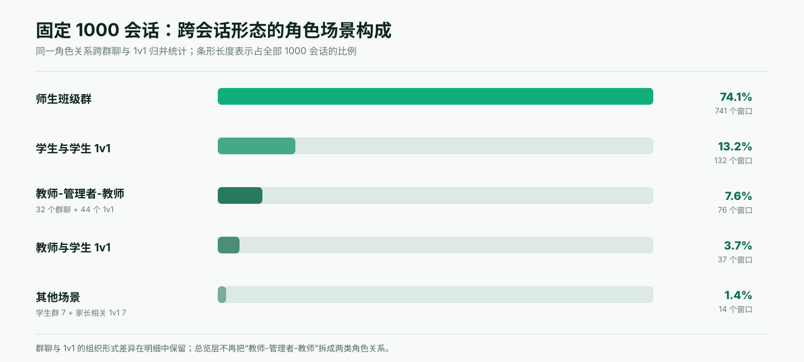

# ClassIn IM 固定 1000 会话综合事实结论 V1.11

## 0. 结论先行

当前研究范围已经完成：固定 1000 个会话窗口的 Topic、分类路径、会话结构、窗口角色关系与原始消息证据已经连接成同一套可复算、可追溯的事实层。

这批事实显示：

1. **IM 现场普遍是多主题现场。** 968 个窗口至少有一个已经归入 v2.3 的正式 Topic；851 个窗口同时包含两个及以上正式 Topic。每窗平均 3.177 个，中位数 3 个，90 分位为 5 个，最高 10 个。
2. **课程运营是覆盖最广的一级主题，但不是唯一重心。** “课程运营与服务”出现在 392 个窗口；“数字平台与技术”349 个；“学习与学业内容”321 个；“人际关系与社交”260 个；“教学设计、实施与改进”235 个；“娱乐与创作”233 个。
3. **跨会话重复最多的具体事项集中在六类：** 课程改期／取消／续课／补课、教材与教学资料、作业、到课与缺勤、群组空间与成员治理、技术故障与连接排查。六类事项均有大量不同会话和精确消息证据支撑，不是由少数单一 Case 造成。
4. **群聊与 1v1 的主题构成明显不同，角色关系进一步改变主题分布。** 师生班级群同时承载排课、教材、作业、群治理、缺勤和技术排障；“教师-管理者-教师”角色场景跨越 32 个群聊和 44 个 1v1，合计 76 个窗口，占 1000 会话的 7.6%；学生—学生 1v1 则以游戏、见面、校园生活、作业、饮食和同伴关系为主。
5. **教学业务与社交生活长期共存于同一 IM 基座。** 人际、娱乐、生活类不是简单“无效噪音”；它们构成学生—学生沟通的重要部分，也会与课程和学习 Topic 同窗出现。
6. **当前结论具有清楚的适用边界。** 样本按会话形态比例分层，能够稳定描述本次抽样框及固定样本中的主要结构；但源表本身对全平台、全部机构与全部用户的覆盖性尚未证明，因此不能把样本比例直接写成全平台发生率。Topic 覆盖率不等于痛点强度，高频不等于应做 AI，一个窗口的角色或用途也不等于账号永久身份或群的长期定义。

本报告以事实结论为主体；第 13 章另行收录研究者在人工审阅中形成的业务观察与产品启示，并用证据标签与统计事实严格分开。该章提供候选方向，不等于功能立项或优先级结论。

## 1. 研究问题、抽样与分析方法

本研究回答：

> 在固定 1000 个、每个 100 条消息的会话窗口中，人们实际聊了什么；这些主题出现在哪些会话形态和角色关系中；哪些原始消息支持这些判断？

### 1.1 抽样单位与总体边界

这里的“抽取 1000 条”不是抽取 1000 条孤立消息，而是抽取 **1000 个会话窗口**：

- 用户提供的 8 月脱敏源表共 `819,700` 条消息记录；
- 源表已经由 `clusterid` 客观组织为 `8,197` 个会话窗口；
- 每个窗口固定包含 `100` 条可见消息；
- 本研究从 8,197 个窗口中抽取 1,000 个，最终分析 `100,000` 条消息；
- 抽样率为 `1,000 ÷ 8,197 = 12.20%`。

将会话窗口而不是单条消息设为抽样单位，是因为 Topic 需要通过发言人、回复关系、时间顺序、指代和前后承接来判断。若直接抽单句，短消息会失去上下文，也无法可靠识别一个会话同时包含的多个主题。

“抽样总体”在本报告中严格指这份源表内的 8,197 个窗口。源表是否完整代表 8 月份全平台、所有机构和所有用户，当前没有独立证据，因此不把 8,197 个窗口改写成“全平台总体”。

### 1.2 分层抽样的实际执行逻辑

抽样只使用原始、客观的 `clustertype` 字段区分会话形态，不使用关键词、旧 Topic、旧分类、模型预判结果或人工挑选：

| 抽样层 | 抽样框窗口 | 抽样框占比 | 抽中窗口 | 样本占比 | 层内抽中率 | 设计权重（约） |
|---|---:|---:|---:|---:|---:|---:|
| 课程群／班级群（`clustertype=0`） | 6,392 | 77.98% | 780 | 78.00% | 12.203% | 8.195 |
| 1v1（`clustertype=1`） | 1,805 | 22.02% | 220 | 22.00% | 12.188% | 8.205 |
| 合计 | 8,197 | 100% | 1,000 | 100% | 12.200% | 8.197 |

具体步骤为：

1. 冻结源文件、工作表和字段结构，并记录源文件 SHA-256；
2. 按 `clusterid` 生成唯一会话窗口清单，检查 `clusterid` 与 `clustertype` 的缺失、冲突和不可支持取值；
3. 以两类会话形态分层，按各层可用窗口数进行最大余数比例分配，得到 780／220 的样本配额；
4. 在每层内使用固定种子 `20260831` 和 SHA-256 排序进行确定性伪随机无放回抽样，避免人工选择“更有意思”的会话；
5. 对每个抽中窗口保留其全部 100 条原始消息、原始行号和标识字段，不按消息内容二次删选；
6. 对抽样唯一性、分层配额、消息数量、原始行回载和产物哈希进行程序校验。

本次源表中的 8,197 个窗口均满足抽样条件；缺失 `clusterid` 的消息为 0，因窗口类型异常而剔除的窗口为 0，抽样后也没有人工替换样本。

### 1.3 为什么这种分层是合理的

分层的目的不是把群聊和 1v1 强行做成 50:50，而是同时满足“保留源表结构”和“让两类关键场景都获得足够观察量”：

- **结构保持：** 群聊在抽样框中占 77.98%，在样本中占 78.00%；1v1 分别为 22.02% 和 22.00%，绝对偏差均小于 0.02 个百分点。
- **近似自加权：** 两层的抽中率分别为 12.203% 和 12.188%，几乎相同；因此本报告的样本内总体比例不会因某一会话形态被显著过采样而系统性偏移。
- **防止大层吞没小层：** 若不分层，只做一次整体抽样，1v1 的实际数量会随随机波动变化；显式保留 220 个 1v1，使单聊主题和角色关系至少具有稳定的观察基础。
- **避免内容先验污染：** 抽样前不看聊天内容、不做关键词命中、不筛“教学相关”会话，因此学习、运营、技术、社交、娱乐和生活内容都有进入样本的机会。
- **上下文等量：** 每个窗口都是 100 条消息，避免长会话仅因消息更多就获得更高的被观察权重。
- **可重现、可审计：** 固定种子、选择摘要、源文件哈希和样本产物哈希均被保存，同一输入可以复现同一批窗口。

这里的“均衡”不是让每个 Topic、每种角色或每类机构拥有相同样本数，而是：保留群聊／1v1 在抽样框中的原始比例，对两层使用近似相同的抽中概率，并在不知道会话主题的情况下抽取等长上下文。角色关系和群用途需要在抽样后才能通过数据库与语义分析确定，若反过来用这些分析结果筛样，会造成循环选择偏差。因此，本轮没有按角色或 Topic 再做配额抽样；其代价是罕见角色关系只能作为 Case 证据，不能做稳定比例推断。

抽样与数据完整性验收结果如下：

| 验收项 | 结果 | 判断 |
|---|---:|---|
| 抽样框 | 8,197 个唯一窗口、819,700 条消息 | 与源表扫描一致 |
| 分层配额 | 群聊 780／1v1 220 | 与比例分配完全一致 |
| 样本唯一性 | 1,000 个 `sample_id`、1,000 个唯一 `clusterid` | 无重复窗口 |
| 窗口长度 | 最小 100、最大 100、合计 100,000 条 | 无缺窗、无截短 |
| 原始行关系 | 重复原始 Excel 行 0；源行回载差异 0 | 可逆回源 |
| 正文可用性 | 99,905 条可读；95 条正文不可用 | 缺失被保留并显式记录，未据内容换样 |
| 排除与替换 | 排除窗口 0；人工替换 0 | 不存在内容导向的样本置换 |
| 自动 QA | 全部检查通过，失败项 0 | 配额、数量、唯一性、哈希均一致 |

作为样本量级的直观参照：若把 8,197 个窗口视为完整抽样框，并暂时假定窗口近似独立，在最保守的 50% 比例下，1,000 个窗口对应的 95% 抽样误差量级约为 ±2.9 个百分点；群聊层约 ±3.3 个百分点，1v1 层约 ±6.2 个百分点。这个数值只用于说明样本规模，不是正式的总体置信区间，因为同一机构／用户之间可能相关，而且源表对全平台的代表性尚未证明。

因此，1,000 窗口适合识别主要 Topic、比较大类结构、发现高频共现和形成后续 Case 池；不适合用来精确估计罕见角色关系、极低频主题或全平台总体比例。

### 1.4 语义分析方法

抽样完成后，每个窗口按统一方法分析：

1. **完整上下文阅读：** 按时间顺序读取 100 条消息，综合发送者、原始角色字段、回复关系、指代、话题转场和附件占位；禁止先逐句贴标签再机械汇总。
2. **多 Topic 提取：** 以共同对象、事项、问题或连续内容为单位，一个窗口可以包含多个 Topic；连续追问和回应不被拆成多个碎片主题。
3. **双轨准入：** 普通 Topic 至少需要 5 条有效关联消息（100 条窗口的 5%）；只有具有明确业务动作或通知意义的公告、提醒、要求和排期，才可以作为低于 5% 的特殊业务 Topic，并与普通 Topic 分轨统计。
4. **语义分类：** 先依据完整上下文形成中性 Topic 名称和摘要，再映射到经人工校准并冻结的 v2.3 分类目录；不以关键词命中替代语义判断。
5. **角色与场景补充：** 原始会话形态、数据库可验证角色与窗口语义角色分层保存，用于比较不同沟通关系下的 Topic 分布；语义推断不覆盖原始系统事实。
6. **可逆证据链：** 每个 Topic 都保留对应 `sample_id`、`clusterid`、原始消息 ID、原始行号和窗口内消息序号，可以从统计结论回到具体会话与原文。
7. **质量控制：** 对 Topic 边界、分类路径、开放目录缺口和数据库未解析角色进行人工复核；程序同时校验窗口、消息、路径、角色、证据关系与文件哈希。

这套方法的有效性来自“完整上下文语义判断 + 明确准入门槛 + 多主题结构 + 人工校准 + 可逆证据”，而不是来自模型自报置信度或关键词次数。

### 1.5 输入事实源

本报告只使用四个已经完成质量门禁的当前事实源：

| 事实源 | 作用 | SHA-256 |
|---|---|---|
| 固定 1000 会话窗口 | 100,000 条原始消息与窗口边界 | `cd3a41a4b1012ac3b4dabb1768b74fbb59362dcdc330141c0c11b6f5a0d6cc11` |
| v2.3 全量 Topic | Topic、资格、分类结果、路径与消息证据 | `eadd20584ef1da44950841d2891336cb32f66887f065a1722ec695d9b688dc01` |
| 1000 会话最终角色标签 | 会话形态、当前窗口角色关系与用途 | `b51ce6145132ab1a3c4379004805b2bfe5273d37cce1af6553805c273fc43e29` |
| v2.3 活跃目录 | 85 个节点、61 个终点及其结构 | `14273fe4b9c17820629022b708c40522904356f3789f486bc75559992b8d1e29` |

方法来源：

- [会话语义主题分析方法 V1](./SEMANTIC-TOPIC-ANALYSIS-METHOD-V1.md)
- [固定样本抽样 Manifest](</Users/eeo/Desktop/202608-Classin-IM数据内容分析/outputs/classin-im-semantic-topic-sample1000-20260901/sample1000_manifest.json>)
- [固定样本抽样 QA](</Users/eeo/Desktop/202608-Classin-IM数据内容分析/outputs/classin-im-semantic-topic-sample1000-20260901/sample1000_qa.json>)
- [v2.3 冻结与物化记录](./TAXONOMY-V2-3-MATERIALIZATION-RECORD-20260903.md)
- [1000 会话结构、角色与用途里程碑](../im-conversation-structure/MILESTONE-SAMPLE1000-STRUCTURE-ROLE-PURPOSE-V1-20260903.md)
- [172 个未解析会话人工角色裁定](../im-conversation-structure/HUMAN-ROLE-ADJUDICATION-172-20260903.md)

## 2. 统计口径

本报告同时使用四个不同指标，不能互换：

| 指标 | 定义 | 能说明什么 | 不能说明什么 |
|---|---|---|---|
| 会话覆盖数／率 | 至少包含一个该路径 Topic 的唯一窗口数 ÷ 对应窗口分母 | 主题出现的广度 | 需求强度、用户数、全平台发生率 |
| Topic 实例数 | 每个窗口中成立的独立正式 Topic 数 | 同类事项重复出现的实例量 | 独立用户数、独立会话数 |
| 唯一证据消息数／占用率 | 被该路径 Topic 关联的唯一原始消息数 ÷ 对应消息分母 | 该类讨论在可见消息中的体量 | 问题是否解决、价值大小 |
| 同窗共现数 | 两个终点同时出现在同一 100 消息窗口的窗口数 | 事项在同一沟通现场共同出现 | 两者的因果关系或同一业务流程 |

补充规则：

- 同一窗口可以有多个 Topic，所以各类会话覆盖率之和可以超过 100%；
- 同一条消息可以支持多个 Topic，所以分类消息占用率之和也可以超过 100%；
- 普通 Topic 需要至少 5% 的有效消息证据；特殊业务公告可以低于 5%，但必须单独标记；
- “未分配正式 Topic”与“短候选”不能混入正式目录排名；
- 所有比例均为固定分层样本内比例；两层近似等概率，但仍不直接外推为全平台比例。

## 3. 数据与质量状态

### 3.1 Topic 漏斗

| 状态 | 数量 | 口径说明 |
|---|---:|---|
| 全部候选 Topic | 4,063 | 包括正式 Topic 与短候选 |
| 正式 Topic | 3,342 | 3,214 个普通 Topic + 128 个特殊业务 Topic |
| 已归入 v2.3 | 3,177 | 3,053 个普通 Topic + 124 个特殊业务 Topic |
| Taxonomy Gap | 114 | 保留为开放世界长尾或尚未建立稳定终点 |
| 不成立／应剔除 | 37 | 完整上下文后不构成稳定 Topic |
| 上下文不足 | 14 | 证据无法支持可靠判断 |
| 短候选 | 721 | 未达 5% 且不满足特殊业务例外，不进入主统计 |

3,177 个已归类 Topic 覆盖 968 个窗口，并关联 62,650 条唯一原始消息，占 100,000 条消息的 62.65%。这不表示其余 37.35% 消息“无意义”；它们可能是上下文、寒暄、碎片内容、短候选或未分配正式 Topic。

模型对 3,342 个正式 Topic 的分类自报置信度为 high 2,610、medium 725、low 7。该字段只是模型内部判断，不等于人工验证准确率。

### 3.2 人工与机器质量检查

| 质量检查 | 结果 | 适用边界 |
|---|---|---|
| 主题与分类人工校准 | 80 窗口、330 个有决策 Topic，308 个认同 | 93.3% 是已审卡片认同比例，不是总体准确率 |
| 独立未见窗口复核 | 20 窗口、71 个提出 Topic 全部认同 | 支持已提出 Topic 的精确性与路由质量，不能单独证明召回率 |
| 定向问题人工反馈 | 244 个 Topic 反馈；234 agree、7 problem、2 unsure、1 仅备注 | 目标性复核，不是随机统计样本 |
| 全量 Gap 复核 | 119 个原 Gap 完整上下文复核 | 只有 1 个跨 4 会话概念达到新增节点门槛并进入 v2.3 |
| 角色人工 Gate | 172 个数据库未解析窗口全部裁定 | 24 个安全历史预填全部与本轮一致；5 个异常经用户确认修正 |
| 结构与综合统计 QA | 全部通过 | 1000 唯一窗口、100000 消息、路径、角色、证据与输入哈希一致 |

因此，当前可以把事实层评价为“经过多轮人工校准、未见窗口盲测、全量 Gap 审计和程序 QA 的高质量研究数据集”；但不能把目标性人工复核的接受率包装成全量 precision/recall。

## 4. IM 现场的多主题结构

| 每窗已归类 Topic 数 | 窗口数 |
|---:|---:|
| 0 | 32 |
| 1 | 117 |
| 2 | 201 |
| 3 | 258 |
| 4 | 204 |
| 5 | 110 |
| 6—10 | 78 |

关键分布：

- 851/1000 个窗口有两个及以上已归类 Topic；
- 平均 3.177 个，中位数 3 个；
- 25 分位为 2 个，75 分位为 4 个，90 分位为 5 个；
- 32 个窗口没有已归入目录的正式 Topic，但不能据此称为“空会话”或“无价值会话”。

这说明以“一个会话只属于一个场景”作为后续分析单位会损失大量真实信息。正确结构应继续保留：

```text
一个会话窗口
└─ 多个 Topic 实例
   ├─ 各自的分类路径
   └─ 各自的原始消息证据
```

## 5. 一级主题全景

| 排名 | 一级主题 | 覆盖窗口 | 样本内覆盖率 | Topic 实例 | 唯一证据消息 | 消息占用率 |
|---:|---|---:|---:|---:|---:|---:|
| 1 | 课程运营与服务 | 392 | 39.2% | 863 | 17,757 | 17.76% |
| 2 | 数字平台与技术 | 349 | 34.9% | 455 | 6,848 | 6.85% |
| 3 | 学习与学业内容 | 321 | 32.1% | 534 | 10,453 | 10.45% |
| 4 | 人际关系与社交 | 260 | 26.0% | 366 | 7,623 | 7.62% |
| 5 | 教学设计、实施与改进 | 235 | 23.5% | 309 | 6,189 | 6.19% |
| 6 | 娱乐与创作 | 233 | 23.3% | 332 | 6,944 | 6.94% |
| 7 | 日常生活、健康与出行 | 126 | 12.6% | 151 | 2,450 | 2.45% |
| 8 | 商业、消费与金融 | 67 | 6.7% | 96 | 3,525 | 3.53% |
| 9 | 教育环境与校园事务 | 46 | 4.6% | 58 | 914 | 0.91% |
| 10 | 法律与公共事务 | 11 | 1.1% | 13 | 371 | 0.37% |

这里出现一个重要差异：数字平台与技术覆盖窗口比学习与学业更广，但证据消息体量更小；学习 Topic 的窗口覆盖略低，消息体量更大。谨慎解释是：技术问题在更多窗口中出现，而学习讨论在出现时往往占用更多消息。它仍不是“技术问题更痛”或“学习问题更有价值”的直接证明。

## 6. 分类目录与 Topic 的关系

目录与 Topic 是两个层次：**Topic 是从一个具体会话窗口中提炼出的语义实例，目录是让不同会话中的同类 Topic 可以汇总比较的稳定分类结构。** 一个窗口可以产生多个 Topic；每个已归类 Topic 只挂到一个主终点路径；多个不同窗口的 Topic 可以共同挂到同一个终点。

```text
会话窗口（100 条消息）
└─ Topic 实例（可以有多个，保留名称、摘要和消息证据）
   └─ 主分类路径（只选一个终点）
      ├─ L1：业务或生活领域
      ├─ L2：该领域中的问题族
      └─ L3：可稳定区分的具体主题终点
```

v2.3 采用“最多三级、允许提前结束”的可变深度结构：共有 10 个 L1、25 个 L2、50 个 L3，以及 61 个可承接 Topic 的终点。其中 50 个终点位于 L3；另外 11 个主题没有足够稳定的细分必要，直接以 L2 作为终点。这避免为了形式完整而制造只有一个子节点或证据不足的 L3。

### 6.1 目录总览

| L1 一级领域 | L2 数 | Topic 终点数 | 主要承接范围 |
|---|---:|---:|---|
| 学习与学业内容 | 2 | 11 | 学科学习、作业、计划、正式测评与日常表现 |
| 教学设计、实施与改进 | 2 | 5 | 教材资源、课程进度、教学方法、课堂规范与质量 |
| 课程运营与服务 | 4 | 12 | 排课、到课、课堂运行、学员服务与教师合作结算 |
| 数字平台与技术 | 2 | 7 | 账号群组、设备应用、故障排查与协作功能操作 |
| 人际关系与社交 | 3 | 8 | 关系相处、个人身份、日常交流与社群参与 |
| 娱乐与创作 | 2 | 8 | 游戏、文娱兴趣、体育、收藏与内容创作 |
| 日常生活、健康与出行 | 5 | 5 | 饮食作息、宠物、健康、天气与出行 |
| 教育环境与校园事务 | 1 | 1 | 校园事务与校园生活 |
| 商业、消费与金融 | 2 | 2 | 消费购买与金融市场活动 |
| 法律与公共事务 | 2 | 2 | 法律权利与公共社会信息 |
| **合计** | **25** | **61** | **50 个 L3 终点 + 11 个 L2 终点** |

<details>
<summary><strong>展开查看 v2.3 完整活跃目录树（85 个节点）</strong></summary>

```text
L1-001 学习与学业内容
├─ L2-001 学科、技能与研究学习
│  ├─ L3-001 英语语言学习
│  ├─ L3-002 语文与中文学习
│  ├─ L3-003 数学学习
│  ├─ L3-004 自然科学与工程学习
│  ├─ L3-005 编程与计算学习
│  ├─ L3-006 艺术技能学习
│  └─ L3-071 研究方法与学术项目能力
└─ L2-041 学习任务、计划与评价
   ├─ L3-007 作业布置、完成与订正
   ├─ L3-009 学习计划、复习与备考
   ├─ L3-072 正式测评、考试与成绩
   └─ L3-010 日常学习表现与反馈

L1-002 教学设计、实施与改进
├─ L2-023 教学内容规划与资源
│  ├─ L3-073 教材、教学资料与课件
│  └─ L3-012 课程内容范围与教学进度
└─ L2-042 教学方法、课堂规范与质量改进
   ├─ L3-014 教学方法与课堂活动设计
   ├─ L3-074 课堂互动规范与参与要求
   └─ L3-015 教学质量评价与改进

L1-003 课程运营与服务
├─ L2-025 课程排期与变更
│  ├─ L3-018 可用时段与排班
│  ├─ L3-075 课程预约与固定排课
│  └─ L3-017 课程改期、取消、续课与补课
├─ L2-026 到课与课堂运行
│  ├─ L3-019 到课、请假与缺勤处置
│  └─ L3-024 教室与课堂接入
├─ L2-043 学员承接、服务与权益
│  ├─ L3-076 试听、首课与学员承接
│  ├─ L3-077 服务评价、投诉与口碑跟进
│  └─ L3-078 学员课程权益、费用与退款
└─ L2-044 教师合作、规范与结算
   ├─ L3-080 教师招聘、入职与资料
   ├─ L3-081 教师工作规范、考核与人员处置
   ├─ L3-079 教师课酬、薪资与奖励
   └─ L3-101 在岗教师学员分配与课量协调

L1-004 数字平台与技术
├─ L2-008 账号、联系人与群组空间
│  ├─ L3-026 账号认证与资料设置
│  ├─ L3-082 联系人与通讯功能
│  └─ L3-027 群组空间与成员治理
└─ L2-045 设备、应用与数字操作
   ├─ L3-029 技术故障与连接排查
   ├─ L3-030 设备设置、应用安装与使用限制
   ├─ L3-032 在线课堂与协作功能操作
   └─ L3-033 消息、文件与媒体操作

L1-005 人际关系与社交
├─ L2-011 关系与相处
│  ├─ L3-034 恋爱与亲密关系
│  ├─ L3-035 朋友同学关系与相处
│  └─ L3-036 家庭与亲属关系
├─ L2-046 个人身份、特征与自我认知 [L2 终点]
└─ L2-012 社交活动、日常交流与社群参与
   ├─ L3-038 见面、聚会与交流安排
   ├─ L3-100 日常寒暄与关系维系
   ├─ L3-039 社群参与与成员交流
   └─ L3-040 玩笑、梗与语言游戏

L1-006 娱乐与创作
├─ L2-013 娱乐内容、游玩与兴趣收藏
│  ├─ L3-041 游戏与游玩
│  ├─ L3-042 影视、动漫与文学作品
│  ├─ L3-043 音乐作品、演出与艺人文化
│  ├─ L3-083 体育赛事与运动娱乐
│  └─ L3-049 兴趣周边与收藏
└─ L2-014 内容创作与虚构互动
   ├─ L3-045 视觉艺术与手作创作
   ├─ L3-046 故事、角色设定与虚构互动
   └─ L3-047 音视频与多媒体创作

L1-007 日常生活、健康与出行
├─ L2-047 饮食、作息与生活事务 [L2 终点]
├─ L2-049 宠物与动物生活 [L2 终点]
├─ L2-050 健康与身体活动 [L2 终点]
├─ L2-051 天气与自然环境状况 [L2 终点]
└─ L2-052 位置、行程与旅行 [L2 终点]

L1-011 教育环境与校园事务
└─ L2-053 校园事务与校园生活 [L2 终点]

L1-012 商业、消费与金融
├─ L2-056 消费与购买 [L2 终点]
└─ L2-057 金融市场分析与交易 [L2 终点]

L1-013 法律与公共事务
├─ L2-058 法律与权利 [L2 终点]
└─ L2-059 公共事务与社会信息 [L2 终点]
```

</details>

完整节点定义、纳入／排除边界和证据状态见 [v2.3 目录平表](</Users/eeo/Desktop/202608-Classin-IM数据内容分析/outputs/classin-im-semantic-topic-sample1000-20260901/human-calibration/taxonomy-v23-materialized-v1/final/taxonomy_flat.csv>)。

### 6.2 真实 Topic 如何挂到目录终点

| 会话与 Topic 实例 | 从会话中提炼出的 Topic | 主分类路径 | 说明 |
|---|---|---|---|
| `S1000-0305` / `STI-f5e91577c04f9f289361` | 英语阅读与翻译作业批改 | 学习与学业内容 → 学习任务、计划与评价 → 作业布置、完成与订正 | 虽然内容是英语，但沟通主任务是提交、批改与订正，因此挂“作业”而不是“英语语言学习” |
| `S1000-0001` / `STI-452b76828bc77196c718` | 为学生确认教材并查找教材文件 | 教学设计、实施与改进 → 教学内容规划与资源 → 教材、教学资料与课件 | 关注的是教学采用什么材料以及文件在哪里，不是学生对知识点的提问 |
| `S1000-0424` / `STI-33578c951e6cb73738f8` | 数学课程排期、取消与请假协调 | 课程运营与服务 → 课程排期与变更 → 课程改期、取消、续课与补课 | “数学”只是课程对象，连续沟通解决的是时间冲突和改课 |
| `S1000-0621` / `STI-862bc2113d1cd5a6ff69` | 核对课时并提前提交薪资审核 | 课程运营与服务 → 教师合作、规范与结算 → 教师课酬、薪资与奖励 | 同属课程运营，但与改课落在不同 L2 与 L3，便于区分排课和结算 |
| `S1000-0895` / `STI-3d26eaa1e1996fe054f6` | 上课期间网络与音频连接故障 | 数字平台与技术 → 设备、应用与数字操作 → 技术故障与连接排查 | 依据连续排查与恢复动作分类，不因其发生在课堂中就挂到教学内容 |
| `S1000-0018` / `STI-f47d2b48f102ed1ea1fb` | 未回复原因与休息安排沟通 | 人际关系与社交 → 关系与相处 → 朋友同学关系与相处 | 对话核心是同伴关系和回应状态，不是课程事务 |
| `S1000-0286` / `STI-0c7ed34ed0af2d14eca0` | 寻找并约定一起玩游戏 | 娱乐与创作 → 娱乐内容、游玩与兴趣收藏 → 游戏与游玩 | 明确包含游戏选择、同伴邀请和时间约定 |
| `S1000-0017` / `STI-d6bc4a206a6c2d9b8e7f` | 暑期运动与体重目标 | 日常生活、健康与出行 → 健康与身体活动 | 该路径直接在 L2 结束，说明目录允许在没有必要继续细分时使用 L2 终点 |

这些例子同时说明：分类依据是 Topic 在完整上下文中解决的**主事项**，而不是消息中出现的学科词、人物词或单个关键词。目录负责聚合，Topic 名称负责保留具体场景，原始证据消息负责让判断可逆核验。

### 6.3 具体高频主题

按覆盖窗口数排名的前 15 个终点：

| 排名 | 主题终点 | 覆盖窗口 | 覆盖率 | Topic 实例 | 唯一证据消息 |
|---:|---|---:|---:|---:|---:|
| 1 | 课程改期、取消、续课与补课 | 230 | 23.0% | 292 | 7,164 |
| 2 | 教材、教学资料与课件 | 161 | 16.1% | 182 | 3,854 |
| 3 | 作业布置、完成与订正 | 147 | 14.7% | 196 | 3,753 |
| 4 | 到课、请假与缺勤处置 | 143 | 14.3% | 169 | 3,533 |
| 5 | 群组空间与成员治理 | 128 | 12.8% | 155 | 2,319 |
| 6 | 技术故障与连接排查 | 113 | 11.3% | 125 | 1,898 |
| 7 | 游戏与游玩 | 96 | 9.6% | 123 | 2,611 |
| 8 | 日常学习表现与反馈 | 95 | 9.5% | 103 | 2,142 |
| 9 | 可用时段与排班 | 65 | 6.5% | 73 | 1,391 |
| 10 | 教室与课堂接入 | 64 | 6.4% | 68 | 1,245 |
| 11 | 玩笑、梗与语言游戏 | 62 | 6.2% | 71 | 1,422 |
| 12 | 朋友同学关系与相处 | 56 | 5.6% | 61 | 1,362 |
| 13 | 社群参与与成员交流 | 53 | 5.3% | 59 | 1,069 |
| 14 | 教师课酬、薪资与奖励 | 52 | 5.2% | 57 | 994 |
| 15 | 影视、动漫与文学作品 | 51 | 5.1% | 62 | 1,096 |

三个事实对后续需求研究最重要：

1. 课程协调、教材、作业、缺勤和技术排障构成同一批高频业务现场；
2. 群成员治理不是边缘技术项，在 128 个窗口中成为独立 Topic；
3. 游戏、玩笑、关系与文娱内容也稳定进入前列，说明实际 IM 使用远超“教学任务传递”。

## 7. 群聊与 1v1：必须结合角色关系理解

只按“群聊／1v1”汇总，会把具有完全不同目的的关系混在一起。例如，1v1 总表同时包含教师薪酬、学生游戏、师生作业和家长排课；这些主题并不属于同一类参与者。因而本章以“会话形态 × 当前窗口角色关系”为主分析单位，群聊／1v1 总量只作为结构分母。

### 7.1 跨会话形态的角色场景总览



本节回答“什么角色关系构成了样本”，因此对跨会话形态的同一角色场景进行归并：**32 个教师管理协作群 + 44 个教师／管理者与教师 1v1 = 76 个“教师-管理者-教师”窗口，占全部 1000 会话的 7.6%**。群聊和 1v1 的组织形式差异仍在 7.2 和 7.3 作为明细保留，但不再将它们误表达为两类不同的角色关系。

归并后，师生班级群占全样本 74.1%，学生—学生 1v1 占 13.2%，教师-管理者-教师占 7.6%，教师—学生 1v1 占 3.7%，其他场景合计 1.4%。师生班级群与学生—学生 1v1 两者合计仍为 87.3%，总体 Topic 排名主要受到这两类大样本牵引。

群聊形态明细仍包含 **师生班级群**（包含班级中的家校沟通窗口）、**教师-管理者-教师（群聊部分）**（包含教师内部协作窗口）和 **学生群**。这些名称只描述本次研究窗口的沟通关系，不定义群或账号的永久身份。

### 7.2 群聊的角色构成

| 群聊类型 | 窗口数 | 占 780 个群聊 | 占全部 1000 会话 | 使用边界 |
|---|---:|---:|---:|---|
| 师生班级群 | 741 | 95.0% | 74.1% | 可用于观察主要班群 Topic 结构 |
| 教师-管理者-教师（群聊部分） | 32 | 4.1% | 3.2% | 与 44 个 1v1 合并后，该角色场景总量为 76 |
| 学生群 | 7 | 0.9% | 0.7% | 只作 Case 级理解，不做稳定比例外推 |

群聊样本实际上以师生班级群为绝对主体。因此，“群聊 Topic 排名”主要反映师生班群，而不能被表述为所有教师群、学生群或家校群的一般规律。

#### 师生班级群（741 窗口）

| 排名 | 主题终点 | 覆盖窗口 | 角色内覆盖率 |
|---:|---|---:|---:|
| 1 | 课程改期、取消、续课与补课 | 178 | 24.0% |
| 2 | 教材、教学资料与课件 | 136 | 18.4% |
| 3 | 作业布置、完成与订正 | 118 | 15.9% |
| 4 | 群组空间与成员治理 | 114 | 15.4% |
| 5 | 到课、请假与缺勤处置 | 113 | 15.2% |
| 6 | 技术故障与连接排查 | 87 | 11.7% |
| 7 | 日常学习表现与反馈 | 87 | 11.7% |

这是当前样本中最完整的“教学服务 + 班群运行”现场：教学内容、作业、排课、出勤、技术支持和群治理共同存在，不应把班群简化成单向通知渠道。

#### 教师-管理者-教师（群聊部分，32 窗口）

课程改期出现在 10 个窗口（31.2%）；到课缺勤与群组治理各 5 个（15.6%）；技术排障、教材资料和账号设置各 4 个（12.5%）；作业与教学质量各 3 个（9.4%）。这一归并后的类型覆盖教师之间的管理、协作和内部沟通现场；32 个窗口可以用于观察主要方向，但仍不足以精确估计细分事项的稳定发生率。

#### 学生群（7 窗口）

6 个窗口涉及群组空间与成员治理，另有账号资料、社群交流、游戏和同伴关系。它提示班级群容器中也存在学生主导的社群使用，但 7 个窗口只足以支持 Case 级理解。

### 7.3 1v1 的角色构成

| 当前窗口角色关系 | 窗口数 | 占 220 个 1v1 | 是否适合看分布 |
|---|---:|---:|---|
| 学生—学生 | 132 | 60.0% | 可观察主要结构 |
| 教师-管理者-教师（1v1 部分） | 44 | 20.0% | 与 32 个群聊合并后，该角色场景总量为 76 |
| 教师—学生 | 37 | 16.8% | 可观察主要方向，细项仍需谨慎 |
| 学生—家长 | 4 | 1.8% | 仅作个案 |
| 教师—家长 | 3 | 1.4% | 仅作个案 |

#### 教师-管理者-教师（1v1 部分，44 窗口）

| 排名 | 主题终点 | 覆盖窗口 | 角色内覆盖率 |
|---:|---|---:|---:|
| 1 | 课程改期、取消、续课与补课 | 24 | 54.5% |
| 2 | 教师课酬、薪资与奖励 | 18 | 40.9% |
| 3 | 到课、请假与缺勤处置 | 15 | 34.1% |
| 4 | 教材、教学资料与课件 | 13 | 29.5% |
| 5 | 技术故障与连接排查 | 10 | 22.7% |
| 6 | 可用时段与排班 | 10 | 22.7% |

这类单聊明显偏向课程运行、人员协作和结算，而不是学生学习内容本身。

#### 教师—学生（37 窗口）

课程改期 12 个窗口（32.4%）居首；作业、健康、到课缺勤各 5 个（13.5%）；技术排障 4 个（10.8%）。这一关系中既有学习辅导，也有保障课程能够发生的协调工作。

#### 学生—学生（132 窗口）

| 排名 | 主题终点 | 覆盖窗口 | 角色内覆盖率 |
|---:|---|---:|---:|
| 1 | 游戏与游玩 | 27 | 20.5% |
| 2 | 见面、聚会与交流安排 | 22 | 16.7% |
| 3 | 校园事务与校园生活 | 20 | 15.2% |
| 4 | 作业布置、完成与订正 | 18 | 13.6% |
| 5 | 饮食、作息与生活事务 | 17 | 12.9% |
| 6 | 朋友同学关系与相处 | 17 | 12.9% |
| 7 | 恋爱与亲密关系 | 16 | 12.1% |

学生私聊既包含作业互助，也包含游戏、见面、校园生活和同伴关系。若把它与教师工作单聊合并，“1v1 的主题分布”就会失去清楚的参与者含义。

#### 家长相关单聊（7 窗口）

教师—家长 3 个、学生—家长 4 个。前者主要出现课程协调，并伴随作业、教学进度、技术和健康等内容；后者出现作业进度、复习任务、设备使用和日常生活管理。分母过小，只在下一章以典型 Case 呈现，不进入稳定比例或名次判断。

## 8. 典型 Topic 的真实消息现场

以下内容均摘自脱敏原始数据。每个 Case 的 Topic 判断基于完整 100 条消息；这里只选取最能说明主题的几条关键消息，不把节选本身当作完整判断依据。方括号内为原始消息 ID，便于回到源表核验；除明确标注的节选外，保留原文用词、错别字和表达方式。

本章按会话形态与角色关系组织案例，覆盖 3 类群聊和 5 类 1v1。每类场景各选 3 个 Case：优先选择语义链完整、能代表该角色主要沟通任务、且三者彼此不重复的现场。教师—家长、学生—家长和学生群的样本量较小，案例只用于说明“出现过什么”，不用于推断稳定比例。

### 8.1 师生班级群：课程协调、作业闭环与技术排障

**Case 1｜课程改期、取消、续课与补课**  
追溯：`S1000-0424`，Topic `STI-33578c951e6cb73738f8`，42/100 条有效证据。

> `[1082436399]` 数学杨老师：今儿下午正常上课吧  
> `[1082436435]` 晟晟：7点半有语文  
> `[1082436437]` 晟晟：下午能连吗  
> `[1082436443]` 数学杨老师：我下午满课  
> `[1092220401]` 晟晟：今天数学能调到晚上吗  
> `[1092220403]` 数学杨老师：今儿晚上我有课了 调不了  
> `[1092220405]` 晟晟：那今天请假

这个 Topic 不是一句“改课”关键词，而是一段围绕学生其他课程、教师可用时段、替代时间和最终请假的连续协商。它代表的是多方日程冲突下的课程协调现场。

**Case 2｜作业布置、完成与订正**  
追溯：`S1000-0305`，Topic `STI-f5e91577c04f9f289361`，79/100 条有效证据。

> `[1080320861]` Odin：邱老师，交作业啦🌹  
> `[1080320863]` 邱志敏 英语：第五题有部分没翻译出来……第六题……意思是阅读所需的神经通路。`[节选]`  
> `[1083733989]` Odin：现在让他订正  
> `[1083733997]` 邱志敏 英语：第十二题：基本翻译到位了  
> `[1083734005]` Odin：一会再拍照给您

这里可见“提交—逐题反馈—订正—再次提交”的完整闭环。Topic 不是泛化的“英语学习”，而是具有明确对象、反馈内容和后续动作的作业处理。

**Case 3｜技术故障与连接排查**  
追溯：`S1000-0895`，Topic `STI-3d26eaa1e1996fe054f6`，56/100 条有效证据。

> `[1082483989]` 葫芦爱学习：又卡出去了吗  
> `[1082483993]` .：对听不见  
> `[1082484021]` .：那开临时  
> `[1085057211]` 葫芦爱学习：你检查一下有没有音量  
> `[1085057215]` 葫芦爱学习：你能打开自己的话筒吗  
> `[1093585747]` .：可以了在进

技术问题直接发生在上课过程中，双方需要判断网络、音量、麦克风和临时教室，并确认能否恢复进入。这类 Topic 的核心不是“有人说了卡”，而是课程被中断后的连续排查与恢复。

### 8.2 教师-管理者-教师（群聊案例）：规则、排课与现场处置

**Case 4｜教师请假规范 × 课程调整**  
追溯：`S1000-0517`；Topic `STI-eb5c1e8f2f57ae36fe7e`（教师工作规范，25/100）与 `STI-c3219224ec0c7254bb7a`（课程改期，27/100）。

> `[1082661757]` 1号 Phea：Is it possible to take a day off today… rescheduling our classes on Saturday? `[节选]`  
> `[1082661761]` Lisa王：你好老师如果你请假记得提前一周说  
> `[1082661763]` Lisa王：不要当天请假啊  
> `[1082661765]` Lisa王：今天已经通知学生取消  
> `[1102212365]` 1号 Phea：…can we move our classes… Still stuck in traffic… `[节选]`  
> `[1102212369]` Lisa王：改好了

同一管理协作窗口里，教师请假既触发工作规范，也触发学生通知和课程改期。这说明“教师管理协作”不能只用某个关键词识别，它表现为管理动作、责任关系和后续处置共同出现。

**Case 5｜多名学生的排期、提醒与代课协调**  
追溯：`S1000-0231`，Topic `STI-fea1d7270a907581a50f`，66/100 条有效证据。

> `[1082436953]` Joanne Lam：please ask Phil's schedule this week  
> `[1082436959]` Ceci：Have set her class. Please check and confirm. Thanks  
> `[1085010675]` Joanne Lam：Good morning, Kaira need a substitute teacher next Monday 5pm please  
> `[1086307459]` Joanne Lam：please help to message to Paige, she might forgot have class today  
> `[1086307467]` Ceci：But cannot arrange. what if it he will ask to cancel the class  
> `[1087556975]` Joanne Lam：I will move George’s class first, ok?

这个窗口不是教师之间的泛泛交流，而是持续处理多名学生的确认、提醒、排期变更和代课风险。它体现了“教师-管理者-教师”角色场景在群聊形态下的运营特征：对象多、状态多，并依赖双方连续交接。

**Case 6｜课堂故障、学生迟到与后续处置**  
追溯：`S1000-0637`，Topic `STI-f267228d4d378906fa56`，45/100 条有效证据。

> `[1095109271]` A16 Glore：I can't hear the child.  
> `[1095109281]` A16 Glore：i can't hear and see my student jinjin inside the classroom.  
> `[1103596469]` bo：我马上看看  
> `[1103596471]` bo：现在恢复了  
> `[1103596485]` A16 Glore：…I have to cancel Jinjin's class… `[节选]`  
> `[1103596487]` A16 Glore：I'll try to enter the nex class.  
> `[1103596491]` A16 Glore：Please help me explain it to Jinjin's parents. Thank you.

故障排查并不止于“网络不好”：教师需要求助、管理者检查课堂、双方判断是否取消、再决定如何向家长解释以及后续课程能否继续。这是技术问题、课程状态和对外沟通交织在一起的典型管理现场。

### 8.3 学生群：娱乐、群治理与数字操作

**Case 7｜学生群中寻找游戏伙伴**  
追溯：`S1000-0286`，Topic `STI-0c7ed34ed0af2d14eca0`，12/100 条有效证据。

> `[1090140021]` 天真：有游戏陪吗  
> `[1090140025]` sky王亿：@天真 什么游戏？  
> `[1090140027]` 天真：和平  
> `[1090140031]` 天真：王者也行最好和平  
> `[1090140037]` sky王亿：只能明天玩  
> `[1091418817]` 天真：@sky王亿 可以

这是学生群中明确的同伴娱乐协调：先提出需求，再选择游戏、确认时间和建立连接。它不属于教学需求，但确实是学生使用 IM 的真实社交目的。

**Case 8｜追问为何被拉入群聊**  
追溯：`S1000-0199`，Topic `STI-e6e16b77f6cf46c1dd4f`，26/100 条有效证据。

> `[1086811391]` せYi：给我蹦哪里来了？  
> `[1086811393]` Q学习A万碎Q：what我是怎么进来的  
> `[1086811397]` 陌郁：谁拉的  
> `[1086811415]` 陌郁：@せYi 我都没他好友  
> `[1086811421]` 行走在cl的棒球：企业后台拉的  
> `[1086811437]` 天然呆：@所有人 这是群聊🤤

学生首先关心的不是群内要完成什么教学任务，而是“我为什么在这里、谁把我拉进来、这个空间是什么”。这类现场指向群来源、成员关系、邀请记录与群说明等基础 IM 信息，而不是 AI 教学需求。

**Case 9｜寻找输入符号并互相指导**  
追溯：`S1000-0321`，Topic `STI-a741728605179542d459`，12/100 条有效证据。

> `[1092769199]` ^林汐^~\\(≧▽≦)/~：@。天然呆 你是怎么打出倒着的问号的？  
> `[1092769203]` 。天然呆：¿  
> `[1092769207]` ^林汐^~\\(≧▽≦)/~：我的里面好像没有。  
> `[1092769215]` 晚安：你截屏给我看一下  
> `[1092769217]` 。天然呆：选特殊[Sweat]  
> `[1092769221]` 晚安：选中文  
> `[1092769225]` 合肥HF□江江TION_0722□ PLAYMC：¿找着了

这是一个很小但完整的同伴互助闭环：提出操作问题、给出位置提示、尝试并找到结果。它说明学生群同样承担轻量数字操作支持，但该类案例的样本基础有限，不应外推为高频平台需求。

### 8.4 教师-管理者-教师（1v1 案例）：结算、培训与教学改进

**Case 10｜课时与薪资核对**  
追溯：`S1000-0621`，Topic `STI-862bc2113d1cd5a6ff69`，8/100 条有效证据。

> `[1079774291]` Ella（教师部）：7月16日-7月31日总课时为42节，请核对课时 核对完成后 我将提交审核 发给财务  
> `[1079774293]` Melika：right  
> `[1095531791]` Ella（教师部）：8月1-8月13日总课时为34节，请核对课时 核对完成后 我将提交审核 发给财务  
> `[1095531797]` Ella（教师部）：15号周六财务会休假Hi  
> `[1095531799]` Ella（教师部）：提前核对发放1-13号的工资

这是带有明确流程状态的管理单聊：统计课时、教师确认、提交审核、财务发放。若只看“1v1”，它会与学生游戏、师生作业混在一起；加入角色后才显现为教师结算工作流。

**Case 11｜教师培训安排与执行反馈**  
追溯：`S1000-0714`，Topic `STI-f3e9317e917415664a00`，45/100 条有效证据。

> `[1086878309]` 365 English：…明天晚上8点半和9点跟你上课，Mark老师在上课时经验不足，明天…我会安排他来旁听学习 `[节选]`  
> `[1088124813]` 365 English：请今晚6点帮我培训Leizle老师…请在观看视频后针对她存在的小问题提出有效的改善措施 `[节选]`  
> `[1091518035]` 365 English：请明天早上8点为一位新老师培训，这是她试课的视频  
> `[1091518037]` 365 English：除了新员工的制度和…Classin的按键外，请告诉她，对于不同基础的学生，要使用不同的语速 `[节选]`  
> `[1105292601]` Teacher Kath：…we were able to talk about the important things to do in teaching BIGMUZZY and DO YOU KNOW. `[节选]`

管理者在单聊中委派培训任务、提供课堂录像和具体观察点，受托教师再反馈培训完成情况。这个现场同时连接人员培养、课程内容和教学质量，但其主任务是一次可交付、可跟进的教师培训。

**Case 12｜试课复盘与课堂互动改进**  
追溯：`S1000-0568`，Topic `STI-024df196e287de3957bb`，43/100 条有效证据。

> `[1079735233]` 31号Nare：…did she say why the class was boring for her? Was it me? Or the activities? I would like to know to improve `[节选]`  
> `[1079735237]` 庞先生：意思就是上课无聊  
> `[1079735243]` 庞先生：让他们参与进来  
> `[1079735269]` 庞先生：我这就拿盘子餐具给学生展示  
> `[1079735273]` 庞先生：这样一下就有互动性了  
> `[1079735281]` 庞先生：先搞简单一点 这个游戏不行就换其它 灵活变通很重要  
> `[1079735291]` 31号Nare：Yes, I’ll include more tpr next time, or if possible real items

这里不是抽象评价“课堂不好”，而是从试课未被选择出发，继续讨论肢体动作、实物、提问和活动难度，最终形成教师下一次可执行的改进动作。它说明教师内部单聊还承担具有专业判断的教学复盘。

### 8.5 教师—学生 1v1：作业、知识辅导与课程协调

**Case 13｜作业提交与订正**  
追溯：`S1000-0017`，Topic `STI-1127351e5483db8e8054`，41/100 条有效证据。

> `[1081740413]` 艺洋dcx：作业&笔记来啦  
> `[1081740415]` 莎语：对比订正哦  
> `[1081740429]` 艺洋dcx：这是今天的订正哈  
> `[1085586527]` 莎语：收到订正  
> `[1094123825]` 莎语：21题没发哦  
> `[1098726129]` 莎语：对比订正完善

这个窗口呈现反复发生的“提交—检查—补漏—订正—确认”，比单条“作业来啦”更能解释师生私聊承担的持续学习反馈作用。

**Case 14｜C++ 程序错误的逐步定位**  
追溯：`S1000-0276`，Topic `STI-79e3d8b2fe41c8122535`，44/100 条有效证据。

> `[1088146117]` 冯喆：这一部分为什么错？  
> `[1088146133]` 帅老师：你全部程序发给我  
> `[1088146139]` 帅老师：首先下标错了  
> `[1088146157]` 帅老师：你的下标从零开始的  
> `[1088146183]` 冯喆：a[1]+a[2]+a[3]  
> `[1088146185]` 帅老师：不对  
> `[1088146193]` 冯喆：a[0]+a[1]+a[2]  
> `[1088146199]` 帅老师：所以都错位了

这是一段基于完整代码和学生回答逐步定位数组下标错误的知识辅导。它与泛泛的“题目难”不同：问题对象、推理过程和理解变化都清楚可见，是 IM 中真正成立的具体答疑现场。

**Case 15｜多次改课与补课时段协商**  
追溯：`S1000-0146`，Topic `STI-e988abbfa2ee5486a96a`，69/100 条有效证据。

> `[1084327941]` Teacher Sheila：…Can we reschedule the class again on saturday morning and the other class on sunday afternoon? `[节选]`  
> `[1084327943]` Ryan 浙江：好吧 上午几点？9点可以吗  
> `[1084327945]` Teacher Sheila：Yes, we can have it at 9:00 on saturday.  
> `[1085628389]` Ryan 浙江：那咋安排课程呢。已经空了3节课了  
> `[1085628395]` Ryan 浙江：星期天上午10点到12点有课  
> `[1106403205]` Ryan 浙江：好的 我们确认一下周六早上九点

师生单聊中的改课不是简单通知，而是反复核对既有空课、双方可用时段和补课安排。它与教师内部排班归入同一 Topic 终点，但沟通对象和决策边界不同。

### 8.6 教师—家长 1v1：课程、作业与家庭约束

本类在固定样本中只有 3 个窗口。以下 3 个 Case 用于完整呈现已观察到的范围，不形成稳定频率判断。

**Case 16｜恢复上课与时间确认**  
追溯：`S1000-0301`，Topic `STI-c524e139060454c2ce43`，15/100 条有效证据。

> `[1079736517]` Xibao5～江苏：老师，xibao去舅舅家了 等回来我们在上课哦  
> `[1079736523]` Xibao5～江苏：8月8号回南京  
> `[1080781517]` Mǎlì lǎoshī (玛丽老师)：yes mommy<br>and we resume on August 8, right?  
> `[1088146009]` Xibao5～江苏：老师，今天晚上7点和7点半可以吗  
> `[1088146011]` Mǎlì lǎoshī (玛丽老师)：your original schedule is untouched.  
> `[1088146017]` Mǎlì lǎoshī (玛丽老师)：if you want to reschedule it early tonight you can do it.<br>just let me know<br>i am available

这里的排课发生在教师—家长关系中，包含出行状态、恢复日期和临时时段选择。它与教师内部排班使用同一个 Topic 终点，但参与者目标和所需信息明显不同。

**Case 17｜家长提出作业要求，教师形成任务**  
追溯：`S1000-0904`，Topic `STI-ef31437709f85e60e285`，15/100 条有效证据。

> `[1095520039]` tiantian9&yumi6：可以给他们留家庭作业，关于前一节课的内容 单词默写 句型之类的吗  
> `[1095520041]` Teacher Chris：I have just seen the message, we will start this next week.  
> `[1098810379]` tiantian9&yumi6：我们可以在课上增加默写单词和词组的内容，特别是tian  
> `[1098810383]` tiantian9&yumi6：Teacher，can you show me my homework？（tian）  
> `[1098810385]` Teacher Chris：Tian's Homework: Make sentences using the following words below: `[节选]`  
> `[1101359695]` tiantian9&yumi6：How about tian’s homework  
> `[1101359697]` Teacher Chris：I will send it after YUmi's class. I will send both.

这个作业 Topic 由家长提出学习要求，教师确认并生成具体任务，之后家长继续追问。它说明家校单聊中的作业沟通同时包含家长期望、任务设计与交付跟进。

**Case 18｜围绕家庭医疗安排协调课程**  
追溯：`S1000-0126`，Topic `STI-7f8295a663479437f6ab`，28/100 条有效证据。

> `[1091514639]` JUSTIN BIEBER：…Since Justin is on summer holiday, we can meet in the evenings from Monday to Friday… `[节选]`  
> `[1091514643]` belenjulaopra*****ail.co：We can have the class tomorrow at 8pm… `[节选]`  
> `[1091514647]` belenjulaopra*****ail.co：T TH S we are in tge hospital for dialysis… `[节选]`  
> `[1091514649]` JUSTIN BIEBER：Don't worry about the lesson, we will work around dialysis schedule.  
> `[1092837319]` belenjulaopra*****ail.co：sorry we are still in the hospital. see u on friday thanks and sorry  
> `[1092837321]` JUSTIN BIEBER：okok no worries[Smooch]

课程安排需要适应家庭成员的透析与照护时间。这里真正影响排课的 Context 不是单纯的“家长没空”，而是具有时段规律和不确定性的家庭约束；同时，这类健康信息具有敏感性，任何系统辅助都必须坚持最小必要使用。

### 8.7 学生—学生 1v1：学习互助、游戏与线下社交

**Case 19｜共同构思作文并讨论 AI 使用**  
追溯：`S1000-0455`，Topic `STI-12d3f6e367c5ce0bd39f`，43/100 条有效证据。

> `[1098718445]` 36+张恬如+Ruby：我所壮锦的初中生活到底怎么写  
> `[1098718447]` 36+张恬如+Ruby：完全不知道怎么写  
> `[1098718449]` 12 徐墨懿 Murphy：万能的豆包  
> `[1098718451]` 36+张恬如+Ruby：不行，我爸妈会检查的  
> `[1098718577]` 36+张恬如+Ruby：给我个开头呗  
> `[1098718595]` 36+张恬如+Ruby：我只想要个启发而已  
> `[1098718597]` 12 徐墨懿 Murphy：小学毕业，步入初中，翻开新的一页，我也有许多新的想法，在脑海中呈现

这个学生私聊 Topic 不是单纯“问答案”，而是同伴之间围绕写作困难、启发、家长检查和 AI 辅助边界展开的协作，能体现学生侧真实的学习求助方式。

**Case 20｜比较游戏战利品与撤离结果**  
追溯：`S1000-0433`，Topic `STI-8b670712bd32eaac3e2e`，40/100 条有效证据。

> `[1080810145]` 格赫罗斯之巅：我这爆率有人敢挑战一下吗？！  
> `[1086943577]` 爱喝奶茶的汤子：这又如何呢？  
> `[1086943579]` 爱喝奶茶的汤子：最近的暴率也是越来越高了  
> `[1086943583]` 爱喝奶茶的汤子：不过比较难带出  
> `[1086943585]` 爱喝奶茶的汤子：只要能出去都是1,000,000往上  
> `[1088180405]` 格赫罗斯之巅：来呀  
> `[1088180407]` 格赫罗斯之巅：继续比啊

双方围绕爆率、战利品价值和撤离经历持续比较。这类交流没有教学任务，却是学生—学生私聊中覆盖较高的娱乐内容之一，说明学生 IM 使用不能只用“学习沟通”解释。

**Case 21｜周末结伴游玩的地点与人员协调**  
追溯：`S1000-0482`，Topic `STI-4089d1fd034e38f78a68`，49/100 条有效证据。

> `[1086887727]` 于铠玮：去个游乐场？  
> `[1086887735]` 王晨宇：欢乐谷？  
> `[1086887745]` 王晨宇：我周六周日好像上午都有课  
> `[1086887763]` 于铠玮：环球影城也可以  
> `[1086887767]` 王晨宇：我们周日去？  
> `[1086887797]` 王晨宇：蘑菇说他周日有时间  
> `[1086887805]` 于铠玮：找个别的地

这个 Topic 包含地点比较、课程时间冲突、同行人员和最终日期等现实约束。它体现学生私聊作为线下社交协调工具的作用，也说明课程信息会自然进入非教学 Topic 的决策过程。

### 8.8 学生—家长 1v1：学习监督、设备权限与生活协同

本类在固定样本中只有 4 个窗口。以下 3 个 Case 只说明样本中已出现的不同家庭沟通任务。

**Case 22｜作业进度与学习任务管理**  
追溯：`S1000-0205`，Topic `STI-b52cbb9e112d65512331`，18/100 条有效证据。

> `[1094121163]` 程昱：今天班级群发的数学打卡是多少页  
> `[1094121171]` 爸爸：54到59  
> `[1099977039]` 爸爸：今天你几点起床的啊？做了什么作业？  
> `[1099977041]` 程昱：我把英语练习册写完了  
> `[1099977045]` 爸爸：单词要背哟  
> `[1099977049]` 爸爸：今天把物理实验做了，晚上回来就录拍视频上传了

同样是“作业”Topic，在学生—家长关系中体现为任务提醒、进度检查和家庭监督，与教师批改或学生同伴互助并不是同一种需求。

**Case 23｜申请延长学习与通讯应用使用时长**  
追溯：`S1000-0129`，Topic `STI-1f69c535fb8d5e9b478c`，12/100 条有效证据。

> `[1089153741]` ln：把我的“笔记”延长一下，这两天要录个视频交作业  
> `[1089153743]` l：👌  
> `[1091470721]` ln：把我笔记 QQ音乐 作业帮时间延长一下  
> `[1095421875]` ln：帮我浏览器时间开一下，谢谢。  
> `[1095421881]` l：class in延长是便于咱俩联系的，咋都用光了？  
> `[1097758091]` ln：我的屏幕使用时间咋又回去了？QQ音乐和浏览器 至少每天1.5小时吧

学生把交作业、查资料、听音乐和保持联系混在同一次设备权限协商中。这个现场说明家庭数字管理并非单纯“开或关”，家长需要判断具体应用、目的和使用时长。

**Case 24｜餐食购买、取餐与到达确认**  
追溯：`S1000-0047`，Topic `STI-a53dd168f0da2555ab2b`，40/100 条有效证据。

> `[1081766521]` 嘤嘤文：瑞幸，还有6次  
> `[1081766525]` 嘤嘤文：你要喝么  
> `[1081766533]` 开婧涵 Sevynara：应该可以🉑  
> `[1081766579]` 嘤嘤文：取餐码945  
> `[1081766587]` 开婧涵 Sevynara：ok拿好了  
> `[1085619335]` 嘤嘤文：我今天不去了，我点了外婆家和星巴克，你等下17:45下去拿  
> `[1085619337]` 开婧涵 Sevynara：ok

这里是典型的家庭生活协同：选择餐食、下单、发送取餐信息并确认领取。它与作业监督同处学生—家长 IM，却对应完全不同的任务，也提醒我们不要把所有家长沟通都误解为教育服务需求。

## 9. 同窗共现：真实沟通往往是复合事项

| 排名 | 同窗出现的两个主题终点 | 共现窗口 |
|---:|---|---:|
| 1 | 教材资料 × 课程改期 | 85 |
| 2 | 到课缺勤 × 课程改期 | 75 |
| 3 | 教材资料 × 到课缺勤 | 58 |
| 4 | 技术排障 × 课程改期 | 54 |
| 5 | 教材资料 × 技术排障 | 41 |
| 6 | 日常学习表现反馈 × 课程改期 | 41 |
| 7 | 技术排障 × 到课缺勤 | 39 |
| 8 | 日常学习表现反馈 × 教材资料 | 38 |
| 9 | 作业 × 课程改期 | 35 |
| 10 | 可用时段排班 × 课程改期 | 34 |

这些共现只说明它们处于同一 100 消息窗口。后续可以回到代表性 Case 判断它们是否形成连续任务链；在完成该语义复核前，不把共现直接写成工作流或因果关系。

## 10. 特殊业务主题的意义

已归类的特殊业务 Topic 共 124 个，分布在 94 个窗口：

| 类型 | Topic 数 |
|---|---:|
| 要求 | 51 |
| 公告 | 26 |
| 提醒 | 18 |
| 排期安排 | 18 |
| 其他业务通知 | 11 |

它们验证了研究起点中的特殊规则：部分老师／管理者单向通知虽然只有 1—4 条消息、没有连续讨论，仍具有明确业务意义，不能被 5% 门槛机械丢弃。与此同时，这 124 个 Topic 必须继续与 3,053 个达到普通门槛的 Topic 分轨统计，不能把“一句公告”与“持续讨论”解释成相同重量。

## 11. 当前事实的置信分层

### 高置信

- 固定样本、消息、Topic、角色和路径的数量与连接关系；
- 1000 窗口内的会话形态与最终窗口角色关系覆盖；
- v2.3 目录结构、Topic 路由结果和精确消息证据的可逆性；
- 前述高频主题由大量不同会话与精确消息证据共同支持；
- 师生班级群、教师-管理者-教师、学生群及其他 1v1 角色关系之间存在明显主题结构差异。

### 中高置信

- 经多轮人工复核后的大类与核心终点边界；
- 代表性角色关系下的主要主题方向；
- 特殊业务公告需要独立准入规则。

### 中等或需保守使用

- 未经人工逐条复核的单个 Topic 名称、证据边界和终点路径；
- 小分母角色关系的百分比与名次；
- 114 个剩余 Gap 所代表的长尾结构。

### 当前不能确认

- 全平台真实发生率或总体用户分布；
- 哪个主题是“最大痛点”；
- 用户的任务是否已经解决、解决质量如何；
- 哪类 Topic 必须由 AI 承载；
- 某个账号的永久身份或一个群的长期用途；
- 当前目录对未来新数据的完整召回率。

## 12. 可复算与可追溯产物

本报告的派生数据位于：

`/Users/eeo/Desktop/202608-Classin-IM数据内容分析/outputs/classin-im-semantic-topic-sample1000-20260901/research-synthesis-stage1-v1/`

主要文件：

- [综合摘要与口径](</Users/eeo/Desktop/202608-Classin-IM数据内容分析/outputs/classin-im-semantic-topic-sample1000-20260901/research-synthesis-stage1-v1/stage1_summary.json>)
- [一级主题统计](</Users/eeo/Desktop/202608-Classin-IM数据内容分析/outputs/classin-im-semantic-topic-sample1000-20260901/research-synthesis-stage1-v1/topic_stats_l1.csv>)
- [二级主题统计](</Users/eeo/Desktop/202608-Classin-IM数据内容分析/outputs/classin-im-semantic-topic-sample1000-20260901/research-synthesis-stage1-v1/topic_stats_l2.csv>)
- [61 个终点统计](</Users/eeo/Desktop/202608-Classin-IM数据内容分析/outputs/classin-im-semantic-topic-sample1000-20260901/research-synthesis-stage1-v1/topic_stats_endpoint.csv>)
- [会话形态 × Topic](</Users/eeo/Desktop/202608-Classin-IM数据内容分析/outputs/classin-im-semantic-topic-sample1000-20260901/research-synthesis-stage1-v1/topic_stats_by_conversation_form.csv>)
- [原始细分窗口角色 × Topic（供归并追溯）](</Users/eeo/Desktop/202608-Classin-IM数据内容分析/outputs/classin-im-semantic-topic-sample1000-20260901/research-synthesis-stage1-v1/topic_stats_by_effective_role.csv>)
- [Topic 同窗共现](</Users/eeo/Desktop/202608-Classin-IM数据内容分析/outputs/classin-im-semantic-topic-sample1000-20260901/research-synthesis-stage1-v1/topic_cooccurrence_pairs.csv>)
- [每窗 Topic 密度](</Users/eeo/Desktop/202608-Classin-IM数据内容分析/outputs/classin-im-semantic-topic-sample1000-20260901/research-synthesis-stage1-v1/conversation_topic_density.csv>)
- [每个终点的可追溯代表 Case](</Users/eeo/Desktop/202608-Classin-IM数据内容分析/outputs/classin-im-semantic-topic-sample1000-20260901/research-synthesis-stage1-v1/representative_case_index.csv>)
- [165 个未进入目录的正式 Topic 索引](</Users/eeo/Desktop/202608-Classin-IM数据内容分析/outputs/classin-im-semantic-topic-sample1000-20260901/research-synthesis-stage1-v1/formal_non_assigned_topic_index.jsonl>)
- [综合 QA](</Users/eeo/Desktop/202608-Classin-IM数据内容分析/outputs/classin-im-semantic-topic-sample1000-20260901/research-synthesis-stage1-v1/qa.json>)
- [产物哈希清单](</Users/eeo/Desktop/202608-Classin-IM数据内容分析/outputs/classin-im-semantic-topic-sample1000-20260901/research-synthesis-stage1-v1/manifest.json>)

复算脚本：

- [build_stage1_fact_synthesis.py](../../../tools/im_research_synthesis_v1/build_stage1_fact_synthesis.py)

## 13. 从事实到产品：人工观察与待验证启示

本章不是对研究者笔记的逐项转录，而是把人工观察作为新的研究输入，与固定 1000 会话的统计、角色结构和原始 Case 共同解释。人工输入来源为 [《IM 聊天内容调研采样—典型案例》](https://app.notion.com/p/3cea5c3b026b803db5e3d2eb455ccd03?pvs=204)，由研究者基于约 100 个会话的人工阅读整理。

### 13.1 如何阅读本章

| 标签 | 含义 | 使用边界 |
|---|---|---|
| `RESEARCH_FACT` | 可由固定 1000 会话、Topic、角色或原始消息复算的事实 | 可以报告数量、比例和消息现场 |
| `HUMAN_OBSERVATION` | 研究者阅读 Case 后形成的业务与人本观察 | 用于解释现象，不外推为总体规律 |
| `SYNTHESIZED_JUDGMENT` | 综合统计、Case 和业务观察后形成的共同研究判断 | 是下一阶段的方向输入，不是已验证产品结论 |
| `DESIGN_HYPOTHESIS` | 在共同判断基础上提出的产品解法 | 必须再验证价值、可行性、风险和边界 |
| `NOT_OBSERVED / OPEN_QUESTION` | 人工样本中未见，或现有数据不足以支持 | 保留问题，不用常识补成结论 |

### 13.2 探查用户 IM 聊天的需求源头

本节重组自研究者人工审阅笔记中的[“二、探查用户 IM 聊天的需求源头”](https://app.notion.com/p/3cea5c3b026b803db5e3d2eb455ccd03?pvs=204)。它回答的不是“用户聊了哪些 Topic”，而是进一步解释：**为什么学生、教师和教学管理者会持续把这些事情带到 IM 中处理。** 以下内容属于 `HUMAN_OBSERVATION` 与 `SYNTHESIZED_JUDGMENT`，用于解释固定样本中的现象，不单独外推为全体用户的因果规律。

| 角色 | 需求源头 | IM 实际承担的作用 | 与本次样本事实的连接 |
|---|---|---|---|
| **学生** | 既需要完成学习任务，也需要在课堂外延续同伴关系、兴趣交流和相对私密的表达；在家庭设备与应用使用受限时，还会寻找一个相对独立且可持续的同伴沟通空间 | 课堂之外的同伴联络、兴趣交流、线下活动协调和学习互助空间 | 学生—学生 1v1 中稳定出现游戏、见面、校园生活、朋友关系和作业等 Topic；教学内容与社交生活也会出现在同一会话中 |
| **教学管理者** | 需要在教师、学生、家长、课表和机构规则之间持续协调；小型、异地或跨国团队未必拥有统一、成熟的运营协同工具 | 低门槛的轻量运营工作台：统一排课、改期复核、到课提醒、异常处理、教师入职与规则沟通、教学反馈、考勤和课酬协同 | “教师-管理者-教师”场景中，课程改期、排班、缺勤、薪酬和教学反馈等 Topic 相对集中，体现出明确的管理动作和履约指向 |
| **教师** | 一端要把课堂、作业和学生表现转化为学生／家长可理解、可执行的信息；另一端要与机构管理者协调时间、规则、资源和异常 | 连接课堂、家庭与机构的双向枢纽：向学生／家长反馈学习情况、同步内容与计划、协调课程；向管理者报告进展、处理异常并接受教学与运营协同 | 师生班级群和教师相关 1v1 同时覆盖教材、作业、学习表现、课程安排、请假和技术排障，说明教师承担了大量跨角色的信息转译与状态衔接 |

从三个角色放在一起看，IM 的高频使用不是偶然堆积：学生需要**关系延续与自主表达**，教学管理者需要**低成本协调与履约控制**，教师需要**跨课堂、家庭和机构的信息中继**。因此，同一个 IM 基座中会同时出现教学、运营、服务和社交内容；这些内容不能只按“教学相关／无关”二分，也不能仅靠关键词判断其价值。

这一需求源头也解释了产品机会出现的位置：

- 对学生，基础 IM 的私密性、连续性、回复组织和群治理，往往比额外增加一个通用 AI 入口更基础；
- 对教学管理者，价值更可能来自把排课、改期、到课、异常和通知从自然语言转成可确认、可追踪的业务状态；
- 对教师，价值更可能来自减少重复转述和整理，例如基于授权上下文形成上课提醒、课程变更通知、作业提醒、学习反馈或课堂小结草稿，并由教师确认后发送。

`NOT_OBSERVED`：研究者认为“师生在 IM 中持续讨论题目与知识点”符合教学场景常识，但本次人工样本没有发现足够典型、连续的实例。因此它仍是待验证需求，不能据此写成高频 AI 答疑场景。

### 13.3 比“角色分别聊了什么”更深一层的结构

Notion 笔记从教师、学生和教学管理者三个角色列举典型 Case；固定样本则给出了这些 Topic 的覆盖与角色分布。把两者合并后，可以看到 IM 中反复发生的不是一串孤立功能需求，而是三类不同性质的活动：

| 活动层 | 典型内容 | 固定样本中的事实锚点 | 共同研究判断 |
|---|---|---|---|
| **教学服务履约** | 排课、调课、到课提醒、请假、材料送达、作业提交、技术排障、课酬核对 | 课程改期、教材资料、作业、缺勤和技术排障均进入高频终点；“教师-管理者-教师”场景的 1v1 部分中，改课、薪酬、缺勤和排班尤其集中 | 这类聊天的终点不是“聊清楚”，而是让课程、任务或服务真正发生并留下状态 |
| **教学判断与内容生产** | 学情反馈、单堂课后反馈、教师评价、教学方法、课程与课件设计 | 师生班级群中日常学习表现反馈覆盖 11.7%；Case 中存在作业订正、教师反馈和课程内容讨论 | 这类信息包含专业判断，AI 可以辅助整理和生成，但发布责任不能从教师或管理者转移给模型 |
| **关系与共同体** | 学生同伴交流、兴趣与游戏、校园生活、家庭沟通、教师内部协作 | 学生—学生 1v1 中游戏、见面、校园生活、朋友关系稳定出现；教学与社交 Topic 也会同窗共存 | IM 的价值不只来自教学效率，也来自持续关系、归属感、信任和非正式协作；不能把它们一概视为噪音 |

同一会话可能同时跨越三层。例如，一次调课既包含服务履约，也会受到家长关系、教师可用时间和机构规则影响。产品若只识别一句“改时间”，仍然无法理解真实任务。

### 13.4 角色不是标签，而是不同的责任结构

| 角色 | 在聊天中的实际位置 | 核心任务 | 产品设计需要尊重的边界 |
|---|---|---|---|
| 教师 | 教学执行者、专业判断者，也是学生／家长与机构之间的信息中继点 | 让课程和作业推进；形成学习反馈；把教学内容转成学生可执行的信息 | 教师需要节省重复劳动，但必须保留对教学结论和对外表达的最终判断 |
| 教学管理者 | 多方约束的协调者、机构规则的执行者、教学质量和人员工作的管理者 | 汇总时间、协调资源、处理异常、解释规则、监督履约 | 机构规则、人员权限和正式状态不能由聊天推断或 AI 自行改写 |
| 学生 | 学习者，也是有同伴关系、兴趣和私人表达需求的社会主体 | 完成学习任务、获得帮助、维持同伴联络与自我表达 | 学生侧不能只以“被管理对象”设计；同时要考虑未成年人安全、隐私和群治理 |
| 家长 | 学习服务的知情者、协调者和部分决策者 | 了解学习情况、协调时间、监督任务、处理设备或生活条件 | 家长相关 1v1 在固定样本中只有 7 个，当前只能形成 Case 理解，不能给出稳定分布 |

这一责任结构与 13.2 的需求源头相互印证，但两者不是同一层结论：需求源头解释“为什么使用 IM”，责任结构约束“产品可以替谁做什么、不能替谁做什么”。

### 13.5 核心产品判断：IM 是业务意图形成的现场

`SYNTHESIZED_JUDGMENT`：IM 最独特的价值，不是再增加一个 AI 对话入口，而是它天然处在**意图、约束、承诺和人类判断刚刚产生的地方**：

- “周六能不能上课”产生了时间约束；
- “今天请假”产生了课程变更意图；
- “第五题需要订正”产生了学习任务；
- “孩子今天注意力不好”产生了教师的专业判断；
- “我已经提交了”产生了需要核验的状态声明。

当前摩擦往往发生在：这些信息留在自然语言里，之后仍需要人再次查课表、找材料、建任务、改课程、写报告、通知他人或记录结果。因此产品机会不是“替人多说几句话”，而是帮助对话完成以下五种转化：

| 从聊天中出现 | 转化为 | 例子 | 主要责任层 |
|---|---|---|---|
| 意图 | 可确认的业务对象或动作 | 请假 → 课程变更申请；“把作业发来” → 正式作业任务 | 业务系统拥有事实，AI 辅助理解 |
| 多方约束 | 可比较的执行方案 | 教师时间 + 学生时间 + 原课表 → 调课候选方案 | 规则引擎／业务工作流为主 |
| 人类证据与判断 | 可审阅、可分享的成果物 | 课堂表现 + 作业情况 → 学情反馈草稿 | AI 生成，教师或管理者负责确认 |
| 异常信号 | 可跟踪的处理事项 | 听不到声音、无法进入课堂 → 技术支持事项 | 监测、工单与状态回传 |
| 短暂表达 | 当前任务需要的上下文 | 教师评价、学生困难、机构规则 → 本次报告或建议的 ContextSnapshot | 权限、来源和时效治理 |

### 13.6 产品能力不应只分“有 AI／没 AI”

更合理的能力结构是四层组合：

| 能力层 | 解决什么问题 | 代表性候选 | AI 的位置 |
|---|---|---|---|
| **基础 IM 交互层** | 让信息更清楚地表达、引用、回应和组织 | 投票、回复、表情、附件、群与成员治理 | 可以不用 AI；先解决确定性交互 |
| **教育业务对象层** | 让聊天与课程、课堂、作业、材料、到课和报告连接 | 课程卡片、作业状态、材料权限、课表与变更记录 | AI 不拥有事实，只读取授权对象 |
| **Agent 辅助层** | 理解多轮上下文，减少整理、生成和比较成本 | 总结约束、生成话术／报告草稿、检索资料、提出排课方案 | 输出草稿、解释和候选方案 |
| **治理与执行层** | 确保真实变化可控、可追溯 | 权限检查、人工审批、领域校验、通知范围、执行回执 | AI 提交 `ProposedAction`，不能绕过控制点 |

因此，TeacherIn／Agent 不应成为悬浮在业务之外的通用问答。它更适合出现在“聊天意图即将转成课程、作业、报告或处理动作”的节点：默认给出可检查的结果，必要时说明依据，让用户确认后再写回系统，并把结果带回原会话。

### 13.7 基于当前证据的方向分层

以下不是最终路线图，而是对“证据成熟度 × 闭环清晰度 × 风险”的初步排序：

| 方向层级 | 候选方向 | 当前判断 |
|---|---|---|
| **A：事实强、闭环较清楚** | 排课／调课、到课与请假、资料分享、作业提交与订正、技术故障处理 | 高频、对象明确、结果可核验，适合优先进入问题与需求地图；具体由基础 IM、业务工作流还是 AI 承担仍需逐项判断 |
| **B：有真实需求，但专业判断或敏感度高** | 单堂课后反馈、阶段学情、教师教学反馈、机构规则与新教师引导 | 可以创造明显价值，但必须有证据引用、角色权限和人审，质量不能只看生成速度 |
| **C：有案例启发，尚不足以由本轮统计确立** | 群内投票、自由创建专题群、回复与表情、课程内容生成 | 可以进入产品探索池，但不能和高频业务事项使用同等证据等级；其中部分首先是基础 IM 问题 |
| **D：高风险独立研究** | 自动电话外呼、课堂画面中的注意力／瞌睡判断、自动形成长期个人画像 | 涉及误判、隐私、未成年人、授权和责任，不应捆绑进入近期轻量能力验证 |

人工笔记强调课程设计 Agent 的价值；共同研究的调整是：**课程内容生成可以继续作为 TeacherIn 的独立产品链路，但本次 IM 数据对它的优先级支持弱于调课、资料、作业、到课和技术排障。** 同理，学生小群与兴趣交流揭示了真实需求方向，却因学生群样本只有 7 个，暂不把“开放自由建群”写成已成立结论。

“老师与学生在 IM 中持续讨论题目、知识点”是合理的教学想象，但研究者在人工样本中没有观察到足够典型的连续实例，应保留为 `NOT_OBSERVED`，而不是凭常识补成高频 AI 答疑需求。

### 13.8 Human Input 应建模为有来源的陈述，而不是永久画像

人工案例中确实存在三类有价值的人类输入：教师对学生的评价，教学管理者对教师的反馈，以及学生对自身需求、困难、兴趣和情绪的表达。但它们的真实性层级并不相同：

| 输入类型 | 例子 | 可以怎样使用 | 不能怎样使用 |
|---|---|---|---|
| 可观察事实／明确承诺 | 未进入课堂、作业已发送、周六无法上课 | 经业务对象核验后用于提醒、排课或状态同步 | 不能只因有人说“完成了”就改写正式状态 |
| 主观评价／专业判断 | 注意力不集中、知识点掌握较弱、教师讲解需要改进 | 作为报告草稿或复盘的有署名证据 | 不能去掉来源后包装成系统客观结论 |
| 推断的情绪／长期特征 | 焦虑、缺乏动力、某种性格或所谓个人“Soul” | 仅在必要、授权、低风险的当前任务中谨慎使用 | 不能凭零散聊天形成跨场景、长期且不可申诉的个人画像 |

更稳妥的链路是：

```text
MessageEvent
  → Context Claim（谁在何时、针对谁、表达了什么、原始证据在哪里）
  → ContextSnapshot（只装入当前任务所需、当前权限允许的上下文）
  → 草稿／建议／ProposedAction
  → 人工确认与领域校验
  → 发布或写回，并保留 ExecutionReceipt
```

每条 Context Claim 至少需要原始证据、说话人和被描述对象、发生时间、当时角色、适用机构／课程、可见范围、陈述类型、置信度与保留期限。**“来自真实聊天”只能证明它是真实发生过的表达，不能自动证明表达内容客观正确。**

### 13.9 从上下文到 AI 机会：覆盖课前、课中、课后与机构管理

以下内容是基于本次 Topic、角色关系、消息现场与上下文结构进一步形成的 `DESIGN_HYPOTHESIS`。它们说明“AI 可能在哪些节点产生价值”，不代表已经完成需求优先级、技术可行性或合规评审。其中，排课、教材、作业、到课、反馈和技术排障有直接 IM 证据；课堂音视频分析等方向需要接入新的课堂数据，属于跨数据源延展机会。

#### 13.9.1 课前：把沟通内容转成可执行的教学安排

| AI 机会 | 可以提供的帮助 | 典型输入与输出 |
|---|---|---|
| **智能排课与调课 Agent** | 汇总教师、学生与教室的时间约束，比较可行方案，生成待确认的排课／调课建议 | 聊天中的可用时间、请假和改期意图 + 正式课表 → 候选时段、冲突说明、确认后变更与通知 |
| **课前提醒与到课保障** | 根据课程状态和历史沟通，分别提醒教师、学生或家长；发现可能迟到、忘课或未确认时触发跟进 | 课程时间、到课记录、聊天承诺 → 分角色提醒、未确认清单、异常跟进事项 |
| **备课与资料准备助手** | 汇总课程目标、上次进度、学生困难和既有材料，辅助教师形成备课提纲并检查资料是否齐备 | 课程目标、历史反馈、教材与课件 → 备课建议、资料清单、待补内容 |
| **课前设备与网络自检** | 在开课前识别麦克风、摄像头、网络和客户端异常，给出针对性排查步骤 | 设备状态、历史故障、用户反馈 → 风险提示、自检结果、修复指引 |

#### 13.9.2 课中：辅助教师感知课堂，而不是替代教师判断

| AI 机会 | 可以提供的帮助 | 关键边界 |
|---|---|---|
| **课堂状态与参与度信号** | 在获得明确授权的前提下，综合在线状态、音视频可用性、互动频率、答题与举手等信号，提示可能掉线、长时间未参与或需要关注的学生 | 摄像头中的视线、表情或姿态只能作为弱信号，不能直接断言学生“没有认真听课”，更不能沉淀为永久画像 |
| **课堂互动分析** | 分析师生发言分布、提问与等待时间、学生参与覆盖、练习完成情况，帮助教师及时调整节奏 | 输出可解释的观察指标和证据片段，不用单一分数替代教学评价 |
| **实时教学辅助** | 汇总学生在语音、聊天和练习中的共性问题，提示可能需要再次讲解的知识点，并快速提供经教师确认的例题、投票或材料 | AI 提供候选内容；教学内容、难度和发布时机仍由教师决定 |
| **课堂技术异常处置** | 识别听不到声音、无法进入课堂、画面卡顿等异常，给出排障建议，并把未解决问题转交人工支持 | 技术诊断与业务状态分开，不能把“暂时无互动”自动解释为学习态度问题 |

#### 13.9.3 课后：把课堂过程转成可审阅的反馈与持续服务

| AI 机会 | 可以提供的帮助 | 典型输入与输出 |
|---|---|---|
| **课堂报告与即时教学反馈** | 结合课堂转写、互动、练习和教师记录，课后立即生成课堂概览，呈现教学节奏、互动覆盖、重点内容、学生疑问和待跟进事项 | 课堂证据 → 可追溯的报告草稿；先推送教师审阅，再决定是否分享给管理者、学生或家长 |
| **学习反馈与家校沟通** | 把课堂表现、作业情况和教师判断整理成不同对象可理解的反馈，减少教师重复转述 | 有来源的课堂事实与教师评价 → 学生版／家长版反馈草稿、后续建议 |
| **作业与订正闭环** | 从聊天和课堂内容中识别作业要求，形成任务、提醒、提交跟踪和共性错误分析 | 作业说明、截止时间、提交状态 → 作业任务、提醒、订正清单、完成回执 |
| **课程内容回顾与资料召回** | 根据本节课的真实内容生成要点、知识卡片和复习材料，并帮助用户定位对应课件、录播片段或原始消息 | 课堂记录与已授权资料 → 带来源的课程摘要、复习清单和资料入口 |
| **课后服务跟进** | 汇总请假、补课、续课、技术遗留问题和未完成承诺，形成下一步待办并同步相关角色 | 聊天承诺与业务状态 → 待办、责任人、截止时间、通知与处理结果 |

#### 13.9.4 教学与机构管理：把分散协作转成可追踪的运营闭环

| AI 机会 | 可以提供的帮助 | 典型场景 |
|---|---|---|
| **教学运营 Agent** | 统一处理排课、调课、请假、补课、续课、教室和教师资源协调，主动识别冲突与遗漏 | 管理者在多个群和 1v1 中反复收集时间、确认人员并通知变更 |
| **教师事务与规则助手** | 基于机构正式规则回答入职、流程、权限、考勤与课酬问题，并为管理者生成待确认的处理建议 | 新教师引导、制度查询、考勤核对、课酬争议和权限申请 |
| **教学质量分析与改进** | 汇总多节课堂的可解释指标、课堂报告与人工反馈，发现重复出现的教学问题并提供改进线索 | 教学节奏、互动覆盖、学生反馈、管理者观察；不能仅凭模型评分直接形成教师绩效结论 |
| **服务异常与风险跟踪** | 聚合反复出现的技术故障、缺勤、投诉或长期未闭环事项，帮助机构识别需要人工介入的服务风险 | 多会话中的异常信号 → 风险清单、证据入口、责任人与处理进度 |
| **机构知识与协作助手** | 在权限范围内检索制度、课程、教师和服务信息，并把回答带回原会话，减少跨群询问和重复转发 | 机构规则、业务对象与历史处理记录 → 有来源的答案或待审批动作 |

#### 13.9.5 这些机会如何进入产品，而不是停留在 AI 想象

优先顺序不应由“AI 能不能生成”决定，而应同时看真实发生频率、用户摩擦、结果可核验性和风险：

1. **先验证 IM 证据强、闭环明确的方向**：排课／调课、到课与请假、资料、作业、技术排障、课堂报告草稿；
2. **再验证需要专业判断的方向**：学情反馈、教学质量分析、教师改进建议，必须保留原始证据与人审；
3. **独立评估高敏感方向**：课堂视频中的视线、表情、姿态和所谓“专注度”判断，必须先解决授权、未成年人保护、误判、申诉和保存期限，再讨论产品化；
4. **所有真实业务变更均需确认**：AI 可以识别意图、生成方案和提醒，但排课、通知、评价、权限与正式记录应经过角色授权、业务校验并留下执行回执。

因此，更完整的 AI 机会链路不是“监测—评分—自动处置”，而是：

```text
授权数据与真实聊天
  → 识别意图、约束、异常或教学信号
  → 给出带证据的摘要、草稿或候选方案
  → 教师／管理者确认
  → 写回课程、作业、报告或处理流程
  → 将执行结果带回原会话
```

### 13.10 本章没有证明什么

- 没有证明高频 Topic 就一定是最大痛点、最高商业价值或必须立项；
- 没有证明每个高频问题都需要 AI，或 AI 比基础 IM／确定性业务工作流更合适；
- 没有证明研究者对用户心理和机构工作方式的解释适用于所有用户；
- 没有证明课堂视频中的眼神、表情或姿态可以准确代表专注度、学习投入或教学质量；
- 没有完成对 Slack 等外部竞品能力的独立证据核验，因此不把 Notion 中的竞品比较纳入本报告事实结论；
- 没有完成具体功能优先级、投入产出、技术可行性和安全合规评审。

## 14. 研究完成门禁与后续入口

本次研究范围的完成条件已经满足：

- 固定输入未被覆盖；
- Topic、分类、结构、角色和消息证据已连接；
- 四类核心统计均有明确分子、分母；
- 会话形态、角色关系和共现交叉表已生成；
- 小分母、非随机人工复核、抽样框边界和窗口边界已显式标注；
- 程序 QA 全部通过，产物有 SHA-256 清单。

后续工作不是继续重做 Topic，而是建立“问题与需求地图”。届时应把前文的高覆盖终点、角色差异、共现组合与第 13 章的人类观察放在一起，逐个回到代表性原始 Case，区分：

1. 参与者正在完成什么任务；
2. 当前遇到的摩擦、信息缺口或协作成本是什么；
3. 现有 IM 是否已经支持；
4. 这是基础 IM、业务工作流、AI 辅助，还是不值得产品化的内容；
5. 需要什么证据才能进入优先级判断。

在完成这一步之前，不把本报告中的高频 Topic 直接转写成产品功能。
