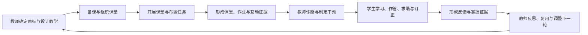

# ClassIn 教与学 SOP 及 AI 能力共识输入

> 日期：2026-08-15  
> 参考项目：`/Users/eeo/Documents/claudecode/classin-pc-agentin`  
> 用途：将 ClassIn 教师“教”和学生“学”的完整业务链路，以及各业务时刻的 AI 工具、Copilot、Agent 机会，作为教师 WorkBuddy 产品定义的业务输入。  
> 状态：业务模型综合稿；不是新的 ClassIn 生产规格，也不代表参考项目中的 AI 建议已经上线或获得真实客户验证。

## 一、证据范围

本次重点研读了参考项目的以下资料：

- `CONTEXT.md`：班级、课程、活动、作业、洞察、成长、资源等领域词汇；
- `docs/00-project/PROJECT-BRIEF.md`、`DECISION-LEDGER.md`：双角色产品树、业务事实所有权和已锁定产品边界；
- `docs/00-project/CLASSIN-DUAL-PLATFORM-EXPERIENCE-DESIGN-SUMMARY.md`：教师“教”和学生“学”的目标旅程；
- `docs/01-research/MOBILE-DUAL-ROLE-BASELINE.md`：老师和学生在首页、课程表、待办、洞察/成长等工作区中的实际动作；
- `docs/01-research/ai-capability-opportunity/`：师生旅程、AI 机会地图、能力分层和优先产品闭环；
- 当前源码：用于核对参考项目实际拥有的业务对象、导航和 AI Placeholder。

### 证据等级

| 类型 | 可以支持的判断 | 不能支持的判断 |
| --- | --- | --- |
| `LOCKED / FACT` 业务文档与领域模型 | 双角色、业务对象、状态和页面职责 | 真实 API、数据质量和生产权限已经就绪 |
| `RECOMMENDATION` AI 机会研究 | AI 机会、优先闭环和安全边界的合理候选 | 用户需求、商业价值或 Agent 能力已经验证 |
| 当前高保真 Demo 与源码 | 已实现业务流程、确定性 Mock 和 Placeholder | 已接入真实模型、课堂、IM、云盘或 Agent Runtime |
| 历史 AI 实现日志 | 曾经讨论或试做过的 AI 卡片、学习计划和诊断对话 | 当前分支仍拥有对应实现，或它们达到真实 Copilot/Agent 层级 |

当前源码只明确保留“AI 助教”“AI 学情”“应用思路点拨”等 Placeholder；历史日志中提到的 AI 今日洞察、学生学习计划和诊断对话，不能当作当前产品已实现能力。后续引用这套研究时，应把业务模型与 AI 实现成熟度分开。

## 二、ClassIn 教与学的总循环

参考项目给出的主循环是：

> **目标 → 准备 → 发生 → 证据 → 诊断 → 干预 → 反馈 → 下一轮调整**

它不是一条只走一次的流程，而是教师动作和学生动作相互作用的连续循环：



这对 WorkBuddy 的直接启示是：产品不能只优化教师的一次内容生成，而应逐步连接“目标、成果、执行、证据和下一轮调整”。

## 三、老师“教”的完整 SOP

| 阶段 | 业务时刻 | 老师的核心动作 | 主要业务产物 | 当前事实所有者 |
| --- | --- | --- | --- | --- |
| 目标 | 明确课程与班级目标 | 理解课程标准、班级特点、阶段目标和成功标准 | 课程目标、班级目标、范围 | 班级课程 / 课程目录 |
| 设计 | 课程设计与教研 | 设计大纲、知识结构、活动和教学策略 | 课程、单元、活动草稿 | 课程目录 |
| 生产 | 制作资源、课件与活动 | 检索、创建、改写课件、题目、资料和课堂活动 | 课件、资源、题目、活动草稿 | 课程目录 / 空间 |
| 准备 | 备课演练与反馈 | 演练讲解，检查表达、知识覆盖和互动设计 | 演练记录、时间戳反馈、修改清单 | 备课证据域（候选） |
| 组织 | 排课与课前准备 | 确认时间、成员、资源、课堂设置和通知 | 日程、准备清单、通知草稿 | 课程表 / 课堂 / 消息 |
| 发生 | 开展课堂与互动 | 讲解、提问、讨论、练习和课堂管理 | 课堂活动、板书、互动与学习证据 | 课堂 / 活动 |
| 处理 | 布置任务与批改 | 设计任务、批改、反馈、催交和要求订正 | 作业、评分、评语、订正要求 | 作业 / 提交 / 待办 |
| 诊断 | 理解效果与诊断 | 识别共性问题、个体薄弱点和进度偏差 | 可追溯诊断结论与待确认假设 | 教学洞察 |
| 干预 | 课后个性化支持 | 安排辅导、练习、资源、沟通和复查 | 干预计划、分层任务、资源与消息草稿 | 待办 / 作业 / 消息 / 空间 |
| 协同 | 沟通跟进 | 与学生、家长、助教或组织沟通进展和安排 | 消息、通知、行动项 | 消息 |
| 复盘 | 教学反思与复用 | 比较目标与结果，沉淀有效策略并调整下一轮 | 反思记录、策略、可复用资源 | 教学洞察 / 空间 / 课程目录 |

老师侧的真正闭环不是“备课—上课—课后报告”三个页面，而是：

```text
目标与设计
  → 资源与备课
  → 课堂发生
  → 作业与反馈
  → 诊断与干预
  → 复盘并进入下一轮设计
```

消息、课程表、待办和空间贯穿主循环，但分别拥有沟通、时间、行动状态和资源事实，WorkBuddy 不应另建一套重复状态。

## 四、学生“学”的完整 SOP

| 阶段 | 业务时刻 | 学生的核心动作 | 主要业务产物 | 当前事实所有者 |
| --- | --- | --- | --- | --- |
| 目标 | 理解目标与课程安排 | 理解为什么学、何时学、完成标准 | 目标理解与课程上下文 | 班级课程 / 课程表 |
| 准备 | 计划与预习 | 安排时间、检查前置知识、使用预习资源 | 学习计划、预习记录 | 课程表 / 待办 |
| 发生 | 进入课堂与参与 | 听讲、提问、讨论、答题和记录 | 参与行为、课堂学习证据 | 课堂 / 活动 |
| 练习 | 练习、作答与提交 | 完成老师布置的活动并提交 | 作答、提交、附件 | 作业 / 提交 / 待办 |
| 求助 | 求助与获得反馈 | 提问，理解老师批注和建议 | 问题、反馈、帮助记录 | 消息 / 作业反馈 |
| 修正 | 订正与掌握 | 根据反馈订正、重新练习并验证 | 订正记录、掌握证据 | 作业 / 学习记录 |
| 拓展 | 自主学习与 AI 互动 | 围绕个人目标练习、复习、提问和探索 | 自主学习会话和练习结果 | 自主学习活动（候选） |
| 成长 | 理解成长与下一目标 | 理解进步、薄弱点并调整目标 | 成长记录、下一目标 | 成长 |

学生侧必须区分三类行为：

1. 教师布置的正式学习任务；
2. 围绕正式任务发生的求助、反馈和订正；
3. 学生主动发起的自主学习活动。

AI 不能把自主问答自动算作教师任务完成，也不能代做、代提交或改写作业状态。

## 五、关键业务对象与事实所有权

| 业务对象 / 领域 | 拥有的事实 | WorkBuddy 可以做什么 | WorkBuddy 不应做什么 |
| --- | --- | --- | --- |
| 班级 | 成员、沟通和长期关系 | 理解组织与角色范围 | 把班级误写成有结课状态的课程 |
| 班级课程 | 目标、课程生命周期、单元和活动 | 生成、调整课程草稿 | 绕过课程发布流程 |
| 课程表 | 什么时候发生 | 解释冲突、生成准备建议 | 保存第二套日程事实 |
| 待办 | 需要做什么及完成状态 | 排序、生成草稿、确认后创建 | 把建议直接标成已完成 |
| 作业与提交 | 任务、作答、提交、评分和订正状态 | 生成评语、练习和错因候选 | 自动改变正式分数或提交状态 |
| 课堂与活动 | 课堂状态和可观察教学行为 | 整理证据、生成摘要和提示 | 把推断写成课堂事实 |
| 教学洞察 | 教师可使用的教学证据与诊断 | 归纳、解释、提出待确认假设 | 把相关性写成因果或永久标签 |
| 成长 | 学生学习结果和发展记录 | 解释进步、建议下一目标 | 使用伤害动机的固定能力标签 |
| 消息 | 沟通、通知和已读状态 | 摘要、提取行动项、生成草稿 | 把已读等同于任务完成或未经确认发送 |
| 空间 | 资源、权限和授权关系 | 检索、推荐、生成资源草稿 | 因 AI 使用而扩大访问权限 |

这套所有权模型是 WorkBuddy 能否从“聊天工具”升级为“业务 Agent”的基础：AI 负责理解、计划、草拟和编排，最终业务事实仍由对应领域对象拥有。

## 六、AI 工具、Copilot 与 Agent 的共同定义

| 层级 | 定义 | 典型输出 | 升级条件 |
| --- | --- | --- | --- |
| AI 工具 | 围绕单一任务完成生成、识别、转换、检索或解释 | 一份教案、题目、摘要、演练报告 | 能读取当前业务对象，并生成可确认写回的草稿 |
| AI Copilot | 理解当前角色、对象、权限和证据，在现有工作流中建议或起草 | 课程草稿、评语、诊断假设、干预计划、消息草稿 | 能围绕目标制定计划、调用两个以上真实工具并跟踪结果 |
| AI Agent | 围绕业务目标规划、调用白名单工具、处理失败、经过审批执行并持续跟踪 | 诊断到干预、创建任务、复查结果的完整运行 | 形成稳定 Runtime、审批、撤销、审计和结果反馈 |

判断层级不能依据交互容器：聊天窗、浮层、全屏工作台或 Agent 市场都不等于 Agent。Agent 至少需要：目标、计划、上下文、真实工具调用、运行状态、审批门、失败恢复、结果跟踪和审计。

### 默认动作边界

| 动作类型 | 默认策略 | 示例 |
| --- | --- | --- |
| 只读理解 | 可自动执行 | 搜索资源、总结错误、解释截止时间 |
| 生成草稿 | 可以自动生成但不发布 | 教案、评语、消息、练习、干预计划 |
| 单对象写入 | 明确确认后执行 | 保存课程草稿、创建一项待办 |
| 批量或外部副作用 | 强确认、差异预览、可撤销 | 批量布置作业、催交、调课、发消息 |
| 不可直接改写事实 | 禁止 AI 直接执行 | 正式成绩、提交状态、课堂事实、权限、已读和完成状态 |

## 七、各业务时刻的 AI 能力判断

### 7.1 老师侧

| 业务时刻 | 推荐 AI 能力 | 合理层级 | 关键产物 |
| --- | --- | --- | --- |
| 目标拆解 | 标准、班级差异与成功标准对照 | 工具 → Copilot | 可编辑目标草稿 |
| 课程设计与教研 | 大纲、知识结构、单元、活动和资源建议 | Copilot | 课程对象草稿 |
| 资源与课件生产 | 检索、改写、出题、重复检查 | 工具 → Copilot | 有来源的资源和活动草稿 |
| 备课演练 | 时间戳证据、覆盖检查、表达与互动建议 | 工具 → Copilot；闭环后才是 Agent 候选 | 演练报告和修改计划 |
| 排课与课前准备 | 冲突解释、准备清单、调课与通知草稿 | Copilot；跨模块执行后是 Agent 候选 | 准备与变更计划 |
| 课堂与互动 | 字幕、板书、摘要、互动提示 | 工具 → Copilot | 课堂证据和课后记录草稿 |
| 作业与批改 | 客观批改、评分建议、评语、共性错误聚类 | 工具 → Copilot | 待确认批改和订正草稿 |
| 教学诊断 | 证据摘要、薄弱点和可解释诊断假设 | Copilot | 待确认诊断 |
| 个性化干预 | 辅导计划、分层练习、资源、消息和复查节点 | Copilot → Agent 候选 | 可执行干预计划 |
| 沟通跟进 | 摘要、行动项、回复和通知草稿 | 工具 → Copilot | 待确认消息和行动项 |
| 教学反思 | 目标-结果比较、策略复用和下一轮实验 | Copilot；长期跟踪可成为 Agent | 反思与下一轮设计草稿 |

### 7.2 学生侧

| 业务时刻 | 推荐 AI 能力 | 合理层级 | 关键边界 |
| --- | --- | --- | --- |
| 理解目标 | 课程地图、标准解释和下一行动 | 工具 → Copilot | 不能偏离教师目标 |
| 计划与预习 | 今日计划、估时、前置知识检查 | Copilot | 学生可以修改，不替学生决定一切 |
| 课堂参与 | 字幕、笔记、重点、问题草稿 | 工具 → Copilot | 不制造课堂分心或隐私监测 |
| 作答与提交 | 题意解释、逐级提示、思路检查 | 工具 → Copilot | 不直接给答案、不代做、不代提交 |
| 求助与反馈 | 先行解释、提问整理、转交老师 | Copilot | 不替代师生关系和正式反馈 |
| 订正与掌握 | 错因候选、订正步骤、针对性练习 | Copilot | 不固化错误标签 |
| 自主学习 | 练习、问答、复习计划和即时反馈 | 工具 → Copilot；跨周期后是 Agent 候选 | 与正式作业隔离，保护未成年人数据 |
| 成长与目标 | 进步解释、薄弱点和下一目标建议 | Copilot | 避免伤害动机的排名和标签 |

## 八、优先纵向闭环

参考项目筛选出的优先闭环，与当前 WorkBuddy 讨论可以这样对齐：

### 闭环 A：诊断到个性化干预

```text
已确认教学证据
  → 诊断假设
  → 个性化干预计划
  → 老师确认
  → 写入待办 / 作业 / 资源 / 消息
  → 到期复查结果
```

这是最接近完整 Agent 骨架的候选，也与我们此前提出的“课后教学包”高度重合。更准确的名称应是“课后诊断与干预闭环”，而不是只强调生成一份报告。

### 闭环 B：批改到订正

```text
作业与提交
  → 共性错误与个体错因候选
  → 老师确认反馈与分层练习
  → 学生逐级提示和订正
  → 结果回到作业与成长证据
```

这是老师和学生第一次形成强耦合的 AI 闭环，数据准备度较高，但必须把评分建议、正式分数和提交状态分开。

### 闭环 C：备课演练到改进

```text
课件 / 音视频 / 知识点
  → 时间戳可观察证据
  → 修改计划
  → 更新课件或活动草稿
  → 再次演练和前后对比
```

它对没有 ClassIn 历史课堂数据的新教师同样成立，因此是通用教师 WorkBuddy 独立使用的重要冷启动候选。

### 闭环 D：课程目标到课程对象

```text
课程目标与教师资料
  → 大纲 / 单元 / 活动 / 资源草稿
  → 教师编辑确认
  → 发布或写回课程目录
  → 用后续教学结果调整下一轮设计
```

这是通用 WorkBuddy 的教研和备课入口，也是“没有 ClassIn 也能使用”的核心价值之一。

## 九、对通用教师 WorkBuddy 的修正与增强

参考项目证明，我们此前的“通用终局 + ClassIn 增强层”方向可以继续成立，但产品模型需要进一步精确。

### 9.1 终局不是功能大全，而是一条教师结果循环

通用教师 WorkBuddy 应覆盖完整教师生命周期，但不应把 11 个业务时刻做成 11 个孤立菜单。核心是让同一个目标、课程、学生范围、成果和证据在不同业务时刻持续流动。

### 9.2 一套核心，两类上下文来源

| 使用状态 | 上下文如何形成 | 能力上限 |
| --- | --- | --- |
| 未使用 ClassIn | 教师输入目标、上传资料、建立课程/班级、连接外部工具 | 教研、备课、演练、内容生产、手动记录后的诊断和沟通支持 |
| 使用 ClassIn | 自动接入获授权的班级、课程、课堂、作业、互动、消息和结果 | 更连续的证据、更精细的诊断、可直接执行的任务和结果复查 |

二者共享同一个教师模型、业务对象模型和 WorkBuddy Runtime；ClassIn 不应是产品唯一入口，而应是最深的业务连接器。

### 9.3 统一工作台与三种协作模式

终局产品壳层是一个统一教师 WorkBuddy 工作台：对话负责目标协调，结构化工作区承载教学产物、上下文、证据、计划、审批和复查。教师面对一个统一主 Agent。

同一个界面支持三种协作模式：

1. **AI 工具模式**：完成单对象、单任务的生成、检索、识别或分析；
2. **业务 Copilot 模式**：理解当前对象并生成可编辑、可确认的业务草稿；
3. **Agent 模式**：围绕复杂目标规划、调用能力、等待审批、执行并复查。

课程、作业、洞察、消息和资源等页面提供携带当前对象的情境入口，运行与审批中心是工作台中的任务控制区域。所有入口共享同一个 WorkBuddy 身份和任务状态，最终成果回到真实业务对象。

## 十、可以作为当前共识的判断

1. 教师 WorkBuddy 的一级模型应按教师业务时刻和教学结果组织，不按页面、模型能力或 Agent 人格组织。
2. 终局产品覆盖教师教研、备课、课堂指导、作业处理、诊断、个性化服务、沟通和复盘的完整循环。
3. 学生不是教师 WorkBuddy 的附属数据对象，而是拥有独立学习任务、反馈、订正、自主学习和成长链路的行动者。
4. AI 工具、Copilot 和 Agent 是递进能力层，不是三种界面风格；只有跨对象规划、执行和跟踪才进入 Agent 层。
5. AI 输出必须成为课程、活动、资源、作业、待办、消息或洞察中的草稿、建议和待确认动作，不能只留在聊天历史中。
6. ClassIn 的差异化来自连续教学上下文、明确业务对象、真实执行系统和结果反馈，不是仅仅“数据更多”。
7. “课后教学包”应升级理解为“诊断到个性化干预”的纵向闭环；它是重要切入点，不是终局产品边界。
8. 对未使用 ClassIn 的教师，课程设计和备课演练是更自然的冷启动场景；接入 ClassIn 后，再逐步解锁更强的课堂诊断、干预执行和结果追踪。

## 十一、仍需验证的问题

1. 首发应优先验证“诊断到干预”，还是同时提供“课程设计/备课演练”作为非 ClassIn 用户入口？
2. 通用 WorkBuddy 的基础班级、课程、学生和教学结果对象由产品自建，还是主要依赖外部导入与连接器？
3. 哪些 ClassIn 数据可以在获得授权后进入 WorkBuddy，数据的质量、留存周期和跨机构边界是什么？
4. 学生侧 AI 是否属于同一个 WorkBuddy 产品体系，还是独立的 Student Buddy，但与教师 WorkBuddy 共享教学协议？
5. 教学管理者如何查看聚合证据，同时避免把 AI 推断直接用于教师排名、绩效或人事判断？
6. Agent 的首批白名单工具、审批门、撤销和审计能力应做到什么深度？

## 十二、建议的下一步

基于本次业务输入，下一轮产品定义不宜直接画页面，而应先完成三个模型：

1. **教师 WorkBuddy 终局能力地图**：将 11 个老师业务时刻收敛为少量连续结果域；
2. **核心对象与上下文模型**：明确教师、班级、课程、学生、目标、教学产物、证据、任务和干预之间的关系；
3. **阶段路线图**：分别定义通用产品冷启动、ClassIn 内嵌切片和从 Copilot 升级 Agent 的门槛。

这三个模型形成后，再进入信息架构、首页/工作台设计和具体 Feature 排序，会比直接讨论聊天框、Agent 市场或功能清单更稳固。
