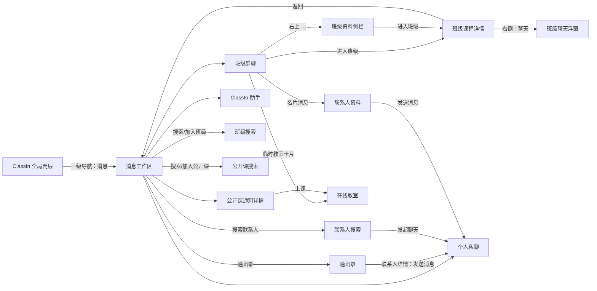
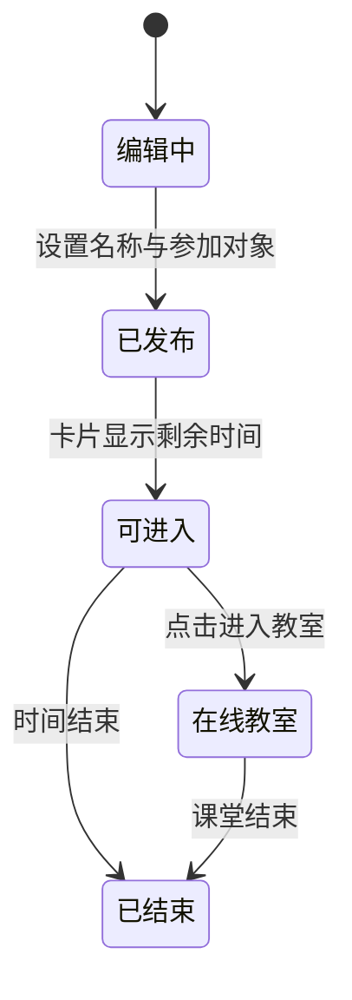

# ClassIn IM 1.0 线上版本功能、入口与交互流程盘点

> 本文是后续 IM / TeacherIn / Agent 2.0 推演的**现状事实底稿**，不是 2.0 产品方案，也不把当前仓库中的 2.0 候选设计反推为 1.0 已有能力。

> 2026-08-30 用户校准已写入[线上 ClassIn IM 功能全集](../im-feature-landscape/02-ONLINE-CLASSIN-IM-FEATURE-INVENTORY.md)。发生差异时以该用户审阅版为准；本底稿同步了会影响当前 Feature 有无的关键结论，规则细节仍保留为历史研究问题。

## 0. 结论摘要

ClassIn IM 1.0 可以概括为一套围绕“人、班级、课程与课堂动作”建立的基础通信系统：

1. **两个外部主入口**：
   - 从 ClassIn 一级导航“消息”进入完整 IM 工作区；
   - 从班级课程详情页右侧“聊天”进入当前班级的聊天浮窗。
2. **四类主要信息对象**：班级群聊、个人私聊、公开课上课通知/详情、`ClassIn 助手`官方通知流。
3. **聊天不是纯文本能力**：除文本和表情外，还支持 `@`、截图、图片/视频、文件、云盘文件、名片和临时教室等消息或业务动作。
4. **班级是 IM 的核心业务上下文**：群聊可进入班级详情、查看班级资料和成员，也可在群内发起临时教室；班级详情又能回到 IM。
5. **1.0 的对话组织仍以顺序消息流为主**：现有材料明确未体现回复/引用线程、Reaction、投票和 Channel 等协作型能力。
6. **1.0 未发现 AI Agent 能力**：`ClassIn 助手`承载官方内容与帮助入口，是通知/内容分发账号，不应被等同于可参与会话、调用工具或执行任务的 AI Agent。
7. **老师与学生共用同一通信底座，管理权限有明确分层**：老师、班主任、助教可管理公告、临时教室和群文件；学生可正常发送消息、表情和文件，但不能操作公告、发起临时教室或管理群文件。当前 2.0 研究以老师视角为主，学生端仅保留必要兼容性关注。
8. **完整理解 1.0 不能停留在页面层**：还必须从核心对象、角色权限、用户任务、生命周期、消息发现与通知、业务连接、异常边界以及可继承资产等角度建立基线。
9. **基础提醒能力存在，但会话管理较弱**：支持基础未读提示/计数、`@我的`提醒和桌面通知；不支持会话置顶、免打扰，也没有单条消息操作菜单、回复、Reaction、点赞或当前版本撤回。

因此，1.0 的基本盘不是“一个消息列表 + 一个输入框”，而是：

```text
联系人/组织关系 + 班级关系 + 会话列表 + 顺序消息流
          + 课程/课堂跳转 + 结构化业务消息 + 官方通知分发
```

## 1. 研究范围、方法与证据边界

### 1.1 研究问题

本文采用“3 个基础问题 + 9 个补充问题”的十二维现状审计框架：

| 维度 | 研究问题 | 主要回答内容 |
|---|---|---|
| Q1 入口 | 线上 1.0 有哪些 IM 操作入口？ | 外部主入口、IM 内部入口、消息内业务入口 |
| Q2 跳转 | 页面、浮层与外部业务页面如何跳转？ | 页面图、前进/返回关系、上下文是否保留 |
| Q3 页面 Feature | 每个页面承载哪些 Feature？ | 页面职责、控件、状态与具体 IM 能力点 |
| Q4 核心对象 | IM 中有哪些业务和通信对象？ | 用户、关系、班级、课程、会话、消息、文件、课堂等 |
| Q5 角色权限 | 谁能看到什么、执行什么？ | 老师、学生、班主任、助教、机构、系统账号的权限边界 |
| Q6 用户任务 | 用户为什么使用 IM？ | 课前、课中、课后和日常协作任务 |
| Q7 生命周期 | 对象与消息如何发生状态变化？ | 发送、撤回、加入、结课、课堂进行/结束等 |
| Q8 组织与发现 | 消息如何被组织、提醒和重新找到？ | 会话排序、摘要、未读、@、搜索、群文件和历史检索 |
| Q9 通知触达 | 用户如何被消息或业务事件触达？ | 公告、@、系统事件、课程通知、离线/桌面通知等 |
| Q10 业务连接 | IM 与哪些 ClassIn 系统连接？ | 班级、课程、组织、云盘、在线教室和官方内容 |
| Q11 异常边界 | 正常路径之外会发生什么？ | 空态、失败、权限、失效、退出、弱网和多端一致性 |
| Q12 演进价值 | 哪些是资产、问题或历史包袱？ | 2.0 应继承、优化、重构和补测的内容 |

其中 Q1–Q3 还原可见产品表面，Q4–Q11 解释其运行结构和真实使用条件，Q12 为 2.0 多方案推演提供共同基线。

### 1.2 证据来源

| 编号 | 来源 | 用途 |
|---|---|---|
| N1 | [ClassIn IM 功能设计现状（Notion）](https://app.notion.com/p/3c9a5c3b026b80a99bc5c773f5f0195c?pvs=204) | 1.0 现状的主要文字事实源 |
| N2 | [IM 能力演进方向、产品设计探讨（Notion）](https://app.notion.com/p/3c9a5c3b026b802e893de4debc3e2cb7?pvs=204) | 仅用于确认“现有 2.0 设计是候选演进方向”，不作为 1.0 功能事实源 |
| U1 | 2026-08-27 用户直接补充说明 | 确认老师/学生端范围、角色权限、消息操作、提醒能力和移出群后的可见性；优先级高于研究推断 |
| S1–S6 | [ClassIn IM 消息现状设计方案截图目录](<../../../reference/Classin IM消息现状设计方案>) | 59 张原始截图，逐张核对入口、页面布局、状态、控件和消息呈现 |
| S7 | [用户补充：班级群消息无单条消息操作入口](<../../../reference/Classin IM消息现状设计方案/7-用户补充证据/7-1-班级群消息无单条消息操作入口.png>) | 纠正对消息 `…` 的误判；右上 `…` 属于会话设置，消息本身没有操作菜单 |

### 1.3 证据标记

- **用户确认**：用户对真实产品行为的直接补充，是本轮最高优先级事实输入；
- **文档确认**：N1 明确写出；
- **截图确认**：本地截图直接可见；
- **综合判断**：由多个事实归纳出的产品判断，不冒充线上规则；
- **待验证**：现有材料不足，不能确定。

### 1.4 研究边界

本轮能确认的是 PC 客户端可见产品行为，不能据此确认：

- 移动端、Web 端是否完全一致；
- 服务端协议、消息存储、推送、已读回执和同步机制；
- 已确认老师/班主任/助教与学生的核心群管理权限差异，但机构、家长和特殊班级状态下的细粒度权限仍不完整；
- 未出现在材料中的异常、弱网、离线与风控流程；
- 线上版本号、灰度差异和历史版本差异。

## 2. 1.0 的信息架构与对象模型

### 2.1 页面和覆盖层

| ID | 页面/覆盖层 | 形态 | 核心职责 |
|---|---|---|---|
| P0 | ClassIn 首页/全局壳层 | 页面 | 提供一级导航“消息” |
| P1 | 消息工作区 | 页面 | 搜索、会话列表、会话详情三栏式工作区 |
| P2 | 班级群聊 | P1 内主视图 | 班级成员间消息、班级资料与课堂动作 |
| P3 | 个人私聊 | P1 内主视图 | 两人直接通信 |
| P4 | 公开课通知详情 | P1 内详情视图 | 展示课程详情、上课与分享/邀请动作 |
| P5 | ClassIn 助手 | P1 内主视图 | 官方通知卡片、产品更新、帮助内容 |
| P6 | 班级课程详情 | 页面 | 班级业务信息、成员、公告、待办与聊天入口 |
| P7 | 在线教室 | 独立课堂页面/窗口 | 承接临时教室卡片的“进入教室”动作 |
| O1 | 班级聊天浮窗 | 模态/独立浮窗 | 在班级详情上下文内快速群聊 |
| O2 | 通讯录 | 弹窗 | 新好友、班级、好友和组织关系浏览 |
| O3 | 添加菜单 | 下拉菜单 | 添加好友、加入班级、加入公开课 |
| O4 | 班级资料侧栏 | 右侧栏 | 班级资料、教师/学生成员、进入班级 |
| O5 | 搜索/加入弹窗 | 弹窗 | 联系人、班级和公开课检索及下一步动作 |
| O6 | 编辑器辅助浮层 | 弹窗/系统工具 | 表情、@、截图、文件、名片、临时教室 |
| O7 | 联系人详情 | 详情面板 | 查看个人资料并发起私聊/添加好友 |

### 2.2 主要会话与信息对象

| 对象 | 是否为常规对话 | 参与者/发送方 | 主要内容 | 选择后的主视图 |
|---|---:|---|---|---|
| 班级群 | 是 | 教师、学生、班级成员 | 群消息、系统事件、文件、临时教室等 | 班级群聊天流 |
| 个人私聊 | 是 | 两名用户 | 直接消息、媒体、文件、名片等 | 1:1 聊天流 |
| 公开课通知 | 否，偏业务入口 | 课程/系统 | 上课提醒、课程详情 | 公开课详情和“上课”动作 |
| ClassIn 助手 | 否，偏官方信息流 | ClassIn 官方 | 图文卡片、更新、入门与帮助 | 官方内容卡片流 |

**综合判断**：P1 的左侧列表并不只是“会话列表”，它混合承载了人与群的对话、课程动作入口和官方内容流。用户选择不同条目后，右侧可能是聊天流，也可能是业务详情页。

### 2.3 核心对象关系

```mermaid
flowchart TB
    U[用户] --> R[好友/组织关系]
    U --> M[班级成员关系]
    C[班级] --> M
    C --> G[班级群会话]
    C --> A[公告]
    C --> GF[群文件]
    C --> L[课程/在线教室]

    U --> D[个人私聊]
    G --> MSG[消息]
    D --> MSG

    MSG --> T[文本/@/系统事件]
    MSG --> MEDIA[图片/视频/文件]
    MSG --> CARD[名片/临时教室卡片]

    CARD --> R
    CARD --> L
    PC[公开课通知] --> L
    OA[ClassIn 助手] --> OC[官方内容]
```

| 对象层 | 核心对象 | 1.0 中的作用 | 当前证据边界 |
|---|---|---|---|
| 身份 | 用户、老师、班主任、助教、学生、官方账号 | 消息发送者、接收者和业务参与者 | 核心群管理权限已确认；特殊角色仍待补充 |
| 关系 | 好友、组织成员、班级成员 | 决定发现、联系人详情、群聊和私聊路径 | 非好友私聊规则待验证 |
| 会话 | 班级群、个人私聊 | 承载连续消息流 | 会话创建、归档和删除规则待验证 |
| 业务信息对象 | 公开课通知、ClassIn 助手内容 | 在消息域分发业务动作和官方内容 | 是否使用统一会话模型待验证 |
| 内容 | 文本、媒体、文件、名片 | 表达信息或引用业务对象 | 消息存储、过期与权限规则待验证 |
| 行动 | 临时教室、上课、发送消息 | 从消息直接进入业务动作 | 操作结果回写范围待验证 |
| 上下文 | 班级、课程、组织、云盘 | 为 IM 提供成员、资料和资源 | 数据同步机制待验证 |

## 3. IM 操作入口全量盘点

### 3.1 两个外部主入口

| 入口 | 起点 | 操作 | 到达形态 | 上下文特点 | 证据 |
|---|---|---|---|---|---|
| E1 一级导航“消息” | ClassIn 全局壳层 | 点击左侧“消息” | 完整消息工作区 P1 | 面向所有会话，可切换联系人、群、通知 | 文档确认、截图确认 [S1-2] |
| E2 班级详情“聊天” | 班级课程详情 P6 | 点击右侧“聊天” | 当前班级聊天浮窗 O1 | 保留班级详情背景，直接定位当前班级 | 文档确认、截图确认 [S1-1] |

两者的体验差异：

- E1 是**跨对象的消息管理入口**，强调会话发现、切换和持续沟通；
- E2 是**班级上下文入口**，强调用户处理班级事务时不离开当前页面即可聊天；
- O1 带有窗口级最小化、最大化、关闭控件，视觉上是叠加在班级页上的独立聊天窗口，而不是完整路由切换。

### 3.2 IM 内部二级入口

| 编号 | 所在位置 | 入口/动作 | 结果 | IM 能力类别 | 证据 |
|---|---|---|---|---|---|
| E3 | P1 左栏顶部 | 通讯录图标 | 打开 O2，浏览新的好友/班级/好友/组织 | 联系人与关系发现 | N1、[S3-1] |
| E4 | P1 左栏顶部 | `+` | 展开添加好友/加入班级/加入公开课 | 关系和业务对象加入 | N1、[S3-2] |
| E5 | P1 搜索框 | 点击/输入 | 左侧切换为全网搜索，再进入联系人/班级/公开课弹窗 | 搜索和会话发现 | N1、[S4] |
| E7 | 班级群右上 | `…` | 展开 O4 班级资料侧栏 | 会话上下文信息 | N1、[S3-5] |
| E8 | 班级群顶部 | “文件” | 切换到群文件视图 | 会话内容聚合 | 截图确认 [S5-1] |
| E9 | 消息中的名片 | 点击名片 | 打开 O7 联系人资料，再“发送消息”进入私聊 | 消息到关系再到会话 | N1、[S6-3] |
| E10 | 临时教室卡片 | 点击“进入教室” | 打开 P7 在线教室 | 消息到实时课堂 | N1、[S5-7] |
| E11 | 公开课通知/详情 | 点击“上课” | 进入公开课课堂 | 消息列表到课程动作 | 截图确认 [S5-1] |
| E12 | ClassIn 助手卡片 | 点击“查看详情” | 打开对应官方内容详情 | 通知到内容详情 | N1、[S5-1] |

## 4. 页面跳转关系

### 4.1 全局关系图



### 4.2 跳转与返回语义

| 起点 | 触发 | 终点 | 呈现方式 | 返回/关闭 |
|---|---|---|---|---|
| 全局壳层 | 一级导航“消息” | P1 | 主页面切换 | 通过全局导航离开 |
| P6 班级详情 | “聊天” | O1 | 覆盖在原页上的聊天窗口 | 关闭窗口，原班级页仍在 |
| P1 班级群 | “进入班级” | P6 | 页面跳转 | 左上“返回”回 IM |
| P1 班级群 | `…` | O4 | 右侧栏展开，聊天区变窄 | 再次关闭/收起侧栏 |
| P1 | 通讯录 | O2 | 居中多栏弹窗 | 关闭弹窗回 P1 |
| O2/O5/O7 | “发送消息/发起聊天” | P3 | 打开对应 1:1 会话 | 回到会话列表上下文 |
| P1 | 搜索 | O5 | 左栏先切搜索分类，再开结果弹窗 | 关闭弹窗或退出搜索 |
| 聊天流 | 名片 | O7 | 联系人详情覆盖层 | 关闭，或“发送消息”进入私聊 |
| 聊天流 | 临时教室卡片 | P7 | 独立在线课堂页面/窗口 | 退出课堂返回客户端 |
| 公开课通知 | “上课” | P7 | 课堂页面/窗口 | 退出课堂返回客户端 |

**待验证**：截图能确认主要方向和返回控件，但不能确认所有跳转是否保留滚动位置、输入草稿、列表选中态及浏览历史。

## 5. 核心用户体验流程

### 5.1 流程 A：从全局消息入口处理会话

1. 用户在 ClassIn 一级导航点击“消息”；
2. 进入 P1，左侧看到搜索、通讯录、添加入口和消息列表；
3. 选择班级群、个人、公开课通知或 ClassIn 助手；
4. 右侧按对象类型展示聊天流、课程详情或官方信息流；
5. 在聊天对象中编辑并发送内容，或从业务对象执行“上课/查看详情”。

体验特征：这是日常消息处理的主路径，支持跨会话切换；同一列表中的对象形态并不完全一致。

### 5.2 流程 B：在班级详情中快速聊天

1. 用户已位于班级课程详情 P6；
2. 点击右侧“聊天”；
3. O1 在当前页面上方打开，并直接绑定本班级；
4. 用户查看公告、历史消息并使用编辑器；
5. 完成后关闭/最小化聊天窗口，继续处理原班级页面。

体验特征：不要求先进入全局消息工作区，也不需要重新查找班级会话，适合“课程事务中顺手沟通”。

### 5.3 流程 C：从通讯录发现人并发起私聊

1. 在 P1 点击通讯录；
2. 在“新的好友 / 班级 / 好友 / 组织”之间切换；
3. 好友可按拼音/字母定位，组织可逐级进入组织、团队、部门和人员；
4. 点击人员查看 O7 联系人详情；
5. 点击“发送消息”进入 P3；非好友场景还可选择“添加好友”。

体验特征：联系人关系与消息会话相互联通；“新的好友”与“好友”存在内容边界重叠的现状。

### 5.4 流程 D：通过搜索建立关系或进入业务对象

1. 用户点击消息页搜索框；
2. 左侧会话列表切换为“全网搜索”分类：搜索好友、搜索班级、搜索公开课；
3. 联系人按手机号或邮箱搜索，结果页可“发起聊天”；
4. 班级按班级号搜索，结果显示简介和成员，并提供加入/进入动作；
5. 公开课按公开课 ID 搜索，结果显示时间、时长、席位/在线人数和教师，并提供“上课”。

补充入口：联系人搜索弹窗还展示“我的二维码”和“我的 In 口令”，用于让他人添加自己。这是分享/被发现机制，不是严格意义上的搜索。

已观察到的状态：

- 未输入；
- 搜索成功；
- 未找到/不允许加入；
- 班级搜索的空态与未找到态使用了相近提示“该班级已结课或不允许学生自主加入”，语义较混合。

### 5.5 流程 E：班级群与班级业务页双向切换

1. 在班级群顶部点击“进入班级”，或在 O4 底部点击同名按钮；
2. 打开班级课程详情 P6；
3. 用户查看/处理班级业务；
4. 点击左上“返回”回到 IM。

体验特征：IM 不是班级的孤立旁路，而是班级业务域的一个入口和返回点。

### 5.6 流程 F：发送普通内容、媒体和文件

1. 在聊天输入区键入文字，或使用表情、@、截图、文件、名片；
2. 截图、图片和附件可先进入输入区形成待发送内容；截图支持一次放入多张，并继续追加文字；
3. 文件可选择本地文件或云盘文件；云盘支持来源切换、搜索、勾选和多选；
4. 点击绿色发送按钮；
5. 消息流按类型渲染为气泡、缩略图、播放卡片、文件卡片或名片卡片；
6. 左侧会话摘要会用 `[图片]`、`[名片]`、`[文件]` 或文本反映最近一条内容。

### 5.7 流程 G：发起临时教室

1. 在班级群编辑器点击临时教室入口；
2. 打开创建弹窗，默认显示“15 分钟临时教室”和容量标识 `1V6`；
3. 编辑教室名称；
4. 选择参加/提醒对象，可全选或选择具体班级成员；
5. 选中成员以 `@成员` 回显；
6. 发布后，在消息流中同时出现临时教室结构化卡片和对相关成员的提醒；
7. 有效期内卡片显示剩余时间和“进入教室”；
8. 点击进入独立在线教室；结束后卡片状态变为“已结束”。

这是 1.0 最典型的“IM 触发业务动作”：消息不只表达信息，还携带可执行动作和生命周期状态。

### 5.8 流程 H：接收官方内容或课程通知

- 选择 `ClassIn 助手`：查看官方图文卡片，点击“查看详情”，或从底部进入“入门必看 / ClassIn 产品更新 / 帮助中心”；
- 选择公开课通知：右侧显示课程详情，可查看时间、教师、人数等信息，并执行“上课”、课后评价或分享/邀请。

体验特征：两者都在消息域中出现，但不是人与人之间的常规对话。

## 6. 页面级 Feature 清单

### 6.1 P1 消息工作区

| Feature | 可见行为 | 对应 IM 能力点 | 证据 |
|---|---|---|---|
| 三栏式布局 | 全局导航、消息列表、当前详情/聊天 | 会话导航与上下文切换 | 截图确认 [S1-2] |
| 会话列表 | 头像、名称、摘要、时间/状态 | 最近会话、最近消息预览 | 截图确认 |
| 异构条目 | 群聊、私聊、公开课、官方助手共存 | 对话、通知与业务入口统一分发 | 截图确认 [S5-1] |
| 搜索 | 进入全网搜索分类 | 联系人/群组/课程发现 | N1、[S4] |
| 通讯录 | 打开新的好友、班级、好友、组织 | 关系发现与会话发起 | N1、[S3-1] |
| 添加菜单 | 添加好友、加入班级、加入公开课 | 建立关系/加入业务对象 | N1、[S3-2] |
| 新消息分隔 | “以下为新消息”分隔 | 当前阅读位置后的新消息边界，不等同于未读数字计数 | 截图确认 [S5-1] |

### 6.2 P2 班级群聊

| Feature | 可见行为 | 对应 IM 能力点 | 证据 |
|---|---|---|---|
| 群身份 | 顶部展示班级头像和名称 | 会话身份与班级上下文 | 截图确认 |
| 顶部 Tab | 聊天 / 文件 / 进入班级 | 对话、内容聚合、业务页跳转 | 截图确认 [S5-1] |
| 班级公告条 | 顶部持续展示公告 | 群公告/固定信息 | N1、截图确认 |
| 提醒条 | 展示发布者、`@所有人` 和关闭按钮 | 群级重要提醒 | 截图确认 |
| 顺序消息流 | 左右分列消息和时间线 | 群内实时/异步通信 | N1、截图确认 |
| 系统事件 | 加入班级、班级改名等事件 | 会话内系统消息 | 截图确认 |
| 历史撤回占位 | 旧画面显示“你撤回了一条消息” | 版本差异证据；当前版本不支持撤回 | 截图、U2 |
| 文件视图 | 顶部“文件”可切换 | 群内容聚合 | 老师/班主任/助教可管理；学生不能管理但可发送普通文件；具体筛选能力待验证 |
| 班级资料侧栏 | 简介、备注、机构、教师、学生 | 会话上下文与成员可见性 | N1、[S3-5] |
| 编辑器 | 文本、表情、@、截图、文件、名片、临时教室 | 多模态与结构化消息创建 | N1、[S5] |

### 6.3 P3 个人私聊

| Feature | 可见行为 | 对应 IM 能力点 | 证据 |
|---|---|---|---|
| 对方身份 | 顶部展示联系人名称 | 1:1 会话身份 | 截图确认 [S5-1] |
| 顺序消息流 | 双方消息左右展示 | 直接通信 | N1、截图确认 |
| 通用编辑器 | 文本、表情、截图、文件、名片等 | 多类型直接消息 | 截图确认 |
| 临时教室 | Composer 可发起临时教室 | 私聊中的结构化课堂动作 | 截图入口、U2 确认可用 |
| 无群上下文控件 | 未看到公告、成员、进入班级 | 私聊与群聊能力分层 | 截图确认 |
| @ 差异 | 私聊截图未见 @ 图标 | @ 主要服务群聊 | 截图确认；是否可通过键盘触发待验证 |

### 6.4 P4 公开课通知详情

| Feature | 可见行为 | 对应 IM 能力点 | 证据 |
|---|---|---|---|
| 课程摘要 | 标题、开始时间、时长、人数/席位、教师 | 业务通知内容 | N1、截图确认 [S5-1] |
| 上课动作 | 绿色“上课”按钮 | 通知到实时课堂的动作入口 | 截图确认 |
| 课后评价 | 显示评价入口 | 课堂后续业务动作 | N1 |
| 分享邀请 | 扫码分享、In 口令、邮件邀请 | 课程传播与邀请 | N1 |

**综合判断**：它位于消息列表中，却不以聊天流为核心，应视为“消息域中的课程动作卡/详情”，而非传统会话。

### 6.5 P5 ClassIn 助手

| Feature | 可见行为 | 对应 IM 能力点 | 证据 |
|---|---|---|---|
| 官方身份 | 名称旁有“官方”标识 | 系统账号可信身份 | 截图确认 [S5-1] |
| 图文卡片 | 图片、标题、说明、查看详情 | 官方通知和内容分发 | N1、截图确认 |
| 内容分类 | 入门必看、产品更新、帮助中心 | 服务内容导航 | N1、截图确认 |
| 详情跳转 | 点击卡片进入内容详情 | 通知到 H5/详情页 | N1 |

**边界结论**：U2 确认这是完全单向、系统触发的推送消息流，不存在用户输入或用户侧触发；因此不能把 `ClassIn 助手`定义为 AI Agent。

### 6.6 P6 班级课程详情

| Feature | 可见行为 | 与 IM 的关系 | 证据 |
|---|---|---|---|
| 班级信息 | 班级名称、头像、资料等 | 形成群聊的业务上下文 | 截图确认 [S1-1] |
| 成员 | 右侧成员入口 | 对应班级群成员关系 | 截图确认 |
| 公告 | 右侧公告入口 | 对应群聊公告信息 | 截图确认 |
| 聊天 | 右侧聊天入口 | 打开 O1 当前班级群聊 | N1、截图确认 |
| 待办 | 右侧待办入口 | 与群聊并列的班级任务能力 | 截图确认；是否产生消息待验证 |
| 返回 IM | 从 IM 进入班级后左上返回 | 完成业务页到消息页闭环 | N1、[S3-3] |

### 6.7 O1 班级聊天浮窗

| Feature | 可见行为 | 对应 IM 能力点 | 证据 |
|---|---|---|---|
| 当前班级直达 | 无需在会话列表再次查找 | 场景化会话入口 | N1、[S1-1] |
| 窗口控制 | 最小化、最大化、关闭 | 多任务与上下文保留 | 截图确认 |
| 班级头部 | 头像、名称、公告 | 会话身份和固定信息 | N1、截图确认 |
| 消息流与编辑器 | 历史消息、输入和发送 | 班级群核心通信 | N1、截图确认 |

### 6.8 O2 通讯录与 O7 联系人详情

| Feature | 可见行为 | 对应 IM 能力点 | 证据 |
|---|---|---|---|
| 新的好友 | 按时间显示新关系 | 好友请求/新增关系 | N1、[S3-1] |
| 班级 | 浏览班级关系 | 群组/业务关系发现 | N1 |
| 好友 | 按字母/拼音组织，有字母索引 | 联系人查找 | N1、截图确认 |
| 组织 | 多级组织树和人员 | 企业组织关系发现 | N1、截图确认 |
| 人员资料 | 头像、名称、备注、部分资料 | 身份识别 | N1、截图确认 |
| 发送消息 | 从资料直接打开私聊 | 关系到会话 | N1、截图确认 |
| 添加好友 | 非好友人员可添加 | 建立可持续私聊关系 | N1、截图确认 |

### 6.9 O4 班级资料侧栏

| Feature | 可见行为 | 对应 IM 能力点 | 证据 |
|---|---|---|---|
| 班级资料 | 名称、图片、机构、简介、备注 | 会话上下文信息 | N1、[S3-5] |
| 教师信息 | 老师/班主任 | 角色与成员身份 | N1、截图确认 |
| 学生列表 | 展示学生成员 | 群成员可见性 | N1、截图确认 |
| 进入班级 | 侧栏底部按钮 | 群聊到班级业务页 | N1、截图确认 |

### 6.10 O5 搜索与加入页面

| 分类 | 输入 | 结果信息 | 主要动作 | 证据 |
|---|---|---|---|---|
| 好友 | 手机号或邮箱 | 头像、昵称、个人资料 | 发起聊天/关系处理 | N1、[S4] |
| 班级 | 班级号 | 班级简介、成员 | 加入或进入班级 | N1、[S4] |
| 公开课 | 公开课 ID | 时间、时长、席位/人数、教师 | 上课 | N1、[S4] |
| 被发现 | 二维码 / In 口令 | 本人分享凭证 | 分享给他人 | N1 |

## 7. 编辑器与消息 Feature 清单

### 7.1 消息创建能力

| Feature | 范围 | 交互与状态 | 结果消息 | 证据 |
|---|---|---|---|---|
| 文本 | 群聊、私聊 | 输入后点击绿色发送按钮 | 文本气泡 | N1、[S5-8] |
| 表情 | 群聊、私聊 | 打开表情面板，切换多个分类 | 表情/贴图消息 | N1、[S5-2] |
| @成员 | 班级群 | 点击 @ 或输入 `@`，选择成员 | 气泡内高亮提及 | N1、[S5-3] |
| @所有人 | 班级群 | 在 @ 列表选择“所有人” | 群级提醒消息 | N1、[S5-3] |
| 截图 | 群聊、私聊 | 可选择截图或截图时隐藏当前窗口；框选、取消/确认 | 图片消息 | N1、[S5-4] |
| 多张截图待发送 | 群聊、私聊 | 截图确认后进入输入区，多张横向排列，可追加文字 | 多图片/图文发送 | 截图确认 |
| 本地文件 | 群聊、私聊 | 通过系统文件选择器选择一个或多个文件 | 文件卡片 | N1、[S5-5] |
| 云盘文件 | 群聊、私聊 | 我的云盘/组织云盘/我的资源，搜索、勾选、多选；界面显示最多 10 项 | 文件卡片 | N1、[S5-5] |
| 名片 | 群聊、私聊 | 搜索或从最近/好友/组织选人并确认 | 联系人名片卡片 | N1、[S5-6] |
| 临时教室 | 截图确认位于班级群 | 设置名称、时长/容量、参与对象并发布 | 可进入且会结束的课堂卡片 | N1、[S5-7] |

### 7.2 消息展示能力

| 消息类型 | 展示形态 | 可执行动作/状态 | 证据 |
|---|---|---|---|
| 文本 | 左右气泡 | 查看；消息本身没有 `…` 或其他单条操作菜单 | U1、[S7] |
| @消息 | 气泡内显示 `@人员/@所有人` | 支持 `@我的`提醒，并可触发桌面通知 | U1、N1、[S6-1] |
| 图片/截图 | 内联缩略图 | 点击查看大图 | N1、[S6-5] |
| 视频 | 带播放按钮和时长的缩略图 | 播放 | [S6-4] |
| 文件/PPT | 图标、名称、大小、类型，部分文件卡片有卡片内部控件 | 打开/下载等文件动作待验证；不等同于单条消息操作菜单 | [S6-2]、U1 |
| 名片 | 头像、姓名、类型 | 点击资料，再发起私聊 | N1、[S6-3] |
| 临时教室 | 名称、容量、剩余时间/持续时间 | 有效期内进入教室；结束后“已结束” | N1、[S5-7] |
| 系统事件 | 居中事件文本 | 表示加入、改名等群状态变化 | [S5-1] |
| 历史撤回占位 | 旧截图出现“你撤回了一条消息” | 用户已确认当前版本不支持撤回；该画面只作为版本差异证据 | [S5-1]、U2 |
| 官方图文 | 图片、标题、说明、查看详情 | 打开官方内容 | N1、[S5-1] |
| 公开课通知 | 课程摘要/详情 | 上课、评价、分享/邀请 | N1、[S5-1] |

### 7.3 已明确未体现的能力

根据 N1、U1 和补充截图，1.0 明确不支持或未提供以下 Feature：

- 单条消息 `…` 操作菜单；
- 对单条消息回复或引用；
- 消息下 Reaction/表情回应；
- 点赞；
- 投票组件；
- Thread 或子消息链；
- Channel/频道式群内分区；
- 会话置顶；
- 会话免打扰；
- 当前版本消息撤回。

此外，现有证据也不足以确认：

- 消息编辑；
- 已读/未读回执到人；
- 输入中状态、在线状态；
- 跨会话转发和收藏；
- 全局聊天记录检索和按类型筛选；
- 语音消息、语音转写；
- 消息定时发送、审批、自动化；
- AI 总结、AI 回复、Agent 入群或 Agent 执行任务。

其中前一组按用户确认记为“不支持”，后一组仍记为“待验证或现有材料未体现”，不将推测写成线上事实。

## 8. 老师与学生场景

### 8.1 老师侧已观察到的场景

| 场景 | 老师任务 | 1.0 支撑方式 | 证据强度 |
|---|---|---|---|
| 班级通知 | 向全班或具体学生提醒 | 班级群、公告、@成员、@所有人 | 高 |
| 资料分享 | 分享课件、图片、视频和云盘资源 | 多媒体与文件消息、群文件 | 高 |
| 快速沟通 | 在课程页直接联系班级 | 班级详情“聊天”浮窗 | 高 |
| 了解群上下文 | 查看班级简介、教师和学生 | 班级资料侧栏 | 高 |
| 临时教学 | 针对学生快速发起在线课堂 | 临时教室创建、@提醒、进入教室卡片 | 高；老师、班主任、助教可发起 |
| 人员联系 | 从组织或名片寻找人员并私聊 | 通讯录、联系人详情、名片到私聊 | 高 |
| 正式课堂 | 从课程通知进入公开课 | 通知详情“上课” | 中；不同身份按钮差异待验证 |

### 8.2 学生侧已确认的能力边界

| 场景 | 学生任务 | 1.0 支撑方式 | 证据边界 |
|---|---|---|---|
| 接收班级信息 | 查看老师/同学的群消息和公告 | 班级群顺序消息流 | N1 明确班级群服务教师和学生 |
| 被定向提醒 | 接收 @本人 或 @所有人 | @消息、提醒条 | 截图可见学生被选择和提醒 |
| 获取与发送学习资料 | 查看并发送图片、视频、课件和普通文件 | 多类型消息卡片与通用编辑器 | U1 确认学生可正常发送文件、消息和表情 |
| 进入临时课堂 | 从群消息进入老师/班主任/助教发起的课堂 | 临时教室卡片 | 学生可以参加，但不能主动发起 |
| 联系老师/同学 | 发起或继续私聊 | 联系人详情和个人私聊 | N1 明确 1:1 好友通信 |
| 进入课程 | 从公开课通知或搜索结果上课 | “上课”动作 | 角色和课程状态差异待验证 |
| 班级管理限制 | 查看公告和群文件，但不能管理 | 公告条、群文件视图 | 不能操作公告、不能创建临时教室、不能管理群文件 |

### 8.3 已确认的角色权限矩阵

| 能力 | 老师 | 班主任 | 助教 | 学生 | 证据 |
|---|---:|---:|---:|---:|---|
| 发送普通消息/表情 | 支持 | 支持 | 支持 | 支持 | U1 |
| 发送普通文件 | 支持 | 支持 | 支持 | 支持 | U1 |
| 操作公告 | 支持 | 支持 | 支持 | 不支持 | U1 |
| 发起临时教室 | 支持 | 支持 | 支持 | 不支持 | U1 |
| 管理群文件 | 支持 | 支持 | 支持 | 不支持 | U1 |
| 查看群聊与师生私聊基本内容 | 支持 | 支持 | 支持 | 支持，页面高度相似 | U1 |

本阶段仍不展开的权限与规则细节：

1. 学生是否可以使用 `@所有人`；
2. 不同班型中的人数、容量和群文件规则细节（Feature 有无已按 U2 确认）；
3. 非好友、同班成员、同组织成员之间发私聊的条件；
4. 封禁、家长等身份下的可见性和发言权限；
5. 公开课的“上课/加入/评价/分享”按钮如何随角色与课程状态变化。

### 8.4 本轮升级的端侧重点

U1 明确：学生端 IM 与老师端相似度很高，老师视角基本覆盖学生能看到的班级群聊、师生私聊和基础消息内容。当前 2.0 推演以**老师端及其独特业务权限**为主，不要求先完成学生端等量深挖；只有当某项设计涉及学生接收、参与、授权或安全边界时，再定向补充学生端证据。

### 8.5 以教学阶段观察用户任务

这一视角用于判断 IM 是否真正帮助用户完成教学任务，而不仅是拥有若干发送按钮。

| 阶段 | 老师可能完成的任务 | 学生可能完成的任务 | 1.0 已见支撑 | 仍缺证据 |
|---|---|---|---|---|
| 课前 | 通知、提醒、分享材料、联系个别学生 | 接收通知、获取材料、确认上课信息 | 公告、@、文件、私聊、公开课通知 | 确认/回执、定时提醒、任务闭环 |
| 课中 | 发起临时教学、补充资料、联系掉线学生 | 进入课堂、接收补充材料、临时求助 | 临时教室卡片、文件、私聊 | 课堂与 IM 的实时联动、紧急程度 |
| 课后 | 分享课件、个别反馈、课程评价 | 查看资料、提问、评价课程 | 文件、群聊、私聊、课后评价 | 作业/订正/反馈是否形成结构化闭环 |
| 日常班级运营 | 维护成员、公告、班级资料 | 查看班级信息、联系老师同学 | 班级侧栏、通讯录、组织树 | 禁言、入退班、成员权限和治理动作 |

**综合判断**：现有 1.0 更擅长“信息传递与动作入口”，尚不能从材料证明其能围绕一个教学任务持续组织状态、责任人、确认和结果。

## 9. 会话组织、消息发现与通知触达

### 9.1 已确认的信息组织方式

| 能力 | 1.0 可见行为 | 证据结论 |
|---|---|---|
| 会话列表 | 显示头像、名称、最近消息摘要、时间/状态 | 截图确认 |
| 最近消息摘要 | 文本直接展示；图片、名片、文件以类型占位 | 截图确认 |
| 对象切换 | 群聊、私聊、课程通知、官方助手共用左侧列表 | 截图确认 |
| 新消息边界 | 消息流中出现“以下为新消息” | 截图确认 |
| 群级固定信息 | 班级公告和提醒条位于消息流上方 | 截图确认 |
| 定向提醒 | 支持 @成员 与 @所有人 | 文档和截图确认 |
| 内容聚合 | 班级群顶部存在“文件”Tab | 截图确认；具体规则待验证 |
| 联系人/对象发现 | 通讯录、组织树、全网搜索、添加菜单 | 文档和截图确认 |

### 9.2 通知与触达方式

| 触达类型 | 触发者/来源 | 用户可见结果 | 当前结论 |
|---|---|---|---|
| 普通聊天消息 | 好友或班级成员 | 会话摘要和消息流更新 | 已确认 |
| @本人 | 班级成员 | 消息内高亮提及并触发“@我的”提醒 | U1 确认支持 |
| @所有人 | 有权限的群成员 | 群级提及和提醒条 | 已确认；权限与频控待验证 |
| 班级公告 | 老师、班主任、助教 | 群顶部公告条 | U1 确认管理角色；学生不能操作 |
| 系统事件 | 班级/系统 | 加入、改名等居中事件 | 已确认 |
| 临时教室邀请 | 创建者 | 结构化卡片与 @提醒 | 已确认 |
| 公开课通知 | 课程/系统 | 消息列表条目、详情和“上课” | 已确认 |
| 官方内容 | ClassIn 助手 | 图文卡片和查看详情 | 已确认 |
| 桌面通知 | 客户端/系统 | 桌面层触达 | U1 确认支持；具体样式和开关待验证 |
| 会话置顶/免打扰 | 客户端 | 无对应能力 | U1 确认不支持 |
| 基础未读提示/计数 | 客户端 | 会话列表提醒 | U2 按“具备”登记；具体视觉与规则不展开 |
| 离线通知 | 客户端/系统 | 离线期间的触达 | 待验证 |

### 9.3 重新找到信息的能力边界

现有材料能确认联系人、班级和公开课的“全网搜索”，但不能确认它是否搜索已有聊天内容。以下能力仍待补测：

- 会话置顶和免打扰已确认不支持；基础未读提示/计数按 U2 登记为具备；
- `@我的`提醒和桌面通知已确认支持，但聚合形态、声音与设置入口待验证；
- 会话排序规则和隐藏/删除；
- 全局聊天记录检索；
- 按成员、日期、图片、文件或链接筛选；
- 群文件与聊天附件的聚合、权限和过期关系；
- 历史消息加载范围和跨端同步。

## 10. 对象与消息生命周期

### 10.1 已观察到的状态链

| 对象 | 已观察到的状态/事件 | 能确认的生命周期 | 仍待验证 |
|---|---|---|---|
| 文本/媒体消息 | 编辑区待发送、消息流已发送 | 创建 → 发送后展示 | 发送中、失败、重试、已读 |
| 已发送消息 | 旧截图存在撤回占位；当前消息无 `…` 菜单 | 当前版本只确认已发送展示，不支持撤回 | 旧画面仅作为版本差异证据 |
| 班级成员 | 加入班级系统事件；移出后群变为只读 | 未在群中 → 已加入 → 被移出/不能发言 | 申请、审批、主动退出、重新加入 |
| 班级 | 改名事件、搜索提示已结课 | 使用中 → 改名/结课相关状态 | 开班、归档、结课后的消息权限 |
| 临时教室 | 创建、发布、剩余时间、进入、已结束 | 草拟 → 已发布/可进入 → 已结束 | 取消、延期、满员、进入失败 |
| 公开课 | 搜索结果、开始时间、上课、课后评价 | 可发现 → 可上课 → 课后 | 未开始、进行中、结束、取消的完整按钮差异 |
| 文件 | 选择器已选、消息卡片 | 选择 → 发送后展示 | 上传中、失败、删除、失效、无权限 |
| 好友关系 | 新的好友、好友、添加好友 | 待建立/新增 → 好友 | 请求、接受、拒绝、删除、拉黑 |

### 10.2 临时教室的结构化消息状态



**综合判断**：临时教室已经具备“创建参数、参与对象、可执行动作、时间状态、结束态”五个结构化要素。它比普通消息更接近未来 Agent 任务卡，但 1.0 尚未证明有通用任务状态模型。

### 10.3 生命周期研究对 2.0 的意义

如果 2.0 引入 Agent，不能只设计“Agent 发出一条消息”，还需要覆盖待用户确认、排队/执行中、等待补充信息、部分成功、完成、失败、取消，以及结果被接受、修改或撤销等状态。这些是从 1.0 结构化消息继续演进时需要新增的状态，不属于 1.0 已有事实。

## 11. IM 与 ClassIn 业务系统的连接

| 外部业务系统/对象 | 从 IM 进入的方式 | 从业务页回到 IM 的方式 | 连接形态 | 操作结果是否回写消息流 |
|---|---|---|---|---|
| 班级课程详情 | 群顶部/侧栏“进入班级” | 左上返回；班级页也可打开聊天浮窗 | 双向页面连接、共享班级上下文 | 待验证 |
| 组织通讯录 | 通讯录进入组织树 | 人员详情“发送消息” | 关系数据转化为会话 | 新会话可见；其他回写待验证 |
| 好友系统 | 添加、搜索、联系人详情 | “发送消息/发起聊天” | 身份与关系连接 | 待验证 |
| 云盘/资源 | 编辑器文件入口 | 选中文件后回到编辑器 | 资源选择并生成文件消息 | 已确认生成文件卡片 |
| 在线教室 | 临时教室卡片或公开课“上课” | 退出课堂返回客户端 | 结构化动作卡/业务跳转 | 结束态可见；课堂过程回写待验证 |
| 公开课 | 搜索或消息列表通知 | 详情中的“上课”、评价和分享 | 业务通知与动作入口 | 待验证 |
| 官方帮助/内容 | ClassIn 助手卡片 | 关闭详情回消息域 | 官方内容分发 | 不适用或待验证 |

可以把 1.0 的连接深度分成四级：

1. **导航连接**：从 IM 跳到业务页面；
2. **对象引用**：在消息中展示名片、文件或课程信息；
3. **动作执行**：直接从消息卡片进入课堂或发起私聊；
4. **状态回写**：业务状态回到消息卡片，例如临时教室“已结束”。

**综合判断**：1.0 已经覆盖四级连接的局部案例，但尚未形成可从材料确认的统一业务卡片协议或通用动作模型。

## 12. 异常、边界与非理想路径

### 12.1 已观察到的边界状态

| 场景 | 当前可见表现 | 现状判断 |
|---|---|---|
| 班级搜索未输入 | 中央提示与限制信息 | 空态和限制态语义可能混合 |
| 班级没有搜到 | “已结课或不允许学生自主加入” | 未找到、结课和无权限未被清晰区分 |
| 历史撤回占位 | 旧画面保留“你撤回了一条消息” | 当前版本不支持撤回，仅作为版本差异证据 |
| 临时教室结束 | 卡片显示“已结束” | 结构化消息有失效状态 |
| 新成员加入/班级改名 | 消息流显示系统事件 | 业务状态变化会部分进入消息流 |
| 成员被移出群 | 历史消息、群文件和私聊历史仍可见，群内不能继续发言 | 按 U1 作为当前工作结论；若影响具体设计再复核 |

### 12.2 需要补测的异常矩阵

| 类别 | 待验证问题 | 对 2.0 的影响 |
|---|---|---|
| 消息发送 | 弱网、离线、失败、重试、重复发送如何处理？ | Agent 输出和用户消息都需要可靠交付状态 |
| 文件资源 | 上传失败、文件删除、云盘权限变化、链接过期如何展示？ | Agent 引用资源必须能解释不可用原因 |
| 人员关系 | 被移出群后，历史消息和群文件仍可见，群内不能继续发言；私聊历史仍可见。删除好友、拉黑规则待验证 | 已形成只读保留的工作结论；决定 Agent 的授权终止与历史可见性 |
| 班级状态 | 结课、归档、解散后历史消息和文件如何处理？ | 决定长期上下文与知识保留 |
| 课堂动作 | 教室满员、过期、取消、无权限、进入失败如何反馈？ | Action Card 必须覆盖失败与恢复 |
| 页面层级 | 多弹窗叠加、跳转返回后草稿/滚动位置是否保留？ | 影响复杂 Agent 协作任务的连续性 |
| 通知 | 1.0 不支持免打扰；离线和跨端重复提醒如何处理仍待验证 | 决定 Agent 主动触达的频率和可信度 |
| 多端一致性 | PC、移动端、Web 的消息、状态和权限是否一致？ | 决定 2.0 能否跨端连续执行 |
| 安全治理 | 举报、敏感内容、未成年人保护、审计如何体现？ | 教育 Agent 必须具备明确治理机制 |

## 13. 1.0 资产、问题与历史包袱评估

本节是基于证据的产品判断，不是线上规则。

### 13.1 已形成的优势

1. **双入口兼顾全局与场景**：既能集中处理消息，也能在班级页原地沟通。
2. **班级关系与 IM 强绑定**：群成员、公告、资料、课堂入口都能回到同一班级上下文。
3. **消息可承载业务动作**：名片和临时教室证明 1.0 已具有“结构化消息 + 点击执行”的基础。
4. **资源发送路径丰富**：本地文件、个人云盘、组织云盘、图片、视频和截图覆盖教学沟通常见材料。
5. **组织关系可直接转化为会话**：从通讯录、组织树、名片和搜索结果都能发起私聊。

### 13.2 现状摩擦

1. **列表对象语义混杂**：聊天、课程通知和官方内容共享列表，但右侧交互模型不同。
2. **搜索、加入和分享概念混合**：全网搜索中同时存在检索、加入课程、二维码和 In 口令分享。
3. **新的好友与好友存在重叠**：N1 已指出两个 Tab 的内容边界不够清晰。
4. **弹窗/侧栏层级较多**：通讯录、资料、选人、文件和临时教室大量依赖覆盖层，复杂任务可能形成层级切换成本。
5. **群内上下文组织较弱**：顺序消息流缺少回复、引用、Thread、Reaction、投票和频道，信息多时难以围绕任务持续协作。
6. **班级搜索空态语义不够精确**：未输入、未找到、结课和禁止自主加入可能共享或接近同一提示。
7. **官方助手命名容易被误判为智能助手**：实际证据显示它是官方通知/帮助内容流，不具备 Agent 交互模型。
8. **权限差异存在但界面表达仍不充分**：核心权限已确认按“老师/班主任/助教管理，学生基础参与”分层，但页面材料未充分展示权限为何不可用、角色变化和异常反馈。

### 13.3 面向演进的三类评估

| 分类 | 1.0 内容 | 评估理由 | 2.0 处理原则（建议，未锁定） |
|---|---|---|---|
| 应继承资产 | 全局消息入口 + 班级详情聊天入口 | 分别满足集中处理和场景内沟通 | 保留两种上下文价值，不一定保留原 UI |
| 应继承资产 | 班级、组织、好友关系 | 是教师和学生通信的身份与权限基础 | 作为 Agent 授权和上下文来源 |
| 应继承资产 | 文件、名片、临时教室结构化消息 | 已验证消息可引用对象并触发动作 | 演进为通用业务卡片/Agent Action Card |
| 应继承资产 | 班级与 IM 双向跳转 | 连接沟通与教学业务 | 升级为更连续的跨业务工作流 |
| 应优化问题 | 搜索、加入与分享混合 | 用户意图和反馈语义不清 | 按“查内容/找人/加入对象/分享身份”拆分 |
| 应优化问题 | 角色权限差异缺少清晰表达 | 学生不能操作公告、临时教室和群文件管理，但材料未显示完整禁用/解释方式 | 在入口、动作和失败反馈中显式表达权限 |
| 应优化问题 | 消息发现与任务闭环不足 | 顺序流难以持续组织教学任务 | 增加回复、任务状态、聚合和检索能力 |
| 可重构包袱 | 聊天、课程通知、官方内容共用同一列表语义 | 选择后右侧模型不一致 | 重新定义“收件箱/会话/动态/任务”的边界 |
| 可重构包袱 | 大量弹窗和侧栏叠加 | 复杂任务容易产生层级负担 | 为持续任务提供稳定工作面 |
| 可重构包袱 | “ClassIn 助手”名称与能力预期不一致 | 容易被误认为 AI 助手 | 明确区分官方服务账号与 AI Agent 身份 |
| 必须补测 | 细粒度权限、异常、通知设置、多端和治理 | 核心角色权限与基础触达已确认，但特殊状态仍不足 | 在锁定相关 2.0 细节前定向验证 |

## 14. 给后续 2.0 推演的“基本盘”

以下是研究输入，不是已锁定的 2.0 决策。

### 14.1 必须纳入升级评估的 1.0 资产

- 两个主入口及其不同的上下文价值；
- 会话列表与班级/个人关系网络；
- 班级群和班级详情的双向路径；
- 组织通讯录、搜索、好友关系和私聊发起链路；
- 文件、媒体、名片等消息类型；
- 临时教室这类结构化、可执行、有生命周期的业务消息；
- 公开课通知和官方通知这两类非聊天信息对象；
- 教师、学生与班级角色权限。

### 14.2 2.0 设计前应先回答的问题

1. 2.0 是升级“通信工具”，还是重构为学习、互动和服务的统一承载面；
2. 对话、通知、课程动作和 Agent 任务是否继续共用一个列表，如何区分；
3. Agent 是联系人、群成员、独立工作区、消息动作，还是以上多种形态；
4. Agent 生成内容、执行工具和代表用户行动时，如何显示身份、来源、权限、进度与结果；
5. 临时教室/名片现有结构化消息机制能否成为 Agent Action Card 的演进基础；
6. 当前优先设计老师侧 TeacherIn/Agent 时，哪些学生接收、参与和安全边界必须同步兼容；
7. 1.0 的哪个入口、对象和消息格式必须兼容，哪些可以迁移或重构；
8. 回复、Thread、任务状态、协作确认等能力是否为 Agent 协作前置条件。

### 14.3 明确不应预设的事项

- 不预设当前仓库 2.0 蓝图就是唯一升级方向；
- 不把 `ClassIn 助手`直接升级解释为“现有 Agent”；
- 老师端是当前 2.0 推演重点；学生端与其高度相似，但公告、临时教室和群文件管理等权限明确更低；
- 不把前端可见状态反推为服务端架构；
- 不在缺少验证时把待确认项写成兼容性要求。

### 14.4 本轮用户补充后已确认的结论

1. 当前证据与升级重点以老师端为主，学生端只在必要的接收、参与和安全环节定向补充；
2. 老师、班主任、助教可操作公告、临时教室和群文件管理，学生不可；学生仍可正常发送消息、表情和普通文件；
3. 消息本身没有 `…` 操作菜单，也不支持回复、Reaction 和点赞；页面右上 `…` 是班级群会话设置；
5. 被移出群后仍可查看历史消息、群文件和私聊历史，但不能继续在群内发言。该项先作为工作结论，影响具体方案时再复核。

### 14.5 需求设计阶段可再补充的材料

以下问题均不阻塞线上 Feature 有无的第二阶段共识，仅在需求设计需要精确定义规则时再展开。

| 优先级 | 希望补充的问题/材料 | 为什么重要 |
|---|---|---|
| P1 | 临时教室的参加范围、失败/取消/结束规则 | 创建角色已确认；其余状态决定未来结构化 Agent Action 的边界 |
| P1 | 群“文件”Tab 的完整页面、筛选和资源关系 | 管理角色已经确认，仍需判断群文件与聊天附件是否为统一资源系统 |
| P1 | 公开课通知由什么事件产生、各状态按钮如何变化 | 判断消息域中的课程事件模型 |
| P1 | ClassIn 助手系统推送的触发、频率与运营规则 | 单向系统推送定位已确认，只补治理细节 |
| P1 | PC、移动端和 Web 端是否有关键差异 | 本阶段以 PC 资料批次为准；跨端设计时再研究 |
| P1 | 被移出群和班级结课后的只读范围 | 当前已有工作结论；影响长期上下文或隐私设计时再做精确复核 |
| P2 | 当前用户最常用、最少用和抱怨最多的 IM 功能 | 帮助区分真实资产、低价值功能和主要摩擦 |
| P2 | 产品或运营已有的使用量、失败率、未读率等数据 | 用行为数据校正仅基于界面的判断 |

## 15. 证据索引

### S1：两个主入口（2 张）

- [S1-1 班级课程详情页“聊天”与聊天浮窗](<../../../reference/Classin IM消息现状设计方案/1-消息入口1-班级课程详情页-聊天>)
- [S1-2 一级导航“消息”与完整消息工作区](<../../../reference/Classin IM消息现状设计方案/1-消息入口2-一级导航-消息>)

### S3：顶部区域、通讯录与班级跳转（10 张）

- [S3-1 通讯录：新的好友、班级、好友、组织](<../../../reference/Classin IM消息现状设计方案/3-IM消息-顶部几个icon&区域功能/3-1-1-点击通讯录-弹窗-切换tab（新的好友-班级-好友-组织）.png>)
- [S3-2 添加好友、加入班级、加入公开课](<../../../reference/Classin IM消息现状设计方案/3-IM消息-顶部几个icon&区域功能/3-2-1-点击“加号”-添加.png>)
- [S3-3 进入班级与返回 IM](<../../../reference/Classin IM消息现状设计方案/3-IM消息-顶部几个icon&区域功能/3-3-2-点击“进入班级”-跳转班级详情页.png>)
- [S3-5 班级资料侧栏](<../../../reference/Classin IM消息现状设计方案/3-IM消息-顶部几个icon&区域功能/3-5-2-IM消息-右侧右上角-点击展开侧边栏.png>)

### S4：搜索联系人、班级与公开课（8 张）

- [S4 搜索截图目录](<../../../reference/Classin IM消息现状设计方案/4-IM消息-搜索框>)

### S5：会话、编辑器与结构化动作（30 张）

- [S5-1 四类消息对象](<../../../reference/Classin IM消息现状设计方案/5-IM消息-消息窗及编辑窗口功能区/5-1-1-消息类型-班级群.png>)
- [S5-2 表情选择](<../../../reference/Classin IM消息现状设计方案/5-IM消息-消息窗及编辑窗口功能区/5-2-2-IM消息-发消息窗口-支持切换表情类型.png>)
- [S5-3 @成员与@所有人](<../../../reference/Classin IM消息现状设计方案/5-IM消息-消息窗及编辑窗口功能区/5-3-1-IM消息-发消息窗口-点击@弹出人员列表.png>)
- [S5-4 截图与多图待发送](<../../../reference/Classin IM消息现状设计方案/5-IM消息-消息窗及编辑窗口功能区/5-4-5-IM消息-发消息窗口-截屏后勾选，自动进入输入框（多张截图效果）2.png>)
- [S5-5 本地文件与云盘文件](<../../../reference/Classin IM消息现状设计方案/5-IM消息-消息窗及编辑窗口功能区/5-5-0-IM消息-发消息窗口-鼠标hover文件夹（发本地文件&发云盘文件）.png>)
- [S5-6 发送名片](<../../../reference/Classin IM消息现状设计方案/5-IM消息-消息窗及编辑窗口功能区/5-6-4-IM消息-发消息-发送名片-发出去的效果.png>)
- [S5-7 临时教室完整链路](<../../../reference/Classin IM消息现状设计方案/5-IM消息-消息窗及编辑窗口功能区/5-7-5-IM消息-发消息窗口-发送临时教室弹窗-设置完成-发送-在消息区的效果.png>)
- [S5-8 文本输入](<../../../reference/Classin IM消息现状设计方案/5-IM消息-消息窗及编辑窗口功能区/5-8-1-IM消息-发消息窗口-输入文字效果.png>)

### S6：已发送消息格式（7 张）

- [S6-1 @消息](<../../../reference/Classin IM消息现状设计方案/6-IM消息-输入框发送不同文件格式&效果/6-1-@人员效果.png>)
- [S6-2 文件/PPT](<../../../reference/Classin IM消息现状设计方案/6-IM消息-输入框发送不同文件格式&效果/6-2-发送附件文件（ppt）效果.png>)
- [S6-3 名片及联系人详情](<../../../reference/Classin IM消息现状设计方案/6-IM消息-输入框发送不同文件格式&效果/6-3-2-发送名片-点击名片效果.png>)
- [S6-4 视频](<../../../reference/Classin IM消息现状设计方案/6-IM消息-输入框发送不同文件格式&效果/6-4-发送视频效果.png>)
- [S6-5 图片](<../../../reference/Classin IM消息现状设计方案/6-IM消息-输入框发送不同文件格式&效果/6-5-发送图片效果.png>)
- [S6-6 文本](<../../../reference/Classin IM消息现状设计方案/6-IM消息-输入框发送不同文件格式&效果/6-6-发送文本消息.png>)

### S7：用户补充校正证据（1 张）

- [S7-1 班级群消息无单条消息操作入口](<../../../reference/Classin IM消息现状设计方案/7-用户补充证据/7-1-班级群消息无单条消息操作入口.png>)：消息区域本身没有 `…`；页面右上角 `…` 属于班级群会话头部。

## 16. 本轮结论状态

| 类别 | 状态 |
|---|---|
| 1.0 主入口 | 已形成截图与文档交叉验证基线 |
| 页面关系和主流程 | 已形成页面图、跳转表与八条流程基线 |
| 页面级 Feature | 已按工作区、会话、业务页和覆盖层归档 |
| 编辑器与消息类型 | 已形成创建与展示能力清单 |
| 老师/学生场景 | 核心权限矩阵已确认；当前 2.0 以老师端为主，学生端按需补充 |
| 十二维现状审计 | 已建立入口、跳转、Feature、对象、角色、任务、生命周期、发现、通知、业务连接、异常和演进价值框架 |
| 生命周期与异常 | 移出群后的只读工作结论已补充；失败、弱网、特殊权限和多端场景仍待补测 |
| 消息操作与通知 | 已校准：无单条消息菜单、置顶、免打扰或当前版本撤回；支持基础未读提示/计数、@我的和桌面通知 |
| 资产/问题/包袱 | 已形成第一版演进评估，属于研究判断而非锁定决策 |
| AI Agent 现状 | 未发现 1.0 Agent；ClassIn 助手确认为官方通知流定位 |
| 2.0 方案 | 未在本文锁定，仅列出基于 1.0 的设计前置问题 |
