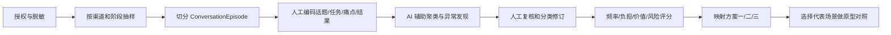

# ClassIn IM 真实聊天场景发现与 AI 机会分析框架

> **历史状态（2026-08-29）**：本文已作为预研 Round 0 封存。它从 AI 机会和方案一/二/三出发，具有明显的方案预设，不能继续充当正式事实研究协议。原样快照见 [Round 0 封存包](../../07-history/stage-deliverables/im-data-prestudy-round-0-20260828/README.md)；当前协议入口见 [ClassIn IM 真实沟通事实研究](../im-real-communication-fact-study/README.md)。以下正文保留当时表达，不追改为新方法。

## 0. 目的

本文定义如何从真实 ClassIn IM 沟通内容中发现：

1. 老师—学生单聊和老师—班级群聊中最高频的话题；
2. 老师与学生真正关注的信息、任务和痛点；
3. 哪些问题存在重复、遗漏、延迟、信息不完整或难以收口；
4. AI Agent 最适合观察、建议、生成、促进还是执行；
5. 哪些场景应优先进入方案一 AI Enhanced IM；
6. 哪些场景可能形成方案二 Learning Loop；
7. 哪些模式与行业证据结合后可能衍生方案三。

本框架只定义研究方法，不在没有真实样本时预设“班级共性问题”“个别答疑”或“作业订正”一定是第一优先级。

## 1. 研究边界

### 1.1 核心渠道

| 渠道 | 关系 | 研究重点 |
|---|---|---|
| C1 老师—学生单聊 | 1:1、相对私密 | 个体问题、个性化反馈、敏感信息、连续跟进、老师重复劳动 |
| C2 老师—班级群聊 | 1:N/N:N、公开共享 | 通知、共性问题、材料、讨论、集体活动、群体参与和信息淹没 |

### 1.2 当前不作为主样本

- 老师—老师协作；
- 机构管理群；
- 家长沟通；
- 公开课营销或招生群；
- 纯系统通知；
- 与教学无关的社交群。

这些场景可以在首轮出现时标记，但不与核心渠道混合计算。

### 1.3 研究单位不是“单条消息”

单条消息往往无法表达完整任务。首轮分析单位定义为 `ConversationEpisode`：

> 围绕同一个用户目标、问题或业务事项，在相对连续时间内发生，并能够判断起因、互动过程和当前结果的一段沟通。

一个 Episode 可能包含：

- 一条提问和一条回复；
- 多名学生围绕同一问题的多条消息；
- 老师发布通知、学生追问、老师补充说明的完整过程；
- 一次问题提出后始终无人回应的开放片段；
- 从群聊转入私聊后继续处理的跨渠道过程。

## 2. 研究问题

### 2.1 话题与任务

- 用户在谈什么；
- 这段沟通想完成什么；
- 属于课前、课中、课后还是日常班级运营；
- 是信息传递、教学互动、学习求助还是业务处理；
- 是否需要形成结果或后续行动。

### 2.2 现有体验

- 当前谁首先发起；
- 谁需要响应；
- 需要哪些上下文；
- 目前用了多少轮、多少时间；
- 是否转移到课堂、作业、云盘或其他页面；
- 最终是否解决；
- 是否出现重复询问、遗漏或理解偏差。

### 2.3 AI 机会

- AI 能否在不改变原流程时减少重复劳动；
- 能否发现人类不易看到的共性模式；
- 能否提升学生表达和参与；
- 能否把一次沟通推进为可完成的学习循环；
- 需要公开 Agent、教师私密 TeacherIn，还是纯后台组织能力；
- 是否涉及敏感推断、未成年人、评价或正式业务写回。

## 3. Episode 编码模型

每个 Episode 使用以下字段编码。

### 3.1 基础上下文

| 字段 | 示例值 | 说明 |
|---|---|---|
| `episode_id` | `E-0001` | 研究用脱敏编号 |
| `channel` | `direct` / `class_group` | 单聊或班级群聊 |
| `teaching_stage` | 课前/课中/课后/日常 | 教学阶段 |
| `subject` | 英语/数学/通用 | 只保留分析所需粒度 |
| `class_type` | 常规班/训练营/公开课 | 不记录真实班级名称 |
| `initiator_role` | teacher/student | 发起者角色 |
| `participant_pattern` | 1:1/1:N/N:N | 互动结构 |
| `duration_band` | 即时/当日/跨日 | 不保留精确可识别时间 |

### 3.2 用户任务与话题

| 字段 | 说明 |
|---|---|
| `primary_job` | 用户最终想完成的任务 |
| `topic_primary` | 一级话题分类 |
| `topic_secondary` | 二级具体话题 |
| `trigger` | 课堂、作业、材料、通知、临时事件等 |
| `context_needed` | 完成任务所需课程、作业、学生或历史信息 |
| `expected_outcome` | 用户期待的结果 |

### 3.3 问题与结果

| 字段 | 可选值/说明 |
|---|---|
| `pain_type` | 重复/遗漏/延迟/上下文缺失/误解/难收口/操作跳转/权限 |
| `teacher_effort` | 低/中/高，并记录理由 |
| `student_impact` | 低/中/高，并记录理由 |
| `resolution_state` | 已解决/部分解决/未解决/无法判断 |
| `response_latency` | 即时/较晚/跨日/无响应 |
| `repeatability` | 一次性/同一学生重复/跨学生重复/跨班级重复 |
| `workaround` | 老师当前如何补救 |
| `evidence_quality` | 高/中/低，避免把推断当事实 |

### 3.4 AI 介入方式

| 模式 | AI 行为 | 典型产品形态 |
|---|---|---|
| A0 不介入 | 人类沟通已经足够 | 保持普通 IM |
| A1 整理 | 搜索、聚类、摘要、提取待办 | 智能收件箱/群聊摘要 |
| A2 私密建议 | 给老师提示、草稿、风险和下一步 | TeacherIn Sidecar/建议卡 |
| A3 被动回答 | 被明确 `@` 或私聊后回答 | 群内 Agent/Agent 私聊 |
| A4 主动促进 | 经授权主持、追问、总结或发起轻活动 | 讨论促进者/Learning Loop |
| A5 受控执行 | 发送、创建活动、写回业务对象 | ProposedAction + Approval + Receipt |
| A6 个性化陪伴 | 对学生分步提示、自检、反思和升级老师 | 学生私密学习搭档 |

同一 Episode 可以有多个候选模式，但必须标记主模式和风险上限。

## 4. 初始话题分类假设

以下分类只是首轮编码起点，必须允许真实数据新增、合并或删除类别。

### 4.1 老师—学生单聊

| 一级话题 | 可能内容 | 可能痛点 |
|---|---|---|
| 知识答疑 | 概念、题目、解法、材料理解 | 上下文不全、老师重复解释、跨日未解决 |
| 作业与订正 | 要求、提交、反馈、补交、错题 | 状态散落、重复追问、正式结果与聊天分离 |
| 个性化反馈 | 学情、学习建议、表现反馈 | 老师准备成本高、措辞敏感、缺证据 |
| 课程与课堂事务 | 时间、请假、迟到、回放、设备 | 高频重复、可自动查事实但有权限边界 |
| 资料与资源 | 课件、链接、录播、补充材料 | 查找困难、版本不清、权限过期 |
| 学习计划与督促 | 目标、进度、提醒、跟进 | 难持续、缺少状态和确认 |
| 情绪与关系 | 焦虑、挫败、鼓励、冲突 | 高敏感、AI 不宜自动判断或公开 |
| 技术支持 | 登录、进入课堂、文件问题 | 可标准化，但不一定属于教学 Agent |

### 4.2 老师—班级群聊

| 一级话题 | 可能内容 | 可能痛点 |
|---|---|---|
| 班级通知 | 上课、调整、提醒、规则 | 重复询问、阅读确认不清、消息沉底 |
| 作业发布与催交 | 作业要求、截止、未交提醒 | 信息重复、个体隐私、状态难追踪 |
| 共性知识答疑 | 多人询问同一概念或题目 | 问题分散、老师难聚类、回答难复用 |
| 课堂讨论 | 观点、材料、问题、同伴互动 | 偏题、参与不均、缺少阶段总结和收口 |
| 学习资源分享 | 文件、视频、链接、优秀答案 | 消息淹没、检索弱、缺少学习引导 |
| 临时课堂与活动 | 临时教室、讨论、快问快答 | 参与对象、结束状态和结果分散 |
| 反馈与表扬 | 班级表现、优秀作品、阶段结果 | 容易单向广播，缺少后续学习行动 |
| 班级运营 | 加入、退出、班规、组织事项 | 权限和系统事件多，教学价值有限 |
| 社交与非教学内容 | 问候、闲聊、表情 | 可能维持关系，不应一律视为噪音 |

## 5. 频率不等于优先级

高频问题只是入口，还需要同时评估价值和风险。

### 5.1 机会评分

每个候选场景使用 1–5 分评估：

| 维度 | 高分含义 |
|---|---|
| Frequency | 在多个班级/时间段反复出现 |
| Teacher Burden | 占用大量重复阅读、判断或编辑时间 |
| Student Impact | 延迟或失败会明显影响理解、参与或结果 |
| Unresolved Rate | 当前经常没有回应、部分解决或反复出现 |
| AI Unique Leverage | AI 能利用聚类、上下文、生成或实时适应带来独特增益 |
| Data Readiness | 所需数据可获得、可授权、可信且可解释 |
| Workflow Fit | 能在现有师生关系和业务流程中自然发生 |
| Learning Evidence | 能观察到结果而不是只生成内容 |
| Risk Control | 权限、隐私和错误后果容易控制 |

建议排序公式：

```text
Opportunity Score
= Frequency
+ Teacher Burden
+ Student Impact
+ Unresolved Rate
+ AI Unique Leverage
+ Data Readiness
+ Workflow Fit
+ Learning Evidence
+ Risk Control
```

评分只用于结构化讨论，不代替产品判断。高频但低价值的事务通知不一定优先；低频但高风险的情绪场景也不适合作为首个 Agent 自动化。

### 5.2 方案适配判断

| 现象 | 更可能适合 |
|---|---|
| 原流程有效，只缺草稿、总结、检索或快捷操作 | 方案一 AI Enhanced IM |
| 需要目标、参与、活动、结果和持续跟进 | 方案二 Learning Loop |
| 现有会话结构无法承载，行业出现新的交互范式 | 方案三候选 |
| 高风险、低证据或价值不清 | 暂不 AI 化 |

## 6. 样本策略

### 6.1 首轮探索样本

建议先做定性覆盖，不立即追求总体统计：

- 单聊与群聊分别抽取 Episode；
- 覆盖课前、课中、课后和日常；
- 覆盖高活跃与低活跃班级；
- 覆盖已解决、未解决和无法判断结果；
- 覆盖不同学科与班级类型，但不以学科差异替代沟通模式分析；
- 对同一高频话题连续抽样，确认是否只是个别案例。

首轮达到“新样本不再频繁产生新一级话题”的主题饱和后，再设计量化抽样。

### 6.2 第二轮量化验证

在分类稳定后，统计：

- Episode 频率，而非只统计关键词；
- 发起角色和响应角色；
- 解决率和响应延迟；
- 重复出现范围；
- 老师投入；
- 学生影响；
- 频道差异；
- 教学阶段差异；
- AI 机会模式分布。

## 7. 分析流程



### 7.1 AI 在研究中的角色

AI 可以：

- 建议 Episode 边界；
- 对相似表达做初步聚类；
- 提取显式任务和结果；
- 发现分类外样本；
- 帮助生成匿名代表案例。

AI 不可以：

- 把情绪、能力、性格或学习水平推断当作事实；
- 未经人工复核直接统计结论；
- 用原始学生身份构建长期画像；
- 把一条消息脱离上下文解释；
- 将研究推断自动升级为产品规则。

## 8. 数据与隐私要求

### 8.1 最小化原则

- 只处理回答研究问题所需的字段；
- 删除姓名、手机号、邮箱、机构、真实班级名和可识别时间；
- 学生使用稳定但不可逆的研究编号；
- 文件内容只记录类型和业务作用，不复制真实附件；
- 高敏感内容默认不进入研究样本，除非有专门授权和治理方案；
- 原始聊天日志不得提交到本仓库。

### 8.2 仓库可保存内容

可以保存：

- 脱敏分类定义；
- 聚合统计；
- 无法反推出个人的匿名 Episode 摘要；
- 研究方法；
- 事实、判断和未知项；
- 产品机会矩阵。

不可保存：

- 原始聊天导出；
- 真实学生身份；
- 账号、Token 或内部访问凭据；
- 可由多个字段组合重新识别个人的信息；
- 未经确认的学生能力或心理标签。

## 9. 研究产出

完成后应形成：

1. 单聊高频话题地图；
2. 班级群聊高频话题地图；
3. 高频 × 教师负担 × 学习价值矩阵；
4. 已解决/未解决/重复问题分布；
5. AI 介入模式矩阵；
6. 方案一增强机会清单；
7. 方案二 Learning Loop 候选清单；
8. 与行业模式结合后的方案三机会；
9. 3–5 条匿名代表性用户旅程；
10. 首个原型验证场景及不选择其他场景的理由。

## 10. 当前需要用户补充的信息

在正式分析前需要确认：

1. 能否提供经过授权和脱敏的师生单聊、班级群聊样本；
2. 样本能覆盖哪些学科、班级类型和教学阶段；
3. 是否能够判断一段沟通最终有没有解决；
4. 是否有老师对“最耗时、最重复、最希望 AI 帮助”的主观反馈；
5. 是否有消息量、响应时间或功能使用的聚合数据；
6. 哪些内容因隐私或合规要求必须排除；
7. 研究是否只做离线分析，还是允许后续进行老师访谈复核。

如果暂时不能提供原始脱敏样本，也可以先提供：

- 10–20 个由产品/教研人员整理的匿名典型 Episode；
- 单聊和群聊各自最常见的 10 类话题；
- 5 个老师明确认为最麻烦的沟通场景；
- 5 个学生经常得不到有效解决的问题。

这些输入足以启动第一版定性机会地图，但不能替代后续真实频率验证。
