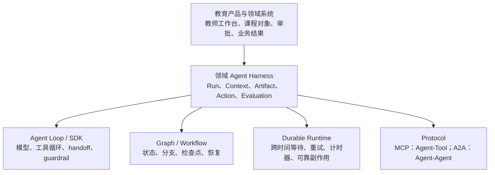
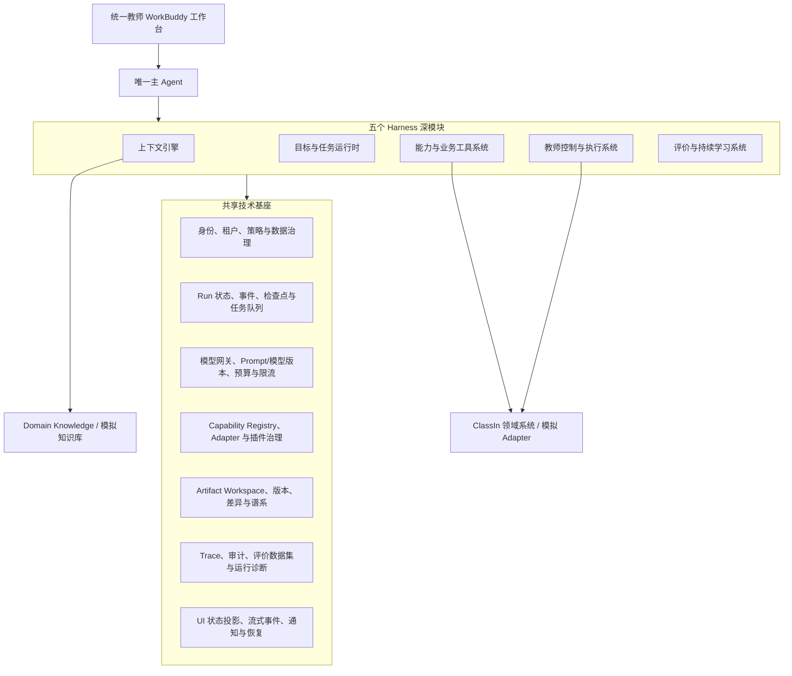

# 开源 Agent 与 Harness 架构全景研究

## 一、研究定位与证据边界

本文是教师 WorkBuddy 阶段 D 的第二轮外部技术研究，使用截至 **2026-08-16** 可访问的官方 GitHub 仓库、官方文档和正式协议规范，回答四个问题：

1. GitHub 上有哪些真正具有 Agent/Harness 架构参考价值的代表项目；
2. Agent SDK、状态图、持久工作流、完整 Agent 产品和互操作协议分别解决什么问题；
3. 当前 WorkBuddy 的“五个深模块 + 共享技术基座”是否完整，还有哪些缺口；
4. 哪些模式值得优先吸收，哪些不能直接照搬到教育业务。

### 1. 证据类型必须分开

| 证据类型 | 能证明什么 | 不能证明什么 | 本文处理方式 |
| --- | --- | --- | --- |
| 技术架构证据 | 公开接口、运行模型、状态机制、扩展点、协议和源码结构 | 实际生产规模、内部未公开系统、教育业务适配度 | 本文 12 个项目的主要证据 |
| 产品体验证据 | 用户界面、任务入口、控制方式和工作流呈现 | 底层一定采用何种 Harness | OpenHands Agent Canvas、Letta Code 仅作辅助观察 |
| 教育行业直接参考 | 教师任务、教学对象、证据、审批与教学闭环 | 通用框架的技术完备性 | 不从本轮通用开源项目中推断；沿用《Agent Harness 成熟架构模式与教师 AI 产品研究》的教育案例 |

本轮 12 个核心样本中，**没有一个是公开了完整底层架构的教育行业 WorkBuddy**。这不是研究遗漏，而是当前一手公开证据的边界。Khanmigo、MagicSchool、SchoolAI、TeachFX、Brisk、Microsoft Teach 和 Google Gemini Notebook 可校准教师体验，但不能据其产品页面反推内部 Harness。

### 2. 评价符号

- **原生**：官方将其作为明确的一等能力；
- **部分**：存在实现或集成，但不是完整领域能力，或需要外围系统补齐；
- **非核心**：项目并不负责该层；
- **未知**：官方一手资料不足，不作推断。

## 二、先回答核心问题：Agent 项目不等于完整 Harness

GitHub 上确实有大量 Agent 项目，但它们不能被等同为同一种“完整 Harness”。至少要区分六层：

一个项目只要实现“模型 → 工具 → 模型”的循环，就可以被称为 Agent Framework，但这还不自动包含：

- 机构身份、租户、权限和隐私策略；
- 长时任务的恢复、计时器、幂等和补偿；
- 教学产物的版本、差异、引用和业务状态；
- 高风险动作的教师审批与真实执行回执；
- 课程、课堂、作业、消息等领域事实所有权；
- 面向业务结果的评价、试点门槛和持续治理。

因此，WorkBuddy 不能选择某个开源项目后就宣告“有了完整 Harness”。正确方式是用这些项目分别审视底层责任，再由 WorkBuddy 领域架构拥有完整契约。

## 三、样本选择与覆盖范围

本轮保留 12 个样本，选择标准不是热度，而是能代表一种不同且可验证的架构范式。

| 类别 | 代表样本 | 选择原因 |
| --- | --- | --- |
| 可组合 Harness | DeepSeek Harness、Pydantic AI Harness | 明确使用 Harness 概念，公开插件/能力、上下文、持久化或沙箱设计 |
| Agent SDK / Loop | OpenAI Agents SDK、Google ADK、Microsoft Agent Framework | 覆盖工具循环、多 Agent、HITL、状态或工作流，是主 Agent 内核候选范式 |
| Graph / Stateful Runtime | LangGraph | 代表显式状态图、checkpoint、interrupt 和 long-running agent |
| Coding Harness / 完整平台 | OpenHands、SWE-agent、Letta Code | 展示工作区、远程运行、权限、记忆、子 Agent 或完整控制台如何组合 |
| Durable Workflow | Temporal | 不是 Agent 框架，但代表跨小时/天的可靠状态与副作用编排 |
| Protocol | MCP、A2A | 分别明确 Agent-to-Tool 与 Agent-to-Agent 的边界 |

CrewAI、AutoGen 和 Semantic Kernel 没有进入核心矩阵：CrewAI 与已选多 Agent SDK 的覆盖高度重叠；Microsoft 官方正通过 Agent Framework 提供从 AutoGen 和 Semantic Kernel 迁移的统一方向。[Microsoft Agent Framework README](https://github.com/microsoft/agent-framework) · [AutoGen 迁移指南](https://learn.microsoft.com/en-us/agent-framework/migration-guide/from-autogen) · [Semantic Kernel 迁移指南](https://learn.microsoft.com/en-us/agent-framework/migration-guide/from-semantic-kernel)

这不表示这些项目没有价值，只表示在 12 项上限下，它们没有增加足够独特的架构维度。

## 四、12 项统一架构对比

### 1. 核心能力矩阵

| 项目 | Agent Loop | 状态/持久化 | Context / Memory | Tool / Capability | HITL / 审批 | Artifact | Sandbox | 插件/扩展 | Trace / Eval | Multi-agent | 协议边界 |
| --- | --- | --- | --- | --- | --- | --- | --- | --- | --- | --- | --- |
| DeepSeek Harness | 原生、可替换 Loop | 原生 Session Event/存储插件 | 原生、由事件重建模型可见上下文 | 原生 Registry 与 Capability seam | 原生审批管线 | 部分，偏会话/文件结果 | 原生 | 原生，一切皆插件 | 原生 telemetry/事件 | 原生子 Agent 能力 | 部分，内部 seam 强，外部协议不是核心 |
| OpenAI Agents SDK | 原生 Runner 循环 | 部分，Sessions 与可序列化 RunState | 原生会话历史与运行上下文 | 原生 tools、MCP、hosted tools | 原生 interruption/批准/拒绝/恢复 | 非核心，主要是最终输出和工具结果 | 原生 SandboxAgent | 部分，provider/tools/hooks | 原生 tracing；eval 需外围 | 原生 handoff / agents-as-tools | MCP 原生；A2A 非核心 |
| Google ADK 2.0 | 原生 Agent | 原生 Session/State；Workflow Runtime | 原生 Session、State、Memory | 原生工具生态、插件、MCP | 原生 tool confirmation 和 workflow HITL | 原生 Artifact Service | 非核心 | 原生 plugins/callbacks | 原生 evaluation/telemetry | 原生层级 Agent 与 Task API | MCP 与 A2A 均有官方支持 |
| Microsoft Agent Framework | 原生 Agent + middleware | 原生 workflow checkpoint/restart | 原生 context providers 与 memory 扩展 | 原生 tools、skills、middleware | 原生审批和 workflow HITL | 部分，workflow output 不是领域 Artifact | 非核心 | 原生 middleware、provider、declarative agent | 原生 OpenTelemetry；评价需外围 | 原生 sequential/concurrent/handoff/group | MCP、A2A、AG-UI 均有官方样例 |
| LangGraph | 部分，不规定唯一 Loop | 原生 checkpointer、durable execution | 原生短期状态与长期 Store | 部分，通常结合 LangChain tools | 原生 interrupt / resume | 非核心 | 非核心 | 原生 node/subgraph，可组合 | 部分，通常结合 LangSmith | 原生图模式与 subgraph | 无核心跨系统协议 |
| Pydantic AI + Harness | 原生 typed agent loop | 原生 step persistence；可接 Temporal/DBOS/Prefect | 原生 compaction、memory、history processing | 原生 capability 与 typed tool | 原生 deferred tool approval/guardrails | 部分，文件/运行输出为主 | 原生本地/Modal/代码沙箱能力 | 原生 capability composition | 原生 OpenTelemetry；Logfire 可视化 | 原生 subagents/dynamic workflow | MCP 原生；ACP 实验性 |
| OpenHands | 原生 coding Agent | 原生 conversation/event；Agent Server 持有运行 | 原生对话、workspace、skills | 原生 code tools/plugins | 部分，权限和安全策略可扩展 | 部分，代码、补丁和工作区文件 | 原生 Docker/Kubernetes/远程 workspace | 原生 tools、skills、plugins | 原生事件；评价另有基准体系 | 原生 delegation/多 Agent 示例 | ACP 与 REST/WebSocket 边界 |
| SWE-agent | 原生 coding loop | 部分，trajectory/run 输出 | 原生 history processor，但偏单任务 | 原生 Agent-Computer Interface 工具 | 非核心 | 部分，patch/trajectory | 原生通过 SWE-ReX 环境隔离 | 原生 YAML 配置和工具 bundle | 原生 trajectory/benchmark | 非核心 | 非通用协议重点 |
| Letta Code | 原生长期 Agent | 原生云端 Agent state/会话 | 原生 memory blocks、MemFS、跨会话学习 | 原生 skills、hooks、tools | 原生 permission modes | 部分，文件/记忆/技能有版本，但非教学产物 | 原生云端/远程环境选项 | 原生 skills、hooks、mods | 部分，记忆审计和运行记录 | 原生同步/异步 subagent | 客户端/服务端与 channel 边界，MCP/A2A 非主线 |
| Temporal | 非核心 | 原生 Event History、replay、timer、retry | 非核心，只保存确定性工作流状态 | 非核心，以 Activity 接外部能力 | 部分，通过 Signal/Update/等待状态实现 | 非核心 | Workflow sandbox 不是安全沙箱 | 原生 SDK/interceptor/plugin | 原生 workflow visibility；模型 eval 非核心 | 原生 child workflow，不等于智能体协作 | 业务运行协议由应用定义 |
| MCP | 非核心 | 部分，有状态 Client-Server session | 原生 Resources/Prompts，但不是业务记忆 | 原生 Tools/Resources/Prompts 发现和调用 | 规范要求敏感操作保留控制，具体审批由 Host 实现 | 非核心 | 非核心 | 原生 Server 能力扩展 | 非核心 | 非核心 | 原生 Agent-to-Tool 协议 |
| A2A | 非核心 | 原生 Task 生命周期与状态 | 部分，Message/Context，不暴露内部 memory | Agent Card 公开能力 | 原生 `input-required` / `auth-required` 等状态 | 原生 Artifact | 非核心 | 通过任意 A2A Agent 扩展 | 非核心 | 原生 | 原生 Agent-to-Agent 协议 |

### 2. 成熟度与适用边界

| 项目 | 截至 2026-08-16 的官方成熟度信号 | 对 WorkBuddy 的正确定位 |
| --- | --- | --- |
| DeepSeek Harness | README 明确标注 **Developer Preview**，并警告存在破坏性变更；官方仓库暂无正式 GitHub Release | 前沿架构样本和 PoC 对象，不作为当前生产基座承诺 |
| OpenAI Agents SDK | 官方持续发布 Python 包，2026-08-15 发布 `v0.21.0`；具备 Sessions、HITL、Tracing、Sandbox 等明确文档 | 可作为可替换 Agent Loop provider；不拥有课程和业务 Run 事实 |
| Google ADK 2.0 | README 提供“Stable Release (Recommended)”，同时明确 2.0 改变 Agent API、事件模型和 Session Schema | 候选综合 SDK；升级兼容和状态迁移必须独立评估 |
| Microsoft Agent Framework | 官方定位 production-grade，并提供 AutoGen/Semantic Kernel 迁移指南；2026-08-14 发布 Python `1.14.0` | 综合框架参考；“生产级”是官方定位，不等于已验证 ClassIn 负载和合规 |
| LangGraph | 官方定位长运行、有状态 Agent 的低层编排，并公开 durable execution、interrupt 和 memory | 运行时候选；不应把整个开放式教学过程机械图化 |
| Pydantic AI Harness | 官方采用 `0.x`，说明 API 仍可能在 minor release 变化，同时称能力经过端到端测试、面向生产使用 | 最直接的 Harness 完备性对照之一；能力 API 仍需隔离在 WorkBuddy Interface 后 |
| OpenHands | Agent Canvas `v1.13.0`，公开 SDK、Agent Server、远程 backend 和 sandbox；主要服务编码场景 | 参考完整 Agent 产品装配和运行控制，不复用其编码领域模型 |
| SWE-agent | README 明确主要开发已转向 mini-SWE-agent，并建议新用户优先使用后者；SWE-agent 最新正式版为 `v1.1.0` | 作为“窄领域 Agent-Computer Interface”经典样本，不作为新平台底座 |
| Letta Code | 当前活跃实现已迁移到 `letta-ai/letta-code`，2026-08-16 发布 `v0.30.23`；旧 `letta-ai/letta` V1 源码已归档且不受支持 | 参考长期身份、记忆和跨环境 Agent；自修改机制需严格限制 |
| Temporal | Python SDK `1.31.0`；长期公开 Workflow/Activity/Event History 语义 | 可靠运行底座候选，不是 Agent Framework |
| MCP | 官方规范仓库正式发布 `2026-07-28` 版本 | 工具/资源协议边界，不是审批、权限或业务事务系统 |
| A2A | Linux Foundation 项目，官方仓库发布 `v1.0.1` | 独立 Agent 互操作边界，不替代主 Agent 内部工具调用 |

上述版本信息来自各项目官方 GitHub Releases，只用于说明检索日状态，不用版本号或 Star 数量替代生产成熟度判断。

## 五、各架构范式的可借鉴内容

### 1. DeepSeek Harness：插件、事件域与 Capability Seam

DeepSeek Harness 将模型适配器、工具注册表、会话日志和 Agent Loop 都组织为插件；共享上下文承载服务和类型化事件，插件副作用可以回收。[官方 README](https://github.com/deepseek-ai/deepseek-harness) · [架构文档](https://github.com/deepseek-ai/deepseek-harness/blob/master/docs/architecture.md)

其 Session Event、Agent Event、Capability Event 的划分，以及 Definition / Provider / Consumer 的 Capability seam，最适合用来审视 WorkBuddy 的扩展边界。[Capability Seams](https://github.com/deepseek-ai/deepseek-harness/blob/master/docs/capability-seams.md) 工具策略、审批、执行、超时/重试、结果冻结和持久化可以组成统一管线，而不是散落在各工具里。[工具执行管线](https://github.com/deepseek-ai/deepseek-harness/blob/master/docs/tool-execution-pipeline.md)

**借鉴结论**：吸收事件分层、可替换 provider、插件生命周期和唯一工具执行入口；不照搬编码工具集合，也不把学生敏感内容无条件写入永久 Session Log。

### 2. OpenAI Agents SDK：清晰的 Agent Loop 与可恢复审批

Runner 的公开循环处理最终输出、handoff 和 tool calls，并在超过最大轮数后终止。[Running Agents](https://openai.github.io/openai-agents-python/running_agents/) SDK 同时提供 tools、MCP、guardrails、Sessions、tracing 和多 Agent handoff。[官方仓库](https://github.com/openai/openai-agents-python)

敏感工具可以触发 interruption；`RunState` 能序列化，之后批准、拒绝并继续运行。[Human-in-the-loop](https://openai.github.io/openai-agents-python/human_in_the_loop/)

**借鉴结论**：适合验证 WorkBuddy 的短程 Loop、tool approval 和 handoff provider；课程对象、审批事实、ExecutionReceipt 和跨天 Run 必须保存在 SDK 外层。

### 3. Google ADK 2.0：Agent、Workflow、Task、Artifact 的综合框架

ADK 2.0 将 `Agent` 与图式 `Workflow` 分开，Workflow Runtime 支持 routing、fan-out/fan-in、loop、retry、state、dynamic node、HITL 和 nested workflow；Task API 用于结构化 Agent 间委派。[官方仓库](https://github.com/google/adk-python)

官方文档还分别提供 Session/State、Memory、Artifact、tool confirmation、evaluation 和插件机制。[Sessions 与 State](https://google.github.io/adk-docs/sessions/) · [Artifacts](https://google.github.io/adk-docs/artifacts/) · [Tool Confirmation](https://google.github.io/adk-docs/tools/confirmation/) · [Evaluation](https://google.github.io/adk-docs/evaluate/) · [Plugins](https://google.github.io/adk-docs/plugins/)

**借鉴结论**：这是检验“综合框架是否漏项”的强样本，尤其是 Artifact Service 与 Task API；但 ADK Artifact 仍是通用二进制/文件产物，不等于课程对象的业务版本和发布状态。

### 4. Microsoft Agent Framework：Agent 与 Workflow 的统一生产框架

Microsoft Agent Framework 官方同时覆盖 Agent provider、middleware、多 Agent workflow、checkpoint、streaming、HITL、time-travel、OpenTelemetry、declarative agent 和 skills。[官方仓库](https://github.com/microsoft/agent-framework)

其 workflow 明确支持 sequential、concurrent、handoff 和 group collaboration；官方也提供 MCP、A2A、AG-UI 及函数审批样例。[User Guide](https://learn.microsoft.com/en-us/agent-framework/user-guide/overview)

**借鉴结论**：适合对照 WorkBuddy 的 middleware、workflow checkpoint、skills 和观测接口；不能因为一个框架同时支持多种协议，就把 MCP、A2A、UI event 和业务 API 混成同一层。

### 5. LangGraph：显式状态、检查点和人工中断

LangGraph 官方定位为构建长运行、有状态 Agent 的低层编排。Checkpointer 保存单线程图状态，Store 保存跨线程数据；interrupt 可持久暂停并通过相同 thread 恢复。[官方仓库](https://github.com/langchain-ai/langgraph) · [Persistence](https://docs.langchain.com/oss/python/langgraph/persistence) · [Interrupts](https://docs.langchain.com/oss/python/langgraph/interrupts)

官方同时提醒：恢复 interrupt 时，包含 interrupt 的节点可能从开头重新执行，因此此前副作用必须幂等或被隔离。[Interrupts](https://docs.langchain.com/oss/python/langgraph/interrupts)

**借鉴结论**：适合表达“目标澄清 → 生成 → 校验 → 教师确认 → 修订”中的可观察分支；不把模型隐藏推理或每一次自然对话都固化成图节点。

### 6. Pydantic AI Harness：Capability 组合与长任务配套

Pydantic AI 将 typed agent loop、tool schema 和 structured output 放在核心包；Pydantic AI Harness 再以统一 Capability 原语补充 workspace、planning、memory、subagents、compaction、guardrails、sandbox 和 step persistence。[官方仓库](https://github.com/pydantic/pydantic-ai-harness)

其 Capability 可组合成 Coder/Researcher，也可独立替换；Step Persistence 支持 save、restore、resume 和 fork；Durable Execution 可接 Temporal、DBOS 或 Prefect；OpenTelemetry 覆盖模型与工具调用。[Harness README](https://github.com/pydantic/pydantic-ai-harness) · [Pydantic AI Durable Execution](https://ai.pydantic.dev/durable_execution/overview/)

**借鉴结论**：它直接证明“轻 Loop + 可组合 Harness 能力 + 外部 durable substrate”是一种可行分层。WorkBuddy 可借鉴 Capability 元数据和组合方式，但不能允许运行中生成的新能力未经机构治理直接进入生产工具集。

### 7. OpenHands：完整 Agent 产品的装配与远程运行

OpenHands 当前将 Agent Canvas 定位为自托管的 coding-agent 控制中心，可连接本地、Docker、VM、云端和 ACP-compatible Agent；Agent Server 暴露多 Agent 运行 API，并可与自动化服务组合。[Agent Canvas](https://github.com/OpenHands/OpenHands)

其 Software Agent SDK 提供 Agent、Conversation、Tool、Workspace、REST API、远程 Agent Server、skills/plugins 和 ephemeral workspace。[Software Agent SDK](https://github.com/OpenHands/software-agent-sdk) · [架构与核心概念](https://docs.openhands.dev/sdk/arch/overview)

**借鉴结论**：适合参考“控制台 + 多 backend + Agent Server + sandbox”的完整装配关系，也说明产品壳层和运行时可以分开；代码补丁、终端和仓库不是教师 WorkBuddy 的核心 Artifact。

### 8. SWE-agent：窄领域 Harness 与 Agent-Computer Interface

SWE-agent 把软件修复任务、模型、工具集合、环境和 history processor 组织为可配置 Agent，并输出完整 trajectory；其核心贡献是为编码任务设计 Agent-Computer Interface。[官方仓库](https://github.com/SWE-agent/SWE-agent) · [配置文档](https://swe-agent.com/latest/config/)

README 已明确主要开发转向 mini-SWE-agent，并建议新用户优先使用后者。[官方 README](https://github.com/SWE-agent/SWE-agent)

**借鉴结论**：最大的启示不是代码工具本身，而是“高质量 Agent 来自领域化动作空间与反馈界面”。WorkBuddy 同样需要课程、活动、评价和消息等受约束的教学动作，不应只给模型一个通用文本生成工具。

### 9. Letta Code：长期身份、可编辑记忆和跨环境 Agent

Letta Code 将自身定义为 stateful agent harness，公开 memory、identity、MemFS、skills、hooks、permission modes、schedules、subagents 和多环境运行。[官方仓库](https://github.com/letta-ai/letta-code)

Memory blocks 可被 Agent 程序化修改，MemFS 使用 Git 跟踪上下文；同一 Agent 的状态、身份和对话可跨设备保留。[Memory](https://docs.letta.com/letta-code/memory) · [MemFS](https://docs.letta.com/letta-code/memfs) · [Permissions](https://docs.letta.com/letta-code/permissions) · [Subagents](https://docs.letta.com/letta-code/subagents)

**借鉴结论**：适合参考长期教师偏好、跨入口身份和可审计记忆；不能让 Agent 自主改写机构规则、学生事实、评分规范或高风险权限。

### 10. Temporal：跨时间可靠运行，而不是 Agent Loop

Temporal 将确定性 Workflow 与执行外部副作用的 Activity 分开，服务端保存 Event History，Worker 通过 replay 恢复状态。[Understanding Temporal](https://docs.temporal.io/evaluate/understanding-temporal) · [Workflow Execution](https://docs.temporal.io/workflow-execution)

Query、Signal 和 Update 分别用于只读状态、异步改变状态和同步校验后改变状态；这与教师查看 Run、补充信息、批准/拒绝和重新规划存在清晰映射。[Message Passing](https://docs.temporal.io/develop/python/message-passing)

**借鉴结论**：只有当 WorkBuddy 进入跨小时/天等待、定时复查、可靠重试和多系统副作用时，才需要这种 durable substrate；短程草稿生成不必全部放进 Temporal。

### 11. MCP：Agent-to-Tool 协议，不是业务安全边界

MCP 使用 Host-Client-Server 架构，Server 可暴露 Tools、Resources 和 Prompts；协议还定义生命周期、授权和传输。[MCP 架构规范](https://modelcontextprotocol.io/specification/2026-07-28/architecture)

Tools 规范要求实现方考虑输入验证、访问控制、速率限制、结果校验，并建议敏感操作保留人类确认。[MCP Tools](https://modelcontextprotocol.io/specification/2026-07-28/server/tools)

**借鉴结论**：MCP 可以成为 Capability Adapter，但“协议可调用”不等于“教师已授权”或“课程状态允许写入”。所有副作用仍应转为 WorkBuddy `ProposedAction`，经过策略、审批、领域校验和回执。

### 12. A2A：独立 Agent 的任务与交付物协议

A2A 面向彼此不透明、可能由不同框架和组织实现的 Agent。Agent Card 描述能力；Message、Task、Task 状态和 Artifact 承载协作；Agent 无需暴露内部状态、记忆或工具。[官方仓库](https://github.com/a2aproject/A2A) · [关键概念](https://a2a-protocol.org/latest/topics/key-concepts/)

Task 可进入 `input-required`、`auth-required` 等中断状态；终态 Task 不应重启，后续修订应创建新 Task，Artifact 版本关联由 Client 侧维护。[Task 生命周期](https://a2a-protocol.org/latest/topics/life-of-a-task/)

**借鉴结论**：仅当专业子 Agent 拥有独立目标、上下文、权限、生命周期和完成契约时使用 A2A。普通课程工具、知识检索或格式转换不应包装成 A2A Agent。

## 六、对 WorkBuddy 五个深模块的缺口复核

### 1. 结论：五模块不需要推翻，但必须提高契约分辨率

当前五个深模块仍然成立：

1. 上下文引擎；
2. 目标与任务运行时；
3. 能力与业务工具系统；
4. 教师控制与执行系统；
5. 评价与持续学习系统。

第二轮研究没有发现必须增加第六个平级“业务深模块”的证据。真正需要补强的是：模块内部的稳定对象、共享基座和跨模块不变量。

### 2. 逐模块缺口

| WorkBuddy 模块 | 当前方向 | 需要补齐的全局设计 | 主要外部启示 |
| --- | --- | --- | --- |
| 上下文引擎 | 聚合身份、业务事实、知识、历史和教师输入 | 明确事实/知识/推断/偏好四类数据；来源、版本、有效期、权限、最小保留和删除；Run 快照与长期记忆分离 | DeepSeek 事件可重建；Pydantic compaction/memory；Letta 长期记忆 |
| 目标与任务运行时 | 拥有 Run、计划、暂停、恢复和重规划 | 统一 Run Event、checkpoint、timer、retry、cancel、fork；区分短程 Agent Loop、显式图和跨天 durable workflow | OpenAI Runner；LangGraph；Temporal；ADK Workflow |
| 能力与业务工具系统 | 统一 Skill、AI Tool、MCP、领域 API 和子 Agent | Capability Definition/Provider/Consumer；输入输出 Schema、风险、副作用、权限、成本、超时、幂等、版本和下线策略；MCP/A2A 独立 Adapter | DeepSeek seam；Pydantic Capability；MCP；A2A |
| 教师控制与执行系统 | 拥有 ProposedAction、审批、执行回执和审计 | 批准/拒绝/修改/部分批准；审批作用域和过期；唯一副作用管线；冲突、部分失败、补偿、撤销和真实 ExecutionReceipt | OpenAI HITL；ADK confirmation；Microsoft approval；Temporal Activity |
| 评价与持续学习系统 | 记录运行、质量、采纳、安全和业务结果 | OpenTelemetry 级 trace schema；离线数据集和版本；Artifact/Action 结果关联；模型/Prompt/Capability 版本；人工评价和真实业务 outcome 分开 | OpenAI tracing；ADK eval；Pydantic instrumentation |

### 3. 必须提升为一等对象的内容

#### `ArtifactDraft`

Google ADK 和 A2A 都公开了 Artifact 概念，编码 Harness 也普遍把文件或 patch 作为结果，但这仍不足以表达教育产物。WorkBuddy 需要自己的 `ArtifactDraft`：

- `artifact_type`：课程、单元、活动、资源、量规、消息等；
- `source_refs` 与 `knowledge_refs`；
- `target_domain_object`；
- `version`、`diff`、教师修改和采纳记录；
- `validation_results`；
- `status`：仅 WorkBuddy 草稿、待确认、已保存、已发布等；
- `truth_label`：模拟、集成模拟、真实。

`ArtifactDraft` 由 WorkBuddy 拥有；真正的课程、作业和消息对象仍由 ClassIn 领域系统拥有。

#### `RunEvent` 与 `ContextSnapshot`

借鉴 DeepSeek、LangGraph 和 Temporal，但不直接复制其内部事件格式。WorkBuddy 应保证：

- 每个业务可见状态都能由 Run 事件和领域回执解释；
- 模型实际使用的上下文有可审计快照、来源和版本；
- 快照可以引用受控原文，不要求永久复制全部学生敏感数据；
- 恢复不会重复执行已经成功的业务副作用。

#### `CapabilityManifest`

在现有 Capability Contract 上增加：

- `provider` 与 `provider_version`；
- `side_effect_class` 和 `risk_level`；
- `required_scopes` 与数据分类；
- `approval_policy`；
- `idempotency`、`timeout`、`retry`、`compensation`；
- `cost_budget` 与并发限制；
- `protocol`：local、domain API、MCP 或 A2A；
- `lifecycle`：experimental、pilot、production、deprecated。

## 七、共享技术基座的完备性复核

### 1. 推荐的共享基座

### 2. 本轮新增的三项明确补强

与上一轮相比，应把以下三项从“隐含基础设施”提升为显式全局设计：

1. **UI 状态投影层**：将 RunEvent、流式内容、Artifact、审批和回执投影成稳定的工作台状态，避免前端直接拼装各框架内部事件；OpenHands Agent Canvas 证明产品壳层和多个 Agent backend 可以解耦。
2. **Capability 生命周期与供应链治理**：不仅注册工具，还要管理版本、签名、来源、权限、依赖、灰度、下线和机构启用范围；DeepSeek/Pydantic 的插件能力越强，治理责任越不能缺失。
3. **Memory Governance**：长期记忆必须区分教师偏好、任务历史、知识、学生事实和机构规则，并支持查看、更正、撤回、过期和删除；不能照搬 Letta 式自由自修改到高风险教育事实。

### 3. 仍应坚持的事实所有权

| 事实 | 所有者 |
| --- | --- |
| Agent Run、计划、上下文快照引用、ArtifactDraft、ProposedAction、审批、执行回执、评价 | WorkBuddy Harness |
| 教师、机构、角色、权限、课程、单元、活动、作业、课堂、消息和正式发布状态 | ClassIn 对应领域系统 |
| 课程标准、教学法、机构规范、量规及其版本 | Domain Knowledge 责任系统 |
| SDK session、graph checkpoint、workflow history | 底层 provider 的技术状态，不直接升级为业务事实 |

## 八、借鉴优先级

### P0：现在锁定，作为高保真原型和 D2 契约的共同约束

| 优先项 | 要形成的产出 | 参考样本 |
| --- | --- | --- |
| 统一 Run/Event/Checkpoint 模型 | `RunEvent`、状态机、恢复与副作用不重复不变量 | DeepSeek、LangGraph、Temporal |
| Context 与 Memory 治理 | 四类上下文、来源/版本/权限/保留、Run 快照 | Pydantic、Letta、DeepSeek |
| Capability Manifest 与唯一执行管线 | Definition/Provider/Consumer、风险、审批、幂等、回执 | DeepSeek、Pydantic、MCP |
| Artifact Workspace | `ArtifactDraft`、版本、差异、来源、目标对象、真值标签 | Google ADK、A2A |
| 教师控制契约 | 暂停、修改、批准、拒绝、部分批准、冲突、撤销 | OpenAI、Google ADK、Microsoft |
| Trace 与 Evaluation Contract | 模型/Prompt/能力版本、成本、错误、教师采纳和业务结果 | OpenAI、Google ADK、Pydantic |
| 身份、租户和数据治理不变量 | 机构隔离、最小权限、敏感数据和审计 | 通用项目只能提示，需 ClassIn 自行拥有 |

### P1：以“课程目标 → 课程对象”做短技术验证

1. 对比纯 Agent Loop、显式图和 durable workflow 的职责分配，不先绑定单一框架；
2. 用模拟 ClassIn Adapter 验证读取、草稿保存、版本冲突、部分失败和回执；
3. 用一个 MCP 只读工具验证协议适配，但所有副作用仍走统一执行管线；
4. 验证高保真工作台能只消费 WorkBuddy View Model，不感知底层 SDK 事件；
5. 验证 ArtifactDraft 在教师编辑后保留模型来源、教师修改和保存结果的完整谱系。

### P2：有真实价值和治理证据后再建设

- A2A 专业子 Agent 网络；
- 通用插件市场和第三方能力生态；
- 允许 Agent 创建或修改 Capability；
- 跨机构长期教师记忆；
- 多 backend 动态调度和复杂 Agent Canvas；
- 对所有 Run 统一采用重型 durable workflow。

## 九、不应直接照搬的设计

| 外部模式 | 不直接照搬的原因 | WorkBuddy 的改造方式 |
| --- | --- | --- |
| 编码 Agent 的文件/Shell/终端中心模型 | 教师核心对象是课程、活动、作业、证据和沟通，不是文件系统 | 建设领域化教学动作与 Artifact Schema |
| “一切皆插件”扩展到业务事实层 | 插件可替换实现，但不能任意改变课程状态、权限和审计不变量 | 插件止于受控 Capability seam，业务事实仍由领域系统拥有 |
| 将 SDK Session/Graph State 当业务 Run | 框架升级或替换会污染业务事实，且无法表达完整审批和业务回执 | WorkBuddy 定义稳定 Run Contract，框架状态仅为 provider 内部状态 |
| 用 MCP 代替权限和审批 | MCP 只定义调用协议，不知道教师是否有权、对象是否可写 | MCP 调用转为 ProposedAction，再经过领域校验和审批 |
| 把普通工具包装成 A2A Agent | 增加发现、任务状态、网络、权限和错误处理成本 | 只有独立目标/生命周期/交付物的专业能力使用 A2A |
| 将全部教学过程固化为 Graph | 教学目标常需开放式澄清和迭代，过度图化会僵化体验 | 只把可观察业务状态、控制点和副作用画成图 |
| 无界长期记忆和 Agent 自我改写 | 可能固化错误推断，污染学生事实、机构规则或教师身份 | 记忆分类、可见、可纠正、可删除；高风险内容不可自主改写 |
| 默认保存全部模型可见原文 | 与学生隐私、最小保留和机构数据政策可能冲突 | 保存可审计引用、摘要和受控快照，原文按策略保留 |
| 自动生成并启用新 Capability | 存在供应链、越权、不可审计和行为漂移风险 | 生成只进入隔离评审区，需测试、签名、审批和灰度 |
| 将 Trace 直接发送到外部 SaaS | 可能泄露学生、教师和机构敏感信息 | 先设计脱敏、采样、区域、保留和访问策略，再选观测后端 |
| 所有短任务都使用 Temporal | 增加部署、确定性约束和运维成本 | 仅跨时间、等待和多副作用流程进入 Durable Runtime |
| 直接复制 coding Agent 控制台 | 信息架构围绕仓库、终端和补丁，不符合教学对象和教师决策 | 借鉴运行状态、后台任务和审批呈现，重做教育领域 IA |

## 十、对当前实施顺序的最终建议

第二轮研究支持当前“先完整低分辨率蓝图，再做终局原型和首条纵向切片”的方向，但应把执行顺序进一步明确为：

1. **蓝图冻结**：锁定五模块、七项共享基座、事实所有权和安全不变量；
2. **原型标注**：终局高保真原型覆盖完整教学循环，每个关键节点标注 Run、Context、Artifact、Capability、Action、Evaluation 所有者；
3. **契约设计**：先完成六类契约和三个一等对象，不先决定所有框架；
4. **技术 Spike**：分别验证 Agent Loop、graph checkpoint、durable workflow、MCP adapter 和 UI state projection；
5. **纵向骨架**：用模拟机构跑通“课程目标 → 课程对象”，并覆盖教师修改、审批、版本冲突、失败和恢复；
6. **生产审计**：取得真实 ClassIn 数据/API 后，再确认身份、权限、数据分类、领域状态机和真实 Adapter。

### 可以形成的共识

1. GitHub 开源项目值得继续研究，但必须按架构层分类，不能把“Agent 项目”一概视为完整 Harness；
2. 当前五个 WorkBuddy 深模块方向正确，外部项目没有给出需要推翻它们的证据；
3. 需要补齐的是共享基座、稳定契约、一等对象和治理不变量，而不是现在堆更多平级模块；
4. DeepSeek Harness 是重要对照样本，Pydantic AI Harness、Google ADK、Microsoft Agent Framework、LangGraph、Temporal、MCP 和 A2A 分别补充了不同维度；
5. 没有任何单一框架同时拥有 ClassIn 教育事实、教师控制、教学 Artifact 和业务结果评价；这些必须由 WorkBuddy 自己设计；
6. 高保真原型不会隐藏未画出的功能逻辑，但它也不能替代模块契约、领域规则、知识责任和 API 审计；两者应通过同一映射索引同步推进。

## 十一、官方一手来源索引

### Harness 与 Agent SDK

- DeepSeek Harness：[GitHub](https://github.com/deepseek-ai/deepseek-harness) · [Architecture](https://github.com/deepseek-ai/deepseek-harness/blob/master/docs/architecture.md) · [Capability Seams](https://github.com/deepseek-ai/deepseek-harness/blob/master/docs/capability-seams.md) · [Tool Pipeline](https://github.com/deepseek-ai/deepseek-harness/blob/master/docs/tool-execution-pipeline.md)
- OpenAI Agents SDK：[GitHub](https://github.com/openai/openai-agents-python) · [Runner](https://openai.github.io/openai-agents-python/running_agents/) · [HITL](https://openai.github.io/openai-agents-python/human_in_the_loop/) · [Sessions](https://openai.github.io/openai-agents-python/sessions/) · [Tracing](https://openai.github.io/openai-agents-python/tracing/)
- Google ADK：[GitHub](https://github.com/google/adk-python) · [Sessions](https://google.github.io/adk-docs/sessions/) · [Artifacts](https://google.github.io/adk-docs/artifacts/) · [Evaluation](https://google.github.io/adk-docs/evaluate/) · [Tool Confirmation](https://google.github.io/adk-docs/tools/confirmation/)
- Microsoft Agent Framework：[GitHub](https://github.com/microsoft/agent-framework) · [官方文档](https://learn.microsoft.com/en-us/agent-framework/) · [User Guide](https://learn.microsoft.com/en-us/agent-framework/user-guide/overview)
- Pydantic AI Harness：[GitHub](https://github.com/pydantic/pydantic-ai-harness) · [Pydantic AI](https://github.com/pydantic/pydantic-ai) · [Durable Execution](https://ai.pydantic.dev/durable_execution/overview/)

### 状态图、完整 Agent 系统与持久运行

- LangGraph：[GitHub](https://github.com/langchain-ai/langgraph) · [Persistence](https://docs.langchain.com/oss/python/langgraph/persistence) · [Interrupts](https://docs.langchain.com/oss/python/langgraph/interrupts) · [Durable Execution](https://docs.langchain.com/oss/python/langgraph/durable-execution)
- OpenHands：[Agent Canvas](https://github.com/OpenHands/OpenHands) · [Software Agent SDK](https://github.com/OpenHands/software-agent-sdk) · [SDK Architecture](https://docs.openhands.dev/sdk/arch/overview)
- SWE-agent：[GitHub](https://github.com/SWE-agent/SWE-agent) · [官方文档](https://swe-agent.com/latest/) · [配置](https://swe-agent.com/latest/config/)
- Letta Code：[GitHub](https://github.com/letta-ai/letta-code) · [Memory](https://docs.letta.com/letta-code/memory) · [Permissions](https://docs.letta.com/letta-code/permissions) · [Subagents](https://docs.letta.com/letta-code/subagents)
- Temporal：[Python SDK](https://github.com/temporalio/sdk-python) · [Understanding Temporal](https://docs.temporal.io/evaluate/understanding-temporal) · [Workflow Execution](https://docs.temporal.io/workflow-execution) · [Message Passing](https://docs.temporal.io/develop/python/message-passing)

### 协议

- MCP：[官方规范仓库](https://github.com/modelcontextprotocol/modelcontextprotocol) · [2026-07-28 Architecture](https://modelcontextprotocol.io/specification/2026-07-28/architecture) · [Tools](https://modelcontextprotocol.io/specification/2026-07-28/server/tools)
- A2A：[官方仓库](https://github.com/a2aproject/A2A) · [规范](https://a2a-protocol.org/latest/specification/) · [Key Concepts](https://a2a-protocol.org/latest/topics/key-concepts/) · [Task Lifecycle](https://a2a-protocol.org/latest/topics/life-of-a-task/)

## 十二、研究限制

- 本文只基于公开一手材料，不声称覆盖各项目未公开的托管平台能力；
- 官方的“production-grade”“production-ready”等表述只记录为官方定位，不视为独立生产验证；
- GitHub Release、仓库状态和文档可能在检索日后变化；技术选型前需对锁定版本重新验证；
- 本文是架构完备性研究，不是框架采购或生产选型决议；
- 教育行业产品体验证据与通用技术架构证据保持分离，具体教育规则仍需 ClassIn 产品、教研、数据、安全和领域团队共同确认。
