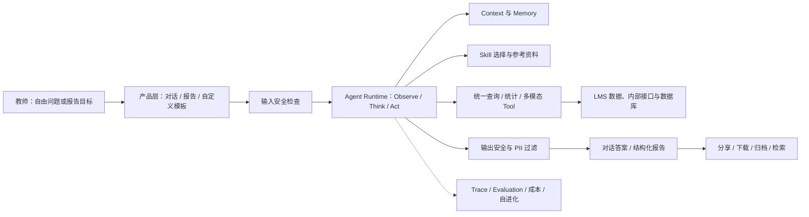

# 新版 AI 学情与 Agent Harness 内部案例系统研究

## 0. 研究结论

这个案例最值得学习的，不是某个 Agent 框架或某组提示词，而是它把一个明确的业务闭环做深了：以老师查询 LMS 学情数据为核心，用自由对话与结构化报告两种产品形态承接，通过统一查询 Tool、分层字段说明、差异化 Context、可配置 Skill、三层安全护栏、轨迹观测和分级 Evaluation 形成一套可运行的 Harness。原文将其描述为已进入生产验证，并给出首周 A/B、离线测试集、成本和延迟数据。[S:L22-L30][S:L42-L46][S:L103-L116][S:L127-L150]

对 ClassIn 教师 WorkBuddy，最大的可迁移价值是四点：

1. **从产品任务反推 Harness，而不是从 Agent 技术反推产品。** 对话、报告、分享、归档和机构模板共同服务于“理解学情并形成可传播结果”。[S:L22-L30]
2. **把复杂数据访问收敛到深 Module。** 14 个脚本和 100+ 参数最终收敛为带输入/输出校验的统一查询 Tool，明显降低了模型和调用方需要掌握的 Interface。[S:L183-L205]
3. **把质量、成本和迭代放进同一运行闭环。** 轨迹既服务故障定位，也服务 Evaluation、成本管理和回归验证后的 Harness 更新。[S:L356-L371][S:L471-L483]
4. **根据任务约束决定基础设施。** 查询场景在 Tool 取代脚本、Shell 被禁用后取消 Sandbox；这是范围收敛后的结果，不是“Agent 不需要 Sandbox”的通用结论。[S:L329-L344]

但该案例主要证明的是**只读查询与报告生成**，不能直接证明 WorkBuddy 的业务写回能力。原文没有给出 `ProposedAction`、教师审批、领域版本校验、幂等执行、部分成功、撤销或 `ExecutionReceipt` 的完整设计。WorkBuddy 应复用其查询和治理经验，但必须补上教师控制与执行系统，不能把“模型回答正确”升级为“业务动作已经正确发生”。

## 1. 研究问题、范围与证据规则

### 1.1 研究问题

本文回答：

1. 当前系统能力如何设计，并落成了哪些产品应用；
2. Agent 架构有哪些重要 Module，如何串联产品逻辑、业务规则、数据与功能逻辑；
3. 除上述两点外，业务验证、安全、数据治理、评价、可观测、成本、部署和组织演进还提供了什么经验；
4. 哪些内容可以迁移到教师 WorkBuddy，哪些必须改造，哪些不应迁移。

### 1.2 一手材料

- 内部案例：`/Users/eeo/Library/Mobile Documents/iCloud~md~obsidian/Documents/人类的输入/AI Agent 平台实践与经验 —— 新版 AI 学情背后的 Harness 工程.md`
- 读取快照：`nl -ba` 共 512 个编号行（文件含 511 个换行符）；SHA-256 `b5ce764e6d3bb8e753f598dd07a0c15011bd041822f472b8ca7eaf1f32c1af54`。若原文件哈希变化，应重新生成行号引用。
- 作者署名：赵鹏；原文说明材料基于公司内部技术分享整理，数据截止 2026-07-30。[S:L1-L3][S:L487-L498]
- 本文未访问原项目代码、监控后台、实验原始数据或文末外部参考资料；因此不独立验证实现、指标、因果或“业内独创”等主张。
- 原文含内部项目地址、体验入口、班级信息、人员和示例学生信息；本研究只保留架构与汇总证据，不复制这些操作性或个人信息。

### 1.3 证据标记

| 标记 | 本文含义 | 使用边界 |
| --- | --- | --- |
| `FACT` | 能从给定原文直接核对的文档事实或明确设计陈述 | 证明“原文这样记录/设计”，不自动证明生产行为与效果 |
| `AUTHOR CLAIM` | 作者对效果、因果、质量、安全性、行业比较或成熟度的主张 | 未经日志、代码、实验数据或独立来源复核 |
| `INFERENCE` | 本研究基于多条证据形成的分析或迁移判断 | 需要在 WorkBuddy Spec、Spike 或测试中验证 |
| `UNKNOWN` | 原文未披露或证据不足 | 不能用合理猜测补齐 |
| `CONFLICT` | 原文正文、图示或不同段落之间不一致 | 先确认版本关系，不能自行选择其中一个作为现状 |

引用格式 `[S:Lx-Ly]` 指向上述一手材料的原始行号。

### 1.4 原文内部一致性

原文需要先澄清两处版本关系：

1. `CONFLICT`：详细架构图仍展示 Shell 类内建 Tool 和本地权限化 Sandbox，但正文称最终已经禁用 Shell，并在统一 Tool 替代脚本后取消 Sandbox。[S:L166-L166][S:L320-L344]
2. `CONFLICT`：部署图把 Public Agent 和 Customized Agent 同时画在每个 Agent Server Instance 内，正文则更像是在区分共享的通用实例和只服务 MVP 客户的专属实例。[S:L166-L178]

这些差异可能来自不同演进阶段，也可能是概念图与生产图混用；原文没有标注图示版本。本文因此只把“系统经历过这些形态”视为可确认信息，不据此断言当前生产拓扑。

## 2. 案例全景：产品、业务与 Harness 的关系



`FACT`：原文给出的主运行链是输入安全检查后进入 Observe/Think/Act 循环，外围连接 Tool、Skill、Sandbox、长短期 Memory，输出再经过安全检查。[S:L155-L165]

`INFERENCE`：这套架构的业务价值来自三层同时收敛，而不是单一模型升级：产品层把意图约束为对话或报告；Harness 层把数据访问、上下文和安全收敛；业务数据层提供 LMS 事实。任何一层缺失，准确率与可用性都难以成立。

## 3. 维度一：产品形态与用户闭环

### 3.1 已形成的产品形态

| 产品能力 | 原文证据 | 判断 |
| --- | --- | --- |
| 自由对话 | 支持自由提问、推荐问题和图表化展示，底层连接“几乎所有 LMS 数据” | `FACT`（设计陈述）；数据覆盖率仍是 `UNKNOWN`。[S:L22-L25] |
| 结构化报告 | 可一次生成多个报告，可分享到班级或链接传播，可下载 PDF，历史报告可归档和检索 | `FACT`（设计陈述）。[S:L26-L27] |
| 自定义 Skill / 模板 | 既有全局模板，也有机构、班级、个人范围的模板；自然语言可触发 | `FACT`（设计陈述）。[S:L28-L30][S:L295-L300] |
| 模式共存 | 对话与报告可在同一会话共存 | `FACT`（设计陈述）。[S:L30-L30] |
| 专属机构配置 | 不同机构可组合数据源、展示模块和排版，并进行存储、加载、版本管理 | `FACT`（设计陈述）。[S:L295-L300] |

### 3.2 用户闭环

原文呈现的闭环是：

```text
进入 AI 学情
→ 直接提问 / 点击推荐问题 / 选择或自然语言匹配 Skill
→ Agent 查询并分析 LMS 数据
→ 获得对话答案或报告
→ 下载、分享、归档和再次检索
```

`INFERENCE`：这是一条“信息消费与内容交付”闭环，而不是“教学动作执行”闭环。它在答案之后提供了分享、下载和归档，但未说明报告如何转成作业、干预计划、消息草稿、待办或后续效果复查。

### 3.3 产品校准

- `INFERENCE`：自由对话适合探索性问题，报告适合高完整度、可传播的 Artifact；二者共用会话有利于从探索过渡到交付。
- `INFERENCE`：推荐问题降低冷启动成本，自定义 Skill 提供机构差异化，但教师可见的产品概念应是“报告模板/任务方式”，不必暴露内部 Agent、Tool 或 Skill 拓扑。这与 WorkBuddy 的统一主 Agent 决策一致。
- `UNKNOWN`：报告的编辑、差异比较、引用证据、审批、撤回、过期和失效策略；对话答案与报告版本之间的继承关系；分享后的访问控制和审计。

## 4. 维度二：业务验证与证据质量

### 4.1 原文报告的验证路径

| 验证层 | 原文报告内容 | 证据判断 |
| --- | --- | --- |
| 需求共创 | 深度服务 40 多家经访谈筛选的 MVP 机构，并灰度服务 | `AUTHOR CLAIM`。[S:L42-L43] |
| 在线实验 | 随机抽取 50% 机构流量；给出基线转化、MDE、功效和显著性参数 | `AUTHOR CLAIM`；原始分流、样本量与显著性结果未提供。[S:L42-L46] |
| 使用深度 | 日均消息 537 vs 133，师均消息 10.8 vs 3.1 | `AUTHOR CLAIM`。[S:L51-L71] |
| 留存 | 3 日内 37.1% vs 6.1%，7 日内 40.3% vs 12.2% | `AUTHOR CLAIM`。[S:L73-L92] |
| 活跃用户规模 | 实验组 255 人，对照组 269 人；作者据此排除宣传拉新 | 数字是 `AUTHOR CLAIM`；“增长完全来自产品体验”是因果强断言，证据不足。[S:L94-L101] |
| 用户任务分布 | 高频词包括作业、学生学习情况、班级、报告、反馈、课堂；报告类排名第一 | `AUTHOR CLAIM`；分类口径与样本未披露。[S:L118-L125] |
| 离线质量 | 基线、高级、复杂三级数据集，并给出新旧版和模型组合结果 | `AUTHOR CLAIM`；题集、标注协议和评审一致性未开放。[S:L395-L451] |
| 生产抽查 | 某 MVP 客户 8 位老师、7 天、60 次查询，称暂未发现错误 | `AUTHOR CLAIM`；样本小且“未发现”不等于无错误。[S:L453-L456] |
| 稳定性 | 基线集运行三轮，正确数 102–106，执行失败均为 0 | `AUTHOR CLAIM`。[S:L458-L469] |

### 4.2 对业务结论的校准

`AUTHOR CLAIM`：作者认为首周全部关键指标增长、无主动推广且实验组人数略少，因而增长来自产品体验；又认为准确率从约 62% 到 94% 使产品从“能用”变成“好用”。[S:L116-L116][S:L490-L494]

`INFERENCE`：数据方向足以把案例视为一个值得继续验证的产品与工程样本，但不足以单独证明长期业务价值：消息数可能混入多轮重试，留存可能受老师上课周期影响，准确率也未直接等同于教师决策质量或学生结果。

### 4.3 WorkBuddy 应补的业务指标

除使用量、留存和离线准确率外，WorkBuddy 应追踪：

1. Artifact 首次可用率、教师采纳率和修改量；
2. `ProposedAction → Approval → ExecutionReceipt` 转化率；
3. 权限拒绝、版本冲突、部分成功、重试和撤销率；
4. 来源引用覆盖、事实/推断混淆率和敏感数据暴露率；
5. 产物进入真实教学流程后的使用与复查结果；
6. 每个成功闭环的成本和教师节省时间，而非只看每条消息成本。

这些是 `INFERENCE / RECOMMENDATION`，需由产品 Spec 和评价 Module 明确定义。

## 5. 维度三：系统能力与产品实现

### 5.1 能力到产品的映射

| Harness 能力 | 实现方式 | 形成的产品效果 | 证据 |
| --- | --- | --- | --- |
| LMS 数据访问 | 统一查询 Tool，内置参数和输出校验 | 对话和报告能基于业务数据回答 | [S:L183-L205] |
| 复杂计算 | 统计 Tool 用代码计算平均数、中位数和分布 | 避免模型直接算数 | [S:L216-L224] |
| 多模态理解 | 多模态 Tool / Subagent 分析课堂黑板或图片 | 支持大课实时内容理解的候选能力 | [S:L219-L223][S:L346-L354] |
| 场景差异化 | 对话 60K、报告 200K Context | 对话偏速度，报告偏完整度 | [S:L231-L240] |
| 机构定制 | 自定义报告 Skill 的编辑、存储、加载、版本和可见性 | 不同机构/班级拥有专属报告形态 | [S:L295-L300] |
| 高吞吐与定制 | 通用 Agent 共享，专属 Agent 服务 MVP 机构 | 同时支持共享能力和客户定制 | [S:L168-L178] |
| 端云协同 | HTTP 支持云端 Agent，WebSocket 支持端上模型 | 原文描述为“云端规划、客户端执行” | [S:L170-L178] |
| 结果治理 | 输入、执行、输出三层护栏 | 降低注入、越权查询和信息泄露风险 | [S:L302-L325] |

`INFERENCE`：产品能力并非由一个“万能 Agent”直接实现，而是由一组专门能力配合：Runtime 决定循环，Context 决定模型看见什么，Skill 组织可复用方法和参考，Tool 获取/计算确定性事实，Guardrail 控制输入与输出，产品层把结果投影为对话或报告。

`UNKNOWN`：产品前端如何映射 Agent 的生成中、等待、失败、取消、恢复和部分结果；报告生成 5–25 分钟时的异步通知与恢复机制；分享链接的权限和数据生命周期。[S:L142-L150]

## 6. 维度四：Agent 运行链路与状态

### 6.1 原文可确认的链路

```text
用户请求
→ CDN / Agent API
→ 输入安全检查
→ Observe / Think / Act 循环
→ 选择并读取 Skill / Context / Memory
→ 调用查询、统计或多模态 Tool
→ 参数校验、业务数据读取、输出校验、截断/压缩
→ 模型继续迭代并形成答案或报告
→ 输出安全与 PII 过滤
→ 返回用户
→ Trace 进入观测、评估和改进流程
```

这条链的关键证据来自运行框架、部署、Tool 和可观测描述。[S:L164-L178][S:L183-L224][S:L302-L325][S:L471-L483]

### 6.2 状态建模缺口

`UNKNOWN`：原文没有公开稳定的 Run 状态机、事件模型、会话恢复协议、报告任务的 Durable 状态、取消语义或幂等键。虽然轨迹中出现 `CancelledError` 和 `RateLimitError`，但未说明产品如何恢复或向老师解释。[S:L373-L390]

`INFERENCE`：对 1–25 分钟任务，仅靠同步 HTTP/WebSocket 连接不足以证明业务级耐久性。WorkBuddy 需要显式 `WorkBuddyRun` 状态，例如 `needs-input`、`running`、`awaiting-review`、`awaiting-approval`、`executing`、`partially-succeeded`、`recoverable-failure`、`completed-needs-review`、`expired/cancelled`；Provider 的 span 或连接状态不能替代产品状态。

### 6.3 Subagent 的适用边界

原文只定义多模态理解和复杂学情分析两类 Subagent，其价值被描述为节省 Context、并行执行和复杂任务编排。[S:L346-L354]

`INFERENCE`：这支持“专门任务才设 Subagent”，不支持按产品页面或每个 Skill 建一个 Agent。WorkBuddy 只有当子任务拥有独立目标、受限 Context、完成契约和失败处理时才应采用专业 Subagent；普通课程生成步骤应先留在一个深 Runtime Module 内。

## 7. 维度五：Module / Interface / Seam / Adapter 架构重构

原文使用的是 Harness 功能分类，不是严格的 Module 契约文档。下面用本仓库统一词汇重构其架构；未公开的 Interface 形状均为 `INFERENCE`，不是对原代码的断言。

| Module | 小 Interface（概念形状） | 隐藏的复杂性 / Depth | Seam 与 Adapter 判断 |
| --- | --- | --- | --- |
| Conversation / Report Product Module | `submit(intent)`、`render(runProjection)` | 模式切换、推荐问题、报告归档与分享 | 产品 Interface；原文未披露 UI Adapter |
| Agent Runtime Module | `run(request, capabilities)` | Observe/Think/Act、循环终止、流式输出、Subagent 编排 | 模型 Provider 与通信协议是内部 Seam；HTTP/WebSocket 是 Adapter 候选 |
| Context Module | `assemble(scope, mode)` | 60K/200K 配额、选择性卸载、静动态排序、压缩与隔离 | 对话/报告是策略输入，不应暴露 Context 拼装细节 |
| Memory Module | `load(scope)`、`commit(delta)` | 轮次增量、持久化、跨轮/班级/学期检索 | 文件到 MySQL 证明存储会变化，但原文未证明二者满足同一稳定 Interface；应视为候选 Seam |
| Learning Data Access Module | `query(validatedRequest)` | 多数据源路由、参数/输出校验、时间切片、截断、压缩、字段解释 | V1/V2/V3 证明调用复杂度持续收敛，但 Interface 本身也在变化；稳定 Seam 尚待代码核验 |
| Skill Module | `resolve(scope, intent)`、`load(version)` | reference 渐进披露、机构配置、可见性和版本选择 | 全局、机构、班级、个人是同一 Interface 下的配置与数据，不是 Adapter |
| Safety Policy Module | `checkInput`、`authorizeToolCall`、`filterOutput` | 注入检测、Tool allowlist、参数范围、PII 和内部信息处理 | Policy Provider 可替换，但授权结果必须来自组织/领域规则 |
| Evaluation Module | `evaluate(run, suite)` | 数据集分层、模型评审、人工核验、稳定性运行 | 测试集是版本化输入；不同 Judge 实现可以是同一评价 Seam 上的 Adapter |
| Observability Module | `record(event)`、`query(trace)` | Trace 树、Token、耗时、成功率、下载和持久化 | 多个平台证明可观测 Provider 会变化；是否已有稳定 Interface 仍待代码核验 |
| Deployment / Routing Module | `route(tenant, capability)` | 通用/专属实例选择、CDN、十实例负载和端云协议 | 通用/专属是部署策略，HTTP/WebSocket 才可能是传输 Seam 上的 Adapter |

### 7.1 最深的 Module：统一数据访问

`FACT`：V1 让模型面对 14 个脚本和 100+ 参数；V2 收敛为单脚本但仍依赖不安全、可修改的 Shell；V3 改为模型原生黑盒 Tool，并加入输入和输出校验。[S:L185-L195]

`INFERENCE`：这是案例中最清晰的 Deep Module。Interface 从多个脚本/大量参数收敛到一个可验证查询入口，复杂的数据源选择、字段映射、切片、截断和解释集中在 Implementation 内，提升了调用方 Leverage 和维护 Locality。删除这个 Module，复杂性会重新散落到 Prompt、脚本和 Agent 调用路径中。

### 7.2 Seam 校准

- `FACT`：查询方式先后有多脚本、单脚本和原生 Tool 三种形态，文件与 MySQL 也曾先后承担短期 Memory。[S:L188-L205][S:L260-L270]
- `INFERENCE`：这些演进证明了变化点真实存在，但不能仅凭“出现过多个实现”断言已有稳定 Seam。还需从代码确认调用方是否依赖同一个 Interface、替换实现时是否无需修改调用方。
- `INFERENCE`：对 WorkBuddy，Mock ClassIn 与未来真实 ClassIn 实现同一读取/写回 Interface 时，才形成可测试的真实 Seam；脚本到原生 Tool 更像一次 Interface 深化，而不只是替换 Adapter。
- `INFERENCE`：HTTP 与 WebSocket 只是传输 Adapter。原文称二者唯一差异是通信协议，但端上执行通常还涉及身份、信任、离线、重连、版本和执行证明，不能在 WorkBuddy 中假设协议可完全互换。[S:L170-L178]
- `UNKNOWN`：统一 Tool 的实际 Interface、错误码、权限 Context、分页/切片契约、幂等性和 Schema 版本策略。

## 8. 维度六：Context / Memory / Skill / Tool

### 8.1 四者不应混为“Prompt”

| 概念 | 案例中的职责 | 关键经验 | WorkBuddy 校准 |
| --- | --- | --- | --- |
| Context | 当前一次推理可见的静态说明、动态业务范围和工具结果 | 模式化预算、选择性卸载、静态前置以命中 KV Cache | 应产出可审计 `ContextSnapshot`，保留来源、版本、授权和缺口 |
| Memory | 跨步骤或跨会话保留的状态与偏好 | 每轮一次增量写，长期用向量/混合检索 | 学生事实、教师推断、机构规则必须分治理，不可都进入通用向量 Memory |
| Skill | 可复用的方法、参考和机构模板 | 两层 reference 渐进披露；可编辑、版本化、按范围可见 | Skill 不拥有业务事实，也不能直接越过教师审批写回 |
| Tool | 获取事实或执行确定性计算的能力 | 小 Interface、校验、限制、截断、压缩、无 Shell | 只读查询 Tool 与副作用 Tool 必须风险分级；后者转成 `ProposedAction` |

### 8.2 Context 的工程经验

- `FACT`：对话使用 60K、报告使用 200K，以响应速度和丰富度做不同权衡。[S:L231-L240]
- `FACT`：多轮后卸载早期大体积作业/测验结果。[S:L241-L245]
- `FACT`：静态系统提示、Tool 定义和 Skill 文档前置，日期、IP、班级 ID 等动态信息拼到 query 末尾，以提高 KV Cache 命中。[S:L246-L255]
- `AUTHOR CLAIM`：对话输入缓存命中率达到 80%+，且因此成本很低。[S:L253-L255]

`INFERENCE`：按稳定性排序 Context 是有价值的 Provider 优化，但动态身份与班级范围不应只作为自然语言尾注。权限范围必须以结构化、不可由模型覆盖的执行 Context 传给 Tool 和 Policy Module。

### 8.3 Memory 的工程与治理风险

- `FACT`：短期 Memory 从文件全量、频繁写，演进到 MySQL 每轮一次增量写；作者称此前约 20 次状态更新叠加并发使数据库承压。[S:L260-L270]
- `FACT`：长期 Memory 设想覆盖跨轮、跨班级、偏好和跨学期知识/错题，并计划使用向量或混合检索供多个 Agent 共享。[S:L272-L282]

`INFERENCE`：每轮统一 commit delta 是合理的持久化优化，但“多个 Agent 共用长期 Memory”对教育场景风险很高。WorkBuddy 必须按事实类别、主体、租户、目的、保留期和可删除性隔离；跨班级和跨学期检索必须重新鉴权，不能因相同教师/学生标识自动扩展访问范围。

### 8.4 Skill 与 Tool 的分工

`FACT`：原文认为 Skill 更像可复用标准包，包含文档、reference、示例，适合跨项目复用；Tool 则以黑盒 Interface 执行查询，可校验和限制，不需要 Shell。[S:L203-L205][S:L224-L224][S:L284-L300]

`INFERENCE`：对 WorkBuddy，Domain Knowledge、业务规则、Tool 和 Skill 要继续拆开：Skill 组织“如何完成教师任务”，Domain Knowledge 提供教学依据，业务规则判断可否执行，Tool 读取/写入业务系统。把四者都塞进 Skill 会形成浅 Interface 和不可治理的所有权混杂。

## 9. 维度七：Security 与 Data Governance

### 9.1 案例已有安全设计

| 层 | 原文机制 | 判断 |
| --- | --- | --- |
| 输入 | 检测 Jailbreak、Prompt Injection 和有害输入 | `FACT`（设计陈述）。[S:L307-L316] |
| 执行 | 校验 Tool 名称和参数范围，避免恶意数据查询 | `FACT`（设计陈述）。[S:L307-L314] |
| 输出 | PII、接口信息和内部信息过滤/脱敏，重写输出 | `FACT`（设计陈述）。[S:L310-L318] |
| 最小权限 | 限定目录权限、禁用 Shell、隐藏思考过程并给用户概括 | `FACT`（设计陈述）。[S:L320-L325] |
| Sandbox | 在只读查询场景中，Tool 完全替代脚本后取消 Sandbox | `FACT`（设计陈述）。[S:L329-L344] |

### 9.2 需要校准的安全结论

- `AUTHOR CLAIM`：原文以一个外部模型安全事件说明模型能绕过防护，但该事件在本研究中未核验，不能作为事实引用。[S:L327-L327]
- `INFERENCE`：输入/输出过滤是纵深防御，不是授权系统。真正的数据安全必须在 Tool 内使用结构化身份、租户、角色、对象范围和用途进行强制校验。
- `INFERENCE`：隐藏完整思考过程是正确方向，但可审计不等于向最终用户暴露私有推理；用户应看到动作摘要、数据来源、调用范围和结果证据。
- `INFERENCE`：取消 Sandbox 只适用于没有任意代码、文件处理或开放插件的封闭查询 Module。一旦 WorkBuddy 引入用户文件转换、代码执行或第三方 Skill，必须重新评估隔离环境。

### 9.3 原文未覆盖的数据治理

以下均为 `UNKNOWN`：

1. 数据最小化、目的限制、保留周期、删除、更正和导出机制；
2. 教师、学生、班级、机构之间的租户隔离和跨范围再授权；
3. 报告分享链接的访问控制、过期、撤销和下载审计；
4. Trace、Prompt、Tool 结果和长期 Memory 中 PII 的脱敏与保留策略；
5. 自定义 Skill 的发布审批、恶意内容检测、版本回滚和供应链治理；
6. 端上执行的设备信任、证明、离线缓存和失窃处理；
7. 数据是否用于训练、模型 Provider 数据处理条款和跨境边界。

## 10. 维度八：Evaluation / Observability / Self-Evolution

### 10.1 三层评价体系

| 层级 | 设计 | 优点 | 缺口 |
| --- | --- | --- | --- |
| Baseline | 112 个单维、可直接查询问题，严格数值答案，模型评测 + 人工核验 | 适合验证 Tool 查询正确性 | 未披露题集版本、污染控制和评审协议。[S:L397-L417] |
| Advanced | 94 个多步聚合或交叉验证问题，人工标注结构化答案 | 更接近组合分析 | 未披露评分量规和一致性。[S:L419-L437] |
| Complex | 32 个抽象、模糊或缺信息问题，全人工判断 | 覆盖现实开放问题 | 样本小、主观性高，需多评审者与分项量规。[S:L439-L451] |

`AUTHOR CLAIM`：原文报告不同模型组合在三个测试集上约 0.88–0.95 的结果，并据专属 Agent 优于通用组合得出垂直优化更强的结论。[S:L411-L449]

`INFERENCE`：测试集按任务难度分层是可迁移的，但 WorkBuddy 还需要按失败风险分层：事实正确性、课程结构质量、规则合规、来源充分、敏感性、审批/执行正确性和恢复能力不能压成一个“准确率”。

### 10.2 可观测体系

`FACT`：案例用 LangSmith、Coze Loop、OpenTelemetry 记录从用户意图、模型调用、Tool 执行到最终输出的树状 Trace，并追踪 Tool 的 Token、耗时和成功状态。[S:L471-L483]

`INFERENCE`：这是跨 Provider 的真实 Observability Seam。WorkBuddy 应在此基础上增加稳定业务关联键：`runId`、`contextSnapshotId`、`artifactVersion`、`proposedActionId`、`approvalId`、`executionReceiptId`，从而把模型轨迹与产品事实关联，而不让 span 成为业务事实。

### 10.3 自进化闭环

`FACT`：原文定义采集、分类、诊断、建议、验证、更新六步流程，只有通过回归测试的 Harness 修改才采纳。[S:L356-L371]

`AUTHOR CLAIM`：首周轨迹分析发现的失败均被解释为客户端取消或 API 限流，作者据此判断 Agent 自身运行质量过硬。[S:L373-L390]

`INFERENCE`：错误类型与其他日志吻合，只能证明故障分类有用，不能证明不存在 Agent 逻辑错误。客户端取消可能来自过长延迟或体验问题，API 限流也是容量与降级设计的一部分，不宜全部归为“外部原因”。

`RECOMMENDATION`：WorkBuddy 的“自进化”应保持为受治理的离线改进流水线：生成候选修改、固定评测、风险评审、灰度、回滚。不得让生产 Agent 自动修改 Tool 权限、业务规则、长期 Memory 范围或审批策略。

## 11. 维度九：成本、性能与部署

### 11.1 原文披露的数据

| 项目 | 原文数值 | 证据等级 |
| --- | --- | --- |
| 单次对话成本 | RMB 0.007–0.07 | `AUTHOR CLAIM`。[S:L127-L140] |
| 单次报告成本 | RMB 0.05–0.20 | `AUTHOR CLAIM`。[S:L127-L140] |
| 对话缓存命中 | 80%+ 输入 | `AUTHOR CLAIM`。[S:L133-L140][S:L246-L255] |
| 报告缓存命中 | 50%+ 输入 | `AUTHOR CLAIM`。[S:L133-L140] |
| 对话耗时 | 1–5 分钟 | `AUTHOR CLAIM`。[S:L142-L150] |
| 报告耗时 | 5–25 分钟 | `AUTHOR CLAIM`。[S:L142-L150] |
| 部署 | CDN / Agent API，线上 10 个实例，可路由到任意实例 | `FACT`（设计陈述）。[S:L176-L178] |
| 租户形态 | 通用实例共享，专属实例服务定制客户 | `FACT`（设计陈述）。[S:L170-L178] |

### 11.2 架构判断

- `INFERENCE`：KV Cache 优化将静态内容前置，是高 Leverage 的成本优化，但它把 Prompt 排序变成 Interface 不变量；版本更新时需要明确缓存失效和配置版本。
- `INFERENCE`：1–25 分钟不能称为即时交互。产品必须支持后台任务、进度、取消、断线恢复、完成通知和结果过期，而不应依赖页面一直打开。
- `INFERENCE`：通用/专属混合部署有利于成本和定制，但会引入配置漂移、租户隔离、容量预留、版本推进和回滚复杂度。专属 Agent 不应复制核心业务逻辑，差异应尽量落在受治理的 CapabilityManifest、Policy 和 Skill 版本中。
- `UNKNOWN`：并发、P95/P99、超时、重试、降级、排队、实例亲和、会话状态共享、灾备、SLO 和单位成功任务总成本。

## 12. 维度十：组织、交付与演进

### 12.1 案例呈现的组织方式

- `FACT`：项目与大量产品和研发人员协作，前期通过产品访谈筛选 MVP 机构并深度陪跑。[S:L10-L14][S:L42-L43]
- `FACT`：基础设施复用公司 AI 中台；统一接口由相关同事重做；Skill 是否保留为跨项目标准包曾经过团队争论和决策。[S:L176-L178][S:L190-L203][S:L287-L293]
- `FACT`：作者希望建立常态化技术讨论机制，共享问题并减少重复踩坑。[S:L10-L14][S:L490-L496]

### 12.2 可迁移的组织经验

1. `INFERENCE`：纵向场景应有端到端 Owner，能同时看业务指标、产品体验、Tool 质量、成本和安全，而不是按前后端局部完成度验收。
2. `INFERENCE`：共享 Skill 和 Tool 应有 Interface Owner；机构定制通过版本和配置进入统一治理，不由客户分支复制运行时。
3. `INFERENCE`：基础设施优先复用，但复用的判断单位应是稳定 Interface 和可验证 Adapter，不是因为“已有系统”就让领域事实归属模糊。
4. `INFERENCE`：经验复用应沉淀为固定测试集、故障分类、契约、运行手册和变更记录，而不只依赖分享文章。

### 12.3 演进路线中的重要转折

| 演进 | 学到的原则 | 证据 |
| --- | --- | --- |
| 多脚本 → 单脚本 → 原生 Tool | 先降低模型选择复杂度，再移除不必要执行能力 | [S:L185-L195] |
| 大字段文档 → 返回附解释 → 两层 reference | 按需渐进披露，避免 Context 重复与过载 | [S:L196-L205] |
| 文件全量/频写 → MySQL delta/每轮写 | 持久化写入要按业务提交点批处理 | [S:L260-L270] |
| 无 Sandbox → 多种 Sandbox → 无 Sandbox | 基础设施随能力范围变化，不能脱离威胁模型照搬 | [S:L329-L344] |
| 单一共享能力 → 通用 + 专属 | 共性能力与机构差异需同时治理 | [S:L168-L178][S:L295-L300] |

## 13. 对教师 WorkBuddy 的迁移矩阵

### 13.1 可直接迁移的原则

| 可迁移项 | 迁移方式 | 优先级 |
| --- | --- | --- |
| 对话探索 + 结构化 Artifact | WorkBuddy 保持统一主 Agent 入口，结果进入可编辑 `ArtifactDraft`，而不是只返回聊天文本 | P0 |
| 统一数据访问深 Module | 为 ClassIn 读取建立小 Interface，内含参数校验、分页/时间切片、截断、Schema 和结果一致性检查 | P0 |
| 静态 reference 渐进披露 | Domain Knowledge 和 Tool reference 分层加载，并记录来源与版本 | P0 |
| 确定性计算交给 Tool | 数值统计、Schema 校验、版本比较和规则检查不用模型猜 | P0 |
| 全链路 Observability | 记录 Intent → Context → Capability → Artifact → Action → Receipt，并追踪成本、延迟和错误 | P0 |
| 分级 Evaluation | 从确定性事实题扩展到多步、模糊任务，同时增加规则、安全、执行和教师采纳维度 | P0 |
| 回归后才采纳 Harness 修改 | 建立离线候选、回归、灰度、回滚的受治理持续改进流程 | P1 |
| 通用能力 + 机构配置 | 共用 Runtime，通过受治理 Skill/Policy/Knowledge 版本表达机构差异 | P1 |

### 13.2 必须改造后迁移

| 原案例模式 | WorkBuddy 必须增加的改造 | 原因 |
| --- | --- | --- |
| LMS 查询 Tool | 明确只读/写入风险级别；写入先生成 `ProposedAction`，审批后由领域 Adapter 执行并返回 `ExecutionReceipt` | 原案例未证明副作用闭环 |
| 长期共享 Memory | 按租户、主体、事实类型、用途、保留和删除隔离；推断不能作为学生长期事实 | 教育数据高敏感，原文治理信息不足 |
| 自定义 Skill 平台 | 发布审查、签名、版本钉扎、回滚、权限差异预览和 CapabilityManifest | 编辑/可见性不等于安全治理 |
| 通用 + 专属 Agent | 核心 Runtime 与业务规则保持同一版本，专属差异限定在配置和受治理 Adapter | 防止租户分支漂移 |
| HTTP / WebSocket 端云执行 | 增加设备信任、断线恢复、幂等、结果证明、版本兼容和权限复核 | 协议互换不等于执行语义互换 |
| Context 尾部动态拼接 | 动态身份/班级信息同时进入结构化授权 Context，不能仅作为模型文本 | 防止 Prompt 覆盖授权 |
| 隐藏思考过程 | 对用户展示动作摘要、证据、风险和执行结果；Trace 受控保存 | 可解释与隐私需要同时满足 |
| 取消 Sandbox | 每个 Capability 做威胁建模；开放文件、代码或第三方扩展时恢复隔离 | 案例结论只适用于封闭查询场景 |

### 13.3 不应迁移的内容

1. **不迁移“消息增长等于产品价值”的判断。** WorkBuddy 应以 Artifact 采纳、业务回执和教学复查为主要结果。
2. **不迁移“错误均为外部原因，所以 Agent 质量过硬”的结论。** 取消、限流、超时和恢复属于系统整体质量。[S:L373-L390]
3. **不迁移“长期 Memory 可跨班级、跨学期、跨 Agent 自由共享”的默认设计。** 必须先有教育数据治理。
4. **不迁移“专属 Agent 就是机构定制”的产品表面。** 教师不应选择内部 Agent；机构差异由平台配置和领域规则表达。
5. **不迁移“统一 Tool 等于万能业务 Interface”。** 读取学情与保存课程、发送消息、发布作业具有不同风险和事务语义，应分别形成深 Module。
6. **不迁移行业独创性和绝对安全性主张。** 原文相关表述缺少独立证据。[S:L168-L174]
7. **不迁移不受控自进化。** Prompt、Tool、Memory、Policy 的修改必须通过固定回归、人工评审、灰度和回滚。

## 14. WorkBuddy 优先建议

### P0：先把案例经验落到当前纵向切片

1. 定义 ClassIn 读取的最小 Interface，支持机构、教师、课程结构读取；由固定可重置的 Mock ClassIn Adapter 实现，并在 Tool 内完成 Schema、范围和结果校验。
2. 让上下文引擎产出版本化 `ContextSnapshot`，明确产品逻辑、业务规则、Domain Knowledge、业务数据/API 四类来源，而不是把它们拼成无归属 Prompt。
3. 把课程结果固化为可编辑、可比较、带来源的 `ArtifactDraft`；对生成中、信息缺口、可恢复失败和完成待复查建立显式状态。
4. 所有写回走 `ProposedAction → Approval → Domain Validation → Adapter → ExecutionReceipt`，覆盖权限拒绝、版本冲突、部分成功和幂等重试。
5. 建立最小评价集：Context 完整性、Schema 通过率、规则通过率、教师修改量、审批结果、Receipt 关联、延迟与成本。

### P1：形成可复用 Harness

1. 把查询/统计、课程知识、课程生成 Skill、安全 Policy 和模型 Provider 放在不同 Seam，不让 Skill 直接拥有业务事实或执行权限。
2. 使用统一事件关联 Run、Artifact、Action 和 Receipt；Observability Adapter 可以变化，业务对象不随平台变化。
3. 为机构配置建立版本、适用范围、审批、回滚和评测门槛，再开放自定义模板能力。
4. 把失败轨迹沉淀为固定回归集；任何 Harness 修改先过离线评测和安全回归。

### P2：数据和业务闭环成熟后再引入

1. 长期 Memory、跨班级/学期检索；
2. 多模态课堂 Subagent 和实时端云执行；
3. 多个专业 Agent 的委派网络；
4. 自动追踪干预效果和跨天 Durable Workflow；
5. 用户可编辑的开放 Skill 平台。

这些能力都需要新的真实 Seam、治理和运维负担；当前 D1 不应为了架构完整感提前建设。

## 15. 仍需向内部项目核实的问题

### 产品与业务

1. A/B 的随机化单位、样本量计算、显著性区间和指标去重规则是什么？
2. 消息数如何区分有效任务、追问、重试和失败？报告的创建、编辑、分享、复访各自转化如何？
3. 老师是否据报告采取了教学动作，是否有后续结果或质性访谈证据？

### Runtime 与架构

4. Run、Message、ToolCall、Report 和 SkillVersion 的稳定数据模型及状态机是什么？
5. 5–25 分钟任务如何处理断线、取消、重试、恢复、重复提交和结果通知？
6. HTTP 与 WebSocket Adapter 是否共享完全相同的权限、事件、错误和幂等契约？
7. 统一查询 Tool 的参数 Schema、错误分类、分页、数据新鲜度和权限 Context 是什么？

### 安全与治理

8. Tool 的授权由哪个领域系统裁决，是否在每次调用时校验租户/班级/角色？
9. 报告、Trace、Context 和长期 Memory 各自保存多久，如何删除、脱敏和审计？
10. 自定义 Skill 如何审查、发布、回滚，能否改变数据范围或执行权限？
11. PII 过滤器如何评测，误杀/漏检如何处置？

### 评价与运维

12. 测试集如何版本化、防污染，人工评审的一致性如何计算？
13. 自进化候选由谁批准，回归集覆盖哪些安全和业务不变量？
14. 线上 P95/P99、并发、排队、限流降级、SLO、单个成功任务总成本是什么？
15. 生产 Trace 与业务指标能否通过稳定 ID 关联，而不依赖供应商平台的 span 结构？

## 16. 最终校准

这个案例应被定位为：**一个已经将学情只读查询、分析和报告生成做成产品闭环，并系统积累 Harness 工程经验的内部一手案例**。它强有力地说明 Tool Interface、Context 组织、Skill 复用、可观测和评价会直接影响产品质量与成本；它也展示了通过多轮工程收敛获得 Depth、Leverage 和 Locality 的过程。

它不应被定位为：**教师 WorkBuddy 完整架构的现成答案**。WorkBuddy 的目标还包括课程对象草稿、教师控制、业务写回、回执、评价和跨场景复用，且必须严格区分 WorkBuddy、ClassIn、Domain Knowledge 和机构规则的事实所有权。最稳妥的路线是复用案例中的读侧深 Module 与评测方法，在当前“课程目标 → 课程对象”切片中补齐动作、审批、状态和回执，再用真实场景证明新的 Seam。
