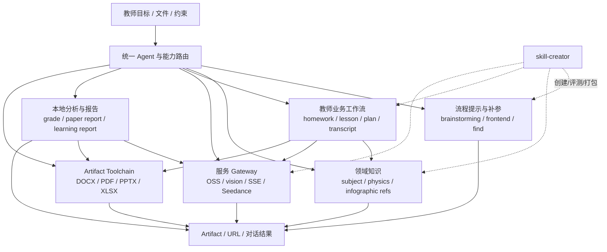

# NineClaw 本地 Skill 全量目录、实现审计与产品交叉验证

> 日期：2026-08-20
>
> 状态：研究记录（源码静态审计；不是运行验收）
>
> 范围：`/Users/eeo/nineclaw/我的文件/.claude/skills` 当前挂载的 23 个 Skill
>
> 用途：佐证 NineClaw 产品研究，并为 ClassIn 教师 WorkBuddy 的能力复刻、产品设计和工程分层提供依据

## 0. 结论摘要

本次审计把产品录屏中“可见的 Skill”与教师工作区中“实际挂载的 Skill 包”逐项对齐。最重要的结论是：

1. **工作区不是 23 份独立副本，而是应用级集中安装目录的投影。** `/Users/eeo/nineclaw/我的文件/.claude/skills` 下 23 个项目全部是符号链接，目标均位于 `/Users/eeo/Library/Application Support/NineClaw/SKILLs/<skill-id>`；23 个链接全部有效，目标中均有 `SKILL.md`。这是“应用级集中安装、工作区按链接挂载”的明确架构事实。
2. **23 个包并不是同一种能力。** 它们至少分为：纯流程提示、学科知识包、业务产物工作流、可执行服务网关、通用 Office 产物工具链、Skill 创建与评测基础设施。把所有 Skill 都画成同一种“工具节点”会掩盖真实实现深度。
3. **产品侧观察与本地源码有较高但非完全重合的覆盖。** 20 个本地 Skill 在录屏/截图中找到同名或明确对应的 UI 入口（A）；3 个只在本地源码出现、录屏未覆盖（B）；其中 10 个包主要由说明、参考和模板构成，单凭目录不能证明稳定运行（C）；另有 9 个 UI Skill 在这 23 个本地包中找不到一一对应实现（D）。C 是成熟度标签，可与 A/B 重叠。
4. **源码佐证了 NineClaw 的核心产品形态：统一任务 Agent 编排 Skill，Skill 产出 Artifact。** 多数包不是独立应用，而是把触发条件、补参步骤、领域规则、脚本和输出契约组合起来，在同一任务会话中生成 HTML、DOCX、PPTX、PDF、XLSX、视频或 URL。
5. **源码只能证明“能力定义和实现材料存在”，不能证明“线上稳定成功”。** 本次仅完成完整静态阅读、链接校验以及核心 Python/Node 脚本的语法检查；没有使用真实 Token 调用 NineClaw 服务、OSS、Seedance 或图像接口，也没有对生成质量做人工评分。
6. **最值得 ClassIn 迁移的不是 23 个包的逐个拷贝，而是四层能力模型：** `Capability Manifest → 业务工作流/规则 → 可替换 Adapter → Artifact/ProposedAction 契约`。NineClaw 当前以自然语言 `description` 兼任路由规则，存在明显重叠；ClassIn 应把意图、输入 schema、权限、数据分级、输出类型、验证器和回滚策略显式化。
7. **关键治理缺口集中在数据外发、动态 HTML、安全边界和依赖完整性。** 图片分析链路会先上传 OSS；部分生成器直接打开模型生成的 HTML；若干报告把未转义 JSON 注入 `<script>`；本地包还引用了未挂载的 `geogebra`、`tutor`、`superpowers:*` 等能力。这些都不能直接照搬到包含学生数据的 WorkBuddy。

## 1. 研究方法与证据边界

### 1.1 审计方法

- 先读取仓库 `AGENTS.md`、`docs/00-project/PROJECT-BRIEF.md`、`docs/00-project/DECISION-LEDGER.md` 和 research skill，遵守“研究结论写回仓库、未验证不改写成事实”的约束。
- 使用 `rg --files -L -uu` 跟随符号链接盘点，再以解析后的集中安装目录复核。普通 `rg --files` 不跟随这里的顶层 symlink，会得到误导性的空目录结果。
- 完整读取 23/23 个 `SKILL.md`，共 4,557 行；读取其直接引用且与行为判断有关的 references、scripts、assets、manifests、`package.json` 和 eval 文件。
- 对 Office 包的标准 OOXML XSD 与捆绑 `node_modules` 只做资产计数和依赖识别，不逐文件解释第三方源代码；这两类文件不改变其业务能力判断。
- 与以下两份既有研究逐项交叉：
  - `docs/01-research/source-notes/product_research_nineclaw_product_design_and_interaction_20260820.md`
  - `docs/01-research/source-notes/product_research_nineclaw_local_architecture_and_skills_20260819.md`
- 对自定义 Node 脚本执行 `node --check`，对核心 Python 源文件做内存编译检查；这些检查只证明语法可解析。

### 1.2 证据标签

| 标签 | 定义 | 本文如何使用 |
|---|---|---|
| A | UI 已观察，且本地源码/包结构可以佐证 | 可写成“入口与实现包均存在”，不能自动升级为稳定可用 |
| B | 本地源码具备，但本轮录屏/截图未覆盖 | 可写成“本地已安装/已发现”，UI 可见性未验证 |
| C | 只有说明、提示、模板或参考，或虽有脚本但没有运行结果 | 必须保留“静态具备/未运行验收”标签；C 可叠加在 A/B 上 |
| D | UI 出现，但本地 23 个目录中无一一对应 Skill | 只证明产品版本/能力面更广；不能凭名称推断实现路径 |

“源码佐证”在本文中表示：包、规则、脚本或资产真实存在，并能说明设计意图。它**不表示**接口可达、凭据有效、服务 SLA、教育质量、输出正确性或生产安全已经通过验证。

### 1.3 盘点统计

| 项目 | 数量 | 说明 |
|---|---:|---|
| 顶层 Skill 链接 | 23 | 全部有效，全部指向集中安装目录 |
| `SKILL.md` | 23 / 4,557 行 | 全量完整阅读 |
| 跟随链接后的文件 | 1,299 | 包含捆绑 `node_modules` 与 Office schema |
| 排除 `node_modules` | 285 | 本地包自身与 Office schema |
| 再排除 Office XSD | 207 | 更接近业务说明、脚本、模板与素材 |
| reference Markdown | 74 | 其中 infographic 占 45 个布局/风格与基础说明文件 |
| 非 `node_modules` assets | 8 | HTML 模板、图片/文档样例等 |
| `evals/evals.json` | 4 | docx、oss-image-upload、paper-diagnosis、learning-report-generator |
| 含 scripts/recalc 的包 | 13 | 包括通用 Office 工具链 |
| 非 `node_modules` Python/JS 文件 | 57 | 含 Office 工具脚本 |

## 2. 安装与发现架构

```text
NineClaw 应用级 Skill 仓库
/Users/eeo/Library/Application Support/NineClaw/SKILLs/<skill-id>
                         │
                         │ 23 个有效 symlink
                         ▼
教师工作区能力投影
/Users/eeo/nineclaw/我的文件/.claude/skills/<skill-id>
                         │
                         │ SKILL.md 的 description + Skill 工具发现
                         ▼
统一任务会话 / Agent 运行
                         │
                         ├── 读取规则与 reference
                         ├── 调用脚本、服务或 MCP
                         └── 生成 Artifact / URL / 对话结果
```

证据：

- 23 个工作区路径均由 `readlink` 解析到 `/Users/eeo/Library/Application Support/NineClaw/SKILLs/<同名目录>`，且每个目标均存在 `SKILL.md`（本次链接逐项校验记录）。
- 运行日志的 system init 同时列出全部 23 个名称于 `slash_commands` 与 `skills`，说明运行时确实发现了这些挂载项：`/Users/eeo/Library/Application Support/NineClaw/logs/cowork.log:L4027`、`:L4183`。
- 同一日志列出的通用能力包括 `Skill`、`AskUserQuestion`、`Write`、任务工具和 MCP；在 MCP 已连接的运行中还可见 `mcp__nine-tool__image_generate`：同上 `:L4027`。
- 这把既有架构研究中“应用源码 → 用户运行时 → 工作区链接 → SDK 发现”的样例判断升级为对当前 23 个包的完整验证；对应既有结论见 `product_research_nineclaw_local_architecture_and_skills_20260819.md` 第 3、5 节。

一个重要的产品含义是：工作区里的“已安装”更接近**能力启用投影**，不是把实现复制进每个教师项目。升级集中目录即可影响后续挂载，但版本回滚、租户隔离和正在运行任务的一致性仍需额外机制；本目录没有提供这些机制的证据。

## 3. 共同实现结构与差异

### 3.1 共同骨架

绝大多数包遵循以下松散骨架：

```text
<skill-id>/
├── SKILL.md                 # frontmatter + 触发条件 + 流程 + 输出要求
├── references/              # 领域规则、布局、提示词、API 或格式知识（可选）
├── scripts/                 # 可执行 Adapter、报告构建或文件处理（可选）
├── assets/                  # HTML 模板、样例文档、图片等（可选）
├── evals/evals.json         # 测试提示与期望说明（少数包）
├── agents/                  # skill-creator 的评测子代理（个例）
└── package.json/LICENSE.txt # 依赖或许可证（部分包）
```

`SKILL.md` 的 frontmatter 通常包含 `name`、`description`、`version`、`official`；但字段并不统一：`subject-expert` 无版本，`infographic` 还有 author/platform/metadata，Office 包含 proprietary license。由此可见当前 manifest 更像可扩展元数据，而不是严格统一 schema。

### 3.2 五种实现深度

| 实现类型 | 包 | 源码能证明什么 | 不能证明什么 |
|---|---|---|---|
| 纯流程提示 | brainstorming、frontend-design、find-skills | 触发语义与执行方法存在 | 输出质量、外部 CLI 可用 |
| 知识/提示包 | subject-expert、physics-solver、infographic | 领域规则、风格/布局或完整提示存在 | 模型遵循度、图像服务效果 |
| 业务产物工作流 | homework-generator、teacher-lesson-plan-assistant、teaching-plan-generator、teaching-transcript-generator | 输入槽位、步骤、模板和产物标准存在 | 真实解析/导出成功、教育正确性 |
| 可执行网关/报告引擎 | oss-image-upload、vision、single-page-creator、geometry-solver、paper-diagnosis、grade-analysis、learning-report-generator、seedance-video-generator | 明确 API/算法/脚本/HTML 构建路径存在 | 凭据、服务可达、运行质量与安全 |
| 通用产物工具链与元能力 | docx、pdf、pptx、xlsx、skill-creator | 文件处理、验证和迭代基础设施较完整 | 当前机器全部依赖齐备、全部用例通过 |

差异不只是“有没有脚本”，还包括谁拥有核心逻辑：有些逻辑在提示中，有些在本地 Python，有些只是后端 SSE 的薄客户端，有些依赖另一个 Skill 或 MCP。ClassIn 不能用一个布尔字段 `hasSkill=true` 表示这些差异。

### 3.3 触发与路由机制

自然语言 `description` 同时承担展示、发现和触发职责。当前存在明显重叠：

- `brainstorming` 声称任何创意工作前都必须使用；`/Users/eeo/nineclaw/我的文件/.claude/skills/brainstorming/SKILL.md:L2-L5`。
- `subject-expert` 对任何学科概念要求必须触发；`/Users/eeo/nineclaw/我的文件/.claude/skills/subject-expert/SKILL.md:L2-L4`。
- `single-page-creator` 覆盖所有学科，并包含几何、物理等大量词；`/Users/eeo/nineclaw/我的文件/.claude/skills/single-page-creator/SKILL.md:L2-L5`。
- `geometry-solver` 与 `physics-solver` 又各有更具体的强制触发；见 `/Users/eeo/nineclaw/我的文件/.claude/skills/geometry-solver/SKILL.md:L2-L12` 与 `/Users/eeo/nineclaw/我的文件/.claude/skills/physics-solver/SKILL.md:L2-L7`。
- `homework-generator` 对任何出题意图触发；`/Users/eeo/nineclaw/我的文件/.claude/skills/homework-generator/SKILL.md:L2-L8`。
- `teacher-lesson-plan-assistant`、`teaching-plan-generator` 在“教案/教学设计”上有语义交集。
- `find-skills` 对广义“能否做 X”触发，可能早于实际业务 Skill。

目录中没有找到显式优先级、负向路由、统一 intent schema 或冲突解析表。因此“由模型基于描述选择 Skill”是源码可见事实；“总能选择正确”不是事实。WorkBuddy 应让统一 Agent 对用户隐藏内部选择，但内部仍需显式 `CapabilityManifest` 与路由策略。

## 4. 全量 Skill 结构与能力矩阵

### 4.1 结构清单（23/23）

| # | ID / 展示名 / 版本 | 主要组成 | 实现类型 | UI 对齐 |
|---:|---|---|---|---|
| 1 | `brainstorming` / 头脑风暴 / 1.0.1 | 仅 SKILL | 纯流程提示 | B、C |
| 2 | `docx` / Word 文档 / 1.0.1 | SKILL、OOXML/Python 工具、schema、refs、eval | Office 工具链 | A |
| 3 | `find-skills` / find-skills / 1.0.2 | SKILL，调用 `npx skills` | 外部 CLI 指南 | A、C |
| 4 | `frontend-design` / 网页设计 / 1.0.1 | SKILL | 设计提示 | A、C |
| 5 | `geometry-solver` / 几何解题 / 0.4.5 | SKILL、SSE Node 客户端 | 服务网关 | A |
| 6 | `grade-analysis` / 学生成绩分析 / 0.0.3 | SKILL、Python 分析器、HTML 模板 | 本地分析/报告 | A |
| 7 | `homework-generator` / 课后练习 / 0.1.2 | SKILL、5 refs、HTML 模板、autoresearch | 业务工作流 | A、C |
| 8 | `infographic` / 信息图 / 0.0.2 | SKILL、45 refs | 图像编排提示 | A、C |
| 9 | `learning-report-generator` / 学习报告生成 / 0.1.0 | SKILL、Python 报告器、HTML、eval | 本地报告 | A |
| 10 | `oss-image-upload` / 文件上传 / 0.0.4 | SKILL、Node 客户端、package、eval | 云存储网关 | A |
| 11 | `paper-diagnosis` / 数学试题诊断 / 0.1.8 | SKILL、Python SSE 客户端/报告器、HTML、eval | 诊断服务网关 | A |
| 12 | `pdf` / PDF 文档 / 1.0.1 | SKILL、Python/JS 处理脚本 | Office 工具链 | A |
| 13 | `physics-solver` / 物理动态可视化 / 0.1.2 | SKILL、完整提示词 ref | 知识/提示包 | A、C |
| 14 | `pptx` / ppt演示文稿 / 1.0.1 | SKILL、PPTX/HTML 转换、验证脚本、捆绑依赖 | Office 工具链 | A |
| 15 | `seedance-video-generator` / 视频生成 / 0.0.5 | SKILL、Node 异步 API/轮询/素材脚本、3 refs | 视频服务网关 | A |
| 16 | `single-page-creator` / 教学动画 / 0.3.5 | SKILL、SSE Node 客户端 | 服务网关 | A |
| 17 | `skill-creator` / 技能创建器 / 1.0.3 | SKILL、评测/打包脚本、agents、viewer、refs | 元能力/评测 | A |
| 18 | `subject-expert` / 学科专家 / 未声明 | SKILL、8 学科 refs | 学科知识包 | A、C |
| 19 | `teacher-lesson-plan-assistant` / 智能教案 / 0.0.4 | SKILL、5 refs、1 asset，组合 docx | 业务工作流 | A、C |
| 20 | `teaching-plan-generator` / 教学计划 / 0.0.4 | SKILL、1 ref、2 assets | 业务工作流 | A、C |
| 21 | `teaching-transcript-generator` / 转逐字稿 / 0.0.5 | SKILL、5 大型 refs | 业务工作流 | A、C |
| 22 | `vision` / 视觉理解 / 0.0.3 | SKILL、Node API 客户端，组合 OSS | 视觉服务网关 | B |
| 23 | `xlsx` / 电子表格 / 1.0.1 | SKILL、Python 重算脚本 | Office 工具链 | B |

### 4.2 能力契约矩阵

| Skill | 触发/核心输入 | 核心步骤与依赖 | 输出物 | 验证/恢复 | 权限、安全与成熟度 |
|---|---|---|---|---|---|
| brainstorming | 创意、功能或行为变更 | 逐问需求→给 2–3 方案→分段确认→写设计；引用缺失的 style/superpowers Skill | 设计与实施计划 | 依赖用户逐段确认；无自动验证 | 无外部写入脚本；依赖链不完整；C |
| docx | 创建/编辑/分析 `.docx` | 解包 OOXML、编辑节点、修订/批注、LaTeX→OMML、打包/渲染 | DOCX、提取内容或渲染结果 | 有 `validate.py`、渲染/解包/打包流程；eval 断言为空 | 会读写本地文档；依赖 pandoc/LibreOffice 等；实现材料深，但未全量运行 |
| find-skills | “如何做 X/有没有 Skill” | `npx skills find/add/check/update` | 搜索结果、安装建议 | CLI 返回码；无包内测试 | 可能安装第三方代码并改工作区；需来源审查；C |
| frontend-design | 网页/组件/UI 美化 | 选择强视觉方向→实现可运行界面→避免模板化 | HTML/CSS/JS/React 等 | 仅说明要求，无自动视觉验收 | 生成任意前端代码；C |
| geometry-solver | 任意几何题 | 题目/图片→`/aiteacher/geometry/sse`→流式收集→提取 HTML→写 `/tmp` | 交互式分步 HTML | SSE 错误、超时、无 HTML 时失败；无内容验证 | 题目发送外部服务；原始生成 HTML 直接落盘/打开；语法通过，未联调 |
| grade-analysis | Excel/CSV 成绩表 | pandas 解析→统计/排名/趋势/预警→注入模板 | 可视化 HTML 报告 | 有输入校验和异常；无回归样例/结果记录 | 学生姓名/分数本地处理，但模板依赖 CDN；多考试统计存在边界风险；语法通过 |
| homework-generator | 学科、年级、知识点、题型、数量、难度、答案 | 结构化补参→命题→自检→按模板输出 HTML；可引用 GeoGebra | 完整可打印练习 HTML | 提示层 5 项自检；autoresearch 自报提升，缺原始运行证据 | 教育质量依赖模型；缺 geogebra 包；C |
| infographic | 文本/文件/URL/主题、布局、风格、比例、语言 | 内容分析→选择 21×21 组合→写 prompt→调用图像生成 | 信息图图片及 prompt/source | 提示层视觉核对 | 文档工具名与本运行时不完全一致；图像 MCP 另行连接；C |
| learning-report-generator | 批改、成绩、试卷图或口述表现 | 数据阈值判断→结构化 JSON→本地 HTML 报告→家长可读总结；可组合 paper/vision | HTML 学习报告 | 最小数据门槛、字段检查、eval prompts；无 pass 记录 | 含学生数据；上游 vision/paper 可外发；JSON 注入边界风险；语法通过 |
| oss-image-upload | 本地路径或 base64 | 读取文件→注入 OSS 配置/凭据→上传唯一 key→返回 CDN | 公开/可访问 CDN URL | 文件存在、扩展/MIME、上传异常；eval 无运行结果 | 可读取任意指定本地文件并外发；URL 生命周期、访问控制、删除未定义 |
| paper-diagnosis | 试卷/作业图片、学科 | OSS 上传→诊断 SSE→标准化结果→HTML→口头总结/追问 | 批改 JSON、HTML 报告、总结 | HTTP/SSE/JSON 异常与报告构建；eval 无 pass 记录 | 学生试卷先上云再传服务；HTML CDN 依赖；答案结构解析存在风险 |
| pdf | PDF 创建、提取、合并、拆分、表单 | Python/CLI 组合处理、渲染检查 | PDF、文本/表格、图片 | 指导使用 Poppler 等做视觉检查 | 本地文件读写；外部工具依赖；未全量验收 |
| physics-solver | 物理题→交互可视化 | 读取完整专家提示→模型生成单文件 H5 | 交互物理 HTML | 提示层完整性检查 | 没有确定性执行器/HTML 沙箱；C |
| pptx | 创建/编辑/分析 PPTX | pptxgenjs/html2pptx、OOXML、布局与渲染脚本 | PPTX、渲染图/分析结果 | 有重叠/越界检查、渲染/验证流程 | 捆绑依赖体量大；需 Node/LibreOffice 等；未全量验收 |
| seedance-video-generator | 文本、图片/音频/视频素材、时长/比例 | 素材上传→提示优化→异步生成/轮询→分段→下载/ffmpeg 合并 | MP4、任务 ID、URL | 轮询、失败状态、下载检查；无真实调用 | Token、素材外发、ffmpeg；错误日志和 shell 拼接有风险；语法通过 |
| single-page-creator | 教学游戏/动画/课件 | `/aiteacher/chat/sse`→流式显示→提取 HTML→写 `/tmp` | 单文件教学 H5 | 超时/无 HTML 失败；无内容安全验证 | 题目外发；原始动态 HTML；语法通过，未联调 |
| skill-creator | 创建、修改、评测或优化 Skill | 草拟→生成 eval→并行/盲测→review→迭代→描述优化→打包 | Skill 包、评测报告/HTML viewer | 自带 grader、aggregate、package/description eval 工具 | 能生成可执行说明/脚本；需要沙箱与发布审批；没有该包自身通过记录 |
| subject-expert | 任意学科概念 | 加载对应学科 ref→组织教学解释 | 学科教学内容 | 仅提示层核对 | 广触发且无版本；领域正确性未评测；C |
| teacher-lesson-plan-assistant | 学科/年级/教材/课时/学情 | 补参→12 模块、3,000+ 字教案→强制组合 docx | 教案 DOCX | 模块/字数/格式清单 | 引用旧开发机绝对路径；无确定性生成/导出测试；C |
| teaching-plan-generator | 教材、年级册次、学情 | 补参→8 模块教学计划→Markdown | 教学计划 Markdown | 结构清单 | 无文件导出器和运行评测；C |
| teaching-transcript-generator | PPT/教案、教学模式、年级、学科、时长 | 解析输入→严格映射→生成 8,000+ 字课堂逐字稿→声明 DOCX | 逐字稿，目标为 DOCX | 字数/阶段/口吻清单 | 无确定性解析器或明确 docx 调用步骤；C |
| vision | 本地/网络图、问题 prompt | 本地图先组合 OSS→`/nineclaw/vision`→返回模型文本 | OCR/描述/视觉问答文本 | HTTP/JSON 错误 | 本地图像先外发且需客户端 Token；语法通过，未联调 |
| xlsx | Excel/CSV 创建、修改、分析、重算 | Python/openpyxl 处理→LibreOffice headless 重算→错误扫描 | XLSX/CSV/TSV | `recalc.py` 检查公式错误 | 读写本地表格；需 LibreOffice；UI 未观察，未全量运行 |

## 5. UI × 源码交叉验证

UI 基准来自 `product_research_nineclaw_product_design_and_interaction_20260820.md:L156-L191` 的 Skill 清单，以及 `:L270-L347` 的代表流程。名称相似但业务对象不同的能力不强行合并。

### 5.1 A：UI 已观察 + 本地源码佐证（20）

| UI 名称 | 本地 Skill | 可升级的事实 | 仍不能升级的部分 |
|---|---|---|---|
| 信息图 | infographic | 21 布局 × 21 风格规则包存在 | 实际图像生成质量与工具名兼容性 |
| 学生成绩分析 | grade-analysis | 本地解析、统计和 HTML 报告脚本存在 | 多考试正确性、真实数据验收 |
| 视频生成 | seedance-video-generator | Seedance API、轮询、素材和分段脚本存在 | 服务可用性、长视频合并稳定性 |
| 查找技能 | find-skills | `npx skills` 搜索/安装说明存在 | 外部 CLI 与来源安全 |
| 数学试题诊断 | paper-diagnosis | 上传→SSE→报告链路存在；代码实际支持 subject 1–9 | 诊断准确率与完整学科 UI 覆盖 |
| 教学动画 | single-page-creator | SSE 生成 H5 客户端存在 | 动画安全性和教学质量 |
| 课后练习 | homework-generator | 补参与 HTML 题集模板存在 | 题目正确率、缺失 GeoGebra 依赖 |
| 智能教案 | teacher-lesson-plan-assistant | 12 模块规则与 docx 组合意图存在 | 自动导出与 3,000+ 字质量稳定性 |
| 教学计划 | teaching-plan-generator | 8 模块规则/模板存在 | 文件导出与运行稳定性 |
| 转逐字稿 | teaching-transcript-generator | 文档→课堂讲稿的强约束流程存在 | 文档解析、DOCX 产出、8,000+ 字质量 |
| 技能创建器 | skill-creator | 创建、评测、优化、打包基础设施存在 | 当前环境全链路成功与发布治理 |
| 几何解题 | geometry-solver | 专用 SSE 与交互 HTML 输出存在 | 服务效果和 HTML 安全 |
| 物理动态可视化 | physics-solver | 完整物理 H5 专家提示存在 | 确定性执行器与实际效果 |
| 学习报告生成 | learning-report-generator | 结构化数据→HTML 报告器存在 | 数据质量、XSS 边界与家长端验收 |
| Word 文档 | docx | DOCX 创建/编辑/验证工具链存在 | 所有外部依赖与用例通过 |
| 网页设计 | frontend-design | 前端设计规则存在 | 生产级质量声明 |
| PDF 文档 | pdf | PDF 创建/处理脚本和流程存在 | 全量格式兼容 |
| PPT 演示文稿 | pptx | PPTX 创建/编辑/验证工具链存在 | UI 中“可编辑 PPTX”是否由它实现 |
| 学科专家 | subject-expert | 8 个学科 reference 存在 | 学科正确率和触发冲突 |
| 文件上传 | oss-image-upload | OSS 上传客户端和 CDN URL 输出存在 | 公开范围、删除、过期与隐私治理 |

### 5.2 B：本地源码具备、UI 未在本轮素材中观察（3）

| 本地 Skill | 判断 |
|---|---|
| brainstorming / 头脑风暴 | 已安装且运行日志可发现；现有录屏清单无独立卡片，可能作为隐式流程 Skill。此句后半是推断。 |
| vision / 视觉理解 | API 客户端与 OSS 组合链路存在；现有录屏清单没有独立入口。 |
| xlsx / 电子表格 | 完整表格处理说明与重算脚本存在；营销材料提到 XLSX 不能替代 UI 入口证据。 |

### 5.3 C：只有说明/模板/参考不能证明稳定运行（成熟度叠加标签）

明确属于 C 的 10 个包为：`brainstorming`、`find-skills`、`frontend-design`、`homework-generator`、`infographic`、`physics-solver`、`subject-expert`、`teacher-lesson-plan-assistant`、`teaching-plan-generator`、`teaching-transcript-generator`。

这不等于它们“不能工作”：LLM 可以执行说明，外部 CLI/MCP 也可能可用；它只表示本地包没有足以独立证明稳定结果的确定性实现与通过记录。其余有脚本的 13 个包也仍未通过本次运行验收。

评测材料的边界：

- 仅 docx、oss-image-upload、paper-diagnosis、learning-report-generator 有 `evals/evals.json`；docx assertions 均为 null，其余主要是 prompt/expected-output 描述，没有本轮 pass 结果。
- homework-generator 的 `autoresearch/results.json` 记录迭代后“100%”等自报数据，但包内没有足以独立复核的原始模型输出和完整评分运行，因此只能视为过程材料。
- 没有找到可证明“23 个 Skill 当前版本全部稳定运行”的统一测试报告。

### 5.4 D：UI 已观察、本地 23 包未找到对应 Skill（9）

| UI Skill | 为什么不强行映射 |
|---|---|
| 飞书 | 本地无同名包；可能由 MCP、历史版本或远端能力实现，未验证 |
| 钉钉 | 同上 |
| 生成可编辑 PPTX | generic `pptx` 可生成 PPTX，但不能据此认定 UI 卡片的实现就是该包 |
| Manim 动画视频 | 本地无 manim Skill |
| 知音楼 | 本地无同名企业连接器 Skill |
| 题目配图 | 可能组合图像 MCP，但本地无该业务 Skill |
| 高中选科走班排课 | 本地无对应排课 Skill |
| 音视频逐字稿 | 本地“转逐字稿”输入是 PPT/教案，不是音视频，语义不同 |
| 智能抠图 | 本地无抠图 Skill |

D 类说明录屏产品面与这个教师工作区当前挂载集合不是同一个快照，不能据此判断能力已删除、未安装还是由 MCP/内置逻辑提供。

## 6. 代表性 Skill 深拆

### 6.1 课后练习：提示驱动的业务产物工作流

`homework-generator` 把产品动作拆为学科、年级、主题、题型、数量、难度、答案等输入槽位，再规定命题、自检、HTML 模板和打印/答案交互。它能佐证录屏中的“先补参、再执行、最后获得可修改产物”不是偶然对话样式，而是 Skill 内部工作流的一部分；见 `/Users/eeo/nineclaw/我的文件/.claude/skills/homework-generator/SKILL.md:L20-L92`。

但是它引用 `SKILLs/geogebra/references/ggb_guide.md`，当前 23 个本地包和集中目录中没有 `geogebra`；见同文件 `:L59`。因此几何作图是一条未闭合依赖。ClassIn 复刻时应把题目生成拆成 `QuestionDraft`、答案/解析、图形资源、质量检查和发布动作，而不是直接把整页 HTML 当唯一真值。

### 6.2 教案、教学计划与逐字稿：相似内容，不同业务对象

- 智能教案定义 12 模块和 3,000+ 字要求，并要求组合 docx；`/Users/eeo/nineclaw/我的文件/.claude/skills/teacher-lesson-plan-assistant/SKILL.md:L19-L136`。
- 教学计划定义学期/单元级 8 模块，主要产物为 Markdown；`/Users/eeo/nineclaw/我的文件/.claude/skills/teaching-plan-generator/SKILL.md:L20-L111`。
- 转逐字稿把既有 PPT/教案映射成课堂话术，要求模式、年级、学科、时长并目标 8,000+ 字；`/Users/eeo/nineclaw/我的文件/.claude/skills/teaching-transcript-generator/SKILL.md:L20-L101`。

三者不应被 ClassIn 合并为一个“写文档”按钮：它们分别对应课程设计、进度规划、课堂执行脚本。可共享学科知识、课程对象和 DOCX Renderer，但要保留不同 Domain Contract 与验收器。

### 6.3 成绩分析：本地可执行，但多考试语义需要重做

`grade-analysis/scripts/analyze.py` 是真实本地分析引擎，包含输入标准化、科目统计、排名、趋势、预警和 HTML 注入。它对嵌入 JSON 使用 `replace('</', '<\\/')`，说明开发者注意到了脚本边界；见 `/Users/eeo/nineclaw/我的文件/.claude/skills/grade-analysis/scripts/analyze.py:L466-L469`。

静态审计发现两个需要验证的边界：

1. 正态曲线使用全局 `full_score` 而非当前学科满分；见 `:L164-L167`。多学科满分不同时可能错误，这是源码推断，未用样例复现。
2. 学生画像先按姓名取最后一次记录（`:L253-L254`），排名却对完整多考试 DataFrame 计算（`:L553`），而 `student_count=len(df)`（`:L577`、`:L592`）可能把“考试行数”当“学生数”。长表多考试输入可能出现重复排名/人数，这是源码推断。

此外报告模板从 CDN 加载 Vue、ECharts、Tailwind（`/Users/eeo/nineclaw/我的文件/.claude/skills/grade-analysis/assets/template.html:L7-L9`），所以“单文件 HTML”不等于“离线自包含”。

### 6.4 试卷诊断与学习报告：诊断服务 + 本地呈现

`paper-diagnosis` 的路径是图片 URL→SSE 诊断→结果归一化→HTML→口头总结；其学科参数实际覆盖 1–9，不只数学，见 `/Users/eeo/nineclaw/我的文件/.claude/skills/paper-diagnosis/scripts/diagnose.py` 和 `/Users/eeo/nineclaw/我的文件/.claude/skills/paper-diagnosis/SKILL.md:L30-L120`。因此可升级为“底层接口设计为多学科”，但 UI 是否开放多学科仍未验证。

一个结构风险是 Skill 示例把 `answer` JSON 解析为数组，而 `diagnose.py` 按字典调用 `.get('solution')`；见 `/Users/eeo/nineclaw/我的文件/.claude/skills/paper-diagnosis/SKILL.md` 的结果解析说明与 `/Users/eeo/nineclaw/我的文件/.claude/skills/paper-diagnosis/scripts/diagnose.py` 的 `answer_data.get`。若真实服务返回数组，步骤会被异常分支丢弃。这是静态推断，不是已复现缺陷。

`learning-report-generator` 则把多源表现整合为家长可读报告，并设置最低数据门槛；`/Users/eeo/nineclaw/我的文件/.claude/skills/learning-report-generator/SKILL.md:L20-L114`。它本地构建 HTML，但若输入来自 paper/vision，前置图片仍可能经过 OSS，不能把“报告本地构建”扩写为“端到端数据不离开本机”。

两者的报告构建器都把 JSON 直接放入 `<script type="application/json">`，未像 grade-analysis 那样转义 `</script>` 边界：`/Users/eeo/nineclaw/我的文件/.claude/skills/learning-report-generator/scripts/build_report.py:L130-L137`、`/Users/eeo/nineclaw/我的文件/.claude/skills/paper-diagnosis/scripts/build_report.py:L61-L68`。在恶意或意外文本输入下存在 HTML 边界/XSS 风险。

### 6.5 OSS 与 Vision：本地图像会被外发

`oss-image-upload/scripts/upload_to_oss.js:L31-L45` 读取注入的 OSS 配置/凭据，`:L199-L225` 读取本地文件并上传，返回 CDN URL。`vision/SKILL.md:L23-L40` 明确要求本地图像先调用 OSS；`vision/scripts/vision.js:L22-L57` 再以 `X-Client-Token` 调用教师服务。

因此以下内容可以写成源码事实：本地视觉链路包含外部云上传与服务调用。以下内容不能写：URL 是否公开匿名访问、保存多久、能否删除、服务端是否训练使用，因为本地包未给出证据。

### 6.6 教学动画与几何解题：薄客户端 + 动态 HTML

`single-page-creator/scripts/chat-animation.js` 调用 `${TEACHER_API}/aiteacher/chat/sse`，流式输出并从响应提取 HTML 到 `/tmp`；`geometry-solver/scripts/geometry-solver.js` 对 `/aiteacher/geometry/sse` 做相似处理。二者核心生成能力在远端服务，本地脚本更接近 Adapter，而不是生成算法本身。

这类实现很好地支持统一任务体验和即时 Artifact，但源代码没有 HTML sanitization、CSP、网络访问白名单或 iframe sandbox 证据。ClassIn 必须把模型生成页面放入隔离预览，并对发布后的脚本能力做策略检查。

### 6.7 Seedance：异步生成编排与实现风险

该包具有较完整的素材、提示优化、异步提交、轮询、分段、下载和合并步骤。它可作为“长任务 Artifact 生命周期”的参考，而不是直接复制代码。

静态风险包括：

- `scripts/lib/api.js:L17-L20` 在异常中序列化 headers，可能把 `X-Client-Token` 写入日志。
- `scripts/lib/assets.js:L40-L53` 把文件路径拼进 `execSync` shell 命令；`generate.js:L135` 对下载 URL 也做 shell 拼接。
- `generate.js:L11` 声明单段最多 15 秒，但 `:L111-L120` 在余数少于 4 秒时并入前一段，16–18 秒总时长会形成大于 15 秒的段。这是静态推断。
- SKILL 有两组不一致的环境说明；实际 `scripts/lib/config.js:L7-L15` 使用 `TOKEN`/`TEACHER_API`。
- 多段合并依赖 ffmpeg；本次 shell 未发现 ffmpeg，但 NineClaw 应用运行环境可能不同，不能据此判断产品功能不可用。

### 6.8 Office 与 Skill Creator：可复用的底层工具链

docx/pdf/pptx/xlsx 的价值是把文件格式复杂度藏在脚本、OOXML 操作与验证步骤后面。它们更像 WorkBuddy 的 `ArtifactRenderer/ArtifactParser`，而不是教师业务 Feature。`skill-creator` 则提供 draft→eval→review→iterate→package 的能力生产流程；它适合迁移为内部开发者基础设施，不宜默认开放为可绕过审核的教师生产能力。

## 7. 能力架构与组合关系



已观察到的显式组合：

- `vision` → `oss-image-upload`；本地图像先转 URL。
- `paper-diagnosis` → `oss-image-upload`；试卷图先上传。
- `seedance-video-generator` → `oss-image-upload`；参考素材需要 URL。
- `teacher-lesson-plan-assistant` → `docx`；内容工作流组合文件 Renderer。
- `learning-report-generator` → paper/vision 的数据；是复合报告工作流。
- `homework-generator` → `geogebra`；但该依赖当前缺失。
- `skill-creator` → 其他 Skill 的创建、评测与打包。

`paper-diagnosis` 还引用 `tutor`，`brainstorming` 引用 `elements-of-style` 与 `superpowers:*`；当前 23 个挂载包中均不存在这些依赖：分别见 `/Users/eeo/nineclaw/我的文件/.claude/skills/paper-diagnosis/SKILL.md:L157`、`/Users/eeo/nineclaw/我的文件/.claude/skills/brainstorming/SKILL.md:L40-L46`。

## 8. 对既有两份研究的交叉验证

### 8.1 对产品与交互报告的校正

| 既有判断 | 源码审计结果 | 应如何表述 |
|---|---|---|
| NineClaw 是任务型 Agent 工作台，而非 Skill 卡片集合 | 强佐证 | 23 个包通过统一运行时发现，多数产出 Artifact，继续保留为综合事实 |
| 任务前先结构化补参 | 强佐证于 homework/lesson/plan/transcript/report | 可把这些具体流程写成“UI 观察 + Skill 规则佐证” |
| Skill 可被安装、启停、创建 | 安装投影与 skill-creator 有源码佐证 | 启停/版本回滚的完整持久化机制仍以应用架构研究为准 |
| 教学动画、教案、作业均是可修改产物 | 输出契约佐证 | “可修改”要区分对话重生成、源码编辑、Office 编辑 |
| 运行中有计划与执行状态 | Skill 步骤能解释任务计划，但包内无统一状态机 | UI 事实继续保留；不要说 Skill 包自身实现统一状态机 |
| 本地/隐私体验 | 需要收窄 | 成绩分析可本地算，但 vision/paper/Seedance/OSS 明确外发；不能全产品泛化 |

### 8.2 对本地架构报告的校正

| 既有判断 | 本次新增证据 |
|---|---|
| 用户运行时集中保存 Skill，工作区软链接挂载 | 从样例升级为 23/23 链接全部验证 |
| Skill 由说明、reference、script、asset 组合 | 全量矩阵证明结构成立，但组合比例差异很大 |
| SDK/运行时发现 Skill | 日志 `slash_commands` 与 `skills` 同时列出 23 项 |
| Skill 可以包含可执行脚本 | 进一步识别本地分析、薄服务网关、Office 工具链三种脚本角色 |
| 当前实现有依赖与安全问题 | 新增缺失依赖、数据外发、动态 HTML、JSON 注入、Token 日志和 shell 拼接证据 |

## 9. 风险、缺口与优先级

### P0：在处理真实学生数据前必须解决

1. **数据外发与对象级授权。** OSS/vision/paper/Seedance 的上传对象、访问范围、保留期、删除与审计都未在 Skill 契约中声明。
2. **动态 HTML 隔离。** SSE 或模型直接生成的 HTML 需要 sandbox、CSP、网络策略、资源审查和发布前扫描。
3. **报告注入边界。** paper/learning 的 JSON script 标签需安全序列化；所有学生文本都要经过上下文适配的编码。
4. **密钥和日志。** Seedance 异常不得打印 headers；所有 Adapter 的 Token 只能在受控 SecretProvider 中使用。
5. **正式写回必须经过 ProposedAction。** 这些包主要生成文件/URL，没有 ClassIn 课程、作业、消息正式写回的审批、领域校验与收据机制。

### P1：进入功能复刻前补齐

1. 给每个 Skill 建统一 manifest：intent、输入 schema、输出 artifact、所需权限、数据分级、Adapter、验证器、超时/重试/幂等、人工确认点。
2. 建显式路由优先级，处理 homework vs lesson、subject vs animation、geometry/physics vs generic page 等冲突。
3. 补齐或移除 `geogebra`、`tutor`、`superpowers:*` 等悬空依赖，并把工具名适配到当前 NineClaw runtime。
4. 对 grade-analysis 的多考试/多满分逻辑建立确定性 fixture 与回归测试。
5. 把业务内容对象与 HTML/DOCX Renderer 分离，避免修改展示模板等于修改领域事实。

### P2：提升产品与工程成熟度

1. 建统一 eval registry，不只记录 prompt，还要保存数据集版本、输出、评分器版本、通过阈值和失败样例。
2. 给长任务建立可恢复 Job/Run：提交、轮询、阶段性 Artifact、取消、重试、部分成功和 ExecutionReceipt。
3. 对 Office 外部工具建立运行时能力探测与降级说明。
4. 去除旧绝对路径等发布残留；`/Users/eeo/nineclaw/我的文件/.claude/skills/teacher-lesson-plan-assistant/SKILL.md:L12` 仍包含旧开发机 `/Users/admin/` 路径。

## 10. 对 ClassIn WorkBuddy 的可迁移结论

### 10.1 直接吸收的产品模式

- 继续坚持统一主 Agent 入口，教师说目标，不选择内部 Agent/Skill/MCP。
- 用补参卡把缺失的业务约束显式化；补参字段来自 Feature Spec，而不是散落在 prompt。
- 让计划、执行步骤、生成中、失败、恢复和产物版本可见。
- 产物继续在同一任务里迭代，但每次修改形成新 `ArtifactDraft` 版本。
- 业务 Skill 可以组合通用 Artifact Toolchain；例如教案工作流组合 DOCX Renderer。

### 10.2 不能直接复制的实现边界

- 不复制“description 即路由规则”；使用 `CapabilityManifest + Intent Router + Policy`。
- 不复制“先传公开 URL 再处理”的默认数据链；使用受控对象存储、短期签名 URL、租户隔离、删除/审计策略。
- 不把模型 HTML 直接当可信应用；使用隔离 Renderer 与安全验证器。
- 不把 HTML/DOCX/PPTX 当领域事实。课程目标、题目、教案模块、诊断结果应先是结构化业务对象，再渲染成文件。
- 不把 Skill Creator 生成的包直接发布；必须经过静态检查、权限审查、eval、人工批准、版本签名和可回滚发布。

### 10.3 建议的实现契约

```text
CapabilityManifest
  id / version / owner / intents / negativeIntents
  inputSchema / outputSchemas / requiredContext
  dataClassification / permissions / approvalPoints
  adapters / dependencies / timeout / retry / idempotency
  validators / evalSuite / truthLabel / rollbackPolicy

WorkBuddyRun
  ContextSnapshot
  → PlannedStep[]
  → SkillInvocation[]
  → ArtifactDraft[]
  → ProposedAction[]
  → Approval[]
  → ExecutionReceipt[]
  → EvaluationEvent[]
```

这一结构与仓库锁定的不变量一致：ClassIn 拥有教师、课程、课堂、作业、消息与正式发布事实；WorkBuddy 拥有运行、快照、草稿、提议动作、审批、执行收据与评价事件。

## 11. 建议回写主报告的结论与落点

### 11.1 可升级为“UI 观察 + 源码佐证事实”

建议回写 `product_research_nineclaw_product_design_and_interaction_20260820.md`：

1. **第 5.2 节 Skill 清单后：** 增加“当前教师工作区实挂 23 个 Skill，均为集中目录 symlink；其中 20 个与 UI 观察对齐，3 个只在源码发现，9 个 UI 项未在本地集合找到”的版本差异说明。
2. **第 6.1 节结构化补参：** 引用 homework、lesson、plan、transcript 的输入槽位，升级为“UI 与 Skill 规则双重证据”。
3. **第 7.1–7.4 节端到端链路：** 教学动画可补“远端 SSE→本地 HTML”；教案补“12 模块→docx”；课后练习补“补参→命题→自检→HTML”。
4. **第 10 节产品关系：** 增加 Skill 的五种实现深度，并明确通用 Office 包更像 Artifact Toolchain。
5. **第 11.2 节风险：** 增加图片先上 OSS、动态 HTML、悬空依赖和自然语言路由冲突。
6. **第 13 节迁移启示：** 增加显式 Capability Manifest、数据分级、Renderer 隔离、ProposedAction/Receipt。

### 11.2 必须继续保留“推断/未验证”标签

- 23 个 Skill 是否在所有账户 UI 中都可见；录屏和本地目录不是完全同一快照。
- 任一后端服务的稳定性、准确率、时延、成本、并发和 SLA。
- `description` 路由的真实优先级、冲突处理和命中率。
- OSS URL 的公开性、过期时间、删除机制和服务端数据用途。
- “本地运行/隐私安全”作为整个产品的统一属性。
- `paper-diagnosis` 的多学科能力是否已经产品化开放。
- 本文列出的 grade-analysis、paper answer、Seedance 分段问题是否在真实输入上触发；它们目前是源码推断。
- eval 文件或 autoresearch 百分比是否代表当前版本通过；没有独立运行证据。
- UI 中飞书、钉钉、Manim、知音楼、题目配图、排课、音视频逐字稿、智能抠图等 D 类能力的具体实现方式。

## 12. 证据索引

### 12.1 全量包入口

所有 Skill 的一手入口均为：

`/Users/eeo/nineclaw/我的文件/.claude/skills/<skill-id>/SKILL.md`

集中安装目标为：

`/Users/eeo/Library/Application Support/NineClaw/SKILLs/<skill-id>/SKILL.md`

23 个 ID：`brainstorming`、`docx`、`find-skills`、`frontend-design`、`geometry-solver`、`grade-analysis`、`homework-generator`、`infographic`、`learning-report-generator`、`oss-image-upload`、`paper-diagnosis`、`pdf`、`physics-solver`、`pptx`、`seedance-video-generator`、`single-page-creator`、`skill-creator`、`subject-expert`、`teacher-lesson-plan-assistant`、`teaching-plan-generator`、`teaching-transcript-generator`、`vision`、`xlsx`。

### 12.2 关键实现文件

- Skill 发现与工具连接：`/Users/eeo/Library/Application Support/NineClaw/logs/cowork.log:L4027`、`:L4183`
- OSS：`/Users/eeo/nineclaw/我的文件/.claude/skills/oss-image-upload/scripts/upload_to_oss.js:L31-L45`、`:L199-L225`
- Vision：`/Users/eeo/nineclaw/我的文件/.claude/skills/vision/SKILL.md:L23-L40`、`/Users/eeo/nineclaw/我的文件/.claude/skills/vision/scripts/vision.js:L22-L57`
- 教学动画：`/Users/eeo/nineclaw/我的文件/.claude/skills/single-page-creator/scripts/chat-animation.js`
- 几何：`/Users/eeo/nineclaw/我的文件/.claude/skills/geometry-solver/scripts/geometry-solver.js`
- 成绩分析：`/Users/eeo/nineclaw/我的文件/.claude/skills/grade-analysis/scripts/analyze.py:L164-L167`、`:L253-L254`、`:L466-L469`、`:L553-L592`
- 成绩模板外部资源：`/Users/eeo/nineclaw/我的文件/.claude/skills/grade-analysis/assets/template.html:L7-L9`
- 试卷诊断：`/Users/eeo/nineclaw/我的文件/.claude/skills/paper-diagnosis/scripts/diagnose.py`、`/Users/eeo/nineclaw/我的文件/.claude/skills/paper-diagnosis/scripts/build_report.py:L61-L68`
- 学习报告：`/Users/eeo/nineclaw/我的文件/.claude/skills/learning-report-generator/scripts/build_report.py:L130-L137`
- Seedance：`/Users/eeo/nineclaw/我的文件/.claude/skills/seedance-video-generator/scripts/lib/api.js:L17-L20`、`/Users/eeo/nineclaw/我的文件/.claude/skills/seedance-video-generator/scripts/lib/assets.js:L40-L53`、`/Users/eeo/nineclaw/我的文件/.claude/skills/seedance-video-generator/scripts/lib/config.js:L7-L15`、`/Users/eeo/nineclaw/我的文件/.claude/skills/seedance-video-generator/scripts/generate.js:L11`、`:L111-L135`
- 悬空依赖：`/Users/eeo/nineclaw/我的文件/.claude/skills/homework-generator/SKILL.md:L59`、`/Users/eeo/nineclaw/我的文件/.claude/skills/paper-diagnosis/SKILL.md:L157`、`/Users/eeo/nineclaw/我的文件/.claude/skills/brainstorming/SKILL.md:L40-L46`
- infographic 工具适配：`/Users/eeo/nineclaw/我的文件/.claude/skills/infographic/SKILL.md:L149-L214`
- 教案旧路径：`/Users/eeo/nineclaw/我的文件/.claude/skills/teacher-lesson-plan-assistant/SKILL.md:L12`

### 12.3 交叉验证文档

- UI、Feature 与交互流程：`docs/01-research/source-notes/product_research_nineclaw_product_design_and_interaction_20260820.md:L142-L191`、`:L235-L367`、`:L415-L468`
- 本地架构与 Skill 资产模型：`docs/01-research/source-notes/product_research_nineclaw_local_architecture_and_skills_20260819.md:L42-L99`、`:L129-L196`、`:L198-L224`

## 13. 最终判断

这批本地材料已经足以把 NineClaw 的产品研究从“界面还原”推进到“能力实现分层”：我们不仅知道 UI 里有什么，还能区分哪些是提示流程、领域知识、业务工作流、服务 Adapter、本地分析器或文件工具链，并能说明它们如何组合成任务产物。

但它仍不足以宣称可以直接、全面、稳定地复刻生产功能。进入 ClassIn 产品设计前，应先补一层结构化能力合同和验收基线：逐项确定真实输入/输出对象、外部依赖、权限、数据去向、失败恢复、人工确认点和教育质量 eval。完成这层后，UI 设计才不是对录屏表面的模仿，而是对可验证业务闭环的表达。
