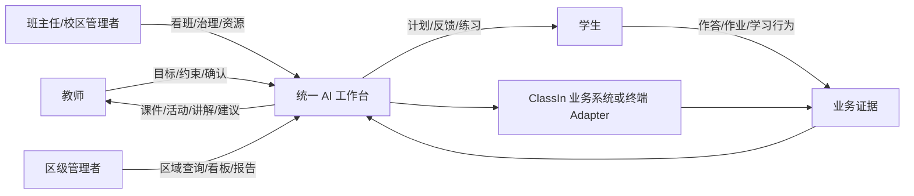
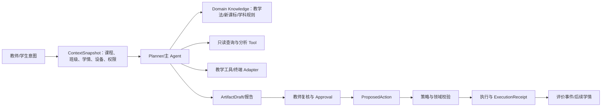

# 希沃 AI 赋能教育全场景方案产品设计链路研究

配套可视化：[希沃 AI 教学全业务链路能力覆盖图](../ai-capability-opportunity/seewo-ai-full-business-chain.html)

# 0. 结论先行

本页对应的研究对象是**希沃 AI 赋能教育全场景方案**。它不是若干孤立的 AI 小工具，而是一套以教育业务周期为骨架、以“应用 + 终端 + 算力”为基础设施的全场景产品方案。页面将场景分为学生学习、教师教学、教育治理、科学研究四个域，并沿课前、课上、课间、课后和校区管理组织产品体验。

最值得迁移到 ClassIn WorkBuddy 的不是“多做几个 Agent”，而是以下闭环：

```text
业务目标/教学意图
→ 上下文与权限准备
→ AI 生成或分析
→ 教师/学生确认与互动
→ 产物沉淀或业务动作
→ 结果证据回流
→ 下一轮个性化建议
```

页面和截图可以充分证明产品对象、入口、交互状态、跨端协作和部分结果形态；不能单独证明后端 Agent 拓扑、模型选择、权限实现、准确率、误报率、数据保留或生产级写回。以下结论按 `FACT / AUTHOR CLAIM / INFERENCE / UNKNOWN` 标记。

# 1. 研究范围与证据边界

## 1.1 材料

- 公开 Notion 页面及其页面正文：见 `source_url`。
- 方案名称证据：页面正文开头称“希沃打造 AI 赋能教育全场景方案”，封面图显示“希沃AI赋能教育全场景解决方案”。本文统一采用“希沃 AI 赋能教育全场景方案”作为研究对象名称；“解决方案”作为封面文案的同义表述。
- 命名边界：`希沃 AI 备课`、`希沃白板`、`AI 助教`、`希沃课堂智能反馈系统`、`希沃魔方区校管理平台`、`希沃·小希`是页面明确出现的产品或能力载体；“教学小工具”“灵感广场”“全学科教学智能体”“AI 老师”“AI 助管”“AI 助评”更适合作为模块/能力名称。
- 页面内可见图片与产品截图：研究时通过浏览器资源包下载约 113 张素材，包含架构图、备课、课堂工具、作业、学情、管理与安全场景。图片资源位于浏览器临时目录，未复制进仓库，避免把外部素材当作项目资产。

## 1.2 证据规则

| 标记 | 含义 | 边界 |
| --- | --- | --- |
| `FACT` | 正文或截图可直接看到的产品陈述、对象、入口或状态 | 只证明页面展示了该能力，不证明后端生产实现 |
| `AUTHOR CLAIM` | 页面作者对覆盖、效果、成熟度或价值的主张 | 需要独立数据、代码或运行记录复核 |
| `INFERENCE` | 基于多个页面证据得到的架构或迁移判断 | 应进入 WorkBuddy Spec、Spike 或评价 |
| `UNKNOWN` | 页面没有披露或截图无法验证的内容 | 不得用推断补写成事实 |

# 2. 产品全景

## 2.1 三层基础结构

`FACT`：希沃 AI 赋能教育全场景方案总图把系统分为应用层、终端层和算力层。终端覆盖教室周边设备、学生终端、交互显示终端、家庭终端、摄像头/安防终端等；应用覆盖学习、教学、治理和研究。

`INFERENCE`：这是一种“场景先于 Agent”的产品组织方式。用户看到的是统一的教学或管理任务，内部才组合模型、工具、设备和数据服务。它与 WorkBuddy 的统一主 Agent 入口一致：教师不应先选择内部 Agent、Skill、MCP 或模型。

## 2.2 四域与五个工作阶段

| 阶段 | 主要参与者 | 页面展示的产品链路 | 关键产物/结果 |
| --- | --- | --- | --- |
| 课前 | 教师、教研组 | 希沃 AI 备课、课件优化、资源生成、灵感复用 | 课件、互动网页、课堂活动、听说交际、对话智能体 |
| 课上 | 教师、学生、AI 教学工具 | 声纹/环境准备、语音调工具、屏幕识别、学科智能体、实时互动 | 课堂演示、作答统计、互动课件、实验过程、即时反馈 |
| 课间 | 教师、班主任、管理者 | 哨兵模式、危险行为识别、掌上看班、事件回顾 | 告警、事件视频、处置提醒 |
| 课后 | 教师、学生 | 希沃课堂智能反馈系统、作业布置/扫描/批改、个性化学习、周报月报 | 批改结果、知识图谱、学习计划、评价建议 |
| 校区/区域 | 校区管理者、区级管理者 | 希沃魔方区校管理平台、希沃·小希、数据驾驶舱、师生档案、对话式查询 | 看板、报告、治理动作 |

`INFERENCE`：全景的真正主线不是时间顺序本身，而是证据循环：课堂和作业产生行为/结果证据，AI 将证据加工成诊断和建议，建议再进入下一次备课、课堂干预或个性化学习。

# 3. 课前：从目标到可复用教学对象

## 3.1 三段式人机协同备课

`FACT`：`希沃 AI 备课`截图展示“创建课件”“优化课件”“生成结果预览”三段式流程。教师输入教材、学段、学科和章节，例如人教版小学数学“小数的认识”，选择新授课、班会课、习题课、阅读课或通用课型；系统生成课件目标、教学活动设计和预览。

`FACT`：优化阶段显示基于班级学情与新课标的优化计划、新课标适配总结、教学活动/工具制作，并有教师确认、发送至云空间、我的作品等动作。课件中可生成“AI 备注”作为讲解提示。

`INFERENCE`：这里已经接近 WorkBuddy 的第一条纵向切片“课程目标 → 课程对象”：自然语言目标被转成结构化教学产物，但“生成完成”与“正式发布/写回”被产品动作分开，教师仍是确认者。

## 3.2 资源生产与复用

`FACT`：页面展示四类“教学小工具”产物：互动网页、对话智能体、课堂活动、听说交际。资源可保存到“我的作品”，并支持跨班教学和组内教研；“灵感广场”提供带作者、使用数和点赞数的可复用资源，详情支持获取、复制链接和保存。

`INFERENCE`：产品把 AI 生成从一次性答案升级为可治理 Artifact。对 WorkBuddy，`ArtifactDraft` 应至少记录来源上下文、生成版本、教师修改、适用课程/班级、真值标签和发布状态；复用不是复制文本，而是复制一个可追踪对象。

# 4. 课上：多端协同的实时教学工作台

## 4.1 教师身份与环境准备

`FACT`：截图出现“哨兵模式启动”“自动按照教师过往使用习惯”，并显示 WPS、Edge、文件传输、希沃管家等应用入口；这些是希沃终端环境协同的体验证据，不等于一个独立的“哨兵产品”。

`UNKNOWN`：声纹识别的准确率、活体/冒用防护、权限授予、设备信任、历史习惯的来源与删除方式均未说明。WorkBuddy 只能把它视为体验证据，不能据此实现隐式自动登录或扩权。

## 4.2 语音、屏幕和学科工具

`FACT`：页面展示语音调用教学设备、AI 识别屏幕内容、“你说，我正在听……”；古诗《咏雪》等全学科教学智能体提供讲解、拓展、检测、暂停；数学画板支持函数图像、交点和参数滑块；物理电路图和理化生仿真实验支持器材、步骤、结论、暂停/重启和播放速度。

`INFERENCE`：这些工具适合拆成“确定性教学工具 + AI 编排”。模型负责识别意图、填充参数和解释结果，画板/实验引擎负责可验证的状态变化。不要让语言模型直接伪造实验状态或计算图像。

## 4.3 实时互动与课堂证据

`FACT`：教师可发起班级作答采集，学生以手势选择 A/B/C/D，大屏实时统计；课堂协力图记录举手、答题、互动等事件；教师平板、大屏和学生平板联动，支持教师在教室任意位置调动大屏能力。

`FACT`：页面还展示课堂参与、专注度、情绪状态、教师/学生等分析维度。

`UNKNOWN / RISK`：专注度和情绪状态的定义、模型误差、告知与申诉、数据保存、谁可以查看及其是否影响评价均未说明。教育场景中，这些推断不能直接作为学生事实或纪律结论。

# 5. 课后：从作业结果到个性化干预

## 5.1 个性化学习

`FACT`：学生端提供学习计划、薄弱点专项、错题重做、微课讲解、每日测评、区域真题和作文批改。AI 老师按题目输出求解目标、已知条件、相关知识性质、解答步骤和解题总结，支持语音交互与图文板书式讲解。

`FACT`：区域真题支持省份、学科、题型和难度筛选，并显示题目数量、薄弱考点、答案解析和专项练习入口。

`INFERENCE`：推荐链路可抽象为“学情证据 → 知识点/题型诊断 → 题目召回 → 个性化讲解 → 新结果回流”。WorkBuddy 初期应优先支持教师可查看、可解释、可撤回的推荐，不应把推荐直接变成学生强制任务。

## 5.2 作业与学情报告

`FACT`：教师通过希沃白板布置作业，纸质作业经批阅机扫描；`希沃课堂智能反馈系统`自动生成报告，展示提交情况、平均正确率、薄弱考点、题目级正确率、学情概览、正确率分布、学生名单、AI 分析、分层学习建议和课堂优化建议。

`FACT`：知识图谱以知识点节点和正确率呈现，例如 100%、92%、83%、75%、63%。

`INFERENCE`：这条链将一次作业从“批改结果”提升为“可用于下一次教学决策的证据对象”。WorkBuddy 应将原始事实、模型诊断、教师判断和建议动作分层存储，并在报告中标注来源与置信边界。

## 5.3 班级/学生评价

`FACT`：学生详情包括 AI 评语、点评数据、点赞/表扬/待改进次数、专注度、情绪状态、综合素质雷达图和学科兴趣分析；班级周报/月报包括建议关注学生、建议鼓励学生、建议鼓励小组、发放奖励及周同比变化。

`FACT`：页面将课后课堂分析归入`希沃课堂智能反馈系统`；学生侧的资源查找和对话式查询由`希沃·小希`承载。页面未证明这两个载体共享同一 Agent 实例或同一数据权限实现。

`UNKNOWN / RISK`：长周期行为建模的样本范围、标签质量、偏差校正、学生/家长知情、教师纠错、跨班级隔离、保留期和自动化决策边界均未披露。该类输出应先作为“教师复核建议”，不能直接写入正式学生档案或惩罚性流程。

# 6. 课间与治理：从识别到处置

`FACT`：哨兵模式通过摄像头识别教室画面、标注危险行为，并向教师反馈；支持手机通知、事件回顾、掌上看班、多端同步，画面显示低危/高危事件数量和视频时间轴筛选。

`INFERENCE`：安全产品的完整链路应是“检测 → 分级 → 通知 → 人工确认 → 处置 → 留痕 → 复盘”。页面主要证明了检测、通知和回顾入口，未证明人工确认、责任移交、误报申诉、事件关闭和审计回执。

`UNKNOWN`：危险行为定义、误报率、告警阈值、视频保存与加密、访问审计、未成年人隐私合规、跨设备同步延迟和断网恢复均需单独核验。

## 6.1 校区与区域管理

`FACT`：页面明确展示`希沃魔方区校管理平台`，包含校园数据驾驶舱、全维度师生档案和区校一体化管理；`希沃·小希`以对话形式帮助教师查找资源和查询区域教、学、研、评、管数据。

`INFERENCE`：这部分把教师侧产物和课堂证据上收为管理者可查询的治理数据，但不应因此绕过原始业务系统的所有权、租户边界和访问审计。

# 7. 角色链与产品对象

## 7.1 角色链



## 7.2 主要产品对象

`FACT`：页面展示的对象包括课件、互动网页、课堂活动、听说交际、对话智能体、作业、批改结果、学情报告、学习计划、区域真题、周报/月报、事件回顾、数据驾驶舱和师生档案；这些对象由希沃 AI 赋能教育全场景方案下的希沃白板、课堂智能反馈、希沃魔方区校管理平台等载体承接。

`INFERENCE`：这些对象应成为 WorkBuddy 的领域产物，而不是某次对话的纯文本。建议采用 `ArtifactDraft`、`ContextSnapshot`、`ProposedAction`、`ExecutionReceipt` 等显式对象承载生命周期。

# 8. Agent/Harness 归纳

页面没有公开内部 Agent、Skill、MCP 或模型选择器，因此以下是对产品体验的架构归纳，不是对其实现的断言。



建议按 Module 划分：

| Module | Interface 方向 | 隐藏复杂性 | WorkBuddy 对应 |
| --- | --- | --- | --- |
| 主 Agent Runtime | `run(request, capabilities)` | 意图解析、计划、循环终止、流式状态 | 统一主 Agent |
| Context | `assemble(scope, mode)` | 课程/班级/学情/设备/权限与缺口 | `ContextSnapshot` |
| Domain Knowledge | `resolve(subject, grade, objective)` | 新课标、学科方法、模板 | 版本化知识包 |
| Evidence Query | `query(validatedRequest)` | 学情、作业、课堂事件的读取与切片 | ClassIn 只读 Adapter |
| Artifact | `draft/validate/publish` | 课件、报告、活动的版本与来源 | `ArtifactDraft` |
| Policy & Approval | `check/approve` | 权限、风险、教师控制 | `Approval` |
| Action Execution | `propose/execute/receipt` | 幂等、领域校验、部分成功、撤销 | `ProposedAction`/`ExecutionReceipt` |
| Evaluation & Trace | `record/evaluate` | 事实准确性、采纳率、回归与成本 | 评价事件 |

`INFERENCE`：页面最充分证明的是“只读证据 → 生成/分析 → 人类使用”的链路；对 WorkBuddy 必须补齐“生成 → 审批 → 写回 → 回执 → 复查”的业务闭环。

# 9. 对 ClassIn WorkBuddy 的迁移建议

## 9.1 可以直接借鉴

1. 以教师工作周期组织能力，而不是以 AI 工具列表组织首页。
2. 统一主 Agent 入口，内部能力通过 Capability Manifest 组合。
3. 先做只读学情查询、证据解释和 Artifact 生成，建立可观测闭环。
4. 将可复用课件/活动建模为有版本、有来源、有适用范围的对象。
5. 把终端和真实 ClassIn 变化放到 Adapter/Seam，模拟与真实实现使用相同 Interface。
6. 让学生事实、教师推断、机构规则和模型建议分层，并在 UI 中区分。

## 9.2 必须改造

1. “发送到云空间”不能等同于正式发布；必须经过 `ProposedAction → Approval → Domain Validation → ExecutionReceipt`。
2. 课堂实时状态、作业报告和长期学生档案必须有明确租户、角色、保留期和审计策略。
3. 专注度、情绪和兴趣等推断先作为可解释、可纠错的建议，不作为无监督事实。
4. 长任务要有显式 Run 状态、取消、恢复、部分成功和失败重试语义。
5. 跨班复用和灵感资源要做来源、权限和版本隔离，防止把一个班的学生事实带入另一个班。

## 9.3 不应照搬

- 不应因为页面展示多种智能体就建立教师可见的多 Agent 选择器。
- 不应把摄像头行为识别、情绪识别或声纹识别直接作为自动化治理事实。
- 不应把产品宣传页的“全场景闭环”当成已经验证的后端可靠性、准确率或合规性。
- 不应让模型直接写 ClassIn 正式事实或绕过教师审批。

# 10. 建议的验证指标

除常规 DAU、消息量和留存外，WorkBuddy 应验证：

- 目标澄清成功率、首次可用 Artifact 率、教师修改量与采纳率；
- 引用/证据覆盖率、事实与推断混淆率、权限拒绝率；
- `ProposedAction → Approval → ExecutionReceipt` 转化率；
- 版本冲突、部分成功、可恢复失败、撤销和人工接管率；
- 课件/报告进入真实课堂后的复查与再利用率；
- 每个完整教学闭环的成本、耗时与教师节省时间；
- 学生数据最小化、访问审计、误报申诉和删除请求完成率。

# 11. 待核验问题

1. 页面展示的 AI 备课、批改、学情分析目前哪些已生产可用，哪些是演示或规划？
2. ClassIn/希沃业务对象的正式所有权、发布状态和写回接口如何划分？
3. 报告、课件和资源是否有版本、审批、撤回、过期和审计？
4. 长任务如何持久化、取消、恢复和通知？
5. 课堂设备调用是否需要显式授权、设备信任和教师确认？
6. 专注度、情绪、兴趣和危险行为的定义、阈值、误报率和申诉机制是什么？
7. 学生、家长、教师和管理者分别可见哪些数据，保留多久？
8. 跨班、跨校区和跨学期复用的权限边界是什么？
9. 资源市场中的作者、使用量、点赞量是否可审计，是否存在复制后的责任归属？
10. 推荐学习计划和分层建议如何进行人工纠错与效果复查？

# 12. 研究结论

这个希沃 AI 赋能教育全场景方案案例对 WorkBuddy 的核心启示是：AI 产品的竞争力来自业务证据、产物生命周期、终端协同和人类控制被串成一条可复查链路，而不是来自页面上 Agent 数量。WorkBuddy 应把“课程目标 → 课程对象”作为第一条可验证纵向切片，逐步扩展到“课堂证据 → 学情诊断 → 教师批准的教学动作”，同时保持 ClassIn 的领域事实所有权、显式状态和执行回执。
