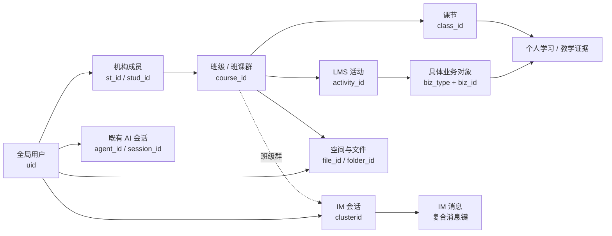
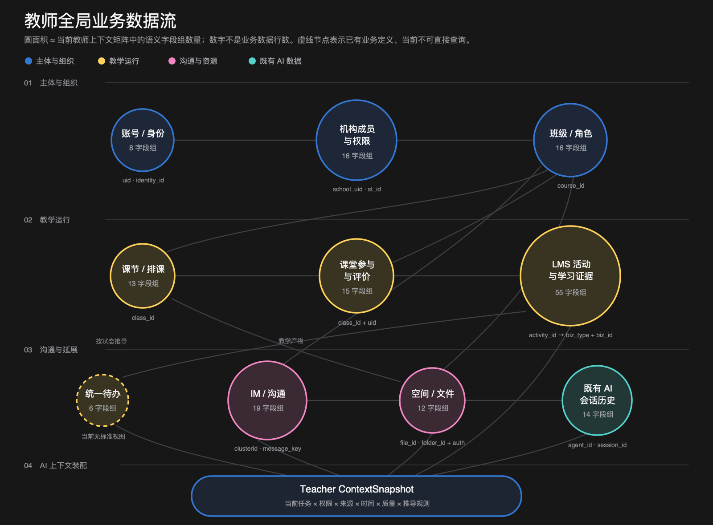
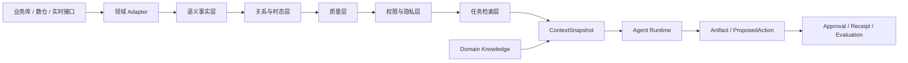
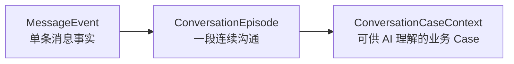

# ClassIn 教师与学生数据、AI Context 基础及 IM Case 研究纪要

## 0. 文档定位

本文记录 2026-09-01 围绕以下三个主题形成的阶段共识：

1. 教师与学生视角下的整体业务数据流图景，以及当前已梳理的完整语义字段范围；
2. 如何把底层数据库事实组织成 AI 可以直接消费的高质量上下文；
3. 以 IM 内容分析为例，底层消息数据还需要补齐什么结构，才能可靠进入 AI Context。

本文是研究与架构输入，不锁定具体 2.0 产品方案，不把“数据存在”解释为“AI 应自动行动”。教师 / 学生字段的底层字段、来源、可用性等级和默认暴露策略仍以两张字段矩阵为唯一详细事实源：

- [教师视角上下文字段矩阵](./TEACHER-CONTEXT-FIELD-MATRIX.md)
- [学生视角上下文字段矩阵](./STUDENT-CONTEXT-FIELD-MATRIX.md)

## 1. 核心结论

ClassIn 已经具备围绕 `uid` 串联账号、机构、班级、课节、LMS、IM、空间和既有 AI 数据的业务骨架，但这些底层事实还不能直接等同于 AI Context。

目标不应是建设一张教师 / 学生“超级宽表”，而应建设一条按任务动态装配的上下文链：

```text
底层业务事实
→ 领域 Adapter
→ 语义标准化
→ 关系与时态对齐
→ 质量与冲突校验
→ 权限与隐私裁剪
→ 按任务检索和摘要
→ ContextSnapshot
→ IM Agent / 学生 Agent / TeacherIn
```

高质量 Context 的基本判断是：

- 字段名称和状态具有稳定业务语义；
- ID、关系和角色能够在明确机构与时间范围内串联；
- 事实、行为证据、受控推导和 AI 判断相互分离；
- 每条事实都有来源、观察时间、权限、质量和局限；
- 上下文只包含当前任务所需的最小集合；
- AI 可以读取事实和提出动作，但不能把模型输出直接写成 ClassIn 正式事实。

---

# 第一部分：教师与学生整体业务数据流图景

## 2. 全局业务主链

教师与学生共用同一套主要业务对象，但主体角色、授权范围和可见证据不同：



### 2.1 核心 ID 的统一语义

| ID / 组合键 | 统一业务语义 | 使用边界 |
|---|---|---|
| `uid` | ClassIn 全局用户 | 教师、学生跨域关联的主体入口 |
| `school_uid` | 机构 / 租户 | 权限和成员关系的组织范围 |
| `st_id` | 教师在某机构内的成员 ID | 不能替代全局教师 `uid` |
| `stud_id` | 学生在某机构内的成员 ID | 不能跨机构复用 |
| `course_id` | 班级 / 班课群 | 语义层建议命名为 `course_group_id` |
| `class_id` | 一次课节 / 课堂场次 | 语义层建议命名为 `lesson_id` |
| `activity_id` | LMS 活动统一入口 | 需经 `biz_type + biz_id` 路由具体对象 |
| `clusterid` | IM 会话 / 群 | 班级群可关联班级；联系人会话不能强行关联 |
| `clusterid + msgbucketid + msgid` | IM 消息复合键 | 不以单独 `msgid` 作为全局唯一键 |
| `file_id / folder_id` | 文件 / 文件夹 | 必须叠加资源范围和授权关系 |
| `agent_id / session_id` | 既有 AI Agent 与会话 | 只按任务使用，不自动形成长期画像 |

## 3. 教师全局业务数据流



教师上下文从教师账号和机构身份出发，经班级角色进入排课、课堂、LMS、IM 和空间。不同域的事实按当前任务和授权范围组装为 `Teacher ContextSnapshot`。

### 3.1 教师完整语义字段范围

下表汇总当前教师字段矩阵中的全部建议语义字段。底层字段、来源、可用性等级和敏感性说明见[教师视角上下文字段矩阵](./TEACHER-CONTEXT-FIELD-MATRIX.md)。

| 领域 | 完整语义字段范围 |
|---|---|
| 身份 | `teacher.uid`、`account_status`、`registered_at`、`locale`、`school_stage_id`、`grade_id`、`identity_id`、`subject_id` |
| 机构 | `teacher_membership_id`、`school_uid`、`display_name`、`employee_no`、`position`、`membership_state`、`joined_at`、`can_create_course`、`public_resource_status`、`join_type`、`school_name`、`school_type`、`region`、`service_version`、`service_status`、`service_expires_at` |
| 班级 | `course_group_id`、`name`、`status`、`category`、`start_at`、`end_at`、`student_count`、`lesson_count`、`head_teacher_membership_id`、`allow_join`、`allow_add_friend`、`allow_temp_classroom`、`teacher_can_add_lesson`、`course_roles[]`、`relationship_valid_at`、`authorized_students[]` |
| 课节与课堂 | `lesson_id`、`course_group_id`、`name`、`status`、`type`、`subject_id`、`starts_at`、`ends_at`、`main_teacher_membership_id`、`assistant_teacher_membership_id`、`live_enabled`、`record_enabled`、`teaching_mode`、`lesson_identity`、`online_seconds`、`late`、`early_leave`、`platform`、`presence_segments`、`lesson_students[]`、`membership_state`、`classroom_actions[]`、`attendance_summary`、`interaction_summary`、`recording_summary` |
| 教学评价 | `teacher_comment`、`star_level`、`commented_at` |
| LMS 活动 | `activity_id`、`type`、`title`、`status`、`publish_state`、`process_state`、`starts_at`、`ends_at`、`max_score`、`passing_score`、`student_total`、`creator_uid`、`teacher_uid`、`created_at`、`updated_at`、`deleted` |
| 作业 | `homework_id`、`title`、`description_ref`、`starts_at`、`ends_at`、`late_allowed`、`score_rule`、`submission_summary`、`submission_state`、`score`、`submitted_at`、`reviewed_at`、`needs_revision`、`revision_count`、`correct_count`、`wrong_count` |
| 资料与录播 | `material_id`、`title`、`description_ref`、`starts_at`、`ends_at`、`student_total`、`checked_total`、`checked_at`、`check_total`、`record_id`、`duration`、`valid_play_seconds`、`max_position`、`play_segments` |
| LMS / AI 结果 | `ai_review_status`、`ai_review_count`、`ai_grade`、`ai_rate`、`teacher_review_status`、`reviewed_at` |
| 待办 | `todo_id`、`type`、`title`、`due_at`、`state`、`related_object_ref`；当前为待补能力，不能假设已存在统一可查询事实 |
| IM | `conversation_id`、`conversation_type`、`member_status`、`im_admin_role`、`teaching_role`、`can_speak`、`read_cursor`、`at_message_id`、`pinned`、`last_message`、`message_key`、`sender_uid`、`target_uids`、`message_type`、`reply_to`、`sent_at`、`message_content_ref`、`attachment_refs[]` |
| 空间与文件 | `resource_id`、`course_group_id`、`owner_uid`、`folder_id`、`name`、`size`、`extension`、`created_at`、`space_type`、`resource_ref`、`share_scope`、`permission` |
| 既有 AI 历史 | `agent_id`、`scene`、`scene_id`、`session_id`、`role`、`title`、`message_count`、`feedback_summary`、`created_at`、`message_id`、`question_ref`、`answer_ref`、`useful_feedback` |
| 上下文治理 | `source_entity`、`source_key`、`observed_at`、`freshness`、`derived`、`quality`、`authorization_scope`、`truth_label` |

## 4. 学生全局业务数据流


学生上下文从学生账号与机构成员身份出发，经班级关系进入课节参与、教师评价、LMS 学习任务、IM、空间和既有 AI 学习会话，最终组装为只包含本人及本人授权范围的 `Student ContextSnapshot`。

### 4.1 学生完整语义字段范围

下表汇总当前学生字段矩阵中的全部建议语义字段。底层字段、来源、可用性等级和敏感性说明见[学生视角上下文字段矩阵](./STUDENT-CONTEXT-FIELD-MATRIX.md)。

| 领域 | 完整语义字段范围 |
|---|---|
| 身份 | `student.uid`、`account_status`、`registered_at`、`locale`、`school_stage_id`、`grade_id`、`identity_id`、`subject_id` |
| 机构 | `student_membership_id`、`school_uid`、`student_number`、`display_name`、`membership_state`、`joined_at`、`expires_at`、`public_resource_status`、`cloud_folder_refs`、`join_type`、`reported_course_count`、`reported_attendance`、`reported_lesson_totals`、`school_name`、`school_type`、`region`、`service_version`、`service_status` |
| 班级 | `course_group_id`、`name`、`status`、`category`、`start_at`、`end_at`、`lesson_count`、`head_teacher_ref`、`allow_add_friend`、`allow_temp_classroom`、`student_can_modify_nickname`、`course_membership_state`、`course_role`、`relationship_valid_at`、`authorized_teachers[]`、`teacher_roles[]` |
| 课节与课堂 | `lesson_id`、`course_group_id`、`name`、`status`、`type`、`subject_id`、`starts_at`、`ends_at`、`main_teacher_ref`、`assistant_teacher_ref`、`live_enabled`、`record_enabled`、`teaching_mode`、`lesson_membership_state`、`lesson_identity`、`online_seconds`、`late`、`early_leave`、`online`、`platform`、`presence_segments`、`classroom_actions[]` |
| 教师评价 | `teacher_ref`、`star_level`、`comment_ref`、`commented_at` |
| LMS 活动 | `activity_id`、`state`、`is_done`、`is_scored`、`grade_method`、`rate`、`created_at`、`updated_at`、`type`、`title`、`publish_state`、`process_state`、`starts_at`、`ends_at`、`max_score`、`passing_score` |
| 本人作业 | `homework_id`、`submission_state`、`score`、`submitted_at`、`reviewed_at`、`needs_revision`、`revision_count`、`correct_count`、`wrong_count`、`submission_content_ref`、`attachment_refs`、`teacher_edit_ref`、`teacher_comment_ref` |
| 资料与录播 | `material_id`、`checked_at`、`check_total`、`score_percent`、`record_id`、`file_id`、`total_play_seconds`、`valid_play_seconds`、`max_position`、`play_segments`、`updated_at` |
| LMS / AI 学习结果 | `ai_review_status`、`ai_review_count`、`ai_grade`、`ai_rate`、`reviewed_at`、`failure_state`、`excellent`、`teacher_comment_ref`、`teacher_review_status`、`submitted_at`、`revision_state` |
| 待办 | `todo_id`、`type`、`title`、`due_at`、`state`、`related_object_ref`；当前主要由活动和课节状态推导，不能冒充统一待办事实 |
| IM | `conversation_id`、`conversation_type`、`member_status`、`im_admin_role`、`teaching_role`、`can_speak`、`read_cursor`、`at_message_id`、`pinned`、`last_message`、`message_key`、`sender_uid`、`target_uids`、`message_type`、`reply_to`、`sent_at`、`message_content_ref`、`attachment_refs[]` |
| 空间与文件 | `resource_id`、`course_group_id`、`owner_ref`、`folder_id`、`name`、`size`、`extension`、`created_at`、`space_type`、`resource_ref`、`share_scope`、`permission` |
| 既有 AI 历史 | `agent_id`、`scene`、`scene_id`、`session_id`、`role`、`title`、`message_count`、`feedback_summary`、`created_at`、`message_id`、`question_ref`、`answer_ref`、`useful_feedback` |
| 上下文治理 | `source_entity`、`source_key`、`observed_at`、`freshness`、`derived`、`quality`、`authorization_scope`、`truth_label` |

### 4.2 教师与学生视角的根本差异

| 维度 | 教师 | 学生 |
|---|---|---|
| 主体范围 | 教师本人及其获授权的班级、学生和教学对象 | 学生本人及本人被分配、可见的学习对象 |
| 学生证据 | 可在明确教学任务中按需读取授权学生证据 | 默认只能读取本人证据 |
| 写操作责任 | 教师确认后可产生发布、发送、创建任务等 `ProposedAction` | 不替学生提交作业、代答或绕过教师要求 |
| 长期记忆 | 教师确认的工作偏好可受控保留 | 未确认的学习诊断和人格判断不得固化 |
| 敏感内容 | 学生明细、评语、消息正文按任务授权 | 本人数据仍需目的限制；不得暴露同学明细 |

---

# 第二部分：从底层数据库到 AI 可消费 Context

## 5. 四种上下文形态

| 对象 | 作用 | 生命周期 |
|---|---|---|
| `LaunchContext` | 用户从哪个端、页面、班级、作业或会话进入 AI | 进入入口时生成，只用于确定任务优先范围 |
| `ContextSnapshot` | 本次 Agent Run 实际使用的已授权事实 | Run 开始时冻结，可追溯和复现 |
| `ToolReadResult` | Run 中按需补查的业务事实 | 单次读取，附来源、时间、权限和标准错误 |
| `WorkingMemory` | 本轮目标、草稿、用户修改和中间产物 | 只属于当前任务，不自动升级为业务事实 |

`LaunchContext` 不是最终 Prompt，`WorkingMemory` 也不是长期画像。真正进入模型的输入应由 `ContextSnapshot + 必要 ToolReadResult + Domain Knowledge` 组成。

## 6. 数据加工和治理链



### 6.1 需要补齐的 gap

| 层 | 当前常见问题 | 需要建设的产物 | 验收重点 |
|---|---|---|---|
| 语义字典 | `course_id`、`class_id`、`identity`、`state` 等容易错解 | canonical 业务词典、枚举和单位契约 | 同一字段在不同域不再被混用 |
| 身份与关系 | `uid`、机构成员 ID、班级角色和课节角色分散 | `ActorRef`、`InstitutionMembership`、`CourseMembership`、`LessonMembership` | 能解释“谁在何时以什么角色访问哪个对象” |
| LMS 类型化 | 不同 `biz_type` 的状态和结果分散 | 每类活动 Adapter 与统一 `ActivityContext` | 通用状态不丢失类型化证据 |
| 时间与时态 | 日增量、当前快照和历史事件混合 | `effective_at`、`observed_at`、版本和时态 Join 规则 | 不以当前身份反推历史身份 |
| 数据质量 | 空值、异常、缩放、汇总失真、多源冲突 | 质量规则、来源优先级、`usable / degraded / rejected` Gate | 数据不足时明确降级或拒绝 |
| 权限与隐私 | 可查询不等于可交给 AI | 行级、对象级、字段级、正文级 Policy | 未授权数据不会进入 Context |
| 内容与资源 | 消息、附件和文件正文体量大且敏感 | 引用优先、正文按需读取、内容扫描 | 默认不全量加载正文和文件 |
| 任务裁剪 | 容易把所有用户数据拼进 Prompt | `ContextRequest` 与任务型 Context Pack | 只取当前任务的最小必要集合 |
| 可追溯性 | 模型无法解释事实来源和时间 | `FactEnvelope`、`provenance`、`limitations` | 任一重要结论可回溯事实 |
| 实时性 | 标准数仓通常为 T+1 | 实时业务 Adapter，与离线数仓共用语义契约 | 实时场景不使用离线快照冒充 |
| 评价与反馈 | 无法判断 Context 是否真正帮助 Agent | Context 使用日志、错误分类、采纳和结果评价 | 能定位错误来自数据、语义、模型或产品策略 |

## 7. AI 可消费事实的最小契约

数据库的一行记录需要转成带治理信息的 `FactEnvelope`：

```json
{
  "fact_id": "fact-...",
  "name": "lesson_attendance",
  "subject_ref": { "type": "student", "id": "..." },
  "object_ref": { "type": "lesson", "id": "..." },
  "value": {
    "status": "late",
    "online_seconds": 119
  },
  "source": {
    "entity": "lesson_member_time",
    "source_key": "...",
    "observed_at": "2026-08-30T23:58:56+08:00"
  },
  "semantics": {
    "derived": false,
    "quality": "usable",
    "freshness": "t_plus_1",
    "authorization_scope": "current_course"
  },
  "limitations": [
    "在线时长不等于学习效果"
  ]
}
```

任何可影响 Agent 判断或动作的事实至少应包含：

- 稳定语义字段名和类型；
- 主体、对象和作用范围；
- 来源和可追溯键；
- 观察时间和有效时间；
- 是否推导、推导规则和置信度；
- 数据质量和新鲜度；
- 授权范围与真值标签；
- 必要的解释限制。

## 8. 推荐的 ContextSnapshot 结构

```text
ContextSnapshot
├─ request
│  ├─ entry
│  ├─ intent
│  ├─ observed_at
│  └─ time_window
├─ actor
│  ├─ actor_ref
│  ├─ role
│  └─ institution_membership
├─ scope
│  ├─ institution_ref
│  ├─ course_group_ref
│  ├─ lesson_ref
│  ├─ activity_ref
│  └─ conversation_ref
├─ business_facts[]
├─ learning_evidence[]
├─ conversation_excerpts[]
├─ authorized_resource_refs[]
├─ domain_knowledge_refs[]
├─ permissions
├─ provenance[]
├─ quality_summary
└─ limitations[]
```

下列三类内容必须分开：

| 类型 | 所有者 | 例子 |
|---|---|---|
| `BusinessFact` | ClassIn 业务域 | 作业已发布、截止时间、学生已提交 |
| `Evidence` | 可观察行为事实 | 在线观看 20 分钟、发送了一张图片 |
| `Hypothesis` | AI 或教师判断 | 可能未理解、可能需要干预 |

AI 生成的 `Hypothesis` 不能自动覆盖 `BusinessFact`。

## 9. Context Module 的建议 Interface

底层可以有身份、班级、课节、LMS、IM、空间、AI 历史和实时数据等多个 Adapter，但 TeacherIn、学生 Agent 和 IM Agent 不应分别理解所有表与 Join 规则。

建议把复杂度收敛在一个深层 Module 后：

```ts
interface ContextModule {
  getSnapshot(request: ContextRequest): Promise<ContextSnapshot>
}
```

调用方只表达：

```text
actor + entry + intent + selected objects + time window
```

Context Module 的 Implementation 隐藏：

- 表和实时接口选择；
- ID 关联和时态 Join；
- 类型化 Adapter；
- 权限校验和字段裁剪；
- 正文和附件按需读取；
- 质量降级、冲突和标准错误；
- Context 冻结、版本和追溯。

## 10. 默认、按需和禁止进入 AI 的数据

### 10.1 默认最小集合

- 当前用户与端别；
- 当前机构和有效角色；
- 当前班级、课节、活动或会话引用；
- 当前任务需要的状态、时间和必要结果；
- 来源、观察时间、质量和授权范围；
- 非正文型资源和消息引用。

### 10.2 明确任务下按需读取

- IM 消息正文；
- 作业正文、教师评语和学生提交；
- 图片、语音、文件及其解析内容；
- 单个学生成绩、错题和语言学习明细；
- AI 历史问答正文；
- 联系方式等个人资料。

### 10.3 默认禁止

- 密码、密钥、Token 和 Secret；
- 与教育任务无关的个人敏感信息；
- 未授权学生、其他班级和其他机构数据；
- 已删除、已退出或过期关系中不应继续暴露的内容；
- 没有来源、时间和证据的长期画像结论。

---

# 第三部分：IM 内容分析 Case 与目标 Context 结构

## 11. 当前 IM 数据骨架

当前 IM 数据能够提供以下基础事实：

| 数据对象 | 当前主要字段 | 可以回答 | 仍不能稳定回答 |
|---|---|---|---|
| 消息记录 | `clusterid`、`msgbucketid`、`msgid`、`msgcmd`、`msgdata`、`replymsgid`、`sourceuid`、`targetuids`、时间与日期分区 | 谁在某个会话发送了某种消息 | 一段完整对话的边界、消息内容统一语义、最终结果 |
| 群成员 | `clusterid + uid`、成员状态、群身份、教学身份、昵称、禁言、退出位置 | 当前谁在群中以及当前角色 | 消息发生时的历史角色和成员状态 |
| 用户—会话关系 | 用户与会话关系、联系人、已读、@、最近消息、置顶等结构 | 用户个人视角下的会话状态候选 | 当前字段契约与数据可用性仍需统一验收 |

目前最重要的结构性问题是：

- 消息表是日增量，成员和关系通常是当前全量快照；
- 知识定义和实际元数据存在字段漂移，需要重新锁定 canonical 契约；
- `msgdata` 需要结合 `msgcmd` 解析，不能把原始字符串直接当统一文本；
- 时间标记字段不能在未核验语义时直接转换为业务时间；
- 数据有“单条消息”，没有天然的“对话 Episode”和“业务 Case”；
- 按发送者抽取会造成单向数据，无法可靠判断回应；
- 群聊没有直接表达“师生班级群、教学管理群、教师内部群”等业务场景；
- 图片、语音和文件只有占位或原始引用时，AI 仍不知道具体内容；
- 聊天内容是用户产生的不可信业务数据，不能被当作 Agent 系统指令。

## 12. IM Context 的三级对象



### 12.1 MessageEvent

| 字段 | 语义 |
|---|---|
| `message_key` | `conversation_id + message_bucket_id + message_id` 形成稳定复合键 |
| `conversation_ref` | 当前会话引用 |
| `sender_ref` | 发送者主体引用 |
| `recipient_refs[]` | 明确接收者集合 |
| `sent_at` | 经核验的业务发送时间 |
| `ingested_at` | 数据进入当前系统的时间 |
| `logical_order` | 会话内部可复现排序 |
| `raw_message_type` | 原始消息指令 / 类型 |
| `semantic_message_type` | 文本、图片、文件、语音、回复、@、系统事件、业务卡片等统一类型 |
| `text` / `content_ref` | 轻量正文或受控内容引用 |
| `attachment_refs[]` | 图片、语音、文件等附件引用 |
| `reply_to_message_key` | 被回复消息复合键 |
| `mention_refs[]` | 被 @ 的参与者 |
| `is_system_event` | 是否系统事件 |
| `displayable` | 当前用户是否可呈现 |
| `parse_status` | `parsed / partial / failed` |
| `parser_version` | 消息解析契约版本 |
| `source` | 原始来源与追溯键 |

### 12.2 ParticipantSnapshot

| 字段 | 语义 |
|---|---|
| `participant_ref` | 稳定参与者引用 |
| `display_name_at_event` | 消息发生时用于展示的名称 |
| `actor_type` | 教师、学生、助教、管理人员、未知等 |
| `teaching_role_at_event` | 消息发生时的教学角色 |
| `im_admin_role_at_event` | 消息发生时的 IM 管理身份 |
| `membership_state_at_event` | 正常、锁定、退出、删除等 |
| `can_speak_at_event` | 当时是否允许发言 |
| `relationship_to_current_user` | 与当前用户的教学 / 联系人关系 |
| `resolution_quality` | 身份和关系还原质量 |

### 12.3 Conversation

| 字段 | 语义 |
|---|---|
| `conversation_ref` | 会话稳定引用 |
| `conversation_type` | 私聊、普通群、联系人会话、课程群等技术类型 |
| `business_scene` | `teacher_student_private`、`course_group`、`teaching_management_group`、`institution_staff_group`、`student_student_private`、`unknown` 等 |
| `institution_ref` | 已确认关联机构 |
| `course_group_ref` | 已确认关联班级 / 班课群 |
| `current_user_membership` | 当前用户在会话中的状态和权限 |
| `participant_count` | 当前会话参与者数量 |
| `scene_resolution_method` | 明确字段、业务关联或受控推导 |
| `scene_resolution_confidence` | 场景识别置信度 |

### 12.4 ConversationEpisode

| 字段 | 语义 |
|---|---|
| `episode_id` | 对话片段唯一 ID |
| `started_at / ended_at` | 片段时间边界 |
| `message_refs[]` | 按稳定顺序排列的消息集合 |
| `participant_refs[]` | 片段中的参与者 |
| `active_sender_count` | 实际发言人数 |
| `core_message_refs[]` | 当前分析焦点 |
| `context_before_refs[]` | 必要的前置消息 |
| `context_after_refs[]` | 回应和结果所需的后续消息 |
| `topic_continuity` | 主题是否保持连续 |
| `conversation_completeness` | `complete / partial / unknown` |
| `is_single_sender_episode` | 是否只有一个发送者 |
| `possible_missing_counterparty_data` | 是否可能漏掉另一侧消息 |
| `segmentation_method` | 时间、回复关系、业务对象和语义连续性的组合规则 |

### 12.5 BusinessAnchor

| 字段 | 语义 |
|---|---|
| `object_type` | 机构、班级、课节、活动、作业、考试、资料、录播、文件或学生 |
| `object_ref` | 稳定业务对象引用 |
| `resolution_method` | 消息卡片、当前入口、明确 ID 或受控语义推导 |
| `evidence_message_refs[]` | 支持该关联的消息证据 |
| `candidate_objects[]` | 存在歧义时的候选对象 |
| `confidence` | 关联置信度 |

### 12.6 InteractionSemantics

| 字段 | 语义 |
|---|---|
| `initiating_intent` | 提问、通知、行动请求、提交、反馈、确认等 |
| `speech_acts[]` | 每条消息在互动中的作用 |
| `response_status` | `responded / pending / no_response_observed / unknown_incomplete_data` |
| `response_message_refs[]` | 回应证据 |
| `action_request` | 对方需要执行的动作 |
| `commitment` | 已形成的行动承诺 |
| `outcome_status` | 未开始、处理中、已提交未核验、完成、失败、未知等 |
| `outcome_evidence_refs[]` | 结果证据 |
| `unresolved_questions[]` | 仍未解决的问题 |

### 12.7 ContextGovernance 与质量

| 字段 | 语义 |
|---|---|
| `authorization_scope` | 当前允许读取和使用的范围 |
| `content_trust` | IM 内容固定标记为 `untrusted_user_content` |
| `sensitive_content_flags[]` | 隐私和敏感内容标记 |
| `redaction_state` | 脱敏状态 |
| `message_parse_coverage` | 消息解析覆盖度 |
| `participant_resolution_coverage` | 参与者身份还原覆盖度 |
| `role_resolution_quality` | 事件时角色质量 |
| `business_anchor_quality` | 业务对象关联质量 |
| `attachment_availability` | 附件是否可访问、可解析 |
| `freshness` | 数据新鲜度 |
| `permission_verified` | 是否完成权限校验 |
| `known_limitations[]` | 已知缺口和不确定性 |

## 13. 回应判断必须位于 Episode / Case 层

以三条消息为例：

```text
学生：老师，作业什么时候交？
老师：今晚 8 点前，请交第 3 页图片。
学生：[图片] 这是第 3 页。
```

逐条消息事实是：

1. 第一条是问题；
2. 第二条是回答，并包含时间要求和行动请求；
3. 第三条是提交行为，并附带图片。

整段 Episode 的互动事实是：

```text
问题：询问作业截止时间
回应：已回应
时间要求：今晚 20:00 前
行动请求：提交第 3 页图片
学生行动：已发送图片
结果：仅能确认出现提交行为
质量验证：附件内容尚未核验
```

不能把“发送了图片”直接写成“作业正确完成”。

### 13.1 单向发送者的正确处理

单向发送者 Case 不应直接删除，也不能直接解释为“没人回应”。应区分：

- 真实连续发送、对方未回应；
- 群公告式单向发布；
- 系统消息或机器人消息；
- 抽取逻辑只保留了某个发送者；
- 时间窗切得过窄，回应位于窗外；
- 对方回复数据缺失。

因此必须记录：

```text
active_sender_count
is_single_sender_episode
conversation_completeness
possible_missing_counterparty_data
response_status
```

只有完整观察窗口内确实没有回应，才可以使用 `no_response_observed`；数据不完整时必须使用 `unknown_incomplete_data`。

## 14. IM Context 示例

```json
{
  "context_type": "im_conversation_case",
  "conversation": {
    "conversation_ref": "conv-...",
    "type": "teacher_student_private",
    "business_scene": "course_communication"
  },
  "participants": [
    {
      "actor_ref": "teacher-...",
      "role_at_event": "teacher"
    },
    {
      "actor_ref": "student-...",
      "role_at_event": "student"
    }
  ],
  "episode": {
    "episode_id": "episode-...",
    "started_at": "...",
    "ended_at": "...",
    "message_refs": ["msg-1", "msg-2", "msg-3"],
    "completeness": "complete"
  },
  "business_anchors": [
    {
      "type": "homework",
      "object_ref": "homework-...",
      "resolution_method": "explicit_message_card"
    }
  ],
  "interaction": {
    "initiating_intent": "ask_deadline",
    "response_status": "responded",
    "action_request": "submit_page_3_image",
    "outcome_status": "submitted_unverified"
  },
  "quality": {
    "role_resolution": "verified",
    "content_parse": "complete",
    "permission_verified": true
  },
  "governance": {
    "content_trust": "untrusted_user_content",
    "authorization_scope": "current_conversation_and_homework"
  },
  "limitations": [
    "附件内容尚未完成质量核验"
  ]
}
```

## 15. IM 数据建设顺序

### P0：先形成可信的研究数据集

1. 锁定消息复合键、消息时间和排序语义；
2. 建立文本、图片、语音、文件、回复、@、系统消息和业务卡片解析器；
3. 保证以会话为单位获取完整多发送者消息；
4. 建立 `ParticipantSnapshot` 和事件时角色；
5. 构建 `ConversationEpisode`，记录切分规则和完整度；
6. 将回应、行动和结果从单条消息字段提升到 Case 字段；
7. 建立包含边界 Case 的双人标注、裁决和评测集。

### P1：连接 ClassIn 教学业务语境

1. 区分师生私聊、班级群、教学管理群、教师内部群等场景；
2. 关联机构、班级、课节、作业、资料和文件；
3. 建立 `BusinessAnchor` 及推导证据；
4. 加入对象状态、截止时间、提交、订正和结果证据；
5. 建立会话、成员、正文、附件和业务对象的权限裁剪。

### P2：形成线上 Agent Context

1. 离线数仓用于研究、评测和趋势分析；
2. 在线 IM Interface 提供实时消息、当前成员、权限和最新状态；
3. 离线与在线链路共用 `MessageEvent / ConversationEpisode / ConversationCaseContext` 契约；
4. Agent 只通过 `getConversationContext()` 获取最小必要上下文；
5. 每次 Run 冻结 `ContextSnapshot`，保存来源、版本、质量和权限；
6. 将 AI 产物先保存为草稿或 `ProposedAction`，经用户审批后再执行发送或业务写回。

## 16. 近期建议产物

| 产物 | 目的 |
|---|---|
| `IM-SEMANTIC-DICTIONARY-V1` | 锁定消息、会话、参与者、角色、回应、结果和业务对象语义 |
| `MESSAGE-EVENT-CONTRACT-V1` | 统一原始消息到语义消息事件的解析输出 |
| `CONVERSATION-EPISODE-CONTRACT-V1` | 定义 Case 边界、前后文、完整度和单向样本处理 |
| `IM-BUSINESS-ANCHOR-CONTRACT-V1` | 定义 IM 与班级、课节、活动、作业、文件的连接方式 |
| `IM-CONTEXT-QUALITY-GATE-V1` | 定义可用、降级和拒绝进入 AI 的条件 |
| `IM-CONTEXT-PILOT-DATASET-V1` | 用完整、可追溯、包含边界 Case 的样本验证 Context 结构 |
| `GET-CONVERSATION-CONTEXT-INTERFACE` | 为 IM Agent 与 TeacherIn 提供小而稳定的 Context Interface |

## 17. 最终共识

围绕教师、学生和 IM 的 AI 能力，下一阶段不应先把更多数据库字段拼入 Prompt，也不应先扩大主题分类规模。更重要的是先把以下基础事实建正确：

1. **主体与关系正确**：谁在什么机构、班级、课节和会话中，以什么角色出现；
2. **业务语义正确**：底层字段、枚举、时间、单位和业务对象得到统一解释；
3. **上下文边界正确**：一段完整对话而不是脱离上下文的单句；
4. **证据与判断分开**：行为证据不能直接升级为学习结论；
5. **权限和质量可见**：Agent 知道能看什么、缺什么、哪些只能推导；
6. **任务最小化装配**：为当前任务生成小型可追溯 `ContextSnapshot`；
7. **副作用受控**：AI 先生成草稿和建议，正式发送和业务写回需要审批与回执。

这些基础成立后，IM 内的摘要、问答、作业提醒、沟通草稿、TeacherIn 教学辅助和学生 Agent 才会建立在可信的 ClassIn 业务现场之上。
