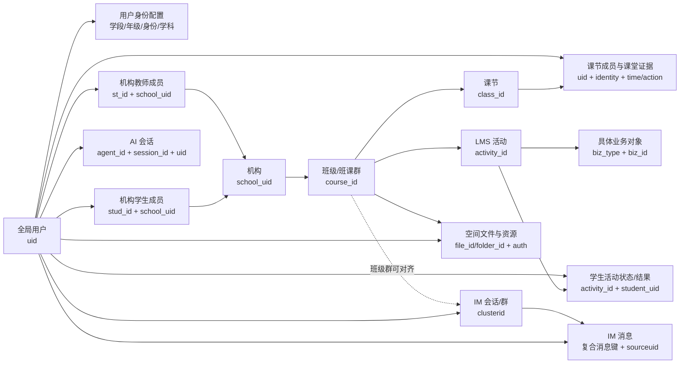

# ClassIn 教师 / 学生全局上下文数据地图

> 状态：`RESEARCH BASELINE`  
> 核验日期：2026-08-31  
> 事实范围：当前数仓查询知识、当前账号可见元数据、只读查询结果与脱敏样例  
> 用途：回答“底层有哪些教师 / 学生业务数据、如何串成全局链路、哪些数据可以安全进入 AI 上下文”  
> 非用途：本文不定义产品方案，不把数据存在等同于 AI 应自动行动，也不把推导结果升级为 ClassIn 生产业务规则。

## 1. 结论先行

ClassIn 当前已经具备一条可以围绕 `uid` 组装的跨域业务链：

1. 用户账号与身份配置；
2. 用户在机构中的教师或学生成员身份；
3. 班级 / 班课群（数仓字段 `course_id`）；
4. 课节（数仓字段 `class_id`）及出勤、停留、课堂行为；
5. LMS 活动及作业、资料、录播、口语等具体学习对象；
6. IM 群关系、消息信封和按需获取的消息正文；
7. 课程、个人和机构空间中的文件与权限；
8. 用户已有的 AI Agent 会话和反馈记录。

但它还不是一张可以直接交给 AI 的“超级宽表”。正确形态应是：以当前任务、当前用户、当前入口和当前时间窗为条件，通过多层数据接口动态组装 `ContextSnapshot`。每条事实都保留来源、观察时间、权限、数据质量和推导方式。

本研究最重要的边界是：

- **字段存在**不等于**当前有数据**；
- **当前有数据**不等于**语义已经稳定**；
- **语义稳定**不等于**适合默认暴露给 AI**；
- **AI 看得到**不等于**AI 可以直接执行写操作**。

两张详细字段表：

- [教师视角上下文字段矩阵](./TEACHER-CONTEXT-FIELD-MATRIX.md)
- [学生视角上下文字段矩阵](./STUDENT-CONTEXT-FIELD-MATRIX.md)

两张全局业务数据流图：

- 教师全局业务数据流图：[SVG](./diagrams/teacher-global-business-data-flow.svg) · [PNG](./diagrams/teacher-global-business-data-flow.png) · [交互式 HTML](./diagrams/teacher-global-business-data-flow-interactive.html)
- 学生全局业务数据流图：[SVG](./diagrams/student-global-business-data-flow.svg) · [PNG](./diagrams/student-global-business-data-flow.png)

上下文基础与 IM Case 研究纪要：

- [教师与学生数据、AI Context 基础及 IM Case 研究纪要](./AI-CONTEXT-DATA-FOUNDATION-AND-IM-CASE-MINUTES.md)

## 2. 可用性分级

| 等级 | 含义 | 使用规则 |
|---|---|---|
| A：直接可取 | 当前权限下存在标准视图，元数据和样例均已验证 | 可作为上下文事实候选，仍需权限、时间与质量校验 |
| B：关联可得 | 需要通过已验证的主键关联或受控推导获得 | 必须记录 `derived=true`、推导规则和参与来源 |
| C：有定义、当前不可取 | 知识文档中有定义，但当前查询角色没有标准视图 | 不能写成“当前已具备”，需要补视图或 Adapter |
| D：结构存在、数据不可用 | 能看到字段结构，但当前无有效行或质量不足 | 只能用于缺口记录，不能进入默认上下文 |
| E：敏感或受限 | 字段可能存在，但不应默认进入 AI 上下文 | 仅在明确目的、授权和审计条件下按需取用 |

## 3. 核心业务 ID 与准确语义

| ID / 组合键 | 业务语义 | 关键说明 |
|---|---|---|
| `uid` | ClassIn 全局用户 | 教师、学生都从它进入跨域关联 |
| `school_uid` | 机构 / 租户 | 权限、教师 / 学生机构成员关系的边界 |
| `st_id` | 教师在某机构内的成员 ID | 不是全局用户 ID；同一用户在不同机构可有不同成员关系 |
| `stud_id` | 学生在某机构内的成员 ID | 不是全局用户 ID；不能跨机构直接复用 |
| `course_id` | ClassIn 班级 / 班课群 | 当前数仓命名为 course，但不能简单理解成学科意义的“课程” |
| `class_id` | 一次课节 / 课堂场次 | 不是班级；与 `course_id` 共同定位教学场景 |
| `activity_id` | LMS 活动统一入口 | 通过 `biz_type + biz_id` 路由到作业、考试、资料、录播等具体对象 |
| `clusterid` | IM 会话 / 群标识 | 班级群场景下可与 `course_id` 对齐；好友 / 联系人会话属于另一 ID 空间，不能强行连班级 |
| `clusterid + msgbucketid + msgid` | IM 消息复合键 | 不应只用 `msgid` 作为全局唯一消息键 |
| `agent_id` | AI Agent | 通过 AI session 与 `uid`、角色、场景相连 |
| `file_id` / `folder_id` | 空间文件与目录 | 必须叠加资源范围与授权关系，不能仅凭 ID 向 AI 暴露内容 |

### 3.1 关键角色与状态码

| 位置 | 字段 / 值 | 已核验语义 | 使用注意 |
|---|---|---|---|
| 课节成员 | `identity=1 / 2 / 3 / 4` | 学生 / 旁听 / 教师 / 助教 | 只代表该课节或成员记录中的身份 |
| 班级成员 | `identity=192` | 班主任 | 当前缺统一班级成员标准视图；其他扩展角色值需随来源解释 |
| IM 管理角色 | `identity=0 / 1 / 255` | 普通成员 / 管理员 / 群主 | 不是教学角色 |
| IM 教学角色 | `classidentity=0 / 1 / 2 / 3 / 4` | 无效 / 学生 / 旁听 / 教师 / 助教 | 与 IM 管理角色同时保留，不能互相覆盖 |
| LMS 发布 | `publish_flag=0 / 1 / 2` | 草稿 / 隐藏 / 已发布 | “存在”不等于学生可见 |
| LMS 进程 | `process_flag=0 / 1 / 2` | 未开始 / 进行中 / 已结束 | 仍需结合开始、截止和删除状态 |
| 学生活动状态 | `state=0 / 10 / 20 / 30 / 40 / 50 / 60` | 统一状态码字段已存在 | 各值的展示语义必须由活动 Adapter 按业务类型解释，不能脱离 `biz_type` 硬编码 |

### 3.2 LMS 活动动态路由

`lms_activity` 是统一入口，不是所有教学任务的完整明细。查询顺序必须是：

```text
activity_id
  → 读取 biz_type + biz_id
  → 路由到对应业务主对象
  → 再按 activity_id + student_uid 读取个人状态 / 结果
```

| `biz_type` | 业务类型 | 典型下游事实 |
|---:|---|---|
| 1 | 课节 | 课节主数据、成员与课堂证据 |
| 2 | 作业 | 作业要求、提交、批改、订正 |
| 3 | 考试 | 试卷、考试状态、成绩与结果 |
| 4 | 录播课 | 视频、观看进度、有效播放证据 |
| 5 | 学习资料 | 资料元数据、查看时间与次数 |
| 6 | 讨论 | 讨论主题、参与状态与内容引用 |
| 7 | 答题卡 | 答题卡任务、提交和结果 |
| 8 | 打卡 | 要求天数、已打卡天数及完成判断 |
| 9 | SCORM | SCORM 学习对象与进度 |
| 10–15 | 语言学习扩展活动 | 口语、阅读等类型化结果；具体值由对应业务 Adapter 解释 |

不同类型不能共用一套朴素完成规则。例如打卡应以已打卡天数与要求天数判断，播放时长只证明观看证据，AI 阅读比率还存在特定缩放规则。

### 3.3 快照、增量与新鲜度

| 后缀 | 语义 | 上下文使用方式 |
|---|---|---|
| `_f` | 当前全量快照 | 适合当前状态；不能直接还原历史角色 |
| `_df` | 按日全量快照 | 查询必须带 `dt`；适合某日状态 |
| `_di` | 按日增量 / 事实 | 查询必须带 `dt`；跨日轨迹需按业务键正确合并 |

当前标准数仓事实默认按 T+1 理解。若 Agent 需要“刚刚发生”的消息、进教室状态或实时待办，必须另接实时业务接口，不能用离线快照伪装实时。

### 3.4 业务对象关系图



### 3.5 教师—学生关系不是一条独立主数据

当前可查询范围内，没有一张已验证、可直接代表“教师—学生”的统一关系表。关系需要在明确场景中推导：

```text
教师 uid / st_id
  └─ 同一 school_uid
      └─ 同一 course_id（班级）
          ├─ course 负责人 / 课节主讲或助教 / IM 教学身份
          └─ 学生 uid / stud_id
              ├─ 课节参与关系
              └─ LMS 学生活动关系
```

因此 AI 不应永久记忆“教师 X 的学生是 Y”，而应表达为：

> 在机构 S、班级 C、时间 T 的已授权上下文中，教师 X 与学生 Y 存在教学关系；证据来自课节、活动或群成员关系。

## 4. 从底层事实到 AI 上下文的组装方式

建议把上下文分成九层，而不是一次性塞入所有字段：

| 层 | 内容 | 默认策略 |
|---|---|---|
| 1. 请求头 | 当前用户、端别、入口、任务、时间、语言 | 每次请求必带 |
| 2. 主体身份 | `uid`、教师 / 学生角色、必要身份配置 | 默认带最小集合 |
| 3. 机构范围 | `school_uid`、机构成员 ID、有效状态、能力开关 | 默认带当前机构 |
| 4. 班级与课节 | 当前 `course_id`、`class_id`、教学 / 学习角色 | 按当前入口或明确选择获取 |
| 5. 活动与任务 | LMS 活动、业务对象、截止时间、发布 / 进行状态 | 按任务和时间窗获取 |
| 6. 学习证据 | 提交、完成、成绩、观看、出勤、课堂动作 | 只取解决当前任务所需范围 |
| 7. 沟通证据 | 会话、参与者、消息信封；必要时取有限消息正文 | 正文默认不取，需任务与权限 |
| 8. 资源与 AI 历史 | 授权文件引用、相关 Agent 会话摘要 | 引用优先，原文按需 |
| 9. 治理信息 | 来源、观察时间、质量、授权、推导规则、真值标签 | 每条事实必带 |

### 4.1 推荐的上下文外壳

下面是上下文契约形态示例，不代表生产接口已经存在：

```json
{
  "context_snapshot_id": "ctx-...",
  "subject": {
    "uid": "U-95***62",
    "role": "student",
    "institution_membership_id": "STUD-..."
  },
  "request_context": {
    "entry": "im.course_group",
    "intent": "summarize_pending_learning_tasks",
    "observed_at": "2026-08-31T09:00:00+08:00"
  },
  "scope": {
    "school_uid": "S-85***28",
    "course_id": "C-30***97",
    "class_id": "L-11***33"
  },
  "facts": [],
  "authorized_resource_refs": [],
  "provenance": [],
  "limitations": []
}
```

每个 `fact` 至少应包含：

```json
{
  "name": "lesson_attendance",
  "value": "late",
  "source_entity": "lesson_member_time",
  "source_key": "masked-or-internal-reference",
  "observed_at": "2026-08-30T23:58:56+08:00",
  "derived": false,
  "quality": "verified_sample",
  "authorization_scope": "current_course"
}
```

## 5. 已验证的脱敏关联样例

以下例子来自只读小样本查询，只用于证明字段和主键能够连接。ID 已遮罩，不用于业务统计。

### 5.1 教师视角：机构成员 → 班级 → 课节参与

| `st_id` | `school_uid` | `course_id` | `class_id` | 课节身份 | 在线秒数 | 迟到 | 早退 | 平台 | 观察时间 |
|---|---|---|---|---:|---:|---:|---:|---:|---|
| T-97***46 | S-97***46 | C-31***69 | L-11***47 | 3（教师） | 979 | 0 | 0 | 202 | 2026-08-30 23:40:53 |
| T-97***06 | S-97***06 | C-31***63 | L-11***05 | 3（教师） | 1,309 | 0 | 0 | 302 | 2026-08-30 |
| T-83***90 | S-83***90 | C-27***25 | L-11***39 | 3（教师） | 1,370 | 1 | 0 | 202 | 2026-08-30 |

### 5.2 学生视角：机构成员 → 班级 → 课节参与

| `student_uid` | `school_uid` | `course_id` | `class_id` | 课节身份 | 在线秒数 | 迟到 | 早退 | 平台 | 观察时间 |
|---|---|---|---|---:|---:|---:|---:|---:|---|
| U-95***62 | S-85***28 | C-30***97 | L-11***33 | 1（学生） | 38 | 1 | 1 | 301 | 2026-08-30 23:58:56 |
| U-96***00 | S-85***28 | C-30***49 | L-11***17 | 1（学生） | 119 | 1 | 1 | 301 | 2026-08-30 |
| U-96***54 | S-85***28 | C-30***49 | L-11***17 | 1（学生） | 253 | 1 | 1 | 202 | 2026-08-30 |

### 5.3 跨域事件样例

| 视角 | 用户 | 机构 | 班级 | 已验证事实 | 关联方式 |
|---|---|---|---|---|---|
| 教师 | U-75***26 | S-75***26 | C-30***67 | 创建并发布学习资料 | `uid + school_uid + course_id + activity_id`，`biz_type=5` |
| 教师 | U-26***86 | S-27***94 | C-31***55 | 创建并发布作业 | 同上，`biz_type=2` |
| 教师 | U-26***78 | S-26***78 | C-30***09 | 创建并发布口语活动 | 同上，`biz_type=10` |
| 学生 | U-90***52 | 已遮罩 | 已遮罩 | 产生 LMS 场景 AI 会话，角色为学生 | `uid + role=2 + agent_id + session_id` |

## 6. 当前可以回答的教师 / 学生问题

### 教师视角

在权限与数据质量满足的前提下，可以组装：

- 我是谁、当前在哪个机构、机构内教师身份是否有效；
- 我负责或参与哪些班级和课节，以及主讲 / 助教 / 班主任等场景角色；
- 某课节的时间、状态、直播 / 录播设置、师生参与与课堂动作证据；
- 我创建或负责的活动有哪些，发布、进行、截止和评分状态如何；
- 已授权学生的提交、完成、观看、出勤、评论和部分结果证据；
- 当前班级群或私聊的会话范围和消息信封；必要时按权限取有限正文；
- 当前班级 / 个人 / 机构空间内有哪些可用资源引用；
- 我过去在何种场景使用过哪类 AI Agent、会话量和显式反馈。

### 学生视角

在权限与数据质量满足的前提下，可以组装：

- 我是谁、当前在哪个机构、机构内学生身份是否有效；
- 我所在的班级、相关教师，以及要参加或已经参加的课节；
- 我的出勤、在线时长和课堂行为证据；
- 分配给我的活动、开始 / 截止时间、当前状态、完成和评分情况；
- 我的作业提交、订正、录播观看、资料查看和 AI 口语 / 阅读结果；
- 我有权访问的班级群、私聊、课程文件和个人空间资源；
- 我过去使用 AI Agent 的会话场景和显式反馈。

以上都只是“可形成上下文的事实”。AI 是否总结、提醒、解释或提出动作，需要另一个产品与策略层决定。

## 7. 关键缺口与数据质量风险

| 问题 | 事实状态 | 对上下文的影响 | 处理建议 |
|---|---|---|---|
| 缺少统一课程成员标准视图 | 当前角色不可见已验证的 canonical course-member 视图 | 教师—学生和班级角色需从多源推导 | 补统一只读视图 / Adapter，并保留角色时态 |
| IM 用户—会话关系当前无有效行 | 字段结构存在，但当前查询结果为空 | 不能可靠承诺已读游标、@ 提醒、置顶、最近消息关系态 | 先修数据链路，当前标 D |
| 学生机构汇总计数可能失真 | 实际有课节参与的样例中，部分课程 / 出勤累计仍为 0 | 不能用机构成员表累计字段直接判断学习情况 | 以课节 / 活动明细为主，汇总字段做质量审计后再用 |
| 班级与课节命名容易误解 | `course_id` 实为班级，`class_id` 实为课节 | Join 和 AI 解释容易错位 | 在语义层统一命名 `course_group` / `lesson` |
| 当前成员快照不能还原历史身份 | 快照与历史消息 / 活动可能不同时态 | 会错判历史发送者当时的角色 | 保存事件时角色或按事件时间做时态 Join |
| LMS 完成规则随类型变化 | 不同 `biz_type` 的完成、分数、进度字段不同 | 统一 `is_done` 可能丢失真实业务含义 | 建活动类型 Adapter，统一输出且保留原始证据 |
| IM `timetag` 不是 Unix 时间 | 样例证实为逻辑 / 排序值；`timeformat` 才可解释为 Unix 时间 | 直接转日期会产生错误时间 | 使用 `timeformat`，`timetag` 仅作逻辑序和追踪 |
| 作业明细视图保留窗口有限 | 当前可见作业相关视图为 7 日全量快照 | 不适合长期学习轨迹 | 补长期事实表或归档策略 |
| 分数 / 比率缩放不一致 | 不同业务使用不同量纲，AI 阅读存在放大存储 | 直接比较会产生错误结论 | 语义层统一单位并记录原始值与换算规则 |
| 统一用户画像域为空 | 当前没有可直接依赖的“教师 / 学生统一画像” | 不能宣称系统已有完整画像 | 用任务型快照逐层组装，不创建无治理长期画像 |
| 待办中心当前不可查询 | 有业务定义，当前权限没有标准视图 | 无法从统一待办直接得出“今天该做什么” | 未来补只读接口；当前从 LMS 状态按需推导 |

## 8. 默认、按需与禁止进入 AI 的数据

### 8.1 默认可进入最小上下文

- 遮罩后的内部主体引用；
- 当前机构、班级、课节及有效角色；
- 当前任务需要的活动状态、时间和必要结果；
- 来源、观察时间、质量、授权范围；
- 非正文型资源引用和会话引用。

### 8.2 仅在明确任务与权限下按需进入

- IM 消息正文、作业正文、教师评语；
- 录音、图片、附件、文件正文；
- 单个学生详细成绩、错题、口语 / 阅读明细；
- AI 历史问答正文；
- 联系方式及其他个人资料。

### 8.3 默认禁止

- 密码、密钥、Token、API Secret；
- 银行、合同、法务、机构证照等敏感字段；
- 与当前教育任务无关的手机号、邮箱、联系人备注；
- 未授权学生或其他班级的数据；
- 已删除、已退出或过期关系中不应继续暴露的内容；
- 没有来源和时间的推断性“画像结论”。

## 9. 下一步数据建设顺序

这不是产品功能优先级，而是把上下文基础设施变得可用的建议顺序：

1. 建立统一语义字典：锁定 `uid / school_uid / st_id / stud_id / course_id / class_id / activity_id / clusterid` 的准确含义；
2. 补齐课程成员和角色时态视图，形成可审计的教师—班级—学生关系；
3. 修复或补齐 IM 用户—会话关系数据，验证已读、@、置顶等关系态；
4. 为不同 LMS `biz_type` 建立统一 Adapter，同时保留原业务字段；
5. 为每个上下文事实添加来源、观察时间、质量、授权和推导说明；
6. 以具体任务创建小型 `ContextSnapshot`，验证“最小必要数据”，不先建设大而全的永久画像；
7. 对教师与学生各选一个真实但脱敏的纵向链路，做端到端一致性与权限验收。

## 10. 证据范围与局限

本地图基于以下企业数仓知识主题与当前只读元数据 / 小样本验证形成：

- 《全局查询指南》
- 《业务术语》
- 《数据仓库·数据内容及应用场景简介》
- 《数据仓库·后台与基础业务》
- 《数据仓库·课堂 / 课节》
- 《数据仓库·LMS 活动》
- 《数据仓库·IM 聊天》
- 《数据仓库·空间》
- 《数据仓库·AI 应用》

本轮没有执行全量业务统计，也没有读取或写回生产数据。脱敏样例只验证结构和关联，不证明覆盖率、正确率或产品价值。当前数仓为离线口径时，默认存在 T+1 新鲜度；实时产品能力仍需业务 API 或实时数据链另行核验。
