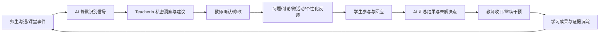

# ClassIn IM × AI Agent 2.0 共识起点与创新演进方向

> **历史状态（2026-08-29）**：本文保留为预研阶段的产品假设，不再作为真实聊天数据的当前结论或优先级依据。方案一/二/三没有被删除，但在 [正式事实研究](../01-research/im-real-communication-fact-study/README.md) 第一部分中暂时搁置；原样版本见 [Round 0 封存包](../07-history/stage-deliverables/im-data-prestudy-round-0-20260828/README.md)。既有 `LOCKED` 决策不因这一研究重置而被静默修改。

## 0. 文档定位

本文用于在以下三类输入之间建立共同起点：

1. 已完成还原的 ClassIn IM 1.0 线上事实；
2. 当前项目目录中可运行的 IM + TeacherIn + `@Agent` 候选 Demo；
3. Notion 文档中提出的第一性原理、开放命题与创新方向。

本文不是最终 PRD，不锁定 2.0 方案，也不直接替代现有[《ClassIn IM、聊天与 Agent/AI 2.0 迭代蓝图》](./IM-CHAT-AGENT-AI-V2-ITERATION-BLUEPRINT.md)。它先回答：

> 我们到底想把 ClassIn IM 升级成什么，为什么值得升级，以及用什么方法找到既创新、又真正改善教学和学习效果的产品方案。

2026-08-28 用户确认：

- 当前 Demo 定义为**方案一：AI Enhanced IM**；
- Learning Loop 定义为**方案二**，与方案一并存比较；
- 方案二若进入原型或开发，应基于 IM 连接能力独立重构页面和交互，不在方案一 Demo 上缝补；
- 方案三保持开放，必须经过行业竞品研究和真实聊天场景分析后再定义；
- 首个学习闭环不预先拍脑袋选择，应从师生单聊与班级群聊的真实高频话题、痛点和关注信息中推导。

### 0.1 主要证据

| 编号 | 来源 | 本文用途 |
|---|---|---|
| N1 | [IM 能力演进方向、产品设计探讨](https://app.notion.com/p/3c9a5c3b026b802e893de4debc3e2cb7?pvs=204) | 第一性原理、IM 新定位、AI 被动/主动交互和研究方法 |
| R1 | [ClassIn IM 1.0 线上现状审计](../01-research/source-notes/classin_im_1_0_online_current_state_audit_20260827.md) | 1.0 入口、功能、权限、生命周期和体验事实 |
| R2 | [IM 与沟通场景中的 AI Agent 行业研究](../01-research/source-notes/industry_research_im_ai_agent_interaction_patterns_20260828.md) | 八个官方案例、交互模式、治理结论和方案三候选 |
| R3 | [真实聊天场景发现与 AI 机会分析框架](../01-research/source-notes/classin_im_chat_scenario_discovery_framework_20260828.md) | Episode 编码、机会评分、样本与隐私方法 |
| P1 | [当前 2.0 候选蓝图](./IM-CHAT-AGENT-AI-V2-ITERATION-BLUEPRINT.md) | 当前 Demo 能力、三类对话语义、治理与工程纵向切片 |
| P2 | [三方案产品组合与验证策略](./IM-AI-AGENT-V2-THREE-OPTION-PORTFOLIO.md) | 方案边界、方案三资格门槛和同题三做验证方法 |
| D1 | [项目简报](../00-project/PROJECT-BRIEF.md)与[决策台账](../00-project/DECISION-LEDGER.md) | TeacherIn、教师主 Agent、事实所有权和审批等锁定边界 |

### 0.2 结论标签

- `1.0 FACT`：线上 1.0 已确认事实；
- `DEMO CURRENT`：当前项目 Demo 已实现，但不是线上事实；
- `LOCKED`：项目锁定决策；
- `PROPOSED`：本文建议，待共同评审；
- `OPEN`：仍需证据或用户决策。

## 1. 对 Notion 思考的核心提炼

N1 实际提出了四层递进命题。

### 1.1 当前候选方案是一种“增强型 IM”

当前 Demo 保留群聊和私聊形态，在其上增加：

- 老师专属的 TeacherIn/WorkBuddy 辅助区；
- 老师和学生可在群聊或私聊中通过 `@Agent` 与 AI 互动。

这条路径的本质是：

```text
原有 IM
+ AI 入口
+ Agent 回复
+ 教师私密辅助
= AI Enhanced IM
```

它是合理的渐进式路线，但不是唯一答案。

### 1.2 第一性原理不是“聊天”，而是“师生连接”

IM 的根本价值并非输入框、气泡和消息列表，而是连接：

- 老师与单个学生；
- 老师与整个班级；
- 学生与同学；
- 信息、资源、问题、反馈与课堂行动。

因此，IM 可以只是底层连接与传输能力，用户真正感知到的上层产品可以被重新定义。

### 1.3 目标可以从信息传递升级为学习协作现场

N1 提出的关键跳跃是：

```text
信息传递工具
→ 线上互动与分享空间
→ 师生学习与教学协作现场
```

在这个现场里，聊天仍然存在，但不再是唯一的内容组织形式。问题、讨论、材料、活动、任务、反馈和学习结果都可以成为一等对象。

### 1.4 AI 需要从被动回答走向受治理的主动促进

N1 区分两种 AI 参与方式：

1. **被动交互**：被老师或学生 `@` 后回答；
2. **主动交互**：后台分析、提出建议、促进讨论、必要时主动发言，帮助达成学习目标。

真正困难的不是让 AI “更主动”，而是决定：

- 它观察什么；
- 什么时候应该保持沉默；
- 什么时候先私下提醒老师；
- 什么时候可以公开介入；
- 谁授权；
- 如何退出、纠正和追责；
- 是否真正改善了学习效果。

## 2. 三类现状必须分开

### 2.1 线上 IM 1.0

`1.0 FACT`：

- 两个主入口：全局“消息”和班级详情“聊天”；
- 以班级群、师生私聊、公开课通知和官方内容为主；
- 支持文本、表情、`@`、文件、名片和临时教室等；
- 老师、班主任、助教拥有公告、临时教室和群文件管理权限；
- 学生可以基础沟通和发送文件，但管理权限更低；
- 支持 `@我的`和桌面通知；
- 不支持会话置顶、免打扰、未读数、单条消息菜单、回复、Reaction 和点赞；
- 没有可确认的 AI Agent。

### 2.2 当前项目 Demo

`DEMO CURRENT`：

- 延续传统会话列表、群聊、私聊和 Composer；
- 增加公开群内 `@Agent`、隔离 Agent 私聊和教师私密 TeacherIn；
- 已验证 AI 私密生成、教师审核、受控发送和回执；
- 部分聊天基础能力超过线上 1.0，例如 Demo 中已有置顶、静音或更完整状态；
- 它证明某些交互和工程闭环可行，但不能代表真实线上现状，也不能自动定义产品终局。

### 2.3 项目锁定边界

`LOCKED`：

- TeacherIn 是教师统一主 Agent/AI 教学搭档，不要求教师理解内部 Agent、Skill 或模型；
- TeacherIn 的私密草稿、Run 和工具过程不能泄漏给学生；
- ClassIn 继续拥有班级、课程、作业、消息和正式业务结果；
- AI 业务副作用必须经过 ProposedAction、Approval 和 ExecutionReceipt；
- 公开班级 Agent 与教师私密 TeacherIn 是不同产品身份，不能因代码复用而混同；
- 当前 2.0 产品范围、优先级和最终形态尚未锁定。

### 2.4 当前蓝图需要重新校准的地方

`PROPOSED`：现有候选蓝图应继续作为能力与治理资产，但后续需要基于 R1 重新校准：

1. 不把 Demo 已实现功能写成线上 1.0 已有能力；
2. 不默认 Reply、Reaction、置顶、静音等基础 IM 增强就是 2.0 的核心价值；
3. 不以“消息功能补齐”替代“学习协作场”的产品定位创新；
4. 不让安全、权限、审批和恢复等正确工程设计反过来限制前台体验想象力；
5. 将现有 `@Agent + Sidecar` 看作迁移能力，而不是默认终局界面。

## 3. 建议建立的共同起点

以下六条可作为进入产品共创前的第一版共识草案。

### C1：IM 是基础设施，不必是最终产品形态

消息传输、会话、权限和通知必须可靠，但用户不必始终面对传统聊天工具。班级、问题、讨论、活动和学习成果可以拥有更适合自身的界面。

### C2：2.0 的目标不是增加聊天频次，而是提高有效学习互动

成功不应等同于更多消息、更多 Agent 回复或更长停留时间。更重要的是：

- 学生问题更快被看见和解决；
- 更多学生有机会参与；
- 老师更早发现共性困难；
- 讨论能沉淀为材料、练习或结论；
- 课前、课中、课后的学习闭环更连续；
- 老师以更低负担提供更高质量反馈。

### C3：老师是学习现场的负责人，AI 提升其影响力而非替代其身份

AI 可以观察、聚合、建议、生成和执行，但应根据风险优先：

```text
先私密理解
→ 再向老师建议
→ 老师授权后公开促进
→ 产生业务变化时留下回执
```

### C4：学生端不是当前主设计面，但学生效果必须进入验收

当前设计优先老师视角和老师独有能力，不做学生端等量重构；但任何公开互动、学习活动和 Agent 介入都必须验证学生是否看得懂、愿意参与、没有被标签化，并真正获得帮助。

### C5：聊天内容需要升级为“可组织的学习对象”

如果所有内容都只是消息，AI 只能不断阅读和回复。2.0 应允许有价值的消息被结构化为：

- 问题；
- 讨论焦点；
- 学习资源；
- 微活动/练习；
- 待办与提醒；
- 教师结论；
- 学习成果与证据。

### C6：AI 主动性必须分级、可见、可控和可评价

主动 AI 不等于频繁公开发言。很多高价值主动性应首先表现为私密洞察、建议和预警，并且需要明确的触发原因、置信度、操作范围和关闭方式。

## 4. 北极星产品命题

### 4.1 工作定义

`PROPOSED`：把 2.0 的北极星暂时定义为：

> **ClassIn 班级学习协作场**：以班级和师生关系为上下文，以沟通为连接基础，以问题、讨论、活动、反馈和成果为核心对象，由 TeacherIn 与班级 Agent 在清晰权限下帮助老师组织学习、促进参与并形成可见结果。

“班级学习协作场”是工作概念，不是最终产品命名。

### 4.2 一句话价值主张

> 让每一次沟通都有机会转化为可跟进的学习事件，让每一次讨论都能沉淀为可复用的学习成果，让 AI 在不抢走教师角色的前提下推动班级持续向学习目标前进。

### 4.3 核心体验循环



这条循环把 AI 从“回复生成器”变成学习过程中的观察、建议、促进、执行和反馈系统。

## 5. 三方案产品组合

| 方案 | 当前定义 | 设计方法 | 当前状态 | 需要回答的问题 |
|---|---|---|---|---|
| 方案一：AI Enhanced IM | 以 1.0 IM 为基础，增强消息基建、`@Agent`、Agent 私聊和教师 TeacherIn 辅助 | 在现有 Demo 能力上继续深化，可逐步演进 | 已有可运行 Demo，可继续优化 | AI 如何更自然融入单聊/群聊；哪些基础 IM 能力真正值得补齐 |
| 方案二：Learning Loop | 以 IM 连接为基座，将消息转化为问题、讨论、活动、反馈、证据和学习结果 | 独立概念原型，重新架构页面与交互；不在方案一上缝补 | 方向已获认可，待概念原型与真实场景验证 | 哪些高频聊天话题最适合形成第一个 Learning Loop |
| 方案三：研究候选 | 当前最强组合假设为 Learning Signal Network，由教师教学沟通雷达与 Conversation-to-Learning Case 组成 | 先分别验证 3A Radar、3C Case；班级 Agent Session 作为 3B 高参与度实验 | 行业证据已形成，真实场景证据仍 `OPEN` | 跨会话发现、分流和学习 Case 是否足以形成独立于方案一/二的产品价值 |

### 5.1 三方案关系

- 方案一与方案二不是“旧方案/新方案”的替代关系，而是可以并行设计、原型和比较；
- 方案二可以复用方案一已经验证的设计原则、视觉语言、身份/权限、审批/回执机制和 IM 功能框架，但不复用其页面结构作为前提；
- 方案三不能由当前团队主观命名后再寻找证据；行业研究已经给出 3A/3B/3C 候选，仍需真实场景研究证明其是否成立；
- 后续可以出现“方案三增强方案一”的结论，也可以出现真正独立的第三种产品形态。

## 6. 建议的体验架构

### 6.1 从“消息页”升级为四个稳定区域

```text
跨班级收件箱
└── 今天需要我关注什么

班级学习空间
├── Flow：自然沟通与动态
├── Focus：正在解决的问题/讨论/活动
└── Outcomes：结论、资源、成果与待跟进项

TeacherIn 教师私密层
└── 洞察、建议、生成、审批、行动与复盘

班级 Agent 公开层
└── 被授权后的答疑、主持、提示、总结和活动引导
```

### 6.2 跨班级收件箱

不只是按最近消息排序，而是帮助老师回答：

- 哪个学生问题尚未得到回应；
- 哪个班级出现集中困惑；
- 哪个讨论需要老师收口；
- 哪个 Agent 建议等待确认；
- 哪个课堂活动已经完成并需要看结果；
- 哪些只是普通消息，可以稍后处理。

### 6.3 班级学习空间

保留自然消息流，但增加两个新的组织面：

- **Focus**：当前班级正在共同解决的题目、话题、材料和活动；
- **Outcomes**：已经形成的教师结论、优秀回答、学习资源、微练习结果和未解决问题。

这样既不破坏聊天的低门槛，又不让所有价值随消息滚动消失。

### 6.4 TeacherIn 教师私密层

TeacherIn 不只是聊天侧边栏，而是老师管理学习现场的私密控制层：

- 班级态势摘要；
- 共性问题聚类；
- 未回应学生提醒；
- 讨论质量与参与分布；
- 下一步干预建议；
- 可编辑的通知、解释、练习和活动；
- 公开前审批；
- 发布后的结果与复盘。

### 6.5 班级 Agent 公开层

班级 Agent 是可见、可辨识、受规则约束的参与者，可以：

- 被 `@` 后答疑；
- 在老师授权的讨论中主持；
- 对讨论做阶段性总结；
- 引导学生完成微活动；
- 在出现明显偏题或共性误解时给出低干扰提示；
- 将无法处理的问题升级给老师。

它不能读取教师私密 TeacherIn 内容，也不能以教师身份发言。

## 7. 从 Message 到 Learning Moment

### 7.1 建议新增的产品对象

| 对象 | 用户理解 | 来源 | 典型状态 |
|---|---|---|---|
| Message | 一条自然沟通内容 | 人或系统发送 | 已发送/不可发送/历史只读 |
| Learning Signal | AI 识别到的潜在学习信号 | 消息、课堂、作业等 | 待确认/忽略/已转化 |
| Learning Moment | 值得被组织和跟进的学习事件 | 教师创建或 Signal 转化 | 草拟/进行中/已收口 |
| Question Cluster | 多个相似问题的聚类 | AI 建议、教师确认 | 待确认/已发布/已解决 |
| Focus Topic | 当前班级共同关注的焦点 | 教师或活动产生 | 活跃/暂停/结束 |
| Micro Activity | 投票、快问快答、练习、反思等轻活动 | 老师/TeacherIn 创建 | 待发布/进行中/已结束 |
| Intervention Proposal | AI 给老师的干预建议 | TeacherIn | 待审/已修改/拒绝/批准 |
| Learning Artifact | 可复用的结论、讲解、资源或活动结果 | 老师与 AI 共创 | 草稿/批准/发布/过期 |
| Learning Evidence | 学生回应、完成和理解变化的证据 | 活动、讨论、作业 | 待汇总/已汇总/需复核 |

### 7.2 转化原则

- 默认消息仍是消息，不要求每次聊天结构化；
- AI 只能提出“这可能是一个学习焦点”，不能静默改变业务事实；
- 教师可一键转化、修改或忽略；
- 被转化后的对象仍保留来源消息引用；
- 学生应知道自己正在参与普通讨论还是正式学习活动；
- 敏感的学生判断不能公开展示或无治理地长期保存。

## 8. AI 角色与主动性阶梯

### 8.1 三种产品身份

| 身份 | 面向谁 | 默认可见性 | 核心职责 | 不应做什么 |
|---|---|---|---|---|
| TeacherIn | 老师 | 教师私密 | 理解班级、提出建议、生成 Artifact、准备行动、复盘 | 未经确认公开发言或暴露学生推断 |
| 班级 Agent | 班级成员 | 群内公开 | 答疑、主持、总结、引导活动、人工升级 | 冒充老师、读取教师私密 Run |
| 学生学习助手 | 单个学生 | 学生私密 | 个性化提示、自检、反思 | 当前不是主线；不能绕过老师或正式提交规则 |

`LOCKED`：三者可以共享底层能力和授权协议，但产品身份、可见性和责任边界不能合并。

### 8.2 主动性五级模型

| 级别 | AI 行为 | 默认呈现 | 授权建议 |
|---|---|---|---|
| L0 连接 | 仅被显式 `@` 后回答 | 公开/私聊回复 | 用户单次触发 |
| L1 静默理解 | 后台聚类问题、识别未回应和参与变化 | 仅进入 TeacherIn 私密层 | 班级级开关 + 最小数据范围 |
| L2 私密建议 | 向老师建议总结、回复、活动或干预 | 教师建议卡 | 每次由老师选择接受/忽略 |
| L3 授权促进 | 在指定讨论中主持、追问、总结或提醒 | 公开 Agent 消息/活动 | 老师对范围、时长和目标授权 |
| L4 受控行动 | 创建活动、发送内容、写回 ClassIn 对象 | Action + Receipt | 风险 Gate + 明确审批 |

### 8.3 主动 AI 的干预预算

`PROPOSED`：公开 Agent 采用“安静优先”的干预预算：

- 同一讨论内限制主动发言频率；
- 优先合并为阶段总结，而不是逐条插话；
- 先判断老师是否已经回应；
- 低置信度只私下建议；
- 学生可以明确请求帮助或暂不需要；
- 老师可以暂停、纠正和查看触发原因；
- 每次主动介入都记录是否有帮助、是否打扰。

## 9. 值得优先探索的创新场景

### S1：班级问题雷达

多名学生在群里用不同表达询问相似问题。TeacherIn 在后台聚类，并私下告诉老师：

- 有多少学生涉及；
- 主要卡点是什么；
- 哪些问题尚未回应；
- 建议公开讲解、发起微练习还是个别回复。

价值：老师不必逐条翻消息，学生的问题不因表达弱或发送时间晚而被淹没。

### S2：从讨论到“学习焦点”

老师把一条消息或一组问题转为 Focus Topic。班级 Agent 在限定时段内帮助：

- 重述问题；
- 邀请不同观点；
- 提醒引用材料；
- 阶段性总结；
- 将未解决点交回老师。

价值：群聊从杂乱消息变成有目标、能收口的学习讨论。

### S3：一键生成微活动

TeacherIn 根据当前讨论生成 3 分钟活动，例如：

- 单选/多选理解检查；
- 快问快答；
- 一句话反思；
- 错因选择；
- 自信度反馈。

学生直接在班级空间完成，结果实时汇总给老师，并形成下一步建议。

价值：把“我讲完了”变成“我知道学生是否理解”。

### S4：高质量师生私聊辅助

学生私聊提出问题。TeacherIn 私下帮助老师：

- 还原上下文；
- 识别缺失信息；
- 生成分层解释；
- 建议公开回答还是保持私聊；
- 经老师修改后以老师身份发送。

价值：保留当前候选 Demo 最成熟的治理链，同时提高个性化反馈质量。

### S5：讨论收口与学习沉淀

一次讨论结束后，TeacherIn 建议生成：

- 教师结论；
- 关键问题与答案；
- 优秀观点；
- 待继续解决的问题；
- 相关材料和微练习；
- 下一次课程可引用的学习成果。

价值：聊天不再随着时间线滚走，而成为课程可复用资产。

## 10. 推荐的第一条创新体验闭环

### 10.1 场景

`PROPOSED`：优先验证“班级问题 → 教师洞察 → 微干预 → 学生反馈 → 学习收口”。

```text
学生在班级中自然提问
→ AI 静默聚类相似问题
→ TeacherIn 私下呈现问题雷达
→ 老师选择：回复 / 生成讲解 / 发起微活动 / 暂不处理
→ 老师修改并批准
→ 班级 Agent 或教师发布
→ 学生直接参与
→ AI 汇总理解程度和未解决点
→ 老师确认结论
→ 沉淀为 Learning Artifact
```

### 10.2 为什么比单纯 `@Agent` 更能验证北极星

- AI 不依赖学生知道应该 `@` 谁；
- 解决老师“看不过来、抓不住共性”的真实负担；
- 同时覆盖自然沟通和结构化学习活动；
- AI 的主动性先私密、后授权，风险可控；
- 能产生学生参与和理解变化证据；
- 能验证 Flow、Focus、Outcomes 三层产品结构；
- 可与当前 Message、TeacherIn Run、Approval、Delivery 和 Receipt 能力衔接。

### 10.3 与当前 V2-IM-01 的关系

当前蓝图推荐的“学生私聊问题 → 教师 TeacherIn 讲题 → 审批发送”仍然有价值，它是安全、清晰的基础能力纵向切片。

建议采用双层关系：

- **工程基础切片**：继续验证 1v1 Thread、教师私密生成、审批、发送和回执；
- **北极星体验切片**：用班级问题雷达和微活动验证 2.0 是否真的从聊天升级为学习协作场。

前者保证系统可信，后者验证产品是否值得被用户频繁使用。

## 11. 产品设计原则

1. **学习结果优先于消息数量**：不把聊天频次直接当成成功。
2. **自然沟通优先，结构化按需发生**：不强迫每条消息成为任务。
3. **AI 安静优先**：能私下建议就不公开打断，能合并总结就不逐条发言。
4. **教师拥有课堂主导权**：AI 促进而不替代，最终公开行动可追溯。
5. **身份与可见性始终明确**：老师、TeacherIn、班级 Agent 和系统内容不可混淆。
6. **主动性逐级授权**：分析、建议、公开促进和业务行动使用不同权限。
7. **消息可转化但来源不丢失**：Learning Moment 始终能回到原始上下文。
8. **学生参与不被标签化**：不公开展示“落后、低分、低参与”等 AI 推断。
9. **轻量发生在原场景**：微活动和反馈尽量不要求离开班级空间。
10. **失败不破坏自然沟通**：AI 不可用时，基础 IM 和教师操作仍然成立。
11. **每个行动可撤回或恢复**：草稿、审批、执行和结果边界明确。
12. **创新界面不牺牲底层可靠性**：消息、权限、通知和资源基建仍需稳定。

## 12. 衡量体系

### 12.1 教师价值

- 从问题出现到老师发现的时间；
- 老师定位共性问题所需时间；
- AI 建议采纳率、修改距离和拒绝原因；
- 形成一次有效干预的操作成本；
- 老师认为“有帮助”与“被打扰”的比例；
- 相对人工处理的时间节省和质量提升。

### 12.2 学生学习价值

- 问题得到有效回应的比例和时间；
- 参与学生覆盖率，而非消息总量；
- 微活动完成率和前后理解变化；
- 未解决问题下降率；
- 学生继续追问、主动表达和自我检查的比例；
- 对 AI 介入的理解、信任和退出意愿。

### 12.3 班级协作价值

- 讨论形成明确收口的比例；
- 消息转化为有效 Learning Moment 的比例；
- 讨论成果复用率；
- 老师遗漏问题率；
- Agent 错误介入、越界和人工升级率；
- 公开 Agent 的干扰率。

### 12.4 不作为核心价值的指标

- 单纯消息条数；
- 单纯 Agent 回复次数；
- 生成字数；
- 工具调用次数；
- 无学习结果解释的停留时长。

## 13. 推荐推进方式

### Phase 0：共识与约束

产出：

- 北极星定位确认或修订；
- 三种 AI 身份与主动性上限；
- 教师优先、学生按需验证的范围；
- 首个业务场景和成功指标；
- 不能触碰的隐私、身份和审批边界。

### Phase 1：真实场景证据

从两类输入建立机会地图：

1. **真实 IM 内容与用户研究**：在脱敏、授权前提下，抽样分析老师通知、学生提问、资料分享、课堂提醒、课后反馈和未解决问题；
2. **跨行业产品研究**：研究 AI 会议、团队协作、社区讨论、在线学习和 Agent 通信产品，不只研究传统 IM。

每个场景记录：频率、痛点、参与者、上下文、现有替代方式、风险、AI 可用信号、预期学习结果。

### Phase 2：机会优先级

使用统一评分：

```text
用户痛点强度
× 发生频率
× 教学结果价值
× AI 独特增益
× 可获得数据
× 可控风险
÷ 实施与迁移成本
```

选择 2–3 个高价值场景进入概念设计，不直接铺开全部 Agent 能力。

### Phase 3：并行概念原型

建议至少做三种低成本概念，不急于在当前 Demo 上直接堆功能：

1. **增强型聊天**：验证 `@Agent + TeacherIn` 的最低迁移成本；
2. **班级学习空间**：验证 Flow / Focus / Outcomes；
3. **主动促进模式**：验证问题雷达、干预建议和干预预算。

### Phase 4：老师任务验证

让老师完成同一真实任务，对比：

- 1.0 当前方式；
- 当前 Demo 方式；
- 新的学习协作场方式。

重点观察是否更快发现问题、是否更愿意采用、是否信任 AI、是否能理解公开/私密边界，以及学生是否得到更好结果。

### Phase 5：锁定纵向切片

只有在概念验证后，才将胜出的体验写成 Feature Spec，并明确：

- 入口与退出；
- Message、Learning Moment、Agent Turn 和 TeacherIn Run 的关系；
- 权限、主动性和审批；
- 状态、失败和恢复；
- 所需真实 ClassIn 数据/API；
- 老师与学生的验收指标；
- 对 1.0 的兼容和迁移方式。

## 14. 已确认共识与开放研究问题

### 14.1 已确认

1. 方案一 AI Enhanced IM 与方案二 Learning Loop 并存，不预先互相替代；
2. 方案二作为重新设计的信息架构和独立概念原型，不直接改造方案一页面；
3. 方案二可以复用当前 Demo 的成熟交互原则、视觉风格、治理链和 IM 功能框架；
4. 产品机会从师生单聊和班级群聊的真实话题、痛点与高频信息出发；
5. 方案三在竞品和真实场景证据形成前保持开放。

### 14.2 行业研究已经形成的结论

- 私密 AI 辅助与公开 Agent 发言应使用不同产品表面；
- 公开 Agent 默认显式添加、`@` 或开启有边界的 Session，不默认逐条插话；
- 来源权限不一致时先在教师私密面预览，公开前检查受众权限交集；
- 高价值路径是“理解 → 建议 → 确认 → 动作 → 回执 → 人工接管”，不是增加更多 AI 回复；
- 3A 教师教学沟通雷达、3B 班级 Agent Session、3C Conversation-to-Learning Case 值得进入概念实验；
- 3A + 3C 是当前最强方案三组合假设，3B 属于更高风险的主动公开实验；
- 行业研究不能回答 ClassIn 真实师生沟通中什么最高频，方案三因此仍不能锁定。

### 14.3 真实场景研究需要回答

- 师生单聊和班级群聊中分别有哪些高频话题；
- 哪些话题占用老师最多重复劳动；
- 哪些问题最容易被遗漏、重复、延迟或无法收口；
- 哪些交流只是信息传递，哪些已经隐含一个学习循环；
- 当前老师如何补救，为什么现有方式不够好；
- AI 最适合观察、建议、生成、促进还是执行；
- 哪些高频但低风险场景适合作为首个切入点。

### 14.4 当前需要的关键输入

需要获得脱敏、授权、可按场景分析的真实 IM 样本，至少覆盖：

- 老师—学生单聊；
- 老师—班级群聊；
- 不同教学阶段和班级类型；
- 成功解决和未解决的对话；
- 老师认为高价值和高负担的典型片段。

## 15. 当前建议结论

`PROPOSED`：

1. 将当前 Demo 明确定义为方案一 AI Enhanced IM；
2. 将 Learning Loop 作为并行方案二，采用独立页面架构和概念原型；
3. 方案三保持开放；先以 3A 教师教学沟通雷达和 3C Conversation-to-Learning Case 作为概念探针，真实 Episode 不支持时降级为方案一增强；
4. 把 AI 主动性继续作为 L0–L4 阶梯研究，而不是简单的“主动/被动”开关；
5. 行业竞品研究已经完成；下一阶段进入真实聊天场景编码、机会排序和三方案同题故事板；
6. 三个方案使用同一真实任务和同一价值指标进行对照；
7. 用学习结果、教师负担和参与覆盖衡量价值，不以消息数和 Agent 回复数作为目标。

这套方向同时保留了 1.0 的低门槛沟通优势、当前 Demo 的治理与执行资产，也为真正焕然一新的学习互动体验留下了足够空间。
