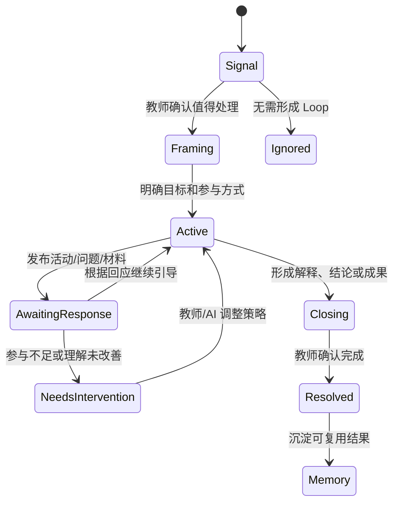

# 方案二：ClassIn Learning Loop 零基产品愿景

## 0. 设计实验

本文进行一次刻意的零基推演：

- 不假设产品必须叫“消息”或“IM”；
- 不假设主界面必须是会话列表、聊天流和输入框；
- 不假设 AI 必须作为一个联系人或通过 `@Agent` 触发；
- 不假设 TeacherIn 必须是聊天侧边栏；
- 不以当前 2.0 Demo、现有代码结构和迁移成本限制产品想象；
- 不把 Reply、Reaction、置顶等 IM 功能补齐当作产品创新。

只保留六个真实前提：

1. 老师需要理解班级正在发生什么；
2. 老师需要组织、引导和改善学习；
3. 学生需要表达、求助、参与、练习和获得反馈；
4. 班级中存在持续发生的问题、材料、讨论、活动和结果；
5. AI 可以理解大量上下文、发现模式、生成内容并执行受控行动；
6. 教育场景必须尊重教师主导、学生隐私、身份透明和安全边界。

本文是反事实产品探索，不自动修改现有锁定决策或开发范围。如果被认可，再反向评估如何迁移和落地。

2026-08-28 用户确认：本文定义为 2.0 **方案二**。它与方案一 AI Enhanced IM 并存，不替代方案一；若进入原型或开发，应以 IM 连接能力为基座重新设计信息架构和页面，不在方案一 Demo 交互上修改、缝补。方案一中已经验证的设计原则、交互风格、治理机制和 IM 功能框架可以选择性复用。

## 1. 我的核心判断

如果完全没有当前 2.0 设定，我不会优先做“一个更强的聊天产品”。

我会做：

> **ClassIn Learning Loop：一个围绕真实学习循环运行的班级协作操作系统。**

它的核心不是“谁给我发了什么消息”，而是：

- 我的班级现在正在学什么；
- 哪些问题正在发生；
- 哪些学生需要关注；
- 当前最值得采取什么行动；
- 一次教学互动是否真正产生了理解变化；
- 讨论、材料和反馈最终沉淀成了什么。

在这个产品中：

- **沟通**是连接方式；
- **Learning Loop** 是核心工作单元；
- **老师**是学习导演；
- **学生**是学习参与者和主体；
- **AI Agent** 是幕后舞台经理、助教和促进系统；
- **学习证据与结果**是结束条件。

## 2. 从传统 IM 到 Learning Loop

| 传统 IM 心智 | Learning Loop 心智 |
|---|---|
| 谁发了新消息 | 现在什么最需要我关注 |
| 会话列表 | 学习注意力队列 |
| 群聊 | 班级学习现场 |
| 一条消息 | 一个学习信号或自然表达 |
| 连续聊天记录 | 正在推进的学习循环 |
| 附件 | 学习上下文与资源 |
| @某人 | 明确责任、邀请参与或请求帮助 |
| @Agent | 系统在合适环节提供智能能力 |
| 通知红点 | 下一步行动与紧迫原因 |
| 消息历史 | 班级学习记忆 |
| 更多消息 | 更快解决问题、更多有效参与、更好学习结果 |

关键变化是：消息不再是产品的最高层对象，只是 Learning Loop 中的一种 Moment。

## 3. 核心产品原语

### 3.1 Learning Space：学习空间

一个班级、课程、小组或师生关系对应一个持续存在的学习空间。空间拥有：

- 当前目标；
- 正在发生的 Loop；
- 人与角色；
- 材料与课程对象；
- 讨论和活动；
- 结果与长期记忆。

### 3.2 Learning Loop：学习循环

Loop 是产品最核心的单位，表示一个需要被推进和收口的学习过程，例如：

- 一个共性问题；
- 一次概念讨论；
- 一次课前准备；
- 一项微练习；
- 一次作业反馈与订正；
- 一个学生的个性化求助；
- 一次班级反思和复盘。

每个 Loop 至少有：

```text
为什么发生
→ 当前目标
→ 谁在参与
→ 现在处于什么状态
→ 下一步行动是什么
→ 产生了哪些证据
→ 是否已经解决
```

### 3.3 Moment：学习时刻

Moment 是 Loop 中发生的一次表达或事件：

- 消息；
- 提问；
- 分享；
- 老师解释；
- AI 建议；
- 学生回答；
- 活动提交；
- 系统事件；
- 课堂或作业数据变化。

### 3.4 Action：下一步行动

Action 不是普通通知，而是一个明确、可执行、有结果的下一步：

- 老师确认一个共性问题；
- 学生完成 3 分钟理解检查；
- 班级 Agent 主持一轮讨论；
- 老师批准一份讲解；
- 学生补充缺失信息；
- 系统把结果写回课程对象。

### 3.5 Evidence：学习证据

Evidence 用来判断 Loop 是否真的向前推进，例如：

- 学生回答；
- 正确率变化；
- 追问是否减少；
- 学生自信度；
- 教师确认；
- 作业订正结果；
- 讨论形成的观点和结论。

### 3.6 Outcome：结果与记忆

Loop 结束时不只是留下聊天记录，而是形成：

- 已解决问题；
- 教师结论；
- 可复用讲解；
- 班级共识；
- 学习资源；
- 学生反馈；
- 待继续跟进的问题；
- 下一次教学可引用的证据。

## 4. 产品不是一个 Feed，而是四个工作面

### 4.1 Today：学习注意力队列

老师打开产品后，不先看到最近消息，而是看到“今天真正需要我处理的事情”：

```text
今天

需要你判断 · 3
  七年级 2 班：8 名学生反复询问同一概念
  李同学：昨天的私聊问题尚未解决
  英语讨论：AI 建议收口并生成 3 分钟检查

正在进行 · 4
  过去完成时理解检查    21/28 已完成
  阅读讨论               等待教师总结

最近形成的结果 · 2
  已沉淀：过去完成时常见错因
  已完成：Unit 3 课后反思
```

这不是传统收件箱。它按学习价值、责任和时效组织注意力。

### 4.2 Class Stage：班级学习现场

每个班级拥有一个“当前正在发生什么”的动态现场：

```text
当前学习目标
正在进行的 Loop
班级自然交流
需要参与的活动
老师与 AI 的公开引导
实时形成的结果
```

自然聊天仍然存在，但不会吞没当前目标和正在推进的学习事件。

### 4.3 Loop Canvas：学习循环画布

点击一个 Loop 后进入专属工作面：

```text
目标与来源
| 相关消息/材料/作业证据
| 参与者与当前响应
| 老师行动
| AI 建议与可解释原因
| 当前活动
| 结果与未解决点
```

它不是另一个聊天线程，而是围绕一个目标组织全部上下文和行动。

### 4.4 Learning Memory：班级学习记忆

已完成的 Loop 进入可检索、可复用的班级记忆：

- 这个班学过什么；
- 哪些概念曾经困难；
- 老师如何解释；
- 学生完成过哪些活动；
- 哪些问题仍反复出现；
- 哪些成果可以在下一节课继续使用。

它不是未经治理的 AI 长期记忆，而是由来源、权限、有效期和教师确认共同约束的学习资产。

## 5. 同一学习空间的双重投影

老师和学生不需要看到同一个界面，但他们操作的是同一个 Learning Loop。

### 5.1 老师投影：Orchestrate

老师看到：

- 班级态势；
- 需要关注的信号；
- 参与覆盖和未解决问题；
- AI 私密建议；
- 可发起的教学动作；
- 公开前预览和控制；
- 结果和下一步干预。

### 5.2 学生投影：Participate

学生看到：

- 我现在需要做什么；
- 班级正在讨论什么；
- 我可以在哪里提问或表达；
- 老师给我的反馈；
- 我是否完成；
- 我还有什么没理解；
- 我能否请求更多帮助。

### 5.3 关键原则

- 老师看到的班级推断不直接暴露给学生；
- 学生不被公开排名或标签化；
- 学生能理解为什么收到某个行动；
- 老师能知道 AI 使用了哪些来源；
- 双方都能回到原始信息和正式业务对象。

## 6. AI 不首先是聊天机器人

### 6.1 AI 的主要输出应该是“更好的产品状态”

传统做法让 AI 生成更多文字。Learning Loop 中，AI 更重要的输出是：

- 把相似问题聚在一起；
- 让重要但沉底的信息浮现；
- 把讨论组织成明确焦点；
- 建议一个更合适的下一步；
- 根据学生回应调整活动；
- 把过程沉淀成可复用结果；
- 在老师确认后执行动作。

最好的 AI 体验不一定出现一条 Agent 消息，而可能是界面突然变得更清楚、下一步更准确、老师少做了十分钟整理工作。

### 6.2 AI 的三种工作角色

#### 私密教学导演助理

面向老师，理解班级和学习状态，提出建议、准备内容、模拟后果、等待确认。

#### 公开学习促进者

面向班级，在明确授权的 Loop 中主持、追问、总结、发布活动和升级给老师。

#### 个人学习搭档

面向学生，帮助表达问题、分步思考、自检和反思，但不能替学生完成正式任务。

三者共享学习上下文能力，但不共享身份、隐私和行动权限。

### 6.3 AI 主动性不是“自动发言”

AI 主动性的优先顺序应是：

```text
发现
→ 整理
→ 私密建议
→ 请求授权
→ 公开促进
→ 受控执行
→ 结果复盘
```

公开发言只是其中很小的一部分。

## 7. Learning Loop 的核心状态机



每个状态都回答：

- 当前发生了什么；
- 谁需要行动；
- AI 能做什么；
- 是否需要教师确认；
- 如何恢复或退出；
- 什么证据允许进入下一状态。

## 8. 一次完整体验示例

### 8.1 自然发生

晚间班级交流中，几名学生分别发出：

- “为什么这里不能用 have done？”
- “had finished 和 finished 有什么区别？”
- “过去完成时我还是看不懂。”

没有人需要知道应该 `@Agent`。

### 8.2 AI 静默理解

系统发现这些表达可能属于同一概念困难，但不在群里自动发言。

老师的 Today 中出现：

> 过去完成时可能存在共性困难，涉及 7 名学生。3 条问题尚未得到回应。建议：发布 3 分钟理解检查，或生成一份班级讲解。

### 8.3 老师决定

老师打开 Loop Canvas，看到：

- 来源消息；
- 涉及概念；
- AI 聚类理由；
- 建议活动；
- 可编辑的讲解草稿。

老师修改两道题，点击发布理解检查。

### 8.4 学生参与

学生不需要进入新工具，只在班级现场看到：

> 3 分钟快速检查：你能区分 finished 与 had finished 吗？

学生提交答案和自信度，也可以选择“我仍然不明白”。

### 8.5 动态调整

AI 发现大多数学生能判断时间先后，但仍有 5 人混淆句型。TeacherIn 私下建议老师发布一个时间轴解释，并给这 5 人提供额外例题。

### 8.6 收口与沉淀

老师确认解释后，Loop 形成：

- 班级讲解；
- 两道检查题；
- 常见错因；
- 仍需个别跟进的学生；
- 下一节课可引用的学习成果。

这是一个从自然沟通开始、以学习结果结束的完整循环，而不是一段更长的 AI 聊天。

## 9. 通用创建入口

产品仍需要一个低门槛入口，但它不只叫“发送消息”。

```text
说一句 | 提问题 | 分享材料 | 发起讨论 | 创建活动 | 请求帮助
```

用户可以直接输入自然语言，系统推断意图并给出明确预览：

- 这将作为普通消息发送；
- 这将创建一个只对老师可见的问题；
- 这将发起班级讨论；
- 这将发布一个三分钟活动；
- 这将请求 AI 私密帮助。

AI 可以帮助理解意图，但最终对象类型、可见范围和执行结果必须在发送前清楚可见。

## 10. 为什么这种形态可能产生更强使用意愿

### 10.1 对老师

- 打开产品就知道什么最值得关注；
- 不需要翻阅大量消息寻找问题；
- AI 帮助准备行动，而不是只生成一段话；
- 每次干预都有学生反馈和结果；
- 已完成工作自动沉淀，可被下次复用；
- 使用次数越多，班级教学记忆越完整。

### 10.2 对学生

- 问题不容易被消息淹没；
- 不会因为不知道如何 `@Agent` 而错失帮助；
- 能看到清晰的下一步，而不是更多通知；
- 能用提问、活动、反思等不同方式参与；
- 反馈更及时、更个性化；
- 能看见自己真正解决了什么。

### 10.3 对班级

- 讨论有目标、有过程、有收口；
- 沉默学生也能通过低压力活动参与；
- 老师的判断与 AI 的处理形成互补；
- 交流逐渐积累为班级共同知识和学习资产。

产品增长动力不是“AI 很新”，而是每次使用都更容易发现问题、采取行动并看到结果。

## 11. 必须避免的产品陷阱

1. **AI 制造更多噪音**：主动 Agent 频繁插话会迅速失去信任。
2. **把班级变成监控面板**：不能让老师或学生感到每句话都被评价和画像。
3. **公开标签学生**：低参与、低正确率和情绪推断必须谨慎且默认私密。
4. **强迫结构化**：普通沟通仍应轻松发生，不要求选择复杂表单。
5. **用 AI 替代老师身份**：公开教学判断与正式行动必须有明确责任人。
6. **伪造确定性**：AI 聚类和判断必须允许查看来源、修改和忽略。
7. **Loop 数量失控**：系统需要合并、降噪、过期和收口机制。
8. **记忆无边界**：长期学习记忆必须有权限、来源、有效期和删除机制。
9. **只服务积极发言者**：产品要捕捉低压力参与和个体求助，而不是奖励消息最多的人。
10. **为了创新牺牲基础通信**：AI 不可用时，人仍能自然沟通和完成关键行动。

## 12. 零基产品的验证方法

### 12.1 不先修改现有 Demo

先制作三个彼此独立的概念原型：

1. 老师 Today 与学习注意力队列；
2. 班级 Stage 与 Loop Canvas；
3. 学生 Participate 投影和微活动。

不要求它们复用当前消息页或现有组件，避免代码形态提前限制判断。

### 12.2 使用同一个真实任务进行对照

选择一个真实高频场景，例如“班级出现共性问题”，分别让老师使用：

- 1.0 消息方式；
- AI Enhanced IM；
- Learning Loop。

比较：

- 发现问题的速度；
- 理解上下文的准确度；
- 发起干预所需操作；
- 学生参与覆盖；
- 老师信任和控制感；
- 是否形成可复用结果。

### 12.3 先验证行为改变，再讨论迁移

只有当老师明显更愿意采用 Learning Loop，且学生获得更好结果，才讨论：

- 它是否替换“消息”入口；
- 是否作为班级主界面；
- 哪些能力复用当前 Demo；
- 如何兼容 1.0 历史消息；
- 如何分阶段上线。

## 13. 我建议的产品立场

如果采用方案二，我会坚持以下产品立场：

1. **方案二不以聊天为产品中心，而以学习循环为中心。**
2. **不把 Agent 做成等待 `@` 的机器人，做成帮助空间持续变清晰、变有序、能行动的智能系统。**
3. **不让 AI 追求多说话，而让它追求少遗漏、快收口、有结果。**
4. **不让老师管理多个 Agent，而让老师管理目标、行动和公开边界。**
5. **不把学生当作消息接收者，而让学生成为每个 Loop 中可表达、可参与、可获得反馈的主体。**
6. **不以消息数衡量成功，以问题解决、参与覆盖、理解变化和教师杠杆衡量成功。**

方案二可以保留并复用 IM，但 IM 会像网络连接一样退到基础层。用户真正感知到的，是一个会理解班级、组织学习、推动行动并沉淀成果的实时学习空间。

## 14. 已确认定位与下一步证据

已确认：

1. Learning Loop 是值得独立探索的方案二核心单元；
2. 方案二采用独立概念原型和重新架构的交互页面，不先修改方案一消息页；
3. 方案一和方案二并行设计，并使用相同真实任务比较效果。

下一步不预先指定“班级共性问题”或“师生个别答疑”为首个闭环，而是先分析：

- 老师—学生单聊中的高频话题、痛点和未解决问题；
- 老师—班级群聊中的高频信息、重复劳动和学习信号；
- 不同话题对应的频率、教师负担、教学价值、AI 增益和风险。

完成真实场景机会排序后，再选择方案二首个 Learning Loop，并与方案一对应体验进行对照验证。
