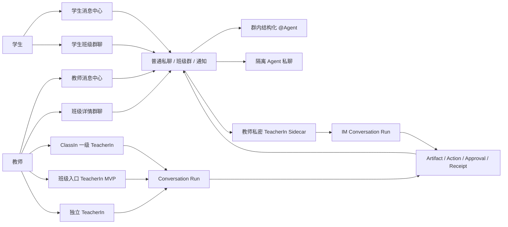
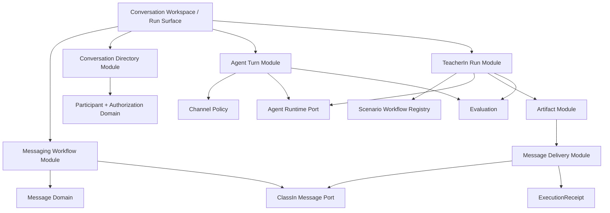

# ClassIn IM、聊天与 Agent/AI 2.0 迭代蓝图

## 0. 文档定位

本文对当前项目中与 IM、聊天、班级 Agent、TeacherIn 和 AI 任务相关的入口、操作、状态、对象、Module 与实现证据做一次统一盘点，并给出 2.0 的结构性迭代方向。

本文是指导性蓝图，不直接替代 Feature Spec，也不把建议自动升级为 `LOCKED` 决策。后续具体开发必须从本文选择一条纵向切片，补齐 PRD、Feature Spec、状态、Adapter 和验收。

文中使用四种事实标签：

- `CURRENT`：当前代码、测试或已验收 Spec 已表达；
- `LOCKED`：已被决策台账锁定；
- `PROPOSED`：本文建议，需后续评审；
- `FUTURE`：方向成立但尚不应进入当前实现。

本文重点回答：

1. 用户从哪里进入 IM、聊天和 AI；
2. 当前基础聊天操作覆盖到什么程度；
3. 普通聊天、公开班级 Agent、隔离 Agent 私聊和教师私密 TeacherIn 有什么本质差异；
4. 当前 Agent/AI 能力如何映射到 Context、Artifact、Action、Approval、Receipt 与 Evaluation；
5. 2.0 应该统一什么、保留什么差异、先做什么；
6. 哪些 Module 应该加深，哪些 Seam 暂时不应提前制造。

## 1. 一页结论

当前项目已经形成一个覆盖面很广的可运行 Demo：

- 一套教师/学生共享的消息工作区；
- 四类消息：私聊、班级消息、系统通知、官方公告；
- 教师和学生的班级群与 1v1 会话；
- 群内结构化 `@Agent` 与教师/学生隔离的 Agent 私聊；
- 教师在消息旁使用私密 TeacherIn 生成、审核并发送内容；
- 三套互相隔离的 TeacherIn 产品装配；
- 课件、课程方案包、测验、消息草稿、单题讲解、审批、写回和回执链路；
- 大量 Integration、E2E、a11y 和视觉证据。

当前最重要的问题已经不是“有没有聊天框”或“能不能生成一段 AI 回复”，而是：

> 如何把普通沟通、Agent 对话和可执行 AI 任务组织成一个一致、可治理、可恢复的产品系统，同时不抹平它们不同的身份、可见性、风险和业务所有权。

2.0 的核心建议是：

1. **统一用户心智，不统一领域语义**：统一会话列表、Composer、身份、状态反馈和内容引用语言；普通消息、Agent Turn 与 TeacherIn Run 继续使用不同领域对象。
2. **先补消息基础，再扩 AI**：先建立可持久、可重试、可同步的 Thread、Participant、Message、Draft、Delivery 与 Read Cursor，再让 Agent 和 TeacherIn 使用它。
3. **统一 Agent 调用协议**：公开 `@Agent` 与 Agent 私聊共享发现、授权、请求、阶段、失败和重试 Interface，只由 Channel Policy 决定触发和可见性。
4. **深化 ConversationRun**：课件、方案包、测验和 IM 任务应共享事件 Envelope、Command Receipt、恢复和评价语言，但不把人类聊天记录伪装成 Agent Run。
5. **所有业务副作用走执行链**：任何由 AI 产生的消息、文件或 ClassIn 对象变化都经过 `ProposedAction → Policy/Validation → Approval → Adapter → ExecutionReceipt`。
6. **以“学生问题 → 教师 TeacherIn → 审核 → 发送 → 学生打开”为第一条 2.0 纵向样板**：它能同时检验 IM、AI、Artifact、权限、审批、消息分发和评价。

## 2. 现状来源与事实边界

本次盘点主要依据：

- 路由和产品装配：`src/app/App.tsx`、`src/app/router/`；
- 消息领域与工作区：`src/domain/message/`、`src/features/message-workspace/`；
- 班级 Agent：`src/domain/class-agent/`、`src/features/class-agent-conversation/`；
- IM 内 TeacherIn：`src/domain/workbuddy/im-*`、`src/features/workbuddy-im-assistance/`；
- 一级 TeacherIn 工作台：`src/features/ai-agent-workspace/`；
- 产品与功能规格：`docs/04-specs/features/workbuddy-im-collaboration/`、`workbuddy-m4-agent-run-ux/` 和 `workbuddy-m4-demo-completion/`；
- 自动化证据：`tests/integration/`、`tests/e2e/message-workspace.spec.ts`、Agent/WorkBuddy E2E 与视觉快照。

当前运行结果仍是固定、脱敏、可重置的本地 Scenario 和 Mock Adapter。`CURRENT` 表示产品结构和交互真实可运行，不表示已接入生产 IM、真实模型、实时推送、生产权限或持久化服务。

## 3. 统一术语

为避免后续把所有“长得像聊天”的界面混为一谈，2.0 使用以下术语：

| 术语 | 含义 | 当前代表对象 |
| --- | --- | --- |
| Conversation | 用户在一个稳定上下文中持续交流或协作的产品容器 | `MessageThread` 或 `ConversationRun` |
| Thread | IM 中拥有参与者、可见范围、消息、未读和历史的会话 | `MessageThread` |
| Message | 已进入 IM 事实的沟通条目 | `MessageEntry` |
| Draft | 尚未发送、只属于当前 Actor 的输入 | 当前 Composer 本地状态；目标需显式建模 |
| Agent Turn | 一次用户请求到 Agent 完成、失败或被阻断的回复周期 | `ClassAgentThreadStatus` + Agent Message |
| TeacherIn Run | 围绕目标、Context、Plan、Artifact、Action、Approval 和 Receipt 的可恢复任务 | `ConversationRunProjection`、IM Run Projection |
| Artifact | 可审阅、版本化、可引用的 AI 产物 | 课件、方案包、测验、通知草稿、讲题内容 |
| Content Reference | Message 指向已批准 Artifact 的安全引用 | `GuidedExplanationContentReference` |
| Channel Policy | 决定触发、身份、可见性、上下文和审批要求的规则 | 公开班级 Agent / 隔离私聊 / 教师私密 WorkBuddy |
| Business Effect | 改变 ClassIn 消息、文件、课程、作业或发布状态的动作 | `ProposedAction` 与 `ExecutionReceipt` |

### 3.1 三种对话语义

| 类型 | 用户心智 | 事实所有者 | 是否产生 Artifact | 是否需要 Approval | 完成证据 |
| --- | --- | --- | --- | --- | --- |
| 普通 IM | 我与人或群沟通 | ClassIn Message Domain | 通常不产生 | 普通发送不需要 | Message Delivery/Read 状态 |
| 班级 Agent 对话 | 我在当前课程范围内向 Agent 提问 | ClassIn Thread + Agent Turn | 可选，默认是回复 | 低风险回复通常不需要 | Agent Reply + Turn 状态 |
| TeacherIn Run | 教师委托 AI 完成一个教学工作 | TeacherIn Run Domain；ClassIn 只拥有正式业务结果 | 通常产生 | 业务副作用需要 | Artifact + Approval + ExecutionReceipt |

这三者可以出现在同一个视觉工作区，但不能共享同一个含糊的 `message.status` 或一个万能的布尔状态。

## 4. 当前产品拓扑



### 4.1 产品入口地图

| 入口 | 路由/触发 | 角色 | 当前内容 | AI/Agent 关系 | 状态 |
| --- | --- | --- | --- | --- | --- |
| 教师全局消息中心 | `/teacher/messages` | 教师 | 私聊、班级、系统、官方四类消息 | 可打开 TeacherIn；可发现班级 Agent | `CURRENT` |
| 教师班级群聊 | `/teacher/classes/:classId/chat` | 教师 | 锁定当前班级的沉浸群聊 | 可使用公开 Agent 与常驻 TeacherIn | `CURRENT` |
| 学生消息中心 | `/student/messages` | 学生 | 四类消息的学生可见投影 | 可发现自己的班级 Agent 私聊；无 TeacherIn | `CURRENT` |
| 学生班级群聊 | `/student/classes/:classId/chat` | 学生 | 锁定当前班级的沉浸群聊 | 可公开 `@Agent`；无 TeacherIn | `CURRENT` |
| 群内公开班级 Agent | 群聊 Composer 的 `@Agent` 或 typed `@` | 教师、学生 | Agent 选择、主目标、公开回复 | 群成员可见，必须显式结构化 Mention | `CURRENT` |
| Agent 隔离私聊 | 私聊目录的“班级 Agent” | 教师、学生 | 独立历史、分阶段回复、失败重试 | 无需 `@`，Actor 线程隔离 | `CURRENT` |
| IM 内教师私密 TeacherIn | 教师群聊/1v1 Header 或沉浸辅助区 | 教师 | 通知、讲题、回复建议、审核和发送 | 草稿私密；批准后以教师身份进入目标 Thread | `CURRENT` |
| ClassIn 一级 TeacherIn | `/teacher/ai-agent/*` | 教师 | 新任务、Run、Skills、Tools、Content、Files、Schedules | `ideal-full` Product Module | `CURRENT` |
| 班级入口 TeacherIn MVP | `/teacher/classes/:classId/workbuddy/*` | 教师 | 班级 Launch Context 下的独立 Shell | `classin-mvp` Product Module，数据与一级入口隔离 | `CURRENT` |
| 独立 TeacherIn | `/teachbuddy/app/*` | 个人教师 | 任务、能力、文件、点数、会员与连接价值 | `standalone-teacher` Product Module | `CURRENT` |
| 系统通知行动 | 系统消息中的行动按钮 | 教师、学生 | 跳到作业详情、订正或结果 | 当前不是 Agent 入口，但可成为未来 Context Launch | `CURRENT` |

### 4.2 已锁定的入口边界

- TeacherIn 只进入教师端；学生不可发现教师私密 Sidecar。
- 公开班级 Agent 与教师私密 TeacherIn 是不同产品身份，不能合并。
- 公开 Agent 只有结构化 `@Agent` 才触发；普通文本中的相似文字不应触发。
- 教师与学生的 Agent 私聊互相隔离，教师默认不可搜索学生 Agent 私聊。
- `ideal-full`、`classin-mvp`、`standalone-teacher` 的 Route、配置和私有数据空间隔离。
- 独立 TeacherIn 不得读取或代理 ClassIn 私有业务数据；内容格式兼容不等于运行数据共享。

## 5. 当前基础聊天操作盘点

### 5.1 会话发现与导航

| 操作 | 当前行为 | 范围 | 成熟度 | 2.0 指导 |
| --- | --- | --- | --- | --- |
| 消息分类 | 私聊、班级、系统、官方四类 Tab | 师生 | 可运行 Demo | 保留分类，但允许由稳定 Thread Type 配置，而不是页面硬编码 |
| 未读计数 | 按角色和分类统计；支持全部已读 | 师生 | 本地状态 | 升级为 Actor 级 Read Cursor，不以角色代替具体用户 |
| 会话搜索 | 标题、摘要、最近消息；Agent 还支持名称、班级、能力 | 师生 | 可运行 Demo | 搜索应只消费授权后的 Directory Projection |
| 私聊范围筛选 | 全部 / 班级 Agent / 联系人 | 师生 | 可运行 Demo | 保持 Agent 与联系人可辨识，不建立第二套会话列表 |
| 发起私聊 | 联系人 Dialog；Agent 和联系人分组 | 师生 | 固定 Scenario | 接入真实 Participant Directory 前保持 Interface，不伪造通讯录能力 |
| 深链进入 | URL query 可定位 Thread；通知可进入业务对象 | 师生 | 可运行 Demo | 所有入口使用稳定 ThreadRef/ContextRef，明确目标不可用与无权限 |
| 班级锁定 | 班级详情入口只展示当前班级 Thread | 师生 | 可运行 Demo | Context Lock 只限制入口投影，不复制 Message Domain |
| 历史加载 | Agent 私聊支持向上加载并保持锚点 | 师生 Agent 私聊 | 固定本地分页 | 扩展到全部长会话，使用 Cursor 而不是数组切片语义 |
| 新消息锚点 | 阅读旧消息时显示“1 条新消息” | 师生 Agent 私聊 | 可运行 Demo | 扩展为基于 Read Cursor 的 N 条新消息与稳定定位 |

### 5.2 Composer 与发送

| 操作 | 当前行为 | 范围 | 成熟度 | 2.0 指导 |
| --- | --- | --- | --- | --- |
| 发送文本 | Trim 后本地追加到 Thread | 可写私聊/群聊 | 本地 Demo | 必须补 `submitting/sent/failed`、幂等键和重试 |
| 发送表情 | 固定发送 `🙂` | 可写私聊/群聊 | Demo | 作为 Message Content Variant，不特殊绕过发送生命周期 |
| 草稿保持 | 切换 Agent 时有二次确认；WorkBuddy 草稿由 Provider 持有 | 部分入口 | 局部实现 | 建立 Actor + Thread 级 Draft，明确过期、恢复与跨设备边界 |
| typed `@` | 混合选择联系人和 Agent | 班级群 | 可运行 Demo | 人员 Mention 和 Agent Mention 使用不同结构化 Entity |
| `@Agent` 工具 | 只展示已授权 Agent，形成唯一主目标 | 班级群 | 可运行 Demo | 保留单一主响应 Agent；多 Agent 编排不进入公开 Composer |
| Agent 目标撤销 | 可移除或撤销切换 | 班级群 | 可运行 Demo | 目标必须在发送前重验授权版本 |
| 附件入口 | 图片、文件等只返回 Placeholder 反馈 | 可写会话 | 未实现 | 先定义 Attachment 生命周期、扫描、权限和失败，再接上传 UI |
| 临时教室入口 | Placeholder | 可写会话 | 未实现 | 属于业务 Action，不应伪装成普通附件 |
| 禁言阻断 | 群聊禁言或只读时替换 Composer | 班级群 | 本地 Demo | 由 Thread Permission Projection 决定，不在页面复制规则 |
| TeacherIn 回复建议 | 生成后插入普通消息 Composer，仍需教师发送 | 教师 1v1 | 可运行 Demo | 这是低风险 Copilot，不应直接写入 Thread |

### 5.3 消息与会话管理

| 操作 | 当前行为 | 范围 | 成熟度 | 2.0 指导 |
| --- | --- | --- | --- | --- |
| 消息置顶 | 教师可在班级群置顶/取消 | 教师群聊 | 本地 Demo | 作为 Thread Command，返回权限或冲突结果 |
| 消息撤回 | 教师不限时；学生 24 小时内 | 班级群 | Domain 规则已存在 | 生产规则需由 ClassIn 事实与服务端时间拥有 |
| 全体禁言 | 教师可切换 | 班级群 | 本地 Demo | 属于群管理副作用，需要权限、Receipt 和审计 |
| 消息免打扰 | 私聊可切换 | 教师/学生私聊 | 本地 Demo | 属于 Actor Preference，不与群禁言复用同一含糊字段 |
| 群文件 | 入口存在，未连接真实文件服务 | 班级群 | Placeholder | 连接 ClassIn Space/File Interface 后再启用 |
| 成员 | 入口存在，引导到班级详情统一管理 | 班级群 | Placeholder/引导 | 保持成员管理属于 Class Domain |
| 联系人资料 | 入口存在，不读取真实通讯录 | 私聊 | Placeholder | 只读 Participant Profile Projection |
| 标为已读 | 当前分类全部已读、选中 Thread 已读 | 师生 | 本地状态 | 使用 Actor 级 Read Cursor 和服务端冲突语义 |
| 系统通知行动 | 跳转作业详情、订正或结果 | 系统消息 | 可运行 Demo | Message 只持有安全 ActionRef，不复制业务状态 |
| 内容引用 | 教师消息可携带讲题引用并打开 Viewer | 指定群/学生 | 可运行 Demo | 引用必须指向批准版本并校验可见权限 |

### 5.4 工作区操作

| 操作 | 当前行为 | 成熟度 | 2.0 指导 |
| --- | --- | --- | --- |
| 沉浸模式 | 教师消息中心和班级群支持进入/退出；学生班级群也使用沉浸 Frame | 已实现 | Shell 只拥有布局状态，不拥有 Thread/Run 状态 |
| 辅助区常驻 | 教师沉浸消息中 TeacherIn 常驻 | 已实现 | 常驻是 UI Policy，不写入 Run Domain |
| 辅助区拖拽 | 宽屏可调宽度，紧凑视口降级 Overlay | 已实现 | Layout Module 只处理尺寸和输入，不持有业务状态 |
| Composer 固定 | Chat 与 TeacherIn 均固定在底部 | 已实现 | 共享 Design System，发送命令与目标语义仍由各 Feature 拥有 |
| 键盘与焦点 | Picker、Dialog、Esc、Splitter 和 Reduced Motion 有自动化 | 已实现 | 继续作为每条纵向切片的验收门 |

### 5.5 当前基础聊天缺口

以下能力尚未形成生产级闭环：

- 消息提交、送达、失败、重试、已读的完整生命周期；
- Actor/Participant 级身份、成员关系和 Read Cursor；
- 普通会话的服务端历史分页、实时同步和跨设备草稿；
- 引用回复、消息编辑、Reaction、转发、多选和批量操作；
- 文件上传、扫描、预览、权限和发送失败；
- 新建会话、成员变化、退群/解散、管理员权限和审计；
- 离线、重连、重复发送、乱序、冲突和撤回失败；
- 消息举报、未成年人安全、敏感内容与人工升级；
- 真实通知策略、推送和免打扰设置；
- 生产 IM Adapter、实时 Transport、持久化与租户隔离。

这些缺口不应一次性全部实现。2.0 先选择能支撑首条 AI 纵向切片的最小消息基础。

## 6. 当前 Agent 与 AI 能力盘点

### 6.1 IM 内三渠道 Case

| Case | 渠道 | 当前能力 | Artifact/动作 | 审批 | 状态 |
| --- | --- | --- | --- | --- | --- |
| WB-01 作业催交 | 教师私密 TeacherIn | 读取未提交事实、分组、生成提醒 | 群消息草稿 → 模拟发送 | 教师逐次批准 | `CURRENT` |
| WB-02 周课前准备 | 教师私密 TeacherIn | 归纳周计划、生成准备通知 | 通知草稿 → 模拟发送 | 教师逐次批准 | `CURRENT` |
| WB-06 单题讲解 | 教师私密 TeacherIn | 定位题目、生成分步讲解和最终话术 | Artifact 入库 + 当前群/学生分发 | 教师逐次批准 | `CURRENT` |
| PA-01 群内答疑 | 公开班级 Agent | 理解公开问题、生成简短提示 | Agent 公开回复 | 无教师审批；显式 `@` | `CURRENT` |
| DA-01 隔离辅导 | Agent 私聊 | 连续分步提示和自检 | Agent 私聊回复 | 无 `@`；线程隔离 | `CURRENT` |
| WB-03 作业批改与订正 | 教师私密 TeacherIn | M5 规格已准备 | 错因 Artifact + 订正草稿 | 需要 | `FUTURE/PARKED` |
| PA-02 作业事实答疑 | 公开班级 Agent | 只读正式作业事实 | 公开事实回复 | 不改业务对象 | `FUTURE` |
| DA-02 错题订正辅导 | Agent 私聊 | 读取学生自己的提交与反馈 | 订正过程草稿 | 正式提交仍走 ClassIn | `FUTURE` |

### 6.2 班级 Agent 能力

当前固定定义了四个班级 Agent：

1. 物理学习助手：概念解释与解题思路；
2. 作业订正助手：错题定位与订正建议；
3. 实验探究助手：实验设计与变量分析；
4. 学习规划助手：学习计划与阶段复盘。

当前共享能力：

- 按角色、班级、渠道和授权 Binding 过滤；
- 按名称、别名、班级、能力关键词搜索和稳定排序；
- 公开群聊选择时生成结构化 `AgentMentionEntity`；
- 发送前重验 `authorizationId + authorizationVersion`；
- 公开群聊与私聊共享 Agent Definition；
- 私聊按 Actor 隔离；
- 回复状态为 `understanding → composing → replied`；
- 可恢复失败允许重试，授权变化时 fail closed；
- Agent Message 保留 Agent ID、Channel、可见范围和真值元数据。

当前限制：回复来自确定性 Mock Adapter；没有真实模型、Tool/Skill 调用、流式 Token、引用、费用、内容安全或人工升级。

### 6.3 IM 内 TeacherIn 能力

`WorkBuddyImProvider` 当前拥有以下命令：

- 打开/关闭当前会话辅助区；
- 编辑 Composer Draft；
- 生成任务；
- 运行中补充要求；
- 删除作业分组或学生、恢复清单；
- 编辑最终消息正文；
- 修订单题讲解 Artifact；
- 批准并发送；
- 对讲题分发做可恢复重试。

它表达：

- `ready / generating / empty / draft-ready / sending / sent / failure`；
- 讲题特有的 `needs-input / generation-failure / draft-ready / sending / sent / failure`；
- 教师私聊回复建议 `direct-draft-ready`；
- Conversation Run 事件、Receipt History 和 Evaluation History。

这套能力已经验证“AI 私密工作 → 教师审核 → 消息进入公开/私聊 Thread”的核心治理模式。

### 6.4 一级 TeacherIn 工作台

三套 Product Module 都支持以下任务类型：

- 单个智能课件；
- 课程方案包；
- 测验活动创建。

能力入口 Registry 包含：

- Skills；
- Tools；
- Content；
- Files；
- Schedules；
- Settings。

不同 Experience Profile 按产品边界裁剪：

| Profile | 任务类型 | 可见能力 | 数据边界 |
| --- | --- | --- | --- |
| `ideal-full` | 课件、方案包、测验 | Skills、Tools、Files、Schedules；Content 已配置但保持 Dormant | ClassIn 集成终局空间 |
| `classin-mvp` | 课件、方案包、测验 | Skills、Tools、Files | 独立 MVP 空间；携带班级 Launch Context |
| `standalone-teacher` | 课件、方案包、测验 | Skills、Tools、Content、Files、Schedules、Settings | 独立账号、点数、内容与文件空间 |

当前 `ConversationRunModule` 已提供：

- `open(runRef)`；
- `dispatch(runRef, command)`；
- `subscribe(runRef, cursor, listener)`；
- 稳定 Event Envelope；
- Command Idempotency Receipt；
- Context、Plan、Capability、Artifact、Action、Approval、Receipt 和 Evaluation 事件；
- stop、resume、supplement、replan、review、approve、execute 和 recover；
- UI Presentation State 与业务对象分离。

当前限制是 `ConversationRunProjection.taskKind` 只覆盖 `courseware | course_package`，测验使用独立体验和状态，IM Run 也使用独立 Projection，尚未形成真正跨任务的统一 Run 协议。

## 7. 三类核心生命周期

### 7.1 普通消息

当前近似为：

```text
draft → append-local-message
```

2.0 最小目标：

```text
draft
  → submitting
  → accepted-by-server
  → sent
  → delivered/read（按产品需要）

submitting → recoverable-failure → retry
submitting → permission-denied / thread-closed
```

消息状态只能描述消息传输和可见结果，不能表达 Agent 在思考或业务对象已保存。

### 7.2 Agent Turn

当前近似为：

```text
idle
  → understanding
  → composing
  → replied

understanding/composing
  → recoverable-failure → retry
  → authorization-failure
```

2.0 可以扩展 `queued / retrieving-context / calling-capability / streaming / completed`，但默认界面只展示教师或学生需要理解的阶段，不展示隐藏推理链或原始工具日志。

### 7.3 TeacherIn Run

```text
Goal
→ Context Proposal / Snapshot
→ Clarification
→ Plan
→ Capability Calls
→ Artifact
→ Review / Revision
→ ProposedAction
→ Teacher Approval
→ Execution
→ ExecutionReceipt
→ Evaluation
```

Run 与 Message 的连接点只有两个：

1. Message/Thread 可以作为受治理的 ContextRef；
2. 已批准的 Artifact 可以通过 Message ProposedAction 进入目标 Thread。

Run 过程本身不应写入公开聊天记录。

## 8. 当前 Module 与 Interface 地图

| Module | 当前 Interface/职责 | 优点 | 当前问题 |
| --- | --- | --- | --- |
| Message Domain | Thread 过滤、未读、追加、置顶、撤回、时间格式 | 纯函数、可测试 | Participant、Delivery、Draft、Attachment 过薄 |
| `MessageWorkspaceProvider` | 读 Thread、加载历史、追加、置顶、撤回、静音 | 页面不直接改数组 | 只在 React 内存中；没有持久化或 Transport Seam |
| `MessageWorkspace` | 目录、搜索、Composer、Mention、消息渲染、管理、通知、TeacherIn、布局 | 单页体验完整 | 约 1,440 行，多个变化原因集中在一个 UI Implementation |
| `DirectConversationDirectoryModule` | 授权后投影 Agent/联系人目录 | 小 Interface，隐藏筛选排序 | 仍依赖 Demo 级 `visibleTo: AppRole[]` |
| `AgentDiscoveryModule` | 发现、排序、选择、授权重验 | Deep Module，复用公开/私聊 | 只有固定 Binding，尚无生产授权 Adapter |
| `ClassAgentConversationProvider` | 提交、阶段、回复、重试 | Channel Policy 与页面分离 | Runtime、计时和 Feature 状态仍绑定 React Provider |
| Class Agent Adapter | `reply(request)` | 页面不依赖具体回复实现 | 当前只有 Mock；真实模型/工具/安全尚无证据 |
| IM WorkBuddy Domain | 通知、讲题、审批、回执、评价 | 业务不变量强，副作用受控 | 多种任务状态并入一个宽 union，扩展成本将上升 |
| `WorkBuddyImProvider` | 编排 IM Task、Run、Artifact、Approval 和发送 | 当前纵向闭环完整 | 同时承担 Scheduler、任务选择、状态与跨 Domain 编排 |
| `ConversationRunModule` | open/dispatch/subscribe | Interface 深、命令幂等、恢复好 | 尚未覆盖测验和 IM Run；Presentation 命令面较大 |
| `WorkBuddyWorkspaceProvider` | Context、课件、方案包、测验、TeacherIn、历史 | 统一装配方便 | 外部 Interface 很宽，调用方需了解多个场景 Implementation |
| Experience Profile | Route、任务、能力、Launch Context、Session Namespace | 产品隔离明确 | 入口语义仍需统一说明和跨入口导航规则 |

## 9. 当前值得保留的设计

1. **渠道先于能力**：公开群、隔离私聊、教师私密空间先确定可见性和身份，再决定 AI 能做什么。
2. **结构化 Agent Mention**：Agent 选择不是纯文本解析，发送前重验授权版本。
3. **教师私密生成**：草稿、Context 和 Run 不进入学生可见消息。
4. **明确的人类审核 Gate**：教师能修改正文、范围和 Artifact；旧审批随版本变化失效。
5. **Receipt 才能证明副作用成功**：AI 文案、动画和 Approval 都不能宣布保存或发送成功。
6. **同一 Agent、不同 Channel Policy**：PA-01 和 DA-01 共享 Definition，但不共享可见性和触发规则。
7. **Product Module 隔离**：三套 TeacherIn 只复用低层 Domain、Design System 和 Adapter Interface。
8. **确定性 Harness**：稳定 ID、Clock、Scenario、失败与重试使体验可复现。
9. **可访问性和布局契约**：焦点、键盘、Reduced Motion、滚动和紧凑视口已有较强证据。

## 10. 2.0 需要解决的结构性问题

### P0-1：Actor、Participant 与身份模型不足

当前 `MessageEntry.authorRole` 主要使用应用角色表达发送者，部分固定联系人消息甚至借用 `system` 表达对方。`visibleTo` 和 `unreadByRole` 也按角色而非具体 Actor 建模。这适合单用户 Demo，不足以表达真实班级成员、多个教师、家长、学生和 Agent。

`PROPOSED`：建立稳定 `ActorRef / ParticipantRef / ThreadMembership`，把身份、会话成员、权限和 UI 角色拆开。

### P0-2：Message 没有生产级发送与同步状态

当前普通消息直接追加到本地 Thread，没有 `submitting / failed / retry / server-id / read-cursor`。Agent 和 TeacherIn 的状态反而比基础 IM 更完整。

`PROPOSED`：第一阶段先补消息提交、幂等、失败重试、历史 Cursor 和 Read Cursor；送达/已读回执按真实产品需求决定，不提前承诺。

### P0-3：Agent Turn 与 Run 协议分裂

班级 Agent 使用 `ClassAgentThreadStatus`，IM TeacherIn 使用 `WorkBuddyImRunProjection`，课件/方案包使用 `ConversationRunProjection`，测验又有独立状态。相同的等待、阶段、失败、重试、事件 ID 和真值语义重复出现。

`PROPOSED`：统一 Event Envelope、Command Receipt、Cursor、Actor、ObjectRef 和失败分类；保留各场景自己的 Domain State 与允许命令。

### P0-4：消息与 AI 业务副作用之间缺少统一 Bridge

当前作业提醒和讲题各自通过专用 Adapter 追加教师消息，普通 Agent 回复通过另一个 Bridge 追加消息。方向正确，但“哪个批准版本进入哪个 Thread、以谁的身份、产生哪个 Receipt”的通用规则尚未抽成可复用 Module。

`PROPOSED`：建立 `MessageDeliveryModule`，只接受已校验的 `MessageProposedAction + Approval + ArtifactRef`，通过 ClassIn Message Adapter 返回 Receipt。普通人类即时发送仍走 Messaging Workflow，不强制 Approval。

### P0-5：UI Implementation 承担过多变化原因

`MessageWorkspace.tsx` 同时处理 Directory、搜索、URL、Composer、Mention、Agent 状态、通知、管理菜单、WorkBuddy、Viewer、历史锚点和响应式组合。它虽然可运行，但 Locality 较弱；修改一种能力容易触碰整个工作区。

`PROPOSED`：按稳定 Interface 深化 Directory、Conversation Surface、Composer Intent、Message Action、Assistant Host 和 Notice Projection；页面只组合这些 Interface。

### P1-1：一级 TeacherIn Workspace Interface 过宽

`WorkBuddyWorkspace` 向调用方暴露大量课件、方案包和测验专用方法。删除这个 Module 后，复杂度并不会明显重新出现，因为复杂度已经暴露在 Interface 上。

`PROPOSED`：以 Scenario Run Registry 装配多个深的 Workflow Module；页面主要跨 `ConversationRunModule`，场景专用编辑 Interface 只在对应 Artifact Surface 内出现。

### P1-2：Capability Registry 与真实可执行能力未完全统一

Skills、Tools、Content、Files、Schedules、Settings 已形成页面和 Profile 配置，但“导航可见”不等于 Runtime 可调用、已授权或生产就绪。

`PROPOSED`：统一 `CapabilityManifest` 的发现、权限、输入输出、风险、真值与可用状态；导航只投影 Manifest，不反向定义能力事实。

### P1-3：基础聊天能力与 Agent 能力发展失衡

Agent Run 已有 Artifact、审批、回执和恢复，而普通聊天仍缺少 Reply、Edit、Reaction、Attachment 和 Delivery。这会导致 AI 很强但沟通基座不可信。

`PROPOSED`：2.0 每增加一个 AI Case，都明确它依赖的消息基础，并把缺失基础纳入同一纵向切片。

### P1-4：事实文档状态存在漂移

- IM Feature Spec Frontmatter 仍标记“已实现待验收”，而项目状态已记录用户验收完成；
- M4.1 Feature Spec 仍标记 `READY_FOR_AGENT`，当前实现和自动化已明显超出该状态；
- 决策台账存在两个不同含义的 `D-101`，后续引用可能产生歧义。

`PROPOSED`：在启动 2.0 Feature Spec 前做一次事实状态归一化；不在本文中静默修改既有 `LOCKED` 决策。

## 11. 2.0 产品设计原则

1. **Conversation 是入口，Thread/Run 是语义**：用户可以在统一工作区看到沟通和任务，但系统必须知道当前是 Message Thread 还是 TeacherIn Run。
2. **身份优先**：每条内容明确“谁生成、谁批准、以谁身份发送、谁可见”。
3. **Context 最小化**：公开 Agent 只读取公开片段，私聊 Agent 只读取当前 Actor Thread，TeacherIn 只读取当前任务 Snapshot。
4. **结构化引用**：Mention、Artifact、Action、业务对象和消息目标都使用稳定引用，不从最终文本反向猜测。
5. **人类可控**：建议可插入 Composer；业务消息和对象变化在风险 Gate 前不自动执行。
6. **过程可感知但不暴露隐藏推理**：展示理解、检索、能力调用、整理和失败，不展示 Chain of Thought。
7. **失败保留工作**：保留 Draft、Context、Artifact、Action、Approval 和幂等意图，允许安全恢复。
8. **真值在证据层持续存在**：正常产品 UI 可以减少开发徽标，但 Domain、Adapter、Receipt 和测试保留 Truth Metadata。
9. **同一命令同一位置**：发送、重试、停止、批准、查看引用在不同入口保持稳定命名和交互位置。
10. **产品边界先于代码复用**：复用不能让 Standalone 读取 ClassIn 数据，也不能让班级 MVP 泄漏终局历史。

## 12. 建议的目标 Module 结构



### 12.1 Messaging Workflow Module

建议 Interface 只暴露：

```text
open(viewerRef, threadRef) → ConversationProjection
dispatch(ChatCommand) → CommandReceipt
subscribe(cursor) → ConversationEvents
```

Implementation 隐藏：Thread 权限、草稿、提交、历史、已读、置顶、撤回、静音和同步。测试和 UI 都跨同一 Interface。

当真实 ClassIn 消息服务与本地测试替身都存在时，在服务调用处建立 Message Port；在此之前不增加多层假 Adapter。

### 12.2 Conversation Directory Module

从现有 `DirectConversationDirectoryModule` 深化，负责：

- 授权后 Thread 列表；
- Agent/联系人/班级/通知分类；
- 搜索、排序、未读摘要和可用行动；
- 不可见与失效目标的稳定 Projection。

它不拥有消息发送和 Agent Runtime。

### 12.3 Agent Turn Module

统一公开与私聊 Agent 的：

- Agent 发现与授权重验；
- 请求接纳与幂等；
- Channel Policy；
- 阶段、取消、失败和重试；
- 结果引用与 Evaluation。

公开群和私聊的差异由 Policy 注入：是否需要 Mention、可读取 Context、回答长度、身份、可见范围和是否允许连续追问。

### 12.4 TeacherIn Run Module

继续以 `ConversationRunModule` 为高层 Seam，逐步纳入：

- 单课件；
- 课程方案包；
- 测验活动；
- IM 通知与讲题；
- 后续作业订正。

纳入指共享 Event/Command/Recovery 协议，不要求所有场景共享同一状态机或同一 Artifact Schema。

### 12.5 Message Delivery Module

负责 AI 产物到 IM 的受控分发：

```text
Approved Artifact Version
→ MessageProposedAction
→ Target/Actor/Permission/Version Validation
→ Teacher Approval
→ Message Adapter
→ Message ExecutionReceipt
```

它不能负责 Artifact 生成，也不能替普通人类即时消息强加审批。

### 12.6 Conversation Surface

UI 按稳定区域组合：

```text
Directory
| Conversation Header
| Timeline
| Composer
| Optional Assistant/Artifact Surface
```

Surface 只消费 Projection、发 Command；URL、响应式布局和焦点规则不应直接修改 Domain State。

## 13. 建议的核心对象

| 对象 | 主要字段 | 所有者 | 关键不变量 |
| --- | --- | --- | --- |
| `ActorRef` | actorId、actorType、tenantRef | Identity Domain | 不用 UI 角色代替具体 Actor |
| `ParticipantRef` | actorRef、displaySnapshot、membershipRef | Message Domain | 显示快照与权威身份可追溯 |
| `ConversationThread` | threadRef、type、members、contextRef、policyRef | ClassIn Message Domain | Thread 可见性由 Membership/Policy 决定 |
| `MessageDraft` | actorRef、threadRef、body、mentions、attachments、updatedAt | Actor Workspace | 未发送不进入共享消息事实 |
| `Message` | messageRef、threadRef、author、content、createdAt | ClassIn Message Domain | 服务端稳定 ID；内容 Variant 结构化 |
| `MessageDelivery` | clientIntentId、serverMessageRef、state、failure | Messaging Workflow | 重试不产生重复消息 |
| `ReadCursor` | actorRef、threadRef、lastReadMessageRef | Message Domain | 未读按 Actor 计算 |
| `MentionEntity` | kind、targetRef、displaySnapshot、authorizationVersion | Message/Agent Domain | 发送前授权重验 |
| `AgentTurn` | turnRef、threadRef、agentRef、requestRef、state | Agent Runtime | 不跨 Thread/Actor 读取未授权 Context |
| `ArtifactReference` | artifactId、version、linkLabel、accessPolicy | TeacherIn/Content Domain | Message 只指向批准且可访问的版本 |
| `MessageProposedAction` | targetThread、actor、contentRef/body、risk、idempotencyKey | TeacherIn Control | 目标、身份和版本不可含糊 |
| `ExecutionReceipt` | actionRef、messageRef、result、executedAt、truth | ClassIn Adapter | 只有它能证明发送成功 |

## 14. 基础聊天操作的 2.0 优先级

### P0：首条 AI 纵向切片必须具备

- Actor/Participant/Thread Membership；
- 文本 Draft 按 Thread 保持；
- 消息提交、服务端接受、失败和幂等重试；
- 历史 Cursor、Read Cursor 和新消息定位；
- 结构化人员 Mention 与 Agent Mention；
- 消息内容引用和访问校验；
- 群/私聊权限、只读和禁言 Projection；
- 置顶、撤回、免打扰的明确结果；
- 无障碍 Composer、Timeline、Picker 和错误恢复。

### P1：完成 P0 后按场景加入

- 引用回复；
- 编辑已发消息及编辑标记；
- Reaction；
- 图片/文件 Attachment；
- 转发与安全目标选择；
- 服务端推送、离线重连和多端同步；
- 细粒度通知偏好。

### P2：治理或规模成熟后加入

- 群管理员与复杂成员变更；
- 举报、审核、敏感内容和人工升级；
- 全文检索、留存、导出与合规审计；
- 大规模群、消息分片和多租户性能；
- 跨机构或开放式 Agent 网络。

## 15. Agent/AI 能力的 2.0 优先级

### P0-A：统一 Agent Turn

让公开 `@Agent` 和 Agent 私聊共享一个 Turn Interface、授权重验、失败分类、重试和 Evaluation；保留不同 Channel Policy。

### P0-B：统一 AI 到 Message 的执行链

把 WB-01、WB-02、WB-06 的消息分发共性收敛到 Message Delivery Module；目标 Thread、教师身份、Artifact 版本、Approval 和 Receipt 必须可追踪。

### P0-C：ConversationRun 协议扩展

先让测验和 IM Run 映射到共享 Event Envelope 与 Command Receipt，再决定是否迁移 Implementation。完成标准是 UI 和测试不再为每种任务发明新的事件状态词。

### P0-D：Context Launch 标准

从班级、作业、通知、学生私聊进入 AI 时生成结构化 Launch Context；Launch Context 只提供任务优先级，Run 仍冻结最小 ContextSnapshot。

### P1-A：作业订正闭环

恢复 WB-03/DA-02 之前，先确认作业提交、反馈、评分规则、学生隐私、教师审批和正式提交 Adapter。

### P1-B：能力 Manifest 与 Runtime 对齐

Skills/Tools 页面、Agent Capability 与 Run Capability Call 共享可验证 Manifest；不让页面卡片成为能力事实源。

### P2：生产 Runtime 与开放扩展

真实模型、MCP、A2A、自动化和多 Agent 只在数据、权限、审批、恢复、审计和评价 Gate 通过后扩展。

## 16. 推荐的第一条 2.0 纵向切片

### 16.1 场景

> 学生在与教师的私聊中提出一道具体作业题的卡点。教师在当前 Thread 打开 TeacherIn，生成可审阅的回复和单题讲解，修改后批准发送。消息以教师身份进入同一 Thread，学生打开批准版本，系统形成消息回执与评价事件。

### 16.2 为什么选它

它同时覆盖：

- 人类 1v1 Thread；
- Actor/Participant 和隐私；
- Thread Launch Context；
- 教师私密 AI Run；
- 需要补充、生成、修订和版本；
- Artifact Reference；
- 教师 Approval；
- Message Delivery 与幂等；
- 学生端访问控制；
- Receipt 和 Evaluation；
- 失败、重试和证据不匹配。

### 16.3 纵向链路

```text
Student Message
→ Teacher Thread ContextRef
→ TeacherIn Goal + ContextSnapshot
→ Guided Explanation Artifact v1
→ Teacher Review / Revision v2
→ MessageProposedAction
→ Approval
→ ClassIn Message Adapter
→ Message + ArtifactReference
→ ExecutionReceipt
→ Student Open Event
→ EvaluationEvent
```

### 16.4 必须覆盖的状态

- Thread 不可用或 Actor 无权访问；
- 学生问题可唯一定位；
- 需要补充题目或范围；
- 生成中；
- Artifact 待审；
- 修改未应用，旧 Approval 失效；
- 正在发送；
- 权限拒绝；
- 可恢复失败；
- 幂等重试；
- Receipt 与 Action/Approval/Artifact 不匹配；
- 发送成功但学生暂未打开；
- 学生无权访问引用；
- 学生打开批准版本。

### 16.5 验收门

1. Thread、Actor、Artifact 和 Receipt 使用稳定 ID；
2. 学生不能看到教师私密 Run、Prompt 或草稿；
3. 教师修改 Artifact 后旧 Approval 失效；
4. 重复发送命令只产生一个 Message；
5. Message Author 是教师，不冒充 Agent；
6. Message Reference 与批准的 Artifact 版本一致；
7. 失败不伪造消息或 Receipt；
8. 刷新后可恢复 Draft/Run/Receipt 的范围在 Spec 中明确；
9. 键盘、焦点、Reduced Motion 和 1024×640/1440×900 布局通过；
10. Demo/Mock 真值保留在 Domain、Adapter、Receipt 和测试证据中。

## 17. 后续纵向切片顺序

1. **V2-IM-01：学生私聊问题 → 教师 TeacherIn 讲题 → 审批发送**；
2. **V2-IM-02：群内结构化 `@Agent` → 授权重验 → 公开提示 → 失败恢复**；
3. **V2-IM-03：学生 Agent 私聊 → 连续分步辅导 → 人工升级**；
4. **V2-IM-04：作业催交/课前通知统一 Message Delivery**；
5. **V2-AI-01：测验 Run 迁入统一 ConversationRun 协议**；
6. **V2-AI-02：作业批改 → 错因分析 → 订正草稿（恢复 M5）**；
7. **V2-PLATFORM-01：真实 ClassIn Message Adapter 与实时同步试点**。

顺序可以因业务优先级调整，但 V2-IM-01 的消息基础和执行治理不能被后续切片绕过。

## 18. 衡量指标

### 18.1 聊天基础

- 发送成功率与可恢复失败率；
- 重复消息率；
- Thread 恢复、历史加载和新消息定位成功率；
- Draft 丢失率；
- 权限/目标错误率；
- Composer 到成功发送的耗时。

### 18.2 Agent 对话

- Agent 触发准确率；
- 授权失效拦截率；
- 公开/私聊 Context 越界率；
- 回复完成、重试和人工升级率；
- 教师纠正和用户继续追问信号。

### 18.3 TeacherIn Run

- Artifact 采纳率；
- 教师修改距离；
- Approval 通过/拒绝原因；
- Action/Receipt 证据一致率；
- 消息引用打开率；
- 失败恢复成功率；
- 相对人工基线的时间与质量变化。

不使用“对话轮数、生成字数、工具调用次数”直接代表业务价值。

## 19. Spec 模板要求

后续每个 IM/Agent/AI Feature Spec 至少回答：

1. 用户、入口、Thread/Run 和退出目标；
2. Actor、Participant、AI 身份和最终发送身份；
3. 可见范围与 Channel Policy；
4. 读取哪些 Context、来源、版本和权限；
5. 普通 Message、Agent Turn 还是 TeacherIn Run；
6. Artifact、Action、Approval、Receipt 和 Evaluation；
7. 所有允许命令和状态转换；
8. 幂等、超时、冲突、权限和恢复；
9. Mock、真实与未来能力的真值；
10. Module、Interface、Seam、Adapter 和依赖方向；
11. 空、加载、错误、紧凑视口、键盘和 Reduced Motion；
12. Integration、E2E、视觉和浏览器验收证据。

## 20. 立即行动清单

### 产品与设计

- 评审本文的三种对话语义和第一条 2.0 纵向切片；
- 确认 P0 基础聊天操作是否满足真实业务优先级；
- 决定 Reply、Reaction、Edit、Attachment 中哪一项随首条切片进入；
- 明确生产试点的教师、学生、班级和数据范围。

### 架构与工程

- 为 Actor/Participant/Thread/Message/Delivery 建立目标契约草案；
- 对 `MessageWorkspace` 做职责切片和 Write Set 设计，不直接大拆重写；
- 为普通 Message、Agent Turn、TeacherIn Run 建立共享 Event 字段对照表；
- 设计 Message Delivery Module 的 Interface 与 Mock/未来真实 Adapter；
- 评估测验和 IM Run 迁入 `ConversationRunModule` 的最小扩展路径；
- 继续以 Interface 作为测试表面，避免新增只能透传的浅 Module。

### 事实治理

- 归一化 IM 与 M4.1 Feature Spec 的状态元数据；
- 解决决策台账 `D-101` ID 冲突；
- 为 2.0 新决策使用唯一 ID，不覆写历史结论；
- 保持当前 M4.2/M4.5 已验收事实和 2.0 建议之间的状态区别。

## 21. 相关事实源

- [项目简报](../00-project/PROJECT-BRIEF.md)
- [决策台账](../00-project/DECISION-LEDGER.md)
- [AI 编排蓝图](./AI-ORCHESTRATION-BLUEPRINT.md)
- [WorkBuddy IM 人机协作 Feature Spec](../04-specs/features/workbuddy-im-collaboration/FEATURE-SPEC.md)
- [三渠道 Case Library](../04-specs/features/workbuddy-im-collaboration/IM-CHANNEL-CASE-LIBRARY.md)
- [M4.2 IM AI 入口与 Case 矩阵](../04-specs/features/workbuddy-m4-demo-completion/M4-2-IM-AI-ENTRY-AND-CASE-MATRIX-PRD.md)
- [M4.1 对话式 Agent Run PRD](../04-specs/features/workbuddy-m4-agent-run-ux/CONVERSATION-RUN-PRD.md)
- [实现架构蓝图](../06-architecture/WORKBUDDY-IMPLEMENTATION-ARCHITECTURE-BLUEPRINT.md)
