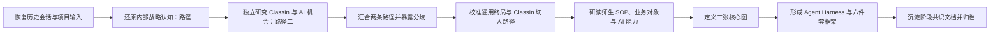

# ClassIn 教师 WorkBuddy 项目当日里程碑复盘

## 文档目的

本文从项目推进过程的角度，复盘 2026 年 8 月 15 日 ClassIn 教师 WorkBuddy 项目完成的主要工作：我们做了什么、采用了什么方法、输入了哪些信息、形成了哪些判断，以及这些判断如何逐步收敛为当前的阶段共识和下一阶段“六件套”。

它与 [[20260815-ClassIn教师WorkBuddy阶段共识与下一阶段六件套]] 的关系是：

- 本文回答“今天的共识是怎样形成的”；
- 《阶段共识与下一阶段六件套》回答“当前共识是什么，以及接下来产出什么”。

本文是项目过程记录和阶段复盘，不是正式立项文件、客户验证结论、PRD 或技术 Spec。

---

## 一、今天总体做了什么

今天的工作不是直接定义一组 AI 功能，而是完成了一次从历史信息恢复、战略问题拆解、独立研究、业务校准到产品与系统蓝图收口的完整认知过程。

总体路径可以概括为：

这一天完成的核心转变是：

> 项目从“讨论 ClassIn 要不要做一个教师 AI 产品、可能做哪些功能”，进入“围绕通用教师 WorkBuddy 终局，系统设计产品、业务对象、Agent Harness、数据上下文和分阶段验证路线”的阶段。

---

## 二、采用了什么工作方法

### 1. 先恢复上下文，再继续判断

由于原有会话无法正常打开，首先从本地会话数据中恢复历史讨论，并导出为可检索、可长期保存的 Markdown 文档，避免新会话在信息不完整的情况下重新推导。

### 2. 将内部认知和外部判断拆成两条路径

没有把内部会议观点直接当成事实，而是分成：

- 路径一：还原内部战略意图、经营压力、产品构想和关键假设；
- 路径二：从 ClassIn 公司、产品、业务结构、公开 AI 能力和行业事实出发独立判断。

这样做的目的是区分“组织希望什么”和“现有事实支持什么”。

### 3. 持续区分事实、判断、假设与未知

对“ClassIn 数据是壁垒”“AI 可以完成教师大量工作”“标杆客户能够带来新客”等表达，没有直接固化为结论，而是判断其证据等级，并明确哪些需要数据审计、教师试点和商业验证。

### 4. 通过用户校准修正分析边界

每一次分歧都没有简单折中，而是确认双方回答的是不是同一个层次的问题。最关键的一次校准，是把“通用型教师 WorkBuddy”和“从 ClassIn 内部场景切入”区分为终局产品定义与阶段进入路径。

### 5. 用真实业务链路约束产品想象

进一步研读参考项目 `/Users/eeo/Documents/claudecode/classin-pc-agentin`，从教师教、学生学的 SOP、业务对象、事实所有权和 AI 机会地图，校准 WorkBuddy 的能力边界。

### 6. 从业务闭环反推 Agent 与 Harness

没有先设计一个泛化 Agent 平台，而是先明确教师要完成的结果、WorkBuddy 操作的业务对象、AI 的自主性等级，再反推上下文、运行时、工具、审批、执行和评价能力。

### 7. 用终局蓝图和纵向验证双轨收口

一方面保留完整的终局教师工作台形态；另一方面明确首批能力需要通过窄而完整的纵向切片验证。愿景 Demo 负责形成共同想象，验证型产品负责证明真实价值。

---

## 三、今天输入了哪些信息

### 1. 历史会话与已有讨论材料

- 无法正常打开的历史 Codex 会话；
- 早期会议内容与讨论日志；
- 已有的 WorkBuddy 专题讨论与分析材料；
- 用户对公司处境、CEO 诉求、产品想法和组织背景的补充。

这些材料主要用于还原问题从何而来、内部已经讨论到哪里，以及存在哪些未解决分歧。

### 2. 路径一：内部战略信息

- ClassIn 当前业务与增长压力；
- CEO 对 AI、Agent、产品转型和拉新的关注；
- 已有客户、课堂、课程、作业、组织和用户数据等潜在资产；
- 面向教师课前、课中、课后的产品设想；
- 内嵌 ClassIn 与独立产品并行的初步想法；
- 通过愿景 Demo 对齐组织、客户与销售的推进方式。

### 3. 路径二：独立研究信息

- ClassIn 官方网站、帮助中心、公开产品和商业资料；
- ClassIn 公司发展、产品矩阵、目标客户和交付模式；
- 当前 App 的业务结构和入口特点；
- 已公开的 AI、AIGC 和智能体能力；
- 可验证的外部事实与证据缺口；
- AI-native 产品、权限、记忆、证据和评价方面的通用约束。

### 4. ClassIn PC AgentIn 参考项目

- 教师“教”的完整 SOP；
- 学生“学”的完整 SOP；
- 班级、课程、活动、课堂、作业、提交、待办、消息、空间、洞察和成长等核心对象；
- 各领域的事实所有权与状态边界；
- 不同业务时刻的 AI 工具、Copilot 和 Agent 机会；
- 诊断到干预、批改到订正、备课演练到改进、课程目标到课程对象等纵向闭环。

### 5. 用户在讨论中的关键校准

- 未使用 ClassIn 的教师也应能够使用 WorkBuddy；
- ClassIn 的作用是提供更完整的上下文和更深的执行能力，而不是限定产品边界；
- 通用终局与 ClassIn 场景切入并不矛盾；
- 三张图需要共同描述产品能力、对象关系和 AI 分阶段建设；
- 下一阶段要进一步想清楚 Agent Harness、业务知识、上下文、终局 Demo 和实施计划。

---

## 四、节点性 Milestone

### Milestone 1：恢复历史会话，重建项目连续上下文

#### 输入

- Codex 本地会话数据库；
- 当前项目目录；
- 原会话大致时间、主题和用户描述。

#### 怎么做

- 读取本地数据库结构和会话记录；
- 定位与当前项目相关的历史 session；
- 将主会话内容导出为 Markdown；
- 建立后续可检索、可引用的项目材料。

#### 形成的判断

- 原会话界面无法打开，不等于会话内容丢失；
- 项目推进不能依赖单一聊天窗口，需要把重要共识沉淀为项目文件和知识库文档。

#### 产出

- `历史会话导出_20260815.md`
- `讨论日志_20260815.md`

#### 节点意义

恢复了项目的认知连续性，并建立了“聊天用于讨论，文档用于长期承载”的基本工作方式。

---

### Milestone 2：完成路径一，形成内部战略假设地图

#### 输入

- 内部会议与项目讨论；
- CEO 诉求、增长背景和产品设想；
- 用户对组织、业务和现有资产的说明。

#### 怎么做

- 还原内部战略叙事；
- 拆分事实、强信号、判断、假设和未知；
- 分析全链路愿景、锋利单点、存量验证、拉新增长和独立产品之间的张力。

#### 形成的判断

- WorkBuddy 同时承担产品范式升级和增长探索；
- 教师是第一使用者，但价值还需要穿透学生、教学负责人和机构；
- ClassIn 的课堂与工作流入口是现实资产，数据和教育知识壁垒仍需验证；
- “覆盖教师大量工作”“标杆自然带来增长”等结论必须降级为假设。

#### 产出

- `路径一_内部战略认知与关键假设_20260815.md`

#### 节点意义

把内部愿望整理成了可讨论、可验证的战略假设，而不是继续以混合观点推进产品设计。

---

### Milestone 3：完成路径二，形成独立业务与 AI 战略判断

#### 输入

- ClassIn 公开一手资料；
- 公司、产品、客户、商业模式和 App 架构信息；
- 当前公开 AI 能力与行业环境；
- 可访问资料的证据边界。

#### 怎么做

- 独立分析 ClassIn 是什么公司、当前产品如何运转；
- 判断 AI 机会应落在哪个业务结果上；
- 从产品风险、数据权限、Memory、Agent 执行和评价角度提出约束；
- 给出第一目标用户、第一闭环、指标和阶段路线的候选方案。

#### 形成的判断

- WorkBuddy 不能只是聊天入口、AI 功能集合或 Agent 商店；
- ClassIn 的潜在优势是教学活动发生、证据关联、业务执行和结果反馈的闭环位置；
- 第一阶段适合从真实、可评价、可确认的教学闭环切入；
- 愿景 Demo 和验证型产品必须分轨；
- 数据可用性、授权、质量和商业结果均尚未被证明。

#### 产出

- `public_research_classin_20260815.md`
- `路径二_ClassIn业务与AI战略独立判断_20260815.md`

#### 节点意义

获得了一份不依赖内部既有结论的外部校准，使项目具备了汇合而不是自我论证的基础。

---

### Milestone 4：两条路径第一次汇合，形成可工作的产品起点

#### 输入

- 路径一的内部战略假设；
- 路径二的独立业务判断。

#### 怎么做

- 对比双方在目标用户、产品范围、产品形态、数据优势、增长逻辑和 Demo 作用上的一致与分歧；
- 将无法通过讨论解决的问题转为验证命题；
- 提出第一条可落地的课后教学闭环。

#### 形成的判断

- 第一用户是教师；
- 产品要帮助教师完成教学结果，而不是只生成内容；
- 教师保留专业控制权；
- 先利用 ClassIn 深度场景验证价值；
- 首个候选是“课后教学包”，即从课堂证据到诊断、分层行动、沟通、执行和追踪；
- 内嵌工作流优先、独立产品设置证据门槛，是当时的阶段性进入建议。

#### 产出

- `汇合_ClassIn_WorkBuddy项目起点_20260815.md`
- `共识结论_ClassIn教师WorkBuddy_20260815.md`

#### 节点意义

项目第一次从发散机会进入可以讨论首个用户承诺、指标和试点方式的产品假设阶段。

---

### Milestone 5：完成终局定位校准，打通“通用产品”与“ClassIn 路径”

#### 输入

- 用户对终局教师 Agent 的进一步说明；
- 第一次汇合中“内嵌优先、独立产品后置”的判断。

#### 怎么做

- 将讨论拆成三个不同问题：终局产品边界、能力增强方式、验证与商业进入路径；
- 检查“通用 WorkBuddy”与“ClassIn 场景切入”是否真的矛盾；
- 重新定义两者之间的产品关系。

#### 形成的判断

> 终局是通用型教师 WorkBuddy；ClassIn 是它最强的上下文、执行和结果反馈增强层。

- 未使用 ClassIn 的教师也可以完成教研、备课、课堂指导和课后服务；
- 使用 ClassIn 后，同一套能力获得更连续的数据、更精细的判断、更直接的执行和结果复查；
- ClassIn 内部场景是进入和验证路径，不是终局产品边界；
- 终局完整不等于第一版同时交付全部能力。

#### 产出

- 更新后的产品一句话定位；
- “通用核心 + ClassIn 增强层”的统一产品模型；
- 对此前共识文档和领域语言的修正。

#### 节点意义

解决了当天最重要的产品定位分歧，使长期愿景和阶段实施可以同时成立。

---

### Milestone 6：用 ClassIn 教与学 SOP 校准完整业务模型

#### 输入

- `/Users/eeo/Documents/claudecode/classin-pc-agentin` 的产品文档、研究材料和源码；
- 参考项目中的教师旅程、学生旅程、AI 机会地图与领域对象。

#### 怎么做

- 还原教师“教”和学生“学”的完整循环；
- 梳理每个业务时刻的动作、产物和事实所有者；
- 区分 AI 工具、Copilot 与 Agent；
- 用真实业务对象检验此前的课后闭环和终局 WorkBuddy 设想。

#### 形成的判断

- 教师主循环为：目标、设计、资源、演练、准备、课堂、作业、诊断、干预、沟通、反思；
- 学生主循环为：理解目标、计划预习、参与课堂、练习提交、求助反馈、订正掌握、自主学习、理解成长；
- WorkBuddy 应按业务时刻和教学结果组织，不按页面、聊天框或 Agent 人格组织；
- AI 输出必须进入课程、活动、作业、待办、消息和洞察等真实业务对象；
- “课后教学包”应进一步理解为“诊断到个性化干预”的纵向闭环；
- 课程目标到课程对象、备课演练到改进，是无 ClassIn 历史数据时的重要冷启动场景。

#### 产出

- `ClassIn教与学SOP及AI能力共识输入_20260815.md`
- 更新后的 `CONTEXT.md` 领域术语

#### 节点意义

产品不再停留在抽象的“课前、课中、课后”，而是获得了可以继续做对象建模、能力拆解和 Agent 设计的业务骨架。

---

### Milestone 7：定义三张核心图，建立产品蓝图的三个正交维度

#### 输入

- 通用 WorkBuddy 终局定位；
- 师生 SOP、业务对象和 AI 分层；
- 用户对第三张路线图含义的追问与校准。

#### 怎么做

- 区分“产品做什么”“理解和操作什么”“AI 以多大自主权怎么做”三个问题；
- 为每张图明确回答范围、不负责解决的内容和预期产出；
- 建立三张图对具体业务场景的联合描述方式。

#### 形成的判断

1. WorkBuddy 终局能力与体验地图：描述产品帮助教师完成什么；
2. 核心对象与上下文关系图：描述 WorkBuddy 理解、引用和操作什么；
3. AI 自主性与执行成熟度路线图：描述能力如何从工具到 Copilot，再在满足条件时升级为 Agent。

三张图之间的关系是：

> 一个具体产品场景 = 终局能力 × 核心对象与上下文 × AI 自主性等级。

并非所有能力都必须成为 Agent。正式评分、敏感学生判断和高风险沟通，可能长期保持 Copilot 加教师确认。

#### 产出

- 三张图的统一定义；
- 图与图之间的关系；
- Tool、Copilot、Agent 的共同成熟度语言。

#### 节点意义

把“终局能力地图”“模块关系”和“AI 路线图”从容易混淆的三份图，转成了共同描述一个产品的三个维度。

---

### Milestone 8：从三张图推导 Agent Harness、数据上下文和 Demo 路线

#### 输入

- 三张核心图；
- 教师 WorkBuddy 的 Agent 定位；
- ClassIn 数据与业务联动需求；
- 以终为始的 Demo 要求。

#### 怎么做

- 从真实教学闭环反推 Agent 所需的工程能力；
- 区分实时业务事实、教育知识、教师偏好和 AI 推断；
- 区分终局愿景 Demo 与验证型纵向切片；
- 将后续工作组织为相互依赖的六件套。

#### 形成的判断

Agent Harness 包含五个核心模块：

1. 上下文引擎；
2. 目标与任务运行时；
3. Skill 与业务工具系统；
4. 教师控制与执行系统；
5. 评价与持续学习系统。

ClassIn 信息必须区分：

- 通过工具实时读取的业务事实；
- 通过结构化检索使用的教育知识与规则；
- 由教师可查看、可修改、可删除的偏好记忆；
- 带来源、置信度和确认状态的 AI 推断。

#### 产出

- Agent Harness 的初步深模块定义；
- 数据、知识、上下文与工具的分类原则；
- 终局愿景 Demo 与验证型产品的双轨模型；
- 阶段 0 至阶段 4 的推进框架。

#### 节点意义

项目开始从产品方向共识进入产品蓝图和系统建设方法，明确 Agent 不是模型加聊天框，而是模型与 Harness、业务对象和反馈闭环的共同结果。

---

### Milestone 9：形成下一阶段“六件套”并完成阶段归档

#### 输入

- 前八个节点形成的产品、业务、AI、数据和实施共识。

#### 怎么做

- 将不同层次的问题拆成六项明确产出；
- 定义每项产出解决的问题、内容范围、交付形式与依赖关系；
- 明确先产品与业务模型，再系统与数据蓝图，最后体验表达与实施验证的推进顺序；
- 将全部阶段共识整理为可长期引用的文档，并同步至 Obsidian。

#### 形成的判断

下一阶段六件套为：

1. 终局教师 WorkBuddy 产品定义；
2. 三张核心图；
3. Agent Harness 架构；
4. ClassIn 数据、知识、上下文与工具清单；
5. 终局愿景 Demo 体验脚本；
6. 分阶段纵向切片、评价指标和升级门槛。

#### 产出

- [[20260815-ClassIn教师WorkBuddy阶段共识与下一阶段六件套]]
- 本里程碑复盘文档

#### 节点意义

今天的工作完成收口。项目已经拥有统一起点、共同语言、终局边界和下一阶段产出结构，可以进入正式蓝图设计。

---

## 五、今天最终形成了哪些核心判断

### 产品定位

- 终局是一套不依赖 ClassIn 也能工作的通用教师 WorkBuddy；
- ClassIn 是最强的上下文、执行和结果反馈增强层；
- 从 ClassIn 内部场景切入是验证与商业进入路径，不是最终边界。

### 产品组织方式

- 按教师业务时刻、教学结果和反馈循环组织；
- 不按页面、聊天入口、模型能力或 Agent 人格组织；
- 统一教师 WorkBuddy 工作台是主产品壳层，情境入口和运行审批区域共享同一个 WorkBuddy 核心；AI 工具、Copilot 和 Agent 是同一界面中的三种协作模式。

### AI 能力判断

- AI 工具、Copilot、Agent 是自主性与执行成熟度层级，不是三种界面；
- Agent 需要目标、计划、上下文、真实工具、运行状态、审批、失败恢复、结果追踪和审计；
- 高风险教育行为必须保留教师控制权；
- 并非所有能力最终都需要升级为 Agent。

### Harness 判断

- Harness 要从具体教学闭环反推，不能先做泛化平台；
- 核心由上下文、任务运行时、Skill 与工具、教师控制、评价学习五部分组成；
- AI 输出需要进入真实业务对象，并能够执行、撤销、审计和复查。

### 数据与上下文判断

- 不能把 ClassIn 所有数据统一文档化后塞给模型；
- 业务事实、知识规则、教师偏好、AI 推断必须分离；
- ClassIn 的差异化来自工作流入口、连续证据、教育知识、执行系统和结果反馈的组合，而不是单纯“数据更多”。

### 实施判断

- 以终为始定义完整产品，但通过少量纵向切片逐步验证；
- 愿景 Demo 用于战略和体验对齐，验证型产品用于证明真实价值；
- 阶段升级依据持续使用、节省时间、采纳与修改、结果改善、安全性、成本和商业价值，而不是功能数量或 Agent 数量。

---

## 六、今天完成了什么，尚未完成什么

### 已经完成

- 恢复并固化历史讨论上下文；
- 完成内部战略路径和外部独立判断；
- 完成两条路径的汇合与关键校准；
- 明确通用终局与 ClassIn 增强层关系；
- 建立师生业务循环、核心对象和 AI 成熟度共同语言；
- 明确三张核心图的定义和关系；
- 初步定义 Agent Harness 和数据上下文原则；
- 形成下一阶段六件套及推进顺序；
- 完成项目目录和 Obsidian 的阶段文档归档。

### 尚未完成，也不能视为已经证明

- 尚未获得管理层正式立项确认；
- 尚未通过真实教师访谈或跟岗验证需求强度；
- 尚未完成 ClassIn 生产数据、权限、质量和工具可用性审计；
- 尚未证明通用 WorkBuddy 在无 ClassIn 上下文时的留存和付费价值；
- 尚未完成三张图的正式绘制；
- 尚未形成详细 Harness 架构、接口和运行时设计；
- 尚未确定首批真实纵向切片、试点机构和阶段决策门；
- 尚未完成可运行的终局 Demo 或验证型产品。

这个边界很重要：今天形成的是高质量的产品与系统设计起点，不是市场、工程或商业结果已经成立。

---

## 七、当前项目所处阶段

今天之前，项目主要处于：

> 机会发现、内部观点整理和产品方向讨论。

今天结束后，项目进入：

> 终局产品与系统蓝图设计阶段。

下一步的正式起点是六件套的阶段 A：

1. 完成《终局教师 WorkBuddy 产品定义》；
2. 绘制三张核心图；
3. 用课程目标到课程对象、备课演练到改进、批改到订正、诊断到个性化干预四条闭环进行交叉验证；
4. 三张图稳定后，再反推 Agent Harness 和 ClassIn 数据、知识、上下文与工具清单；
5. 最后形成终局 Demo 体验脚本与分阶段实施验证计划。

---

## 八、一句话总结今天

> 今天没有直接开始做一个 AI 功能或界面，而是通过恢复上下文、双路径研究、关键分歧校准和业务模型验证，把 ClassIn 教师 WorkBuddy 从一个方向性构想，推进成了一套具有明确终局定位、业务骨架、AI 分层、Harness 方向和阶段产出计划的产品命题。
