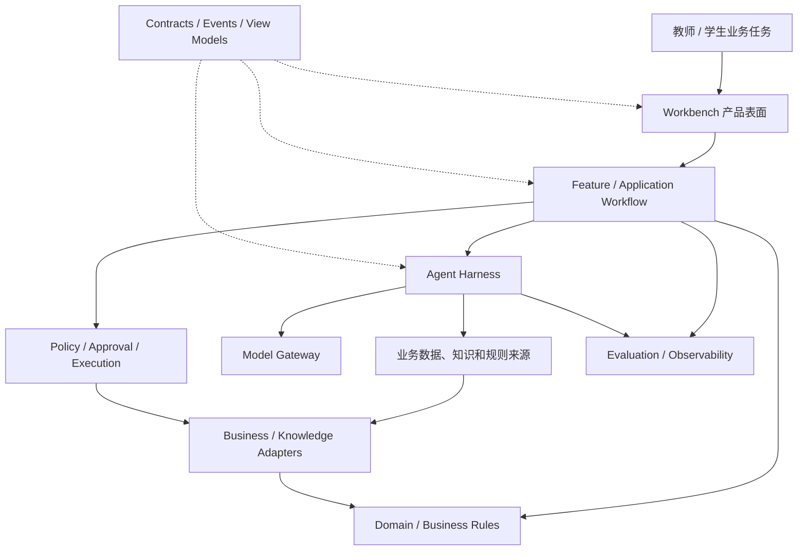

# 从产品设计到实现架构蓝图 Session 日志

## 文档说明

本文记录本次关于“产品设计完成后，如何在进入 PRD、Feature Spec、tickets 和代码之前，把 WorkBuddy 的实现方式讲清楚”的方向校准与方法讨论。

本文是过程日志，不是正式架构事实源。后续形成的 WorkBuddy 实现架构蓝图及其评审结论，才应写入 `docs/06-architecture/` 并成为研发拆解的输入。

## Session 总览

| 项目 | 内容 |
| --- | --- |
| 工作目录 | `/Users/eeo/Documents/claudecode/classin-ai-buddy` |
| 日期 | 2026-08-19 |
| 讨论主题 | 从产品设计过渡到实现架构的方法与表达方式 |
| 已确认前提 | WorkBuddy 是什么、覆盖哪些业务场景和 AI 能力已经基本明确 |
| 核心问题 | 如何让产品、业务、AI、数据和工程团队直观理解“这套系统怎样实现” |
| 方向决定 | 暂停 `/to-spec`、`/to-tickets` 和代码实施，先完成实现架构蓝图 |
| 推荐产出 | 一张总体架构主图、五个配套视图、每个业务场景一张实现卡片 |

## 1. 为什么暂停直接进入研发实施

此前已经完成两类核心问题的梳理：

1. 要建设一个什么样的教师 WorkBuddy / 教师工作台；
2. WorkBuddy 要覆盖哪些单点能力、组合能力和完整业务闭环。

随后曾尝试按以下链路进入研发：

```text
整体产品方案
→ 交互状态原型
→ Feature Spec
→ tickets
→ implement
```

进一步反思后发现，当前缺少的不是更细的代码需求，而是产品方案与研发实现之间的一层共同架构语言。现有材料对“做什么”描述充分，但对以下问题还不够简洁、直观：

- 产品功能模块如何对应系统模块；
- 业务数据、Domain Knowledge 和业务规则由谁提供；
- Agent Harness、Skill、模型、工具和业务 API 如何分工；
- 哪些内容是 AI 生成，哪些是确定性规则，哪些会产生业务副作用；
- 不同团队分别拥有哪些 Module、Interface 和事实。

如果跳过这一层直接生成 tickets，研发团队仍需要自行解释和拼装架构，容易造成产品逻辑、Agent 能力、业务规则和数据接口相互混杂。

因此，本次明确暂停继续细化 Feature Spec、拆票和代码实施，先把“怎么实现”讲清楚。

## 2. 对现有“七段结构、四图三表”的重新定位

现有的七个产品问题、四张图和三张表仍然有效，但它们主要回答的是：

> 一条教师业务场景在产品层面应该怎样被完整定义。

它适合表达：

- 教师要完成什么业务结果；
- 谁在什么情况下使用；
- 系统读取和产出哪些对象；
- AI 怎样参与业务步骤；
- 教师在哪里审教、修改和确认；
- 哪些动作改变业务；
- 如何评价是否真的有帮助。

它不应继续承担完整工程架构的表达任务。若把产品流程、数据来源、Skill Pipeline、系统模块、状态和团队分工全部叠加到这套材料中，会导致信息完整但阅读成本高，无法像一张架构图那样直接回答“系统有哪些部分、如何协作”。

新的定位是：

```text
七段结构 + 四图三表
= 产品场景拆解方法

WorkBuddy 实现架构蓝图
= 产品设计到研发实现的中间层
```

## 3. 实现架构蓝图要回答的核心问题

本次讨论提出的三个起始问题是：

1. WorkBuddy 有哪些产品功能模块；
2. 各业务逻辑需要哪些业务数据库、知识库、Domain Knowledge 和业务规则，这些输入如何提供；
3. 需要哪些 AI 能力、设计哪些 Skill、每个 Skill 的处理 Pipeline 是什么。

在此基础上，进一步补充为八个需要共同回答的问题：

1. 产品表面由哪些功能模块组成；
2. 每个 Feature 由哪些 Application、Domain 和 Harness Module 实现；
3. 正式业务事实、Domain Knowledge、业务规则和运行信号分别来自哪里；
4. Agent、Skill、Model、Tool、Validator 和 Adapter 如何分工；
5. 教师意图怎样从 UI Command 进入 Workflow 并产生 Artifact；
6. 哪些步骤只是生成草稿，哪些步骤会产生业务副作用；
7. 状态、版本、权限、审批、回执和评价如何贯穿全链路；
8. 哪个团队拥有哪个 Module、Interface、事实和交付责任。

## 4. 推荐的表达方式：一张主图 + 五个视图 + 场景实现卡片

不建议尝试用一张巨大的架构图表达全部内容。单张图一旦同时包含产品、数据、AI、运行时、接口和团队边界，就会失去阅读路径。

推荐采用：

```text
一张总体架构主图
+ 五个配套视图
+ 每个业务场景一张实现卡片
```

### 4.1 总体架构主图

主图只表达系统的主要层次、责任和允许的依赖方向：



主图只回答四件事：系统有哪些层、每层负责什么、层之间怎样协作、哪些跨层调用不允许发生。

### 4.2 配套视图一：产品功能模块地图

该视图回答“教师实际使用的 WorkBuddy 由哪些产品模块构成”。建议至少包括：

| 产品模块 | 主要职责 |
| --- | --- |
| 任务入口 | 选择或描述教学任务 |
| 目标与范围 | 收集目标、年级、课时和班级约束 |
| 上下文与依据 | 展示业务数据、知识来源、授权和缺口 |
| Artifact 工作区 | 查看、编辑和比较课程方案包 |
| 审教工作区 | 对整体方案、单元和活动提出意见 |
| 版本工作区 | 查看版本、Diff 和修订原因 |
| 规则校验 | 展示阻断项和非阻断警告 |
| 确认与审批 | 确认最终版本并批准写回 |
| 执行回执 | 展示对象级实际处理结果 |
| 复查与评价 | 记录采纳、修改、结果和后续动作 |

该视图只描述产品表面，不直接展开 Agent、Skill 或 API。

### 4.3 配套视图二：Feature 到系统模块映射

该视图是产品与研发之间最重要的桥梁，回答“一个产品功能由哪些工程模块共同实现”。

| 产品功能 | Application Workflow | Harness | Domain / Rule | 外部依赖 | 输出 |
| --- | --- | --- | --- | --- | --- |
| 目标澄清 | Goal Workflow | Context / Runtime | GoalIntent 规则 | 教师输入、课程范围 | GoalIntentDraft |
| 课程结构生成 | Course Production Workflow | Skill Executor | 课程结构规则 | Domain Knowledge、课程模板 | ArtifactDraft |
| 审教修订 | Review Workflow | Revision Skill | Artifact Version | 教师意见、当前版本 | 新版本和 Diff |
| 完整性校验 | Validation Workflow | 可选解释能力 | Domain Validator | 目标、课时、规则 | ValidationReport |
| 保存课程草稿 | Save Workflow | Control | 权限与版本规则 | ClassIn Adapter | ProposedAction / Receipt |
| 结果评价 | Evaluation Workflow | Evaluation | 评价事件规则 | 教师操作、回执 | EvaluationEvent |

### 4.4 配套视图三：外部数据、知识和规则供给

该视图回答“业务逻辑需要什么外部输入、由谁提供、如何进入系统”。至少区分：

| 来源类别 | 示例 | 提供方式 | 主要使用者 |
| --- | --- | --- | --- |
| 业务事实 | 教师、机构、课程、单元、活动和版本 | Business API / Adapter | Domain、Context |
| Domain Knowledge | 课程标准、教学法、评价量表 | Knowledge API / 检索 / 版本化知识包 | Skill |
| 业务规则 | 权限、课时约束、状态转换、写回条件 | Domain Policy / Rule Service | Domain、Control |
| 运行信号 | 超时、冲突、权限拒绝、工具错误 | Runtime Event / Receipt | Runtime、Control、UI |

每个来源还要记录事实所有者、查询接口、Schema、版本、授权范围、更新时间、缺失/冲突处理、存储边界和降级方式。

### 4.5 配套视图四：AI Skill Pipeline

该视图回答“Agent 如何调用 Skill、模型和工具，并把结果带回业务流程”。推荐的通用链路是：

```text
教师意图
→ 意图结构化
→ 上下文装配
→ 任务计划
→ Skill 选择
→ Skill 输入准备
→ Model 调用
→ 结构化输出校验
→ 业务规则校验
→ Artifact 生成或修订
→ 教师审教
→ Action 提议
→ Approval
→ Business Adapter
→ ExecutionReceipt
→ Evaluation
```

必须明确角色边界：

- Skill 负责可复用的方法能力；
- Model 负责理解和生成；
- Tool / Adapter 负责读取或操作外部系统；
- Rule Validator 负责确定性业务校验；
- Control 负责权限、审批和写回；
- Skill 不能直接写入 ClassIn；
- Model 不能决定权限、版本和业务成功。

### 4.6 配套视图五：状态、控制与业务副作用

该视图回答“哪些步骤只产生草稿，哪些步骤真的改变业务”。核心对象链是：

```text
WorkBuddyRun
→ GoalIntentDraft
→ ContextSnapshot
→ ArtifactDraft
→ ReviewComment
→ ArtifactDraft v2...
→ ValidationReport
→ ProposedAction
→ Approval
→ ExecutionReceipt
→ EvaluationEvent
```

它必须清楚表达：

```text
模型生成成功 ≠ 教师确认
教师确认 ≠ 业务写回
业务写回成功 ≠ 教学效果已经证明
```

## 5. 每个业务场景的实现卡片

总架构只建立共同语言。进入具体场景时，还需要一张实现卡片，把该场景投影到总体架构中。

建议每张卡片包含：

| 维度 | 要记录的内容 |
| --- | --- |
| 业务目标 | 教师最终要完成什么 |
| 产品模块 | 涉及哪些 WorkBuddy 功能模块 |
| Application Workflow | 业务流程如何编排 |
| Domain Objects | 使用哪些领域对象和业务规则 |
| Harness Modules | 使用哪些 Harness 能力 |
| Skills | 需要哪些 Skill，各自输入输出是什么 |
| Model Calls | 哪些步骤需要模型，哪些不需要 |
| External Data | 需要哪些业务数据和 API |
| Domain Knowledge | 需要哪些知识包、量规和版本 |
| Commands | 教师可以执行哪些操作 |
| States | Run、Artifact、Approval 和 Receipt 如何变化 |
| Side Effects | 哪些动作产生业务副作用 |
| Interfaces | 模块之间通过什么契约协作 |
| Errors | 缺口、冲突、权限、部分成功和恢复 |
| Evaluation | 如何判断产物、执行和业务价值 |
| Team Owners | 哪个团队拥有哪个 Module 和事实 |
| Delivery Order | 依赖哪些共享能力，按什么顺序交付 |

当前“课程目标到课程对象”场景的核心实现链可以压缩为：

```text
课程方案工作区
→ Course Production Workflow
→ Context Engine
→ Goal / Structure / Revision Skills
→ Artifact Workspace
→ Review & Validation
→ Control & Approval
→ ClassIn Course Adapter
→ ExecutionReceipt
→ Evaluation
```

## 6. 建议的正式产出包

下一阶段建议形成以下正式架构材料：

```text
WorkBuddy 实现架构蓝图
├── 1. 总体分层架构图
├── 2. 产品功能模块地图
├── 3. Feature → Module 映射表
├── 4. 外部数据 / 知识 / 规则供给图
├── 5. AI Skill Pipeline 图
├── 6. 状态、控制与业务副作用图
├── 7. Module / Interface / Adapter 清单
├── 8. 团队职责与交付依赖图
└── 9. 课程目标到课程对象实现卡片
```

这套材料的目的不是增加文档数量，而是让不同角色用同一套图和映射关系回答：产品功能如何被系统实现、数据和知识从哪里来、AI 怎样参与、业务副作用如何受控、团队如何分工。

## 7. 后续推进顺序

当前建议顺序调整为：

```text
已确认的产品设计
→ WorkBuddy 实现架构蓝图
→ 课程目标到课程对象实现卡片
→ 用其他三个优先场景交叉验证共享 Module
→ 确认 Module、Interface、Adapter 和团队 Owner
→ Feature Spec
→ 垂直工程切片与 tickets
→ 代码实施
```

其中，后续三个优先场景用于验证架构是否真正可复用：

1. 作业批改 → 错因分析 → 订正；
2. 备课演练 → 教学改进；
3. 学情诊断 → 个性化干预。

完成交叉验证后，才能判断哪些 Module 是 WorkBuddy 共享 Harness，哪些是课程生产场景特有能力。

## 8. 本次形成的共识

1. 当前不继续推进 `/to-spec`、`/to-tickets` 或代码实施；
2. 七段结构、四图三表继续作为产品场景拆解方法；
3. 产品设计与研发之间新增“WorkBuddy 实现架构蓝图”这一明确阶段；
4. 架构蓝图采用“一张主图 + 五个配套视图 + 场景实现卡片”，不依赖一张巨型架构图解释全部问题；
5. 实现架构必须同时表达产品模块、Application Workflow、Harness、Skill、Domain、数据/知识/规则供给、Adapter、状态副作用和团队 Owner；
6. 首先用“课程目标到课程对象”完成样板，再用其他三个优先场景验证共享架构；
7. 只有实现架构边界和团队责任确认后，才恢复 Spec、tickets 和代码实施链路。
