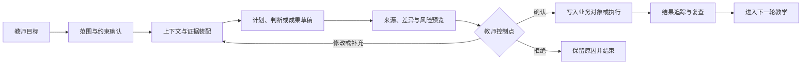
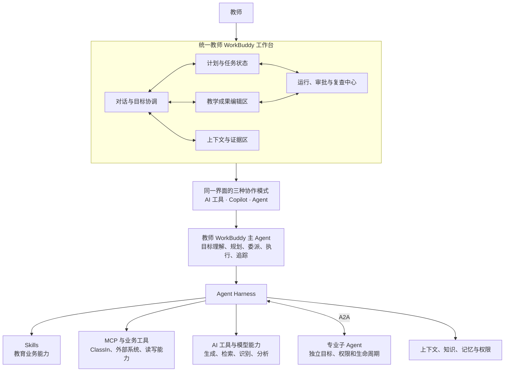

# 终局教师 WorkBuddy 产品定义

## 文档定位

本文是 ClassIn 教师 WorkBuddy 下一阶段“六件套”的第一件，用于锁定终局产品的共同基线，并约束后续三张核心图、Agent Harness、数据与工具清单、终局 Demo 和分阶段实施计划。

本文定义的是终局边界，不等同于第一版功能范围；定义的是当前项目共识，不代表真实客户、管理层和商业结果已经验证。

相关文档：

- [[20260815-ClassIn教师WorkBuddy阶段共识与下一阶段六件套]]
- [[20260815-ClassIn教师WorkBuddy项目当日里程碑复盘]]

---

## 一、一页产品定义

| 维度 | 当前定义 |
| --- | --- |
| 产品名称 | 教师 WorkBuddy |
| 产品类别 | 面向教师完整教学工作的通用 AI 工作伙伴 |
| 第一用户 | 直接承担课程设计、备课、授课、评价和学生服务的一线教师 |
| 协同角色 | 学生、教学负责人、助教、机构管理者、家长或监护人 |
| 核心对象 | 教师要完成的教学结果，以及贯穿结果形成过程的目标、教学产物、证据、判断和行动 |
| 核心承诺 | 从教师目标出发，组织获得授权的上下文和证据，生成可编辑成果，并在教师控制下执行后续教学行动和追踪结果 |
| 终局边界 | 不使用 ClassIn 也能完成教研、备课、课堂支持、评价、干预、沟通和反思的核心工作 |
| ClassIn 角色 | 最深的身份、业务上下文、连续教学证据、执行和结果反馈增强层 |
| 产品组织方式 | 按教师业务时刻、教学结果和反馈循环组织，不按页面、模型能力或 Agent 人格组织 |
| 终局产品形态 | 一个统一教师 WorkBuddy 工作台作为主产品壳层，连接 ClassIn 情境入口；同一界面支持 AI 工具、Copilot 和 Agent 三种协作模式 |
| AI 行动原则 | 先理解和组织证据，再形成判断和草稿；有副作用的行动根据风险由教师确认、授权、撤销和审计 |
| 成功定义 | 教师持续完成更高质量的教学结果，同时显著减少查找、整理、生成、协调和跟进成本 |
| 第一阶段原则 | 以终为始，通过少量真实纵向闭环验证，不把终局能力一次性铺成半成品功能集合 |

### 一句话定位

> **教师 WorkBuddy 是一套通用的教师教学工作伙伴；ClassIn 是它最强的上下文、执行和结果反馈增强层。它基于教师授权的教学上下文，理解目标、组织证据、给出可解释判断、生成可编辑成果，并在教师确认后完成后续教学行动和结果追踪。**

### 北极星承诺

> **教师只需要说明要达成的教学结果，WorkBuddy 就能够在正确的组织、课程、班级、学生和时间范围内，持续协助教师从设计走向执行、从证据走向判断、从判断走向干预，并把结果带入下一轮教学。**

---

## 二、为什么需要这个产品

### 1. 教师真正缺少的不是又一个生成工具

教师已经可以使用通用模型生成教案、题目、总结和评语，但完整教学工作仍然高度割裂：

- 目标、课程、资源、课堂、作业和沟通分散在不同工具中；
- 教师需要重复查找资料、拼接上下文和解释班级差异；
- 单次 AI 生成不知道产物最终被怎样使用，也看不到后续结果；
- 课堂和作业证据难以自然转化为可执行的下一步；
- 个性化服务需要同时理解目标、学生证据、教师策略和机构规则；
- 高风险教育判断不能由一个不可追溯的黑盒直接发布或执行。

因此，产品机会不只是“生成得更快”，而是建立一条完整的教师工作闭环：

```text
目标
→ 装配上下文
→ 组织事实与证据
→ 形成可解释判断
→ 生成可编辑教学产物
→ 教师确认或授权
→ 写入业务对象并执行
→ 追踪结果
→ 调整下一轮教学
```

### 2. ClassIn 为什么能够提供独特增强

ClassIn 的潜在优势不只是拥有数据，而是位于教学活动真实发生的位置：

- 认识当前教师属于哪个机构、承担什么角色；
- 连接班级、课程、课堂、作业、资源、消息和待办；
- 获得连续且可回溯的教学和学习证据；
- 将教师确认后的成果写回真实业务对象；
- 读取执行结果并支持后续复查。

只有当这些信息获得授权、语义可信、来源可见、可以纠正并能改善教学结果时，它们才构成真实差异化。

### 3. 通用产品与 ClassIn 增强不是两个产品

终局是一套 WorkBuddy 核心，两类上下文来源：

| 使用状态 | 上下文建立方式 | 可以形成的价值 |
| --- | --- | --- |
| 未连接 ClassIn | 教师输入目标、创建课程与班级、上传资料、补充学生信息、连接外部工具 | 教研、课程设计、备课演练、内容生产、基于教师输入的评价与沟通支持 |
| 已连接 ClassIn | 在教师授权范围内读取机构、班级、课程、课堂、作业、互动、消息和结果 | 更连续的证据、更精细的诊断、更低的上下文配置成本、可直接执行的行动和结果复查 |

二者共享教师身份、任务状态、产品能力和 Agent Runtime。ClassIn 是深度连接器，不是产品能否成立的唯一前提。

---

## 三、服务谁

### 1. 第一用户：一线教师

第一用户是直接对教学结果负责，并需要持续完成以下工作的教师：

- 理解课程目标和学生情况；
- 设计课程、单元、教学活动和资源；
- 备课、演练和组织课堂；
- 布置、批改和反馈任务；
- 诊断班级和学生问题；
- 进行个性化干预与沟通；
- 复盘教学并调整下一轮。

“教师”是终局角色定义，不代表所有教师具有相同需求。后续验证必须进一步限定机构类型、学段、学科、班型、教学自主权和付费关系。

### 2. 关键协同角色

| 角色 | 与 WorkBuddy 的关系 | 需要获得的价值 |
| --- | --- | --- |
| 学生 | 教学行动的参与者和学习证据的产生者 | 更清楚的目标、更及时的反馈、更适合自己的练习与帮助 |
| 教学负责人 | 教学质量、规范和教师发展的管理者 | 更可见的过程、更一致的标准、更可复用的有效实践 |
| 助教 | 教学执行和沟通的协作者 | 更明确的行动项、分工和跟进状态 |
| 机构管理者 | 采购、治理和经营责任人 | 教学质量、教师效率、客户体验、合规和可控性 |
| 家长或监护人 | 学习服务和沟通的接收者 | 基于事实、适度、可理解且经教师确认的反馈 |

### 3. 学生不是被动数据对象

学生拥有独立的学习目标、任务、作答、求助、订正、自主学习和成长过程。教师 WorkBuddy 可以围绕教师目标协调学生行动，但不能：

- 把学生自主问答自动算作正式任务完成；
- 代做、代交或未经授权改变学生提交状态；
- 将一次 AI 推断固化为长期学生标签；
- 用教师没有权限使用的数据形成评价；
- 以效率为由替代真实的师生关系。

学生侧 AI 最终作为教师 WorkBuddy 的协同能力，还是独立 Student Buddy，当前尚未决定；无论采用哪种承载方式，都应通过共享的课程目标、学习任务、证据和反馈协议与教师 WorkBuddy 协同。

---

## 四、教师需要完成的工作

WorkBuddy 围绕一个连续教师教学循环组织：

```text
明确目标
→ 课程设计与教研
→ 资源、课件与活动生产
→ 备课演练
→ 排课与课前准备
→ 开展课堂
→ 布置任务与批改
→ 教学诊断
→ 个性化干预
→ 沟通跟进
→ 教学反思与复用
→ 下一轮目标
```

### 六个终局能力域

| 能力域 | 教师要完成的结果 | 主要业务时刻 | 代表性教学产物 |
| --- | --- | --- | --- |
| 目标与课程设计 | 将标准、目标和学习者特点转化为可执行课程 | 明确目标、课程设计与教研 | 目标、成功标准、课程、单元、活动草稿 |
| 内容与备课准备 | 形成可使用的资源、教案、课件、活动和改进方案 | 资源生产、备课演练、课前准备 | 教案、课件、资源、题目、演练报告、准备清单 |
| 课堂与教学实施 | 在教学发生过程中提供适时、低干扰的支持并形成证据 | 开展课堂与互动 | 字幕、板书、课堂记录、活动结果、观察证据 |
| 评价与教学诊断 | 将作业、课堂和反馈证据转化为可解释判断 | 布置批改、诊断 | 作业、评语、订正要求、诊断假设 |
| 干预与协同服务 | 将判断转化为分层行动、资源、沟通和复查 | 个性化干预、沟通跟进 | 干预计划、分层任务、资源、消息草稿、复查节点 |
| 反思与持续改进 | 比较目标与结果，沉淀有效策略并进入下一轮 | 教学反思与复用 | 反思记录、策略、复用资源、下一轮调整 |

这些能力域不是六个孤立页面。相同的目标、课程、班级、学生、产物和证据会跨能力域持续流动。

### 四项横向能力

所有能力域共同依赖：

1. **上下文与证据**：确认当前身份、范围、事实、知识、来源和不确定性；
2. **成果与业务对象**：将 AI 结果保存为可编辑、可交付的真实教学产物；
3. **教师控制与执行**：支持预览、修改、确认、拒绝、发布、撤销和审计；
4. **追踪与学习**：记录采纳、修改、执行结果和下一轮改进。

---

## 五、终局北极星用户故事

### 故事主线：完成一次教学循环

一位教师希望围绕一个明确学习目标完成新单元教学。

#### 1. 目标与设计

教师说明课程目标、学生范围、时间约束和成功标准。WorkBuddy 读取教师提供的资料，或在授权后读取已有课程、班级和历史结果，形成范围说明、证据缺口和课程设计草稿。

教师可以查看每项建议基于什么标准、资料和历史证据，并修改目标、顺序和教学策略。

#### 2. 内容与备课

WorkBuddy 将确认后的设计转化为教案、课件、活动、问题和资源草稿。教师进行一次备课演练后，WorkBuddy 以时间戳证据指出知识覆盖、讲解节奏和互动设计问题，生成修改计划，并保留前后版本差异。

#### 3. 教学发生

课堂开始前，WorkBuddy 检查资源、成员、时间和准备事项。课堂中只提供适合当前场景的低干扰帮助，并将可观察的讲解、互动、作答和课堂事件整理为证据，而不是直接推断学生能力。

#### 4. 评价与诊断

课堂或作业结束后，WorkBuddy 结合目标、成功标准和获得授权的证据，区分班级共性问题、个体表现、未知项和诊断假设。教师可以回到原始来源，确认、修改或拒绝判断。

#### 5. 干预与沟通

WorkBuddy 根据教师确认的判断生成分层作业、资源、辅导行动、消息和复查节点。任何正式评分、批量发布、学生敏感评价和外部沟通，都经过教师确认或符合教师预先授权的低风险规则。

#### 6. 结果追踪与下一轮

WorkBuddy 追踪任务完成、订正、反馈和复查结果，将本轮目标与实际结果进行比较，帮助教师形成反思和下一轮课程调整。有效策略可以进入教师可管理的长期偏好或可复用资源，未经确认的推断不会成为长期事实。

### 两种上下文状态下的同一故事

#### 未连接 ClassIn

教师主动输入目标、上传资料、建立课程和学生范围，WorkBuddy 通过文件、手动记录和外部连接器完成核心循环。教师需要承担更多上下文建立和结果回填工作。

#### 已连接 ClassIn

WorkBuddy 在正确权限范围内自动获得课程、课堂、作业、互动和执行结果，减少重复输入，并能把确认后的成果写入课程、作业、待办、资源和消息系统。教师仍然拥有相同的查看、编辑、拒绝和撤销权。

---

## 六、终局体验模型

### 1. 一次 WorkBuddy 协作的标准结构



### 2. 教师应该始终知道什么

在重要任务中，教师需要清楚看到：

- WorkBuddy 当前在帮助完成什么目标；
- 使用的是哪个机构、角色、课程、班级、学生和时间范围；
- 哪些内容是业务事实，哪些是知识规则、教师偏好或 AI 推断；
- 每个关键判断来自哪些证据，证据是否完整；
- 将要创建、修改或发布哪些业务对象；
- 哪些动作已经执行，哪些正在等待确认；
- 失败后发生了什么，是否可以重试或撤销；
- 后续何时复查，以及结果如何影响下一轮。

### 3. WorkBuddy 的主动性边界

WorkBuddy 可以主动发现待处理问题、建议下一步和准备草稿，但主动性必须同时满足：

- 与当前教师目标或明确职责相关；
- 有足够证据或明确标注证据不足；
- 不跨越机构、角色、班级和权限范围；
- 不制造高频、低价值提醒；
- 有副作用的动作遵守教师授权和风险等级；
- 能解释为什么此刻提出建议。

---

## 七、终局产品具象形态

### 1. 终局是一个统一教师 WorkBuddy 工作台

教师最终面对的不是多个彼此割裂的 AI 应用，而是一个统一 WorkBuddy。它以对话作为表达目标和协商约束的主入口，以结构化教学工作区承载成果、证据和执行状态，并通过同一个主 Agent 协调底层能力。



### 2. 工作台的五个可见区域

| 区域 | 教师看到什么 | 主要责任 |
| --- | --- | --- |
| 对话与目标协调 | 自然语言目标、澄清问题、约束和反馈 | 表达意图、协商范围、补充信息和修正结果 |
| 计划与任务状态 | 目标、步骤、依赖、当前状态和完成条件 | 让复杂任务可检查、可暂停、可恢复 |
| 教学成果编辑区 | 课程、教案、课件、作业、评语、干预计划和消息草稿 | 查看、编辑、比较和确认结构化教学产物 |
| 上下文与证据区 | 当前机构、课程、班级、学生范围、来源和不确定性 | 解释 WorkBuddy 知道什么、凭什么判断 |
| 运行、审批与复查中心 | 待确认动作、执行记录、失败、撤销、审计和复查节点 | 控制副作用并持续跟踪结果 |

工作区可以根据任务重排和渐进展开，不要求始终以五栏同时显示。这里定义的是信息责任，不是固定页面线框。

### 3. 同一个界面中的三种协作模式

| 模式 | 教师怎样发起 | WorkBuddy 怎样工作 | 界面重点 |
| --- | --- | --- | --- |
| AI 工具 | 发起一个边界明确的单点任务 | 调用一个或少量原子能力返回结果 | 输入、结果、来源和采用 |
| Copilot | 在当前课程、作业、课堂或学生范围中共同工作 | 理解上下文并形成可编辑、待确认草稿 | 对象、证据、差异和教师确认 |
| Agent | 给出跨对象或跨时间的业务目标 | 制定计划、委派能力、调用工具、等待审批、执行并复查 | 计划、运行状态、审批、失败和结果追踪 |

Copilot 不是主 Agent 调用的一种底层协议，而是 WorkBuddy 与教师共同工作的协作模式。底层可调用单元是 Skills、AI 工具、MCP/业务工具和满足独立委派条件的专业子 Agent。

### 4. ClassIn 情境入口

课程、教案、课件、课堂、作业、洞察、消息和资源页面可以提供高意图入口。入口应携带当前业务对象和权限进入同一个 WorkBuddy 任务，而不是创建一个无关的新聊天应用。

教师可以：

- 在业务页面内完成短任务；
- 将任务展开到完整 WorkBuddy 工作台；
- 离开页面后继续查看运行状态；
- 从工作台返回真实业务对象编辑或发布成果。

### 5. 主 Agent 与专业子 Agent

教师 WorkBuddy 主 Agent 是教师面对的统一身份，负责理解目标、组织计划、选择能力、协调教师审批并汇总最终结果。

专业子 Agent 只在任务拥有独立目标、明确完成契约、隔离上下文或权限、独立失败恢复和审计需求时存在。简单生成、检索、分析和业务写入应使用 Skill 或工具，不为每项功能创建 Agent。

### 6. 产品形态不变量

- 一个统一 WorkBuddy 身份，不要求教师在多个 Agent 人格之间选择；
- 对话是主意图入口，不是唯一成果容器；
- 教学产物在结构化工作区编辑，并最终进入真实业务对象；
- Tool、Copilot 和 Agent 是同一产品中的协作模式，不是三个产品；
- 情境入口、完整工作台和运行中心共享任务状态；
- 主 Agent 可以通过 A2A 委派专业子 Agent，但不以多 Agent 数量作为产品价值；
- 教师始终能够看到上下文、计划、证据、待确认行动和执行结果。

---

## 八、AI 在产品中的角色

### 1. AI 工具、Copilot 与 Agent

| 层级 | 产品责任 | 教师控制 |
| --- | --- | --- |
| AI 工具 | 完成一个边界清楚的生成、识别、检索、转换或解释任务 | 教师决定是否采用输出 |
| AI Copilot | 理解当前对象、角色、权限和证据，生成业务草稿或判断建议 | 教师查看、编辑、确认后写入 |
| AI Agent | 围绕目标制定计划、调用白名单工具、处理失败、经过审批执行并追踪结果 | 教师控制授权范围、高风险审批、暂停、撤销和纠正 |

能力层级由实际行为决定，不由聊天窗口、完整页面、Agent 名称或模型大小决定。

### 2. 不要求所有能力最终成为 Agent

以下领域可能长期保持 Copilot 加教师确认：

- 正式评分和成绩修改；
- 学生能力、心理、行为和风险等敏感判断；
- 影响学生机会的分层与推荐；
- 向学生、家长或机构发送高风险沟通；
- 大规模发布、调课、权限和组织关系变更。

是否升级为 Agent 取决于可逆性、证据质量、错误代价、授权清晰度和结果可评价性，而不是技术可行性本身。

### 3. 教师专业控制权

教师需要能够：

- 查看 AI 使用的范围、来源和依据；
- 修改目标、约束、计划和成果；
- 区分事实与推断；
- 确认或拒绝具体动作；
- 对批量操作查看差异预览；
- 暂停、撤销和重试允许的执行；
- 纠正长期偏好和错误记忆；
- 对重要结果保留最终责任和署名。

---

## 九、产品价值模型

### 1. 教师价值

- 减少查找、整理、重复配置和跨系统协调；
- 更快形成可直接采用的教学产物；
- 更及时地识别班级和学生问题；
- 更容易完成个性化服务和结果跟进；
- 保留专业判断、修改权和责任边界；
- 将有效经验沉淀为可复用策略和资源。

### 2. 学生价值

- 更清楚地理解目标和下一步；
- 获得更及时、有依据和适合自己的反馈；
- 从错误、订正和复查中形成连续学习过程；
- 在需要时获得支持，同时不被固定标签定义。

### 3. 教学负责人和机构价值

- 提高教学过程和服务质量的一致性；
- 减少低价值重复劳动，将教师时间用于专业判断和关系建设；
- 获得可审计、可治理的 AI 使用方式；
- 识别可以复用的有效教学实践；
- 形成续费、升级、客户体验和差异化招生价值。

### 4. ClassIn 价值

- 从教学业务承载平台升级为智能执行平台；
- 提高课堂、课程、作业、消息、资源和待办之间的协同价值；
- 让存量数据和工作流转化为可感知的教师结果；
- 形成通用 WorkBuddy 的深度连接器和商业增强层；
- 为独立用户、外部连接器和新增长建立共同能力底座。

---

## 十、产品原则

### 1. 以教学结果为主索引

从教师要完成的结果出发组织产品，页面和模型能力只作为实现手段。

### 2. 以终为始，但不一步到位

终局覆盖完整教学循环；实施用少量纵向切片逐步验证。

### 3. 一套通用核心，ClassIn 深度增强

不把 ClassIn 作为使用前提，也不为独立版和内嵌版建立互不兼容的产品核心。

### 4. 事实、知识、偏好和推断分离

业务事实由对应系统拥有；教育知识有来源和版本；教师偏好可管理；AI 推断保持暂定状态。

### 5. 证据先于结论

重要判断能够回到来源，并明确证据不足、冲突和不确定性。

### 6. 产出进入真实业务对象

AI 结果最终成为课程、活动、资源、作业、反馈、待办、消息、干预或反思中的草稿和行动，而不是只停留在聊天历史。

### 7. 教师控制风险和副作用

风险越高、影响范围越大、可逆性越低，教师控制和审批越强。

### 8. 结果反馈进入下一轮

WorkBuddy 不以“生成完成”为终点，而以行动是否完成、结果是否改善和下一轮是否得到调整为闭环。

### 9. 业务事实只有一个所有者

WorkBuddy 可以理解、编排和建议，但不复制课程表、作业状态、成绩、权限或消息状态形成第二套事实。

### 10. 用真实结果评价 AI

评价持续使用、节省时间、采纳与修改、执行完成、结果改善、安全、成本和商业价值，不以生成数量、对话次数或 Agent 数量替代。

---

## 十一、明确不是什么

- 不是一个万能聊天框；
- 不是 Agent 商店、Skill 集合或 AI 功能导航；
- 不是单次生成教案、课件、题目或评语的内容工具；
- 不是新建一套课程、作业、消息、待办和成绩状态的平行系统；
- 不是以“自动替代教师多少工作”为目标的教育自动驾驶；
- 不是默认收集和永久保存所有教师、学生与课堂信息的记忆系统；
- 不是只有 ClassIn 用户才能使用的附属功能；
- 不是第一版必须同时交付全部课前、课中和课后能力；
- 不是通过一个愿景 Demo 就能证明需求、留存和商业价值的项目。

---

## 十二、产品不变量与可阶段调整项

### 产品不变量

以下内容是后续三张图和系统设计必须遵守的基线：

1. 教师是第一用户，教学结果是核心对象；
2. 终局是通用教师 WorkBuddy，ClassIn 是增强层；
3. 产品覆盖完整教学循环；
4. 教师保留高风险判断和行动的最终控制权；
5. AI 结果进入真实业务对象，业务事实不重复建设；
6. 事实、知识、偏好和推断分离；
7. 重要判断可追溯，重要行动可控制和审计；
8. Agent 能力通过业务闭环和结果评价逐步升级。

### 可阶段调整项

以下内容必须通过后续调研和试点决定：

- 第一批教师所属机构、学段、学科和班型；
- 第一条或前两条验证型纵向闭环；
- 内嵌入口、独立入口和外部连接器的交付顺序；
- 每项能力在 Tool、Copilot 或 Agent 层停留多久；
- ClassIn 首批可读取、可写入的数据和工具范围；
- 具体模型、知识库、Memory 和 Runtime 技术实现；
- 商业目标在续费、升级、新客、独立付费和品牌声量之间的优先级。

---

## 十三、关键假设与验证责任

| 假设 | 当前状态 | 后续验证方式 |
| --- | --- | --- |
| 教师愿意围绕完整教学结果持续委托 WorkBuddy | 未验证 | 教师跟岗、任务日志、纵向原型、连续使用试点 |
| 无 ClassIn 上下文时仍能产生独立价值 | 未验证 | 课程设计与备课演练冷启动试点 |
| ClassIn 上下文显著提高质量和执行效率 | 未验证 | 同任务上下文消融对照、修改距离与完成率比较 |
| 教师愿意确认并执行 AI 生成的后续行动 | 未验证 | 诊断到干预、批改到订正试点 |
| 机构可以感知并愿意为结果付费或续费 | 未验证 | 机构试点、续费或升级意愿、销售转化实验 |
| Agent 跨模块执行能够稳定且安全 | 未验证 | 白名单工具沙箱、人工基准、失败演练、审计评估 |
| 教学结果反馈可以改善下一轮建议 | 未验证 | 跨周期试点、复查率、结果变化和教师评价 |

---

## 十四、对下一阶段产出的约束

### 对三张核心图

- 能力图必须覆盖六个能力域和完整教学循环；
- 对象图必须表达双模式、权限范围、事实所有权和推断状态；
- 路线图必须按自主性和安全门槛升级，不能假设所有能力都会 Agent 化；
- 三张图必须能共同解释同一条具体业务闭环。

### 对 Agent Harness

- 从纵向教学闭环反推模块和接口；
- 支持上下文快照、持久任务、白名单工具、审批、撤销、审计和评价；
- 不建立第二套业务事实，不把 Memory 当作业务数据库。

### 对数据与工具清单

- 明确来源、所有者、权限、质量、时效和读写方式；
- 将实时业务事实、知识规则、教师偏好和 AI 推断分开；
- 高风险写入必须标记确认、差异预览和可撤销要求。

### 对终局 Demo

- 展示未连接 ClassIn 与已连接 ClassIn 的同一产品核心；
- 展示一次完整教学循环，而不是 AI 功能串场；
- 明确真实能力、模拟能力和未来能力；
- 展示教师查看证据、修改成果、审批行动和复查结果。

### 对分阶段路线

- 每个阶段都交付一条真实纵向闭环；
- 明确真实能力、模拟能力和非目标；
- 用用户价值、安全性、成本和商业结果设置升级门槛与停止条件。

---

## 十五、产品定义完成标准

本产品定义在当前阶段满足以下条件：

- 能用一句话说明产品为谁、完成什么结果和 ClassIn 的角色；
- 能同时解释未使用 ClassIn 和已使用 ClassIn 的产品形态；
- 能覆盖教师完整教学循环而不退化为功能大全；
- 能区分 AI 工具、Copilot 与 Agent，并保留教师控制边界；
- 能约束后续三张图、Harness、数据清单、Demo 和阶段路线；
- 明确哪些是当前共识，哪些仍然需要真实验证。

因此，本文可以作为阶段 A 后续工作的产品基线。若后续三张图或纵向闭环与本文冲突，应显式修订本定义，而不是在下游文档中形成隐性分叉。
