# ClassIn 教师 WorkBuddy 三张核心图

## 文档定位

本文是下一阶段“六件套”的第二件，以 [[01-终局教师WorkBuddy产品定义_20260815|《终局教师 WorkBuddy 产品定义》]] 为约束，从三个正交维度描述同一个终局产品：

1. WorkBuddy 终局能力与体验地图：产品做什么；
2. 核心对象与上下文关系图：产品理解和操作什么；
3. AI 自主性与执行成熟度路线图：AI 以多大自主权怎么做，以及何时升级。

三张图不是页面结构、技术架构或独立方案。任何具体场景都必须同时落在三张图上：

> **具体产品场景 = 终局能力 × 核心对象与上下文 × AI 自主性等级。**

---

## 一、读图约定

### 三张图的分工

| 图 | 核心问题 | 主要读者 | 不负责解决 |
| --- | --- | --- | --- |
| 图一：终局能力与体验地图 | 教师最终能用 WorkBuddy 完成什么 | 产品、设计、业务、管理层 | 对象字段、技术模块、实施排期 |
| 图二：核心对象与上下文关系图 | WorkBuddy 当前理解、引用和操作什么 | 产品、业务、数据、研发、教研 | 页面导航、模型选型、完整数据库 Schema |
| 图三：AI 自主性与执行成熟度路线图 | 每项能力做到 Tool、Copilot 还是 Agent，如何升级 | 产品、研发、安全、试点团队 | 按时间承诺上线日期、假设所有能力 Agent 化 |

### 共同约束

- 教师是第一用户，教学结果是核心对象；
- 终局是通用教师 WorkBuddy，ClassIn 是增强层；
- 产品覆盖完整教学循环，但阶段实施采用纵向切片；
- 业务事实只有一个所有者；
- 事实、知识、偏好与 AI 推断必须分开；
- 高风险教育判断和副作用由教师控制；
- AI 产出最终进入真实业务对象并接受结果评价。

---

## 图一：WorkBuddy 终局能力与体验地图

### 1.1 这张图回答什么

> WorkBuddy 最终帮助教师完成哪些教学结果，这些结果如何形成一个连续循环，教师如何输入目标、获得成果、控制行动并理解反馈？

### 1.2 终局能力主图

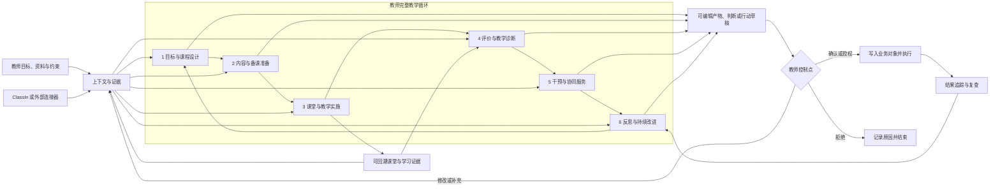

#### 图中最重要的关系

- 六个能力域构成循环，而不是六个功能频道；
- 上下文与证据同时服务所有能力域；
- AI 输出先成为可编辑教学产物，再经过教师控制点；
- 执行结果回到反思与下一轮设计，而不是生成后结束；
- ClassIn 和外部连接器是上下文及执行来源，不改变 WorkBuddy 核心循环。

### 1.3 六个能力域

| 能力域 | 教师目标 | 包含的业务时刻 | WorkBuddy 的终局能力 | 主要产物与行动 |
| --- | --- | --- | --- | --- |
| 目标与课程设计 | 将要求和学习者特点转为可执行课程 | 明确目标、课程设计、教研 | 对照标准、拆解目标、设计大纲、单元、活动与成功标准 | 目标、课程、单元、活动草稿 |
| 内容与备课准备 | 准备可以真正用于教学的内容和方案 | 资源生产、课件、备课演练、课前准备 | 检索、生成、改写、出题、覆盖检查、演练反馈、准备检查 | 教案、课件、题目、资源、演练报告、准备清单 |
| 课堂与教学实施 | 顺利开展课堂并形成低干扰、可回溯的过程证据 | 课堂讲解、互动、课堂管理 | 字幕、板书、摘要、活动支持、适时提示、证据整理 | 课堂记录、活动结果、观察证据 |
| 评价与教学诊断 | 理解学习结果、问题和不确定性 | 作业布置、批改、反馈、诊断 | 客观批改、评分建议、错误聚类、证据摘要、诊断假设 | 作业、评语、订正要求、待确认诊断 |
| 干预与协同服务 | 将判断转化为适合不同学生的下一步 | 个性化干预、辅导、资源、沟通 | 生成分层行动、资源、辅导安排、沟通草稿和复查节点 | 干预计划、学习任务、资源、消息、待办 |
| 反思与持续改进 | 比较目标与结果并改善下一轮教学 | 复查、教学反思、策略复用 | 目标结果对照、策略评价、版本比较、长期跟踪 | 反思、策略、复用资源、下一轮调整 |

### 1.4 终局体验模型

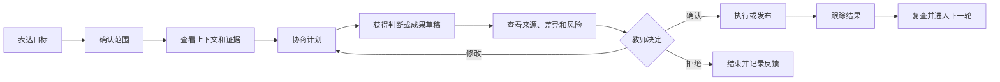

#### 标准输入

- 教师目标、限制和成功标准；
- 课程标准、教材、教案、课件、资源和机构规则；
- 当前机构、角色、班级、课程、学生和时间范围；
- 课堂、互动、作业、提交、订正和沟通证据；
- 教师可管理的偏好、历史策略和人工补充信息。

#### 标准输出

- 可解释的范围、缺口、事实摘要和诊断假设；
- 可编辑的课程、教案、课件、活动、作业、评语和干预计划；
- 待确认的消息、待办、资源、发布和复查动作；
- 已执行动作、失败状态、撤销记录和结果反馈；
- 对下一轮目标、策略和教学产物的调整建议。

### 1.5 统一工作台与连续情境入口

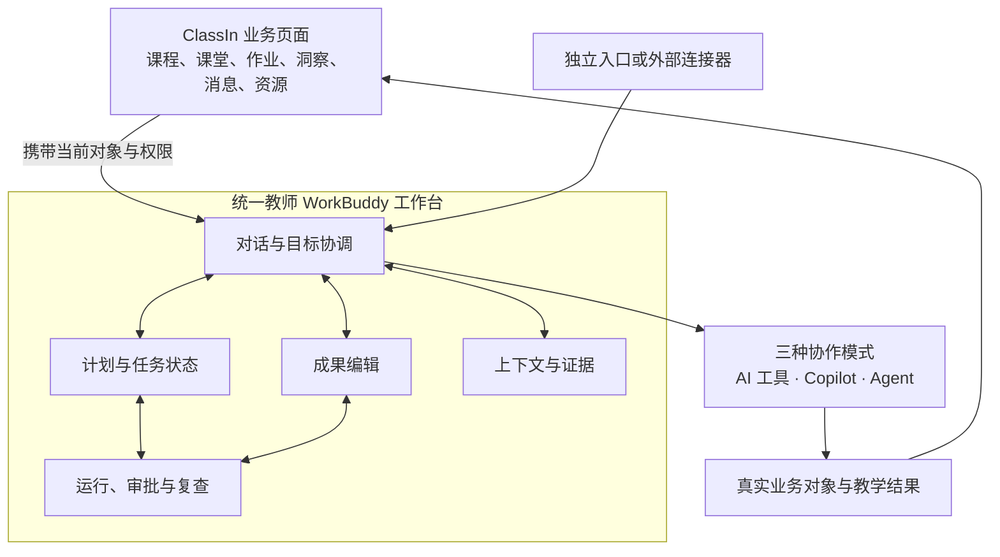

#### 承载原则

- 终局是一个统一教师 WorkBuddy 工作台，不是四个并列产品；
- AI 工具、Copilot 和 Agent 是同一界面中的自主性模式，不是三种底层可调用单元；
- 情境入口负责高意图任务，并携带当前业务对象进入同一个任务；
- 完整工作台承接复杂目标，不取代课程、作业、消息等业务页面；
- 运行与审批区域呈现 Agent 状态，不另建第二套教学事实；
- 对话负责意图协调，结构化工作区负责成果、证据和执行状态。

### 1.6 两种上下文模式

| 体验环节 | 未连接 ClassIn | 已连接 ClassIn |
| --- | --- | --- |
| 身份与范围 | 教师创建或导入课程、班级和学生范围 | 自动识别获授权的机构、角色、课程和班级 |
| 教学资料 | 教师上传或连接外部内容 | 读取课程目录、空间、教案、课件和资源 |
| 教学证据 | 教师手动记录或导入 | 读取课堂、互动、作业、提交、订正和结果 |
| 产物保存 | 保存至 WorkBuddy 或导出到外部工具 | 写入课程、作业、资源、待办和消息草稿 |
| 执行 | 教师手动发布或通过外部连接器执行 | 在教师确认后通过 ClassIn 业务工具执行 |
| 结果复查 | 教师回填或外部连接器同步 | 自动读取完成、反馈和后续教学结果 |

### 1.7 图一的边界

这张图不是：

- 六个一级导航；
- 第一版功能列表；
- “每个能力域各建一个 Agent”的组织方式；
- 底层数据库关系图；
- 已经承诺的上线范围和日期。

---

## 图二：核心对象与上下文关系图

### 2.1 这张图回答什么

> WorkBuddy 当前在什么身份和权限范围内，围绕哪些目标，理解哪些业务对象和证据，形成哪些暂定判断，并对哪些对象执行行动？

### 2.2 核心对象关系主图

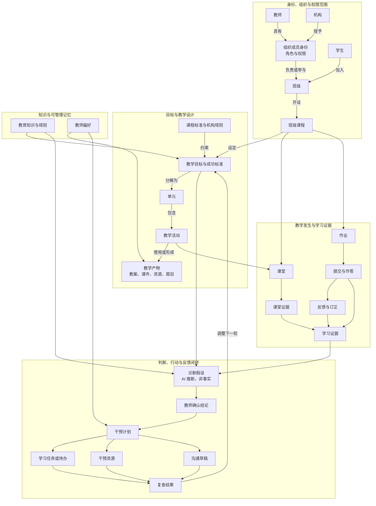

#### 主图表达的核心语义

1. 同一位教师可以拥有多个组织成员身份；每次任务必须绑定当前机构、角色和权限。
2. 班级课程连接长期班级关系与具体教学目标、单元、活动和课堂。
3. 教学产物是可编辑对象；课堂、作答、提交、反馈和订正形成可回溯证据。
4. 诊断假设是 AI 推断，不是学生事实；经教师确认后才形成业务结论或行动依据。
5. 干预通过学习任务、待办、资源和消息等现有对象执行，WorkBuddy 不创建平行状态。
6. 复查结果回到目标与下一轮设计，形成完整教学闭环。

### 2.3 上下文装配图

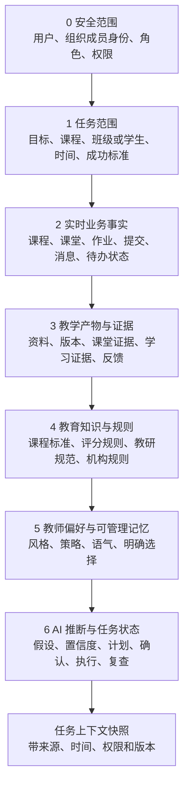

#### 装配顺序为什么不能颠倒

- 先确认安全范围，才能读取业务事实；
- 先确认任务目标，才能判断哪些上下文相关；
- 事实和证据先于知识应用及 AI 推断；
- 偏好只能影响表达和策略，不能改写事实；
- AI 推断始终携带来源、时间、置信度和确认状态；
- 每次重要任务保留上下文快照，避免后续数据变化导致无法解释历史判断。

### 2.4 四类信息的严格边界

| 类型 | 典型内容 | 使用方式 | 生命周期 | 最终所有者 |
| --- | --- | --- | --- | --- |
| 实时业务事实 | 机构、班级、课程、课堂、作业、提交、成绩、权限、消息状态 | 运行时通过业务工具读取 | 随业务系统变化 | 对应 ClassIn 或外部业务系统 |
| 教育知识与规则 | 课程标准、评分量规、教研方法、机构规范 | 有来源、有版本地检索和引用 | 随内容版本更新 | 内容或规则管理方 |
| 教师偏好与长期记忆 | 风格、语气、常用策略、明确选择 | 教师可查看、修改、删除 | 按教师授权保留或过期 | 教师本人 |
| AI 推断与诊断假设 | 薄弱点、原因候选、风险和干预建议 | 保留证据、置信度、时间和确认状态 | 过期、被否定或确认后转为结论/行动 | 不是事实；教师确认决定后续 |

### 2.5 核心对象定义与事实所有权

| 对象 | 核心含义 | 关键关系 | 事实所有者 | WorkBuddy 的允许动作 |
| --- | --- | --- | --- | --- |
| 组织成员身份 | 用户在一个机构中的角色、职责和权限 | 连接教师、机构和可访问范围 | 身份与组织系统 | 读取当前身份，不跨组织混用 |
| 班级 | 成员、沟通和长期教学关系 | 包含学生，关联班级课程 | 班级域 | 理解范围，不复制成员状态 |
| 班级课程 | 一个班级中有目标和生命周期的教学安排 | 连接班级、目标、单元、课堂和作业 | 课程域 | 生成和修改草稿，按流程发布 |
| 教学目标 | 教师希望学生达到的结果及成功标准 | 约束单元、活动、评价和诊断 | 课程域或教师确认 | 拆解、对照和生成草稿 |
| 单元与教学活动 | 课程内部可组织、可执行的教学结构 | 归属课程，产生教学产物和课堂 | 课程域 | 设计、排序和生成草稿 |
| 教学产物 | 教案、课件、资源、题目、评语等可编辑成果 | 服务目标、活动、课堂、作业或干预 | 对应课程、资源或作业域 | 生成版本、差异和待确认写入 |
| 课堂 | 一次实际教学发生及其状态 | 归属课程，承载活动并产生证据 | 课堂域 | 读取、总结，不改写课堂事实 |
| 作业 | 教师布置的正式学习任务 | 归属课程，连接提交、反馈和订正 | 作业域 | 生成草稿，确认后布置 |
| 提交与作答 | 学生对正式任务的实际响应 | 归属学生和作业 | 作业/提交域 | 读取和辅助分析，不代交、不改状态 |
| 学习证据 | 由课堂、作答、反馈和订正产生的可追溯事实 | 支持评价、诊断和复查 | 原始业务域拥有事实，洞察域组织证据 | 汇总、引用、标记缺口 |
| 诊断假设 | 对学习问题、原因或趋势的暂定解释 | 基于目标和证据，等待确认 | 无事实所有权 | 提出、解释、修正、过期 |
| 教师确认结论 | 教师对假设作出的专业判断 | 可以触发干预或下一轮调整 | 教师或教学业务域 | 记录确认、修改与依据 |
| 干预计划 | 围绕已确认问题组织的目标、行动和复查 | 产生任务、资源、消息和复查 | 教学服务域（待明确） | 草拟、编排、经审批执行 |
| 学习任务与待办 | 教师或学生需要完成的正式行动及状态 | 由干预、课程或沟通产生 | 作业、待办或活动域 | 创建草稿，不能虚构完成状态 |
| 消息 | 对学生、家长、助教和机构的沟通记录 | 可承载通知和行动项 | 消息域 | 生成草稿，确认后发送 |
| 复查结果 | 用于判断干预是否完成和是否有效的后续证据 | 回到诊断、反思和下一轮目标 | 对应任务和证据域 | 汇总、比较、触发复查建议 |

### 2.6 多机构和跨时间边界

#### 多机构教师

同一自然人可以在不同机构拥有不同成员身份、课程、学生和规则。默认行为必须是：

- 当前任务只使用一个明确的机构身份；
- 不跨机构引用学生、课堂、作业和机构规则；
- 教师个人偏好只有在明确允许时跨机构使用；
- 可复用资源需要检查版权、机构归属和授权范围；
- 切换机构时重新装配上下文并清晰提示范围变化。

#### 跨时间信息

| 信息 | 是否默认跨时间复用 | 条件 |
| --- | --- | --- |
| 当前业务事实 | 否，运行时重新读取 | 保留历史快照用于解释 |
| 课程标准与机构规则 | 按版本复用 | 标记生效时间与版本 |
| 教师明确偏好 | 可以 | 可查看、可修改、可删除、可过期 |
| AI 诊断假设 | 不可以作为长期事实 | 到期复查或由教师确认 |
| 教学策略与资源 | 可以作为候选 | 保留适用范围、来源和效果记录 |
| 学生敏感判断 | 默认不长期复用 | 需要严格目的、权限和复核机制 |

### 2.7 边界场景校验

| 场景 | 对象模型必须怎样处理 | 不能发生什么 |
| --- | --- | --- |
| 教师同时属于机构 A 和机构 B | 每次任务绑定一个组织成员身份；切换机构后重新装配权限、课程、学生和规则 | 将 A 机构学生证据、规则或沟通内容带入 B 机构 |
| 通用课程模板被多个班级使用 | 区分可复用课程模板与实际班级课程；模板更新只形成可选变更 | 未经教师确认，批量改写已经发布或正在进行的班级课程 |
| 课堂或作业证据缺失、冲突 | 标记未知、缺口和冲突来源；降低诊断范围或请求教师补充 | 为了形成完整报告而补造课堂事实或学生表现 |
| 学生转班或跨机构学习 | 保留证据产生时的班级、课程、机构和权限范围；新任务按当前合法目的重新授权 | 把旧机构中的敏感判断自动继承为新机构的学生标签 |
| 教师否定或撤回诊断假设 | 将依赖该假设的干预计划标记为需要重新确认，暂停尚未执行的相关动作 | 继续把已否定假设作为推荐、分层或沟通依据 |
| Agent 已完成部分动作后失败 | 每个业务对象保持自己的真实状态；记录已完成、未完成和可重试动作，只对幂等步骤重试 | 将部分成功显示为全部完成，或重复布置作业、重复发送消息 |

### 2.8 图二的边界

这张图不是：

- 页面和菜单关系图；
- 生产数据库 ERD；
- 表示当前所有对象和 API 已经存在；
- 允许 AI 把所有上下文保存为 Memory；
- 将 AI 推断直接写入学生档案的授权。

---

## 图三：AI 自主性与执行成熟度路线图

### 3.1 这张图回答什么

> 终局能力地图中的每一项业务能力，AI 应做到工具、Copilot 还是 Agent；升级需要补齐哪些上下文、工具、控制和评价能力？

### 3.2 自主性升级主图

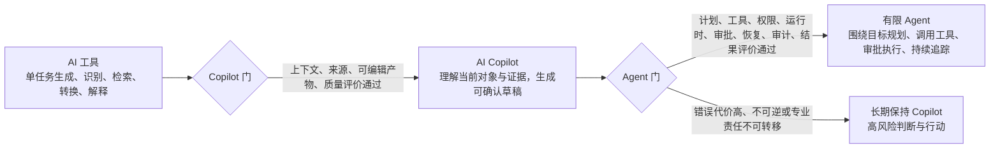

#### 三个层级的操作定义

| 层级 | 必须具备 | 典型表现 | 不构成该层级的情况 |
| --- | --- | --- | --- |
| AI 工具 | 明确输入、单一任务、确定输出边界 | 生成题目、摘要、时间戳演练报告 | 放在聊天窗口中不自动成为 Copilot |
| AI Copilot | 当前角色、对象、权限、证据、可编辑草稿、教师确认 | 结合班级情况形成课程草稿、批改建议、诊断假设 | 只把多个生成按钮放在一个页面 |
| AI Agent | 业务目标、可检查计划、多个真实工具、持久运行、审批、失败恢复、审计、结果追踪 | 诊断问题、创建分层任务、准备沟通、等待确认、执行并到期复查 | 只调用一次模型或预设工作流却没有运行与反馈状态 |

### 3.3 两道升级门

#### 从 AI 工具到 Copilot

一项能力只有同时满足以下条件，才进入 Copilot：

1. 能识别当前教师、机构角色和权限范围；
2. 能读取当前业务对象，而不要求教师重复解释全部上下文；
3. 关键结论可以引用来源并表达不确定性；
4. 输出可以成为真实业务对象的可编辑草稿；
5. 教师能够修改、确认和拒绝；
6. 有针对该任务的质量基准、采纳与修改评价；
7. 上下文缺失时能够降级或请求补充，而不是编造完整答案。

#### 从 Copilot 到有限 Agent

一项能力只有同时满足以下条件，才允许进入 Agent：

1. 目标、范围、约束、完成条件和复查节点清楚；
2. 能生成教师可检查的计划；
3. 只调用有 Schema、权限和副作用声明的白名单工具；
4. 任务可以暂停、恢复、超时、重试并处理部分失败；
5. 写入操作具有幂等、防重复和差异预览机制；
6. 风险动作有明确审批门和最小权限；
7. 允许的动作可以撤销，不能撤销的动作需要更强确认；
8. 全过程保留来源、计划、调用、结果和人工决定的审计记录；
9. 能追踪业务结果，而不是以“工具调用成功”作为完成；
10. 在真实任务集和试点中达到可靠性、安全性、成本和用户价值门槛。

### 3.4 终局能力的合理自主性

| 业务能力 | 起始形态 | 合理终局 | 是否 Agent 候选 | 关键原因或限制 |
| --- | --- | --- | --- | --- |
| 标准对照与目标拆解 | 工具 | Copilot | 否 | 需要教师确认课程意图和成功标准 |
| 课程、单元和活动设计 | 工具 | Copilot | 有限 | 可以长期编排，但正式发布由教师确认 |
| 资源检索、改写与出题 | 工具 | Copilot | 否 | 单点任务多，重点是来源、版权和适配性 |
| 备课演练与修改计划 | 工具 | Copilot | 是 | 可围绕多轮演练持续计划、比较和复查 |
| 排课与课前准备 | Copilot | 有限 Agent | 是 | 适合检查、提醒和低风险准备；调课通知需要确认 |
| 课堂字幕、板书与摘要 | 工具 | Copilot | 否 | 课堂中要求低延迟、低干扰，不宜自主改变教学 |
| 课堂互动建议 | 工具 | Copilot | 否 | 教师必须控制课堂节奏和实际行为 |
| 客观批改和反馈草稿 | 工具 | Copilot | 有限 | 可批量准备草稿，正式评分和发布保留确认 |
| 教学诊断 | 工具 | Copilot | 否 | 诊断是假设，学生敏感判断需要教师专业责任 |
| 个性化干预 | Copilot | 有限 Agent | 是 | 适合跨任务、资源、消息和复查执行 |
| 沟通跟进 | 工具 | Copilot | 有限 | 低风险、重复授权动作可自动；敏感沟通必须确认 |
| 教学反思与长期复查 | Copilot | 有限 Agent | 是 | 可持续跟踪结果并按节点提醒教师复查 |

“合理终局”不是功能越自动越好。正式评分、敏感评价、影响学生机会的分层以及高风险外部沟通，不应因为模型能力提高就自动越过教师。

### 3.5 分阶段能力路线图

以下是当前建议的能力依赖顺序，不是已经承诺的项目排期。阶段 1 最终只验证通用冷启动路径，还是同时加入一条 ClassIn 上下文增强路径，需要在第六件“分阶段纵向切片”中结合试点条件拍板。

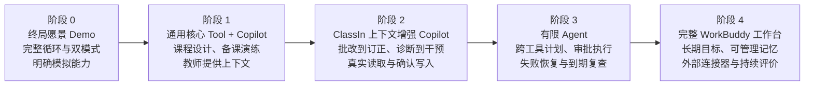

#### 阶段定义

| 阶段 | 真实建设重点 | 代表性闭环 | AI 层级 | 进入下一阶段前必须证明 |
| --- | --- | --- | --- | --- |
| 阶段 0 | 终局产品叙事、双模式、运行与审批体验 | 一次完整教学循环 | 可模拟，不作为成熟度证据 | 管理层、客户和团队能否理解并认同产品形态 |
| 阶段 1 | 教师输入上下文、产物对象、来源、编辑与评价 | 课程目标到课程对象；备课演练到改进 | 工具与 Copilot | 无 ClassIn 历史数据时是否有独立持续价值 |
| 阶段 2 | ClassIn 实时读取、证据链、权限和确认后写入 | 批改到订正；诊断到个性化干预 | 业务 Copilot | ClassIn 上下文是否显著提高质量、效率和执行率 |
| 阶段 3 | 持久任务、计划、多工具、审批、失败恢复、撤销、审计 | 干预计划跨作业、待办、资源、消息执行并复查 | 有限 Agent | Agent 是否能安全、稳定地完成跨模块目标 |
| 阶段 4 | 跨周期工作台、长期复查、可管理记忆、外部连接器和持续评价 | 完整教师循环 | Copilot 与有限 Agent 组合 | 是否形成持续使用、机构价值和商业闭环 |

阶段 0 是愿景表达，不是把模拟功能算作已完成。阶段 1 至阶段 4 的升级由证据门决定，不由预设日期自动触发。

### 3.6 Harness 建设随成熟度递进

| Harness 能力 | 工具阶段 | Copilot 阶段 | 有限 Agent 阶段 |
| --- | --- | --- | --- |
| 上下文引擎 | 用户输入与当前对象 | 身份、权限、事实、证据和知识装配 | 动态刷新、快照、跨步骤一致性和范围守卫 |
| 目标与任务运行时 | 单次请求 | 有限多轮任务与草稿状态 | 持久计划、暂停恢复、重试、超时和复查 |
| Skill 与业务工具 | 只读检索与内容生成 | 读取业务对象、保存草稿 | 多工具编排、确认后写入、幂等与失败处理 |
| 教师控制与执行 | 采用或放弃 | 编辑、差异、确认、拒绝 | 分级审批、暂停、撤销、审计和授权策略 |
| 评价与持续学习 | 输出质量 | 采纳、修改距离、证据正确性 | 任务完成、结果改善、安全、成本和长期复用 |

### 3.7 每个阶段的统一评价门

#### 用户价值

- 是否减少教师完成原任务的总时间；
- 产出是否被采纳，修改距离是否可接受；
- 是否连续复用，而不是只在演示时使用；
- 是否改善教学服务、任务完成或后续结果。

#### 上下文与质量

- 数据是否真实存在、可取、可解释和及时；
- 关键判断是否有可回溯来源；
- 证据缺失、冲突和不确定性是否被正确处理；
- 与无上下文通用模型相比是否有显著增益。

#### 安全与控制

- 权限范围是否正确；
- 高风险动作是否经过正确确认；
- 批量和外部副作用是否有差异预览；
- 失败、重复执行、撤销和审计是否可靠。

#### 经济与商业

- 模型、存储、索引、推理、交付和支持成本是否可接受；
- 机构是否感知价值并愿意扩大、续费或升级；
- 独立用户是否形成激活、留存、分享或付费；
- 是否达到继续、扩大、转向或停止的决策门。

### 3.8 图三的边界

这张图不是：

- 对现有生产 AI 能力已经完成的声明；
- 固定日期和资源承诺；
- 模型能力排行榜；
- “所有工具最终升级为 Agent”的流水线；
- 用自动化比例替代教育价值和安全责任。

---

## 四、三张图的映射关系

### 4.1 总体关系

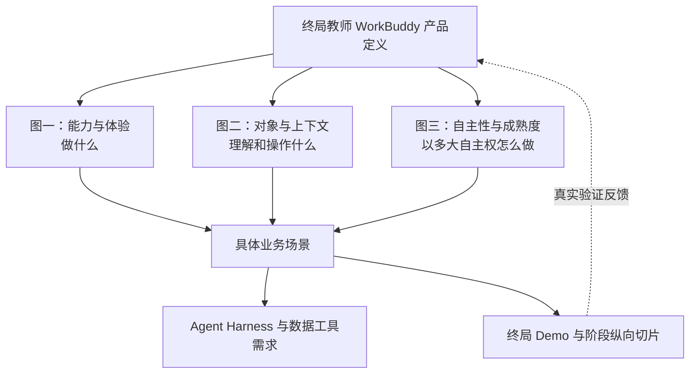

### 4.2 场景规格必须同时回答的问题

任何后续场景都必须回答：

1. 教师要完成什么结果，属于图一哪个能力域？
2. 使用哪些身份、目标、对象、证据、知识和偏好，属于图二什么范围？
3. AI 当前是工具、Copilot 还是 Agent，属于图三哪个阶段？
4. 最终形成或修改哪个真实业务对象？
5. 哪些判断是事实，哪些是 AI 推断，谁负责确认？
6. 会调用哪些只读或写入工具，有什么副作用？
7. 教师在哪些节点查看、修改、确认、暂停或撤销？
8. 用什么结果评价成功，何时复查？

---

## 五、四条纵向闭环的交叉验证

### 5.1 闭环一：课程目标到课程对象

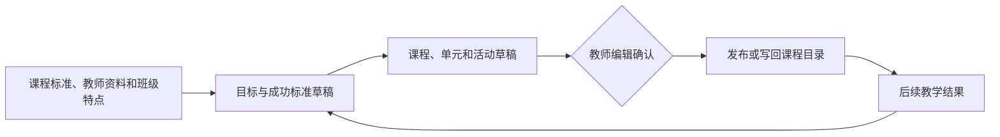

| 维度 | 映射 |
| --- | --- |
| 图一 | 目标与课程设计；内容与备课准备 |
| 图二 | 课程标准、机构规则、教学目标、班级课程、单元、活动、教学产物 |
| 图三 | 阶段 1，工具到 Copilot；正式发布由教师确认，不要求 Agent 化 |
| 通用价值 | 教师上传资料即可使用，是无 ClassIn 历史数据时的重要冷启动入口 |
| ClassIn 增强 | 自动读取班级课程、历史结果和课程目录，并写回真实课程对象 |
| 评价 | 完成时间、采纳率、修改距离、课程使用率、后续目标达成情况 |

### 5.2 闭环二：备课演练到改进

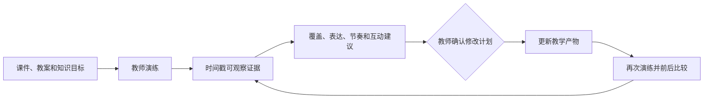

| 维度 | 映射 |
| --- | --- |
| 图一 | 内容与备课准备；反思与持续改进 |
| 图二 | 教学目标、教学产物、演练证据、修改计划、版本与复查结果 |
| 图三 | 阶段 1，工具到 Copilot；多轮演练后可成为有限 Agent 候选 |
| 通用价值 | 不依赖 ClassIn 历史课堂数据，适合独立教师使用 |
| ClassIn 增强 | 连接真实课件、课程目标和历史课堂反馈进行对比 |
| 评价 | 演练完成时间、建议采纳率、修改距离、前后改善、真实课堂复用率 |

### 5.3 闭环三：批改到订正

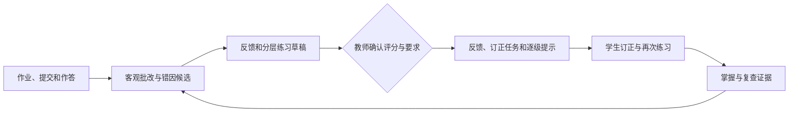

| 维度 | 映射 |
| --- | --- |
| 图一 | 评价与教学诊断；干预与协同服务；反思与持续改进 |
| 图二 | 作业、提交、作答、反馈、订正、学习证据、复查结果 |
| 图三 | 阶段 2，工具到业务 Copilot；可批量准备草稿，正式成绩和发布长期保留教师确认 |
| 通用价值 | 可以通过导入作业与作答工作，但上下文建立成本较高 |
| ClassIn 增强 | 自动读取提交状态和历史证据，确认后写入反馈与订正任务 |
| 评价 | 批改耗时、修改距离、错因确认率、订正完成率、再次掌握情况 |

### 5.4 闭环四：诊断到个性化干预

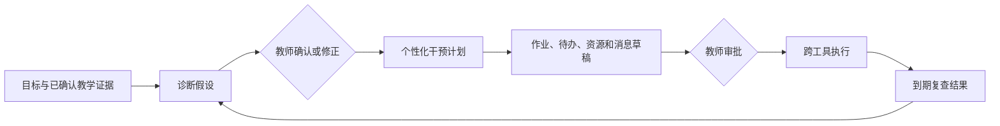

| 维度 | 映射 |
| --- | --- |
| 图一 | 评价与教学诊断；干预与协同服务；反思与持续改进 |
| 图二 | 教学目标、学习证据、诊断假设、教师确认结论、干预计划、任务、资源、消息、复查结果 |
| 图三 | 阶段 2 先以 Copilot 验证；阶段 3 在审批、恢复、撤销和审计成熟后成为有限 Agent |
| 通用价值 | 依赖教师提供或外部导入证据，仍可生成和跟踪干预计划 |
| ClassIn 增强 | 自动获得连续证据并将行动写入多个真实业务对象，复查执行结果 |
| 评价 | 诊断可解释性、教师确认率、行动完成率、复查率、结果改善、安全事件和单次闭环成本 |

### 5.5 交叉验证结论

四条闭环能够同时落入三张图，说明当前产品定义具备基本一致性：

- 图一能够覆盖从通用冷启动到 ClassIn 深度增强的完整教师结果；
- 图二能够表达目标、产物、证据、推断、确认、行动和复查的状态变化；
- 图三能够解释为什么前两条以通用 Tool/Copilot 起步，后两条依赖 ClassIn 上下文，并且只有“诊断到干预”优先进入有限 Agent；
- 没有一条闭环要求先建设一个泛化 Agent 平台；
- 每条闭环都能反推出清晰的 Harness、数据、工具、审批和评价需求。

---

## 六、三张图对后续六件套的约束

### 对 Agent Harness 架构

必须支持：

- 身份、组织、权限、任务范围和上下文快照；
- 目标、计划、步骤、完成条件、暂停、恢复和复查；
- 教学 Skill、只读工具、写入工具和副作用声明；
- 草稿、差异预览、确认、批量审批、撤销和审计；
- 采纳、修改、拒绝、执行结果、教学结果、安全和成本评价。

### 对 ClassIn 数据、知识、上下文与工具清单

必须按图二对象逐项明确：

- 业务事实是否存在、由谁拥有；
- 可通过什么工具读取或写入；
- 权限、时效、质量和留存情况；
- 是否属于知识、偏好或 AI 推断；
- 在四条纵向闭环中承担什么作用；
- 缺失时能力如何降级。

### 对终局愿景 Demo

必须展示：

- 一次完整教学循环，而不是功能菜单巡游；
- 未连接和已连接 ClassIn 的同一产品核心；
- 教师查看证据、修改产物、确认行动和复查结果；
- WorkBuddy 从情境内入口进入完整工作台和运行中心；
- 模拟能力、真实能力和未来能力的明确标记。

### 对分阶段纵向切片

每个切片必须拥有：

- 一个清楚的教师结果；
- 一组有事实所有者的核心对象；
- 一个明确的 AI 自主性等级；
- 一套真实数据、工具、权限和控制要求；
- 一组用户价值、质量、安全、成本和商业评价门；
- 继续、扩大、转向或停止条件。

---

## 七、阶段 A 结论

三张图共同给出了教师 WorkBuddy 的产品蓝图：

1. 图一说明终局不是 AI 功能大全，而是覆盖完整教师教学循环的六个能力域和一套标准协作体验；
2. 图二说明 WorkBuddy 围绕明确身份、目标和业务对象组织事实与证据，并通过教师确认将推断转为行动；
3. 图三说明 AI 自主性由业务风险和系统成熟度决定，Tool、Copilot 与 Agent 是能力等级，不是界面阶段；
4. 四条纵向闭环验证了三张图可以共同指导通用价值、ClassIn 增强、Harness 建设和分阶段落地。

阶段 A 完成后，下一步可以进入六件套的阶段 B：从四条闭环优先反推 Agent Harness 架构，以及 ClassIn 数据、知识、上下文与工具清单。
