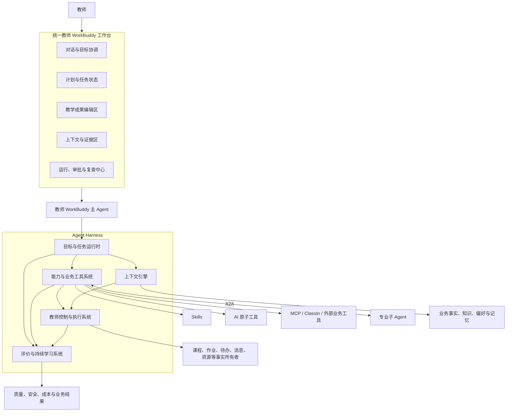
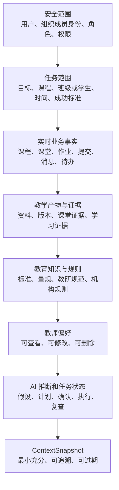
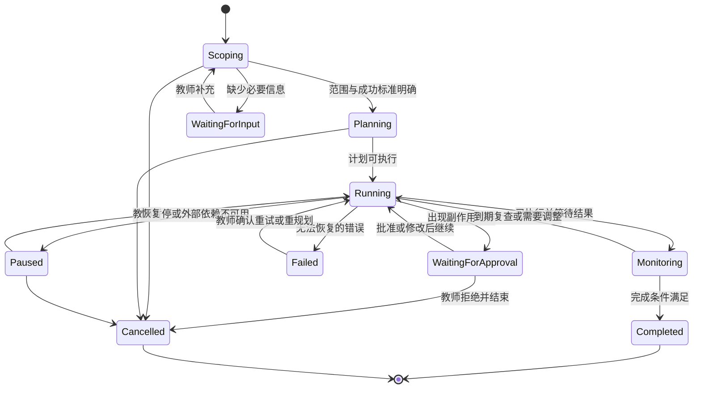
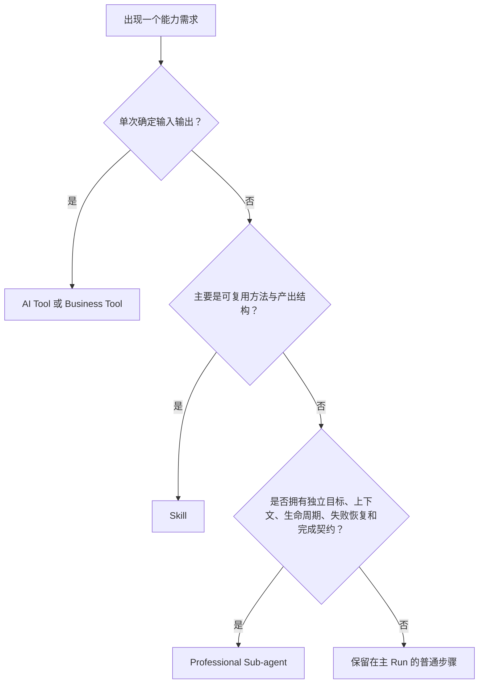
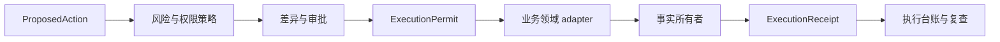
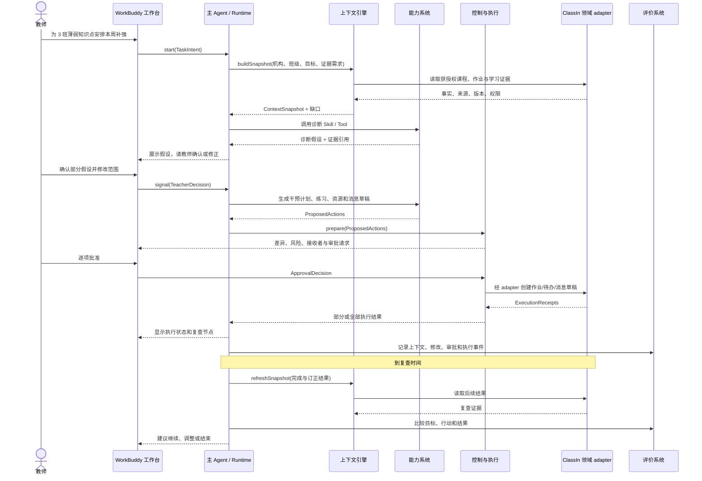

# 教师 WorkBuddy Agent Harness 架构

## 文档定位

本文是下一阶段“六件套”的第三件，将 [[01-终局教师WorkBuddy产品定义_20260815|《终局教师 WorkBuddy 产品定义》]] 和 [[02-ClassIn教师WorkBuddy三张核心图_20260815|《三张核心图》]] 转化为可建设、可运行、可控制、可恢复和可评价的 Agent Harness 架构。

本文定义架构责任、深模块、Interface、seam、运行状态和安全不变量，不锁定具体编程语言、模型供应商、云服务、数据库或消息中间件。ClassIn 生产接口是否存在、数据是否可用及权限规则，仍需第四件清单和生产审计确认。

---

## 一、架构结论

### 1. 一句话架构

> **教师 WorkBuddy 是教师面对的统一主 Agent；Harness 在其背后装配受权限约束的上下文，把目标转成持久任务，通过统一能力 Interface 调用 Skills、AI 工具、MCP/业务工具和必要的专业子 Agent，并在教师控制下执行、恢复和评价结果。**

### 2. 五个深模块

| 深模块 | 核心责任 | 对主 Agent 提供的杠杆 |
| --- | --- | --- |
| 上下文引擎 | 将身份、任务范围、业务事实、证据、知识、偏好和推断装配成可追溯快照 | 主 Agent 不需要理解每个数据源和权限细节 |
| 目标与任务运行时 | 将教师目标管理为计划、步骤、依赖、状态、完成条件和复查节点 | 页面关闭、失败或等待确认后任务仍可继续 |
| 能力与业务工具系统 | 统一注册、发现和调用 Skills、AI 工具、MCP 工具、ClassIn 工具和专业子 Agent | 主 Agent 不直接耦合具体协议和供应商 |
| 教师控制与执行系统 | 评估动作风险，管理草稿、差异、审批、执行、幂等、撤销和审计 | 所有副作用经过同一安全入口 |
| 评价与持续学习系统 | 记录质量、采纳、修改、执行、结果、安全、成本和反馈 | 能按真实教学结果升级或停止能力 |

### 3. 架构不变量

1. 主 Agent 是教师面对的唯一统一身份，不把内部 Agent 拓扑变成用户负担。
2. Copilot 是协作模式，不是主 Agent 调用的底层单元。
3. Skills、AI 工具、MCP/业务工具和专业子 Agent 通过统一能力系统注册与调用。
4. 业务事实仍由课程、课堂、作业、消息、待办、资源、身份等领域拥有。
5. Harness 只拥有 Agent 任务、计划、上下文快照、审批、执行回执、审计和评价事实。
6. AI 推断不能直接成为学生事实；教师确认只改变结论状态，不改写原始证据。
7. 所有写入先经过权限、风险、审批和幂等检查。
8. “工具调用成功”不等于教学目标完成；完成由业务结果和复查条件决定。
9. A2A 只用于拥有独立目标、完成契约、上下文或生命周期的子任务。
10. 模型、协议和数据源通过 adapter 接入，不能泄漏到主 Agent 的业务 Interface。

---

## 二、终局产品到系统架构



### 架构的关键解释

- 工作台只消费可解释的计划、成果、来源、状态和行动，不展示模型隐藏推理过程。
- 主 Agent 负责目标理解和协作策略，持久状态由运行时拥有。
- 能力系统负责“调用谁、用什么协议、如何验证结果”，主 Agent 不直接调用具体 MCP 或供应商模型。
- 控制系统是所有副作用的唯一执行 seam；能力调用不能绕过它直接写业务系统。
- 评价系统从第一天记录事件，不等 Agent 上线后再补可观测性。

---

## 三、教师 WorkBuddy 主 Agent

### 1. 主 Agent 的责任

- 将教师自然语言目标转换为任务意图；
- 识别需要澄清的范围、约束和成功标准；
- 请求运行时启动或推进任务；
- 在 Tool、Copilot 和 Agent 三种协作模式之间选择合适行为；
- 向教师呈现计划、证据、假设、成果和待确认动作；
- 根据教师反馈修改目标、计划或成果；
- 汇总 Skills、工具和子 Agent 结果；
- 在任务完成、暂停、失败或需要复查时给出清楚状态。

### 2. 主 Agent 不拥有

- 不拥有课程、课堂、作业、消息、待办、成绩或权限事实；
- 不直接保存未经治理的长期记忆；
- 不直接执行有副作用的业务写入；
- 不直接管理每个模型、MCP 或 A2A 协议；
- 不将隐藏推理过程作为产品解释；
- 不替教师作出正式评分、敏感评价和高风险沟通决定。

### 3. 主 Agent 与协作模式

| 模式 | 运行时形态 | 是否产生持久 Run | 是否需要计划 | 是否允许业务写入 |
| --- | --- | --- | --- | --- |
| AI 工具 | 单次或短任务 | 可选，至少保留调用与来源记录 | 不需要多步骤计划 | 默认不写入，结果由教师采用 |
| Copilot | 当前业务对象中的协同任务 | 是 | 可以是短计划或草稿状态 | 教师确认后写入草稿或单对象 |
| Agent | 跨对象、跨步骤或跨时间目标 | 必须 | 必须可查看、可修改 | 经过风险策略和审批后执行 |

---

## 四、深模块一：上下文引擎

### 1. 模块责任

上下文引擎隐藏身份解析、权限过滤、数据读取、知识检索、偏好装配、推断隔离和来源追踪的复杂性，为一次任务生成最小充分、可解释、可过期的上下文快照。

### 2. 小 Interface

```text
buildSnapshot(taskScope, contextNeeds) -> ContextSnapshot
refreshSnapshot(snapshotRef, refreshNeeds) -> ContextDelta
explainContext(snapshotRef) -> ContextManifest
```

调用方只需要表达任务范围和所需语义，不需要知道数据来自 ClassIn、外部连接器、知识索引还是教师手动输入。

### 3. 输入与输出

| 输入 | 说明 |
| --- | --- |
| TaskScope | 当前组织成员身份、课程、班级或学生范围、时间、目标和成功标准 |
| ContextNeeds | 所需事实类型、证据范围、知识主题、是否允许使用偏好和历史任务 |

| 输出 | 说明 |
| --- | --- |
| ContextSnapshot | 冻结的任务上下文引用，包含来源、权限、版本和时间 |
| ContextManifest | 教师可理解的“使用了什么、没有什么、哪些可能过期” |
| ContextDelta | 运行期间事实变化、权限变化和新证据，不静默覆盖历史快照 |

### 4. 装配层级



### 5. 不变量

- 没有合法组织成员身份，不读取机构业务事实；
- 不跨机构装配学生、课堂、作业或规则；
- 实时事实通过所有者读取，不从旧对话记忆恢复；
- 知识索引继承原内容权限，索引不扩大访问范围；
- 教师偏好可以影响表达和策略，不能改写事实；
- AI 推断携带来源、时间、置信度和确认状态；
- 上下文不足时返回缺口，不补造完整叙事；
- 快照可解释、可过期、可根据权限变化失效。

### 6. Seam 与 adapter

| Seam | 生产 adapter 候选 | 测试 adapter |
| --- | --- | --- |
| 身份与权限 | ClassIn 身份/组织 adapter | 内存身份 adapter |
| 业务事实 | 各 ClassIn 领域读取 adapter、外部连接器 adapter | 场景事实 adapter |
| 知识检索 | ClassIn 知识索引 adapter、机构知识 adapter | 固定语料检索 adapter |
| 教师偏好 | 用户偏好存储 adapter | 内存偏好 adapter |

模型不直接读取原始数据库，所有事实先通过对应 seam 的 adapter 转成受权限约束的领域对象。

### 7. 失败模式

- 身份或权限无法确认：停止读取并要求切换范围或授权；
- 来源不可用：标记缺口并按任务允许范围降级；
- 数据冲突：保留冲突来源，不替业务系统选择真值；
- 数据已变化：生成 ContextDelta，要求运行时判断是否重算；
- 知识版本过期：标记版本和生效时间，不与实时事实混合；
- 敏感范围过大：缩小到最小学生或班级集合并重新确认。

---

## 五、深模块二：目标与任务运行时

### 1. 模块责任

运行时隐藏计划版本、步骤依赖、持久状态、并发、超时、暂停、恢复、重试、取消和复查调度的复杂性。它拥有 Agent Run 事实，但不拥有业务执行结果本身。

### 2. 小 Interface

```text
start(intent, contextSnapshot) -> RunView
signal(runRef, teacherOrSystemSignal) -> RunView
inspect(runRef) -> RunView
```

所有推进都通过 `signal` 进入，例如教师确认、补充信息、工具返回、权限变化、超时、取消和到期复查。这样调用方无需了解内部状态机。

### 3. Run 拥有的事实

- 教师原始目标与结构化 TaskIntent；
- 当前范围、约束和成功标准；
- 计划版本、步骤、依赖和完成条件；
- 当前状态、等待原因和责任方；
- ContextSnapshot 引用；
- 能力调用、审批请求和执行回执引用；
- 失败、重试、暂停、取消和复查节点；
- 任务最终结果与未完成项。

### 4. 状态机



### 5. 计划原则

- 计划面向教师可检查的业务步骤，不暴露隐藏推理；
- 每一步声明需要的上下文、能力、输出和副作用；
- 计划变更产生新版本，已经批准的旧版本不能静默扩展；
- 只读步骤可以自动运行；写入步骤必须取得 ExecutionPermit；
- 子 Agent 作为子 Run 管理，父 Run 只消费其契约结果；
- 完成条件由教学业务结果定义，不由模型自行宣告；
- 长任务必须设置复查节点、超时和停止条件。

### 6. 并发与部分失败

- 只有互不依赖且不竞争同一业务对象的只读步骤默认并行；
- 多个写入动作按照对象所有者和审批批次排序；
- 部分成功时保留每项 ExecutionReceipt，不回滚无法安全撤销的成功动作；
- 重试只针对明确幂等的步骤；
- 上游结论被教师否定时，依赖步骤标记失效并暂停；
- 计划重算不能重复消费旧批准。

---

## 六、深模块三：能力与业务工具系统

### 1. 模块责任

该模块为主 Agent 和运行时提供统一能力 Interface，隐藏 Skills、AI 工具、MCP、ClassIn 业务工具、外部连接器和 A2A 子 Agent 的注册、选择、协议、版本、校验、调用、超时和结果标准化。

### 2. 小 Interface

```text
resolve(capabilityNeed, contextRef, policy) -> CapabilityPlan
invoke(invocation, executionPermit?) -> CapabilityResult
describe(capabilityRef) -> CapabilityManifest
```

### 3. CapabilityManifest

每项能力至少声明：

| 字段 | 说明 |
| --- | --- |
| identity / version | 稳定标识、版本和维护者 |
| kind | Skill、AI Tool、Business Tool、MCP Tool 或 Sub-agent |
| purpose | 能完成的业务结果与明确非目标 |
| input / output schema | 结构化输入、输出和错误 |
| context requirements | 必要对象、证据和知识范围 |
| permission requirements | 所需角色和对象权限 |
| side-effect class | 只读、草稿、单对象写入、批量/外部副作用、禁止自动执行 |
| idempotency / reversibility | 是否可重复调用、如何去重、是否可撤销 |
| latency / cost budget | 超时、预算和降级策略 |
| evidence behavior | 是否产生来源、置信度和证据引用 |
| approval policy | 是否需要 ExecutionPermit 及审批强度 |
| evaluation contract | 质量、安全和业务结果如何评价 |

### 4. 能力类型

| 类型 | 何时使用 | 示例 | 不应承担 |
| --- | --- | --- | --- |
| Skill | 复用教育方法、任务步骤和结构化产出规则 | 课程目标拆解、干预计划构造、评语规范 | 不直接拥有外部业务状态 |
| AI Tool | 原子生成、识别、检索、转换或分析 | 转写、知识点抽取、题目生成、错误聚类 | 不跨步骤规划和执行 |
| Business Tool | 读取或写入一个真实业务领域 | 读取课程、保存作业草稿、创建待办 | 不绕过领域权限和状态机 |
| MCP Tool | 通过标准协议暴露的本地或远程能力 | 文件、知识库、第三方学习系统 | MCP 协议本身不证明权限安全 |
| Professional Sub-agent | 拥有独立目标、子计划、受限上下文和完成契约 | 复杂课程设计、长期干预编排 | 不用于包装一次模型调用 |

### 5. 选择 Skill、Tool 还是 Sub-agent



### 6. A2A 委派契约

主 Agent 不传递整个会话和全部权限，而是发送最小任务包：

```text
DelegationEnvelope
  objective
  scopeRef
  contextSnapshotRef
  constraints
  allowedCapabilities
  permissionGrant
  evidenceRequirements
  completionContract
  riskClass
  deadlineAndBudget
  parentRunRef
```

子 Agent 返回标准结果：

```text
DelegationResult
  status
  producedArtifacts
  evidenceRefs
  assumptionsAndUnknowns
  proposedActions
  failuresAndUnfinishedWork
  completionAssessment
  costAndQualitySignals
  childRunRef
```

### 7. A2A 安全规则

- 子 Agent 只能获得父 Run 明确授予的能力和上下文；
- 子 Agent 不继承主 Agent 的全部长期记忆；
- 子 Agent 只能提出超出授权的动作，不能自行扩大权限；
- 子 Agent 的产物、工具调用和失败拥有独立审计；
- 父 Agent 负责冲突解决、结果汇总和面向教师的最终解释；
- 多个子 Agent 结论冲突时保留分歧和证据，不投票生成伪共识；
- 任何子 Agent 写入仍经过教师控制与执行系统。

### 8. 首批专业子 Agent 候选

| 候选 | 适合成为子 Agent 的条件 | 当前建议 |
| --- | --- | --- |
| 课程设计子 Agent | 需要跨目标、单元、活动、资源形成多步计划并迭代 | 先以 Copilot + Skill 验证，复杂课程建设后再独立 |
| 备课改进子 Agent | 多轮演练、版本比较和长期复查形成独立生命周期 | 阶段 1 先 Tool/Copilot，稳定后候选 |
| 教学诊断子 Agent | 可独立组织证据和假设，但高风险判断必须由教师确认 | 可以独立分析，不能独立确立学生结论 |
| 个性化干预子 Agent | 需要跨作业、资源、待办、消息和复查节点运行 | 阶段 3 优先有限 Agent 候选 |
| 资源研究子 Agent | 跨来源检索、版权与适配性检查形成独立任务 | 外部资源接入和评价成熟后候选 |

首期不建立固定“Agent 团队”。只有纵向闭环证明独立委派能降低主 Run 复杂度、提高质量或隔离权限时，才将能力升级为专业子 Agent。

---

## 七、深模块四：教师控制与执行系统

### 1. 模块责任

该模块是所有业务副作用的唯一执行 seam，隐藏风险评估、权限复核、差异预览、审批策略、执行顺序、幂等、撤销、补偿和审计复杂性。

### 2. 小 Interface

```text
prepare(actionPlan, contextSnapshot) -> ApprovalRequest | ExecutionPermit | Denial
commit(executionPermit) -> ExecutionReceipt
reverse(executionReceipt, reason) -> ReversalReceipt | NonReversible
```

### 3. 动作风险分区

| 风险级别 | 类型 | 默认策略 | 示例 |
| --- | --- | --- | --- |
| R0 | 只读理解 | 可自动执行并记录来源 | 搜索资源、读取课程、总结作业错误 |
| R1 | 生成草稿 | 自动生成，不发布 | 教案、评语、诊断假设、消息草稿 |
| R2 | 单对象、可逆写入 | 明确确认后执行 | 保存课程草稿、创建一项待办 |
| R3 | 批量、外部或多人副作用 | 强确认、逐项差异、范围提示 | 批量布置作业、催交、调课、群发消息 |
| R4 | 受保护事实或不可转移责任 | 禁止 AI 直接执行 | 正式成绩、提交状态、课堂事实、权限、敏感学生结论 |

### 4. ApprovalRequest 必须呈现

- 教师目标和当前 Run；
- 将要创建、修改或发送的真实业务对象；
- 修改前后差异和影响范围；
- 使用的来源、诊断假设和不确定性；
- 动作风险、是否可逆和撤销时限；
- 执行顺序、部分失败可能性和后续复查；
- 权限范围以及是否包含学生、家长或外部接收者；
- 批准全部、逐项批准、修改、拒绝和稍后处理选项。

### 5. 执行不变量

- 每个写入都使用稳定 idempotency key；
- 执行前重新检查权限和对象版本；
- 批准绑定计划版本、动作集合和参数摘要；
- 计划或参数发生实质变化后旧批准失效；
- ExecutionReceipt 记录业务对象标识、结果、时间和可撤销信息；
- 部分失败逐项呈现，不把批次包装成单一成功；
- 不可撤销动作在执行前提高确认强度；
- 撤销不是删除审计，而是产生新的 ReversalReceipt。

### 6. 领域写入原则

控制系统不直接更新数据库。它通过对应业务领域的 adapter 调用现有校验、权限和状态机：



---

## 八、深模块五：评价与持续学习系统

### 1. 模块责任

该模块将模型输出评价、教师行为、工具可靠性、安全事件、成本和真实教学结果连接起来，决定能力是否保持、修改、扩大、降级或停止。

### 2. 小 Interface

```text
observe(evaluationEvent) -> Acknowledgement
evaluate(targetRef, evaluationProfile) -> EvaluationReport
compare(candidateRef, baselineRef, cohort) -> ComparisonReport
```

### 3. 五层评价

| 层级 | 评价内容 | 代表指标 |
| --- | --- | --- |
| 输出质量 | 事实、来源、结构和教育适切性 | 准确率、证据覆盖、幻觉率、专家评分 |
| 教师协作 | 产出是否真正可用 | 采纳率、修改距离、拒绝原因、总耗时 |
| 执行可靠性 | Agent 是否正确完成计划 | 完成率、失败率、重复执行、撤销率、复查率 |
| 教学与业务结果 | 行动是否改善后续结果 | 订正完成、二次掌握、干预完成、持续使用、机构扩大 |
| 安全与经济 | 是否值得持续运行 | 越权、误发、敏感输出、单次成本、延迟、支持成本 |

### 4. 评价事件

- 请求、任务范围和 ContextSnapshot 版本；
- 模型、Skill、工具和子 Agent 版本；
- 输出、来源、置信度和安全策略结果；
- 教师查看、编辑、采纳、拒绝、批准和撤销；
- 工具调用、失败、重试和业务回执；
- 到期复查和后续教学结果；
- 延迟、Token、模型、检索、存储和交付成本；
- 教师或学生反馈、申诉和纠正。

评价事件只收集实现明确评价目的所需的信息，并遵守机构、教师和未成年人数据范围。不能为了“以后可能有用”而无限保存原始内容。

### 5. 持续学习边界

- 教师修改首先作为评价信号，不自动写入长期偏好；
- 只有明确、重复或教师确认的选择才进入可管理偏好；
- 学生敏感信息和诊断假设不进入通用模型训练；
- 机构数据不能跨客户用于个性化，除非有独立合法依据和授权；
- 模型升级必须在冻结任务集和真实试点上比较，不能只比较通用基准；
- 当结果无法评价时，不升级自主性。

---

## 九、Harness 拥有的事实与业务事实

### 1. WorkBuddy Harness 拥有

| 事实 | 说明 |
| --- | --- |
| TaskIntent | 教师目标、范围、约束和成功标准的结构化表达 |
| AgentRun | 任务生命周期、当前状态和责任方 |
| PlanVersion | 可检查计划、步骤、依赖和完成条件 |
| ContextSnapshotRef | 本次判断使用的上下文版本和来源清单 |
| ProposedAction | 尚未成为业务事实的待确认动作 |
| ApprovalDecision | 谁在何时对哪个计划版本批准、修改或拒绝 |
| ExecutionReceipt | 业务领域返回的执行结果、对象和可撤销信息 |
| AuditTrace | 能力调用、数据来源、权限和人工决定记录 |
| EvaluationEvent | 质量、协作、执行、结果、安全和成本事件 |

### 2. Harness 不拥有

| 业务事实 | 最终所有者 |
| --- | --- |
| 组织、成员、角色和权限 | 身份与组织领域 |
| 班级、班级课程、单元和活动 | 班级与课程领域 |
| 日程、课堂状态和回放可用性 | 课程表与课堂领域 |
| 作业、提交、评分、反馈和订正 | 作业与提交领域 |
| 待办及其完成状态 | 待办领域 |
| 消息、接收者、发送和已读状态 | 消息领域 |
| 资源、文件、版权和授权关系 | 空间与资源领域 |
| 教学洞察和成长证据 | 洞察与成长领域 |

### 3. 草稿的归属

- 生成中的中间产物可以暂存于 AgentRun；
- 当产物成为课程、作业、消息或资源草稿后，由对应业务领域拥有；
- AgentRun 只保留引用、版本摘要、来源和教师决定，不复制完整业务状态；
- 任务结束后按保留策略清理中间产物，不能把运行记录变成第二套内容库。

---

## 十、典型运行时序：诊断到个性化干预



### 时序中的控制点

1. 诊断是带证据的假设，教师确认后才进入干预计划；
2. 子能力只能生成 ProposedAction，不能直接写业务系统；
3. 每项业务写入由对应领域 adapter 执行；
4. 批准绑定明确对象、参数和计划版本；
5. 到期复查读取真实结果，不由 Agent 自行标记完成。

---

## 十一、失败、恢复与一致性

| 失败场景 | Harness 行为 | 教师看到什么 |
| --- | --- | --- |
| 页面关闭或设备离线 | Run 保持状态；恢复后从 RunView 继续 | 上次步骤、等待项和是否仍有效 |
| 数据源暂时不可用 | 暂停依赖步骤，允许无该来源时降级 | 缺失来源、影响和重试选项 |
| 权限在运行中变化 | 使相关 ContextSnapshot 和 ExecutionPermit 失效 | 权限变化、受影响步骤和重新授权选项 |
| 证据冲突 | 保留冲突，不自动选择更“像真”的内容 | 冲突来源、需要教师判断的部分 |
| 子 Agent 超时或失败 | 父 Run 接收失败结果，可重试、替换能力或降级 | 哪个子任务失败、已有成果和可选下一步 |
| 批量执行部分成功 | 保存逐项回执，只重试幂等失败项 | 已完成、未完成、不可撤销和可重试项 |
| 教师撤回诊断结论 | 失效依赖计划，暂停未执行动作 | 哪些计划和动作受影响 |
| 业务对象被他人修改 | 重新读取版本并生成新差异 | 冲突对象、当前版本和重新确认请求 |
| 模型输出违反安全策略 | 阻断结果或降级为人工处理 | 不展示不安全内容，说明需要人工完成 |
| 成本或时间超预算 | 暂停非必要步骤，请求调整范围 | 已消耗预算、剩余工作和精简方案 |

---

## 十二、模型、知识和外部系统的 adapter

### 1. 模型 adapter

主 Agent 和 Skills 依赖的是结构化模型能力 Interface，而不是某个供应商：

- 生成与结构化输出；
- 分类、抽取和比较；
- 多模态理解；
- 工具选择与参数草拟；
- 安全过滤和敏感内容检测。

adapter 负责供应商请求、重试、限流、模型版本、成本、日志和结构校验。模型切换不应改变业务模块 Interface。

### 2. 知识 adapter

- 课程标准和公共教育知识；
- 机构规则和评分量规；
- 获授权课程内容和资源；
- 教师可管理的个人资源与偏好。

知识 adapter 必须返回来源、版本、权限和适用范围，不能只返回无出处文本。

### 3. ClassIn 与外部业务 adapter

每个 adapter 对应真实领域 seam，负责：

- 身份和权限映射；
- 领域对象 Schema 转换；
- 版本与并发控制；
- 状态机和业务校验；
- 幂等键、错误标准化和执行回执；
- 生产实现与内存测试实现。

只有出现生产 adapter 和测试 adapter 时，该 seam 才是有价值的真实 seam；不为尚无替换需求的内部实现制造多余抽象。

---

## 十三、Interface 级测试策略

### 1. 上下文引擎

- 多机构教师不会跨机构泄漏对象；
- 缺失、冲突、过期和权限变化正确表达；
- 同一快照可解释、可重放；
- 知识、偏好和推断不改写业务事实。

### 2. 目标与任务运行时

- 每个 signal 产生合法状态转换；
- 页面关闭、暂停和恢复不重复步骤；
- 计划变更使旧批准失效；
- 部分失败和复查节点正确推进；
- 父子 Run 的完成与失败隔离。

### 3. 能力与业务工具系统

- Schema、权限、超时、成本和错误标准化；
- 相同 capability need 在策略下选择稳定能力；
- 子 Agent 只获得授权上下文和工具；
- 结果保留来源、版本和失败信息。

### 4. 教师控制与执行系统

- R0 至 R4 风险分类正确；
- 任何写入不能绕过 ExecutionPermit；
- 批准绑定正确计划版本和动作摘要；
- 幂等重试不产生重复对象；
- 部分成功、撤销和不可撤销动作正确呈现。

### 5. 评价与持续学习系统

- 从请求到结果能够完整关联；
- 教师修改和拒绝不自动污染长期偏好；
- 对照实验不跨机构混用数据；
- 成本、安全和业务结果可以共同形成升级门。

测试通过深模块 Interface 观察结果，不依赖内部模型调用顺序或私有状态。生产远程依赖使用 adapter，测试使用内存 adapter 或明确 mock。

---

## 十四、分阶段建设顺序

| 建设阶段 | Harness 最小能力 | 支撑场景 | 暂不建设 |
| --- | --- | --- | --- |
| H0：可观察 Tool | 统一调用记录、结构化输出、来源、成本和错误 | 单点生成、转写、检索、演练报告 | 持久计划、多 Agent |
| H1：业务 Copilot | ContextSnapshot、当前对象、草稿、教师确认、评价事件 | 课程设计、备课改进、批改建议 | 自动跨模块写入 |
| H2：确认后写入 | 能力注册、风险分区、ApprovalRequest、ExecutionReceipt、幂等 | 批改到订正、诊断到干预草稿 | 开放式 Agent 自主运行 |
| H3：有限 Agent Runtime | 持久 Run、计划、暂停恢复、子 Run、失败处理、复查 | 跨作业、待办、资源、消息的干预执行 | 无边界多 Agent 团队 |
| H4：完整工作台 | 跨周期任务、可管理记忆、外部连接器、持续评价和策略治理 | 完整教师教学循环 | 永久自动化高风险教育判断 |

每一阶段只建设当前纵向闭环需要的深度。不能先完成一个泛化平台，再寻找业务使用方式。

---

## 十五、仍需生产审计和技术决策的问题

### 生产事实

- ClassIn 当前身份、组织、角色和对象级权限如何表达；
- 哪些课程、课堂、作业、提交、洞察、消息、待办和资源读取接口真实存在；
- 哪些领域支持保存草稿、确认发布、幂等和撤销；
- 课堂音视频、板书、互动和作业内容能否被稳定解析；
- 数据留存、未成年人保护、跨境、模型使用和机构授权规则。

### 架构决策

- Run、快照、审批、审计和评价事件的存储技术；
- 长任务调度、事件传递和并发控制实现；
- MCP、内部工具协议和 A2A 协议的具体选型；
- 模型路由、成本预算和多模态处理方案；
- WorkBuddy 与现有 AgentIn 市场、创建器和已发布应用的兼容关系；
- 独立 WorkBuddy 与 ClassIn 内嵌入口的身份和任务同步方式。

这些问题不改变五个深模块的责任，但会决定 adapter、部署和阶段成本。

---

## 十六、Harness 架构完成标准

本文在当前阶段满足：

- 能从统一 WorkBuddy 工作台追踪到主 Agent、五个深模块和外部能力；
- 每个深模块拥有清楚责任、小 Interface、不变量、seam 和失败模式；
- Tool、Copilot、Agent 与 Skill、Tool、MCP、A2A 的层次不再混淆；
- 业务事实和 Harness 事实所有权清楚；
- 写入、审批、幂等、撤销、审计和复查形成闭环；
- A2A 有明确进入条件和最小授权契约；
- 四条纵向闭环能够按 H0 至 H4 逐步建设；
- 未知生产能力被显式列为审计项，没有把 Demo Placeholder 当作事实。

下一步以本文 Interface 和对象需求为约束，形成第四件《ClassIn 数据、知识、上下文与工具清单》。
