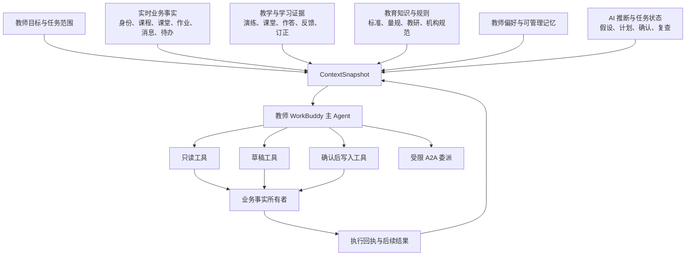

# ClassIn 数据、知识、上下文与工具清单

## 文档定位

本文是下一阶段“六件套”的第四件，以 [[03-教师WorkBuddy-Agent-Harness架构_20260816|《教师 WorkBuddy Agent Harness 架构》]] 为约束，梳理 WorkBuddy 需要的数据、业务事实、教育知识、教师偏好、AI 推断、上下文包和逻辑工具，并形成生产审计与业务协同 Backlog。

本文不是 ClassIn 生产数据库字典或已经可调用的接口文档。参考项目 `/Users/eeo/Documents/claudecode/classin-pc-agentin` 使用本地 Mock 和 Placeholder；它能够证明领域对象、页面职责和候选业务链路，但不能证明生产接口、字段、权限、数据质量和写回能力已经就绪。

---

## 一、证据等级和清单状态

### 1. 证据等级

| 等级 | 含义 | 可以支持 | 不能支持 |
| --- | --- | --- | --- |
| E1：领域确认 | 参考项目 `LOCKED/FACT` 文档和当前领域词汇明确存在该业务概念 | 对象语义、事实所有权、角色和页面职责 | 生产 Schema、接口、质量和权限已就绪 |
| E2：Demo 可见 | 当前 Demo、Mock 或截图展示了字段、状态或入口 | 候选体验、逻辑对象和验证场景 | 真实后台能够读取、写入或持续运行 |
| E3：设计候选 | AI 机会地图、阶段 A/B 架构推导出的需要 | 设计逻辑工具、上下文需求和审计项 | ClassIn 已有对应实现 |
| E4：生产确认 | 由生产领域负责人、接口文档、权限和样本数据共同确认 | 可以进入工程 Spec 和试点 | 不自动代表数据质量和业务价值已验证 |
| E5：试点就绪 | 接口、权限、质量、安全、写回、审计和评价均通过试点门槛 | 可以支撑真实纵向切片 | 不代表可以无边界扩大或 Agent 化 |

### 2. 当前总体状态

- 班级、班级课程、单元、活动、课堂、作业、提交、待办、消息、空间、洞察和成长属于 E1 领域确认；
- Demo 中的具体字段、状态和深链主要属于 E2；
- 本文列出的 Agent 工具大部分属于 E3 逻辑候选；
- 当前没有足够证据将任何生产数据接口统一标记为 E4；
- 在完成真实接口、权限、样本和安全审计前，没有工具达到 E5。

因此，本文的核心价值是明确“需要向谁确认什么”，而不是宣布 ClassIn 已经具备全部数据资产。

---

## 二、资产全景



### 资产分类原则

1. 实时业务事实通过业务工具读取，不复制为长期 Memory；
2. 教学证据保留来源、时间、对象和权限；
3. 教育知识需要版本、来源、适用范围和内容所有者；
4. 教师偏好由教师查看、修改、删除和控制跨机构复用；
5. AI 推断是暂定状态，不自动写成学生或教师事实；
6. 工具只操作其对应领域对象，并返回结构化回执；
7. 所有清单项都必须能映射到一个纵向闭环和评价目的。

---

## 三、ClassIn 实时业务事实清单

### 3.1 身份、组织与权限

| 业务对象 | 逻辑事实需求 | 事实所有者 | WorkBuddy 用途 | 风险 | 当前证据 | 生产审计重点 |
| --- | --- | --- | --- | --- | --- | --- |
| 用户身份 | 稳定用户标识、基础资料、当前登录状态 | 账户领域 | 识别教师本人和偏好归属 | 高 | E1 | 统一身份、跨端一致性、注销和数据主体权利 |
| 组织成员身份 | 机构标识、成员角色、职责、状态、权限范围 | 身份与组织领域 | 确定一次任务的机构、角色和可访问范围 | 极高 | E1 | 多机构、角色切换、对象级权限、授权变更事件 |
| 机构 | 机构标识、名称、规则版本、数据边界 | 组织领域 | 绑定规则、知识和数据隔离 | 高 | E1 | 租户隔离、机构管理员授权、跨机构资源版权 |
| 班级成员关系 | 教师、助教、学生与班级的关系及有效期 | 班级领域 | 确定学生范围和沟通对象 | 极高 | E1 | 转班、离班、历史关系、未成年人和监护信息 |
| 对象权限 | 对课程、课堂、作业、资源、消息的读写动作 | 各领域权限模型 | 对每次读取、草稿和执行进行授权 | 极高 | E1 概念 | 是否存在统一权限查询；缓存和运行中变更 |

### 3.2 班级、课程与教学设计

| 业务对象 | 逻辑事实需求 | 事实所有者 | WorkBuddy 用途 | 风险 | 当前证据 | 生产审计重点 |
| --- | --- | --- | --- | --- | --- | --- |
| 班级 | 标识、名称、成员范围、设置、有效状态 | 班级领域 | 任务范围、课程和学生上下文 | 高 | E1 | 班级本身无结课状态；历史与权限 |
| 班级课程 | 标识、名称、目标、生命周期、所属班级 | 课程领域 | 课程设计、课堂、作业和诊断根上下文 | 高 | E1 | 未结课/已结课状态、版本、发布流程 |
| 课程模板 | 可复用结构、适用学段学科、来源、版权 | 课程或内容领域（待确认） | 无 ClassIn 历史上下文时冷启动和复用 | 中高 | E3 | 是否存在、模板与班级课程差异、复制和更新规则 |
| 单元 | 标识、顺序、目标、所属课程 | 课程领域 | 课程目标拆解和活动组织 | 中 | E1 | 顺序、版本、草稿与发布状态 |
| 教学活动 | 类型、状态、时间、所属单元、资源引用 | 课程领域及具体活动领域 | 生成课堂、作业、测验、资料等草稿 | 高 | E1 | 活动类型 Schema、状态机和深链 |
| 教学目标 | 目标文本、范围、成功标准、来源和确认状态 | 课程领域或教师确认（待确认） | 约束生成、评价、诊断和复查 | 高 | E3 逻辑对象 | 是否为正式对象；目标与课程标准的映射 |
| 教案与课件 | 内容、版本、作者、课程/活动关联、权限 | 课程/空间领域（待确认） | 备课、演练、课堂和版本比较 | 高 | E1 概念 | 内容格式、可解析性、版本、版权和协作编辑 |

### 3.3 日程、课堂与教学发生

| 业务对象 | 逻辑事实需求 | 事实所有者 | WorkBuddy 用途 | 风险 | 当前证据 | 生产审计重点 |
| --- | --- | --- | --- | --- | --- | --- |
| 课程表事项 | 时间、时区、参与者、关联活动、状态 | 课程表领域 | 课前准备、冲突解释和复查调度 | 高 | E1 | 多时区、变更、取消、重复事项和通知 |
| 课堂 | 标识、课程活动、教师、学生范围、开始结束和状态 | 课堂领域 | 课堂上下文、课后证据和回放引用 | 极高 | E1 | 真实课堂接口、状态、访问权限和留存 |
| 课堂回放 | 可用性、媒体引用、权限、时长和处理状态 | 课堂/媒体领域 | 转写、摘要、课堂证据提取 | 极高 | E1 仅可用性概念 | 是否真实存在、转码、同意、未成年人音视频规则 |
| 字幕与转写 | 时间戳文本、说话人、语言、置信度 | 媒体/AI 派生领域（待确认） | 课堂回溯、知识覆盖和证据定位 | 极高 | E3 | 是否已有、准确率、说话人识别、删除和纠正 |
| 板书与课堂内容 | 页面/时间戳、对象引用、权限 | 黑板/课堂领域 | 课堂内容重建和证据引用 | 高 | E1 入口 | 数据格式、版本、导出和访问控制 |
| 互动事件 | 互动类型、时间、参与范围、作答或状态 | 课堂/活动领域 | 形成可观察参与证据 | 极高 | E1 概念 | 事件语义、缺失率、是否能代表学习、反监测边界 |
| 出勤 | 进入退出、时长、有效规则 | 课堂领域 | 解释参与范围，不直接判断学习质量 | 极高 | E1 概念 | 口径、设备异常、隐私和误判纠正 |

### 3.4 作业、提交、反馈与成长

| 业务对象 | 逻辑事实需求 | 事实所有者 | WorkBuddy 用途 | 风险 | 当前证据 | 生产审计重点 |
| --- | --- | --- | --- | --- | --- | --- |
| 作业 | 标识、目标、题目、规则、时间、学生范围、状态 | 作业领域 | 批改、订正和干预任务 | 极高 | E1 | 草稿/发布、权限、题型、学术诚信和版本 |
| 评分标准 | 量规、答案、分值、适用范围、版本 | 作业/内容领域（待确认） | 客观批改和反馈依据 | 极高 | E3 | 是否结构化、内容版权、版本和教师覆盖规则 |
| 提交 | 学生、作业、作答、附件、时间、提交状态 | 提交领域 | 批改、错因候选和完成情况 | 极高 | E1 | 原始尝试、重复提交、附件解析和权限 |
| 正式评分 | 分数、评分者、状态、变更记录 | 作业/评分领域 | 只读理解和教师决策支持 | 极高 | E1 | AI 禁止直接改写、申诉和更正流程 |
| 反馈与评语 | 内容、作者、时间、可见范围、发布状态 | 作业/反馈领域 | 生成和保存待确认草稿 | 极高 | E1 | 草稿能力、敏感内容、学生可见性和撤销 |
| 订正 | 要求、学生响应、再次作答、完成和结果 | 作业/提交领域 | 批改到订正闭环和复查 | 极高 | E1 | 与正式提交状态的关系、二次掌握口径 |
| 教学洞察 | 指标、范围、来源事实、时间和解释 | 洞察领域 | 形成证据摘要和诊断假设 | 极高 | E1 | 指标口径、可追溯性、相关与因果边界 |
| 学生成长 | 学习记录、事实指标、奖励和目标 | 成长领域 | 解释进步和下一目标 | 极高 | E1 | 标签风险、学生可见性、跨课程/机构隔离 |

### 3.5 待办、消息与资源

| 业务对象 | 逻辑事实需求 | 事实所有者 | WorkBuddy 用途 | 风险 | 当前证据 | 生产审计重点 |
| --- | --- | --- | --- | --- | --- | --- |
| 待办 | 责任人、对象引用、截止时间、状态、来源 | 待办领域 | 创建干预行动和跟踪完成 | 高 | E1 | 创建权限、状态机、提醒和去重 |
| 消息线程 | 类型、参与者、内容、时间、可见范围 | 消息领域 | 上下文摘要、沟通草稿和行动项 | 极高 | E1 | 私聊/班级/系统/公告隔离、敏感信息和留存 |
| 消息发送状态 | 草稿、已发送、送达、已读 | 消息领域 | 执行回执和后续跟进 | 极高 | E1 | 草稿是否存在、撤回、失败和重复发送 |
| 空间文件 | 文件、所有者、组织节点、权限、版本 | 空间领域 | 课程设计、备课和资源引用 | 高 | E1 | 文件解析、病毒、版权、组织与个人副本 |
| 资源中心条目 | 内容、学科、学段、难度、来源、版权 | 资源领域 | 检索和推荐获授权教学资源 | 高 | E1 | 版权、适用性、获取与个人副本规则 |
| 授权资源 | 从班级、课堂、作业或消息授予学生的资源 | 资源/授权领域 | 干预计划和学生学习任务 | 极高 | E1 | 授权不会扩大为跨班资源访问 |

### 3.6 备课演练候选事实

| 业务对象 | 逻辑事实需求 | 事实所有者 | WorkBuddy 用途 | 风险 | 当前证据 | 生产审计重点 |
| --- | --- | --- | --- | --- | --- | --- |
| 演练素材 | 视频、音频、课件、知识点清单、版本和权限 | 备课证据域（候选） | 生成时间戳证据和改进建议 | 高 | E3 | 是否已有业务对象、上传/录制、留存和删除 |
| 演练证据 | 时长、转写、声学特征、覆盖和互动标注 | 备课证据域（候选） | 支持自我改进和前后比较 | 高 | E3 | 指标准确性、教师知情、禁止绩效化 |
| 修改计划 | 建议、证据引用、教师确认、目标版本 | 课程/备课域（待确认） | 连接演练证据和教学产物更新 | 中高 | E3 | 保存位置、版本、任务状态和复练关系 |

---

## 四、教育知识与规则清单

### 4.1 知识资产

| 知识类型 | 典型内容 | 所有者候选 | 关键元数据 | 使用场景 | 当前状态 |
| --- | --- | --- | --- | --- | --- |
| 课程标准 | 学段、学科、目标、知识点和能力要求 | 教研/内容团队或外部权威来源 | 来源、地区、版本、生效时间、适用范围 | 目标拆解、课程设计、评价 | E3，需确认来源与授权 |
| 教材与课程内容 | 章节、知识结构、例题、活动和资源 | 机构、教师、内容方 | 版权、版本、学段学科、机构权限 | 课程设计、备课、练习 | E1/E3 混合，需资产盘点 |
| 评分量规 | 成功标准、评分维度、答案和反馈规则 | 教师、机构、内容团队 | 版本、适用作业、覆盖规则、责任人 | 批改、反馈、诊断 | E3，需确认结构化程度 |
| 教研方法 | 教学策略、活动设计、常见误区和干预方法 | 教研团队、专家教师 | 证据、适用条件、学科、版本、评价结果 | 课程设计、诊断、干预 | E3，当前不是既有壁垒 |
| 机构规则 | 教学规范、沟通要求、内容与安全边界 | 机构管理者 | 机构、版本、生效时间、强制/建议 | 所有机构任务 | E1 概念，需生产确认 |
| 产品与业务规则 | 对象状态、发布流程、权限和帮助 | 各 ClassIn 领域团队 | 产品版本、对象类型、权限范围 | 计划、工具选择、错误处理 | E1 文档，需连接生产版本 |
| 安全与沟通规范 | 未成年人、敏感评价、家校沟通和学术诚信 | 安全、法务、教研、机构 | 地区、角色、风险级别、版本 | 诊断、消息、学生 AI | E3，必须先建设 |
| 教师优秀实践 | 教案、课堂策略、评语和干预案例 | 教师本人或机构 | 来源、授权、适用范围、效果和可撤回 | 推荐、Skill 建设 | E3，需明确授权和评价 |

### 4.2 知识进入模型的条件

- 来源清楚且可引用；
- 内容所有者和使用授权明确；
- 有版本、生效时间和适用范围；
- 能按机构、角色、课程和对象权限过滤；
- 内容质量有责任人和纠错流程；
- 索引可以重建、删除和随权限失效；
- 检索结果携带来源，不返回无出处的拼接文本；
- 知识不是业务实时事实的替代品。

### 4.3 首批知识建设优先级

| 优先级 | 知识包 | 直接支撑 |
| --- | --- | --- |
| K0 | 产品对象、权限、状态和工具使用规则 | 所有 Copilot 与 Agent 安全运行 |
| K0 | 选定试点的课程标准、教学目标和评分量规 | 课程设计、批改、诊断 |
| K0 | 未成年人、敏感评价、沟通和学术诚信规则 | 作业、诊断、消息、学生侧能力 |
| K1 | 单学科教研方法、常见误区和干预策略 | 诊断到干预、课程设计 |
| K1 | 机构教学和沟通规范 | ClassIn 机构试点 |
| K2 | 经授权、可评价的优秀教师实践 | 个性化 Skill 和长期差异化 |

---

## 五、教师偏好与可管理记忆

### 5.1 可以进入长期偏好的内容

| 偏好 | 来源 | 使用方式 | 是否可跨机构 | 教师控制 |
| --- | --- | --- | --- | --- |
| 教案和课程结构偏好 | 教师明确设置或反复确认 | 调整产物结构，不改变目标事实 | 可选 | 查看、修改、删除、关闭 |
| 评语与沟通语气 | 教师明确选择 | 调整草稿表达 | 默认不跨机构规则 | 同上 |
| 常用教学策略 | 教师确认有效策略 | 作为候选建议，不自动应用 | 可选并标记适用范围 | 同上 |
| 常用资源和模板 | 教师收藏或确认使用 | 检索排序和草稿起点 | 受版权和机构归属限制 | 同上 |
| 审批偏好 | 对低风险可逆动作的明确授权 | 控制 R0-R2 范围内的交互频率 | 不跨机构 | 随时收回、查看历史 |
| 输出格式与语言 | 教师设置 | 调整展示、导出和内容语言 | 可以 | 同上 |

### 5.2 不应自动进入长期记忆

- 原始课堂、作业、消息和学生内容；
- 未经教师确认的诊断假设；
- 学生敏感评价、心理或行为标签；
- 一次性的任务范围和临时约束；
- 从教师编辑行为推测的隐含偏好；
- 一个机构的规则、学生和专有资源；
- Agent 的隐藏推理过程；
- 已经由业务系统拥有的课程、成绩、提交和权限事实。

### 5.3 记忆治理

- 每条偏好显示来源、创建时间、适用范围和最近使用；
- 教师可以查看“为什么记住”和“影响哪些结果”；
- 允许单条修改、删除、全部清空和关闭个性化；
- 机构级偏好与个人偏好冲突时明确优先级，不静默覆盖；
- 过期、长期未使用或来源撤回的偏好需要复核；
- 删除偏好不删除依法必须保留的审计，但审计不能继续用于个性化。

---

## 六、AI 推断与任务状态清单

| AI 对象 | 必须包含 | 可以转化为什么 | 过期或失效条件 | 禁止行为 |
| --- | --- | --- | --- | --- |
| 诊断假设 | 目标、证据、范围、时间、置信度、未知项 | 教师确认结论或被否定 | 新证据、教师否定、范围变化、到期 | 自动写入学生档案 |
| 错因候选 | 作答、题目、评分标准和解释 | 教师确认的反馈或练习设计 | 作答修正、标准变化 | 自动成为正式评分理由 |
| 干预建议 | 确认结论、目标、行动、复查节点 | 干预计划和 ProposedAction | 上游结论撤回、权限或学生范围变化 | 自动标记干预完成 |
| 资源推荐 | 目标、适用性、来源、版权和权限 | 教师选择的资源引用 | 权限、版本或可用性变化 | 扩大资源访问权限 |
| 计划 | 目标、步骤、依赖、能力、风险和完成条件 | AgentRun 的 PlanVersion | 教师修改、数据变化、工具不可用 | 静默扩展批准范围 |
| ProposedAction | 目标对象、参数、差异、风险和可逆性 | 经批准后的业务执行 | 计划变化、对象版本或权限变化 | 直接当成业务事实 |
| 完成评估 | 完成条件、执行回执和复查证据 | Run 完成、调整或继续 | 新结果、教师复核 | 以模型自述代替业务结果 |

---

## 七、四条纵向闭环的上下文包

### 7.1 课程目标到课程对象

| 上下文层 | 最小需要 | 缺失时降级 |
| --- | --- | --- |
| 安全范围 | 教师身份、课程或新建范围、资源权限 | 只能生成本地未关联草稿 |
| 任务范围 | 教学目标、学段学科、时间、学生范围、成功标准 | 请求教师补充，不生成完整课程 |
| 业务事实 | 班级课程、已有单元活动、历史产物 | 从空白课程开始并标记缺少历史 |
| 知识 | 课程标准、机构规则、授权教材资源 | 只根据教师资料生成并标记来源有限 |
| 偏好 | 课程结构和教案格式 | 使用默认模板，不推测教师风格 |
| 输出对象 | 课程、单元、活动和资源草稿 | 导出为通用文档，不能声称已写回 |

### 7.2 备课演练到改进

| 上下文层 | 最小需要 | 缺失时降级 |
| --- | --- | --- |
| 安全范围 | 教师、演练素材权限和用途 | 不处理媒体 |
| 任务范围 | 目标、知识点、反馈维度和使用目的 | 只做转写，不做教学建议 |
| 教学产物 | 课件、教案或活动版本 | 只评价可观察表达，不判断覆盖 |
| 演练证据 | 音视频、时间戳、转写和可观察指标 | 明确缺失维度，不生成伪时间戳 |
| 知识 | 课程目标和适用教研规则 | 只给一般表达建议 |
| 输出对象 | 演练报告、修改计划、产物版本和复练关系 | 保存为教师个人报告，不进入绩效视图 |

### 7.3 批改到订正

| 上下文层 | 最小需要 | 缺失时降级 |
| --- | --- | --- |
| 安全范围 | 教师对作业和学生提交的权限 | 停止处理 |
| 任务范围 | 作业目标、题型、学生范围和反馈要求 | 请求教师指定，不自动评分 |
| 业务事实 | 作业、提交、作答、正式状态 | 只能处理教师上传的匿名样本 |
| 知识 | 答案、评分标准、课程目标、学术诚信规则 | 仅摘要作答，不给分数建议 |
| 推断 | 共性错误和错因候选 | 明确作为候选等待教师确认 |
| 输出对象 | 反馈草稿、分层订正练习和订正任务 | 不能改变正式分数和提交状态 |

### 7.4 诊断到个性化干预

| 上下文层 | 最小需要 | 缺失时降级 |
| --- | --- | --- |
| 安全范围 | 当前机构、教师角色、班级/学生对象权限 | 停止读取和执行 |
| 任务范围 | 教学目标、学生或班级范围、时间和成功标准 | 只显示证据摘要，不做诊断 |
| 学习证据 | 课堂、作业、反馈、订正及来源 | 形成“证据不足”，请求教师补充 |
| 知识 | 机构规则、干预策略、安全沟通规范 | 只生成教师内部计划，不生成外部消息 |
| 教师确认 | 被确认或修正的诊断结论 | 不进入干预执行 |
| 输出对象 | 干预计划、作业/待办/资源/消息草稿、复查节点 | 只能导出草稿，不声称已执行 |

---

## 八、逻辑只读工具清单

以下工具名是 Harness 中的逻辑 Capability ID，不代表生产接口名称或已经存在。

| 逻辑工具 | 读取目的 | 核心输入 | 核心输出 | 敏感度 | 当前状态 | 生产确认方 |
| --- | --- | --- | --- | --- | --- | --- |
| `resolve_active_membership` | 确认机构角色和任务安全范围 | 用户、机构候选 | 组织成员身份、权限摘要 | 极高 | E3 | 身份/组织团队 |
| `check_object_permissions` | 对具体对象和动作复核权限 | 身份、对象、动作 | allow/deny、原因、版本 | 极高 | E3 | 各领域 + 安全 |
| `read_class_scope` | 读取班级和成员范围 | 班级标识 | 班级、教师、学生关系 | 极高 | E3 | 班级团队 |
| `read_course_structure` | 读取班级课程、单元和活动 | 课程标识 | 结构、状态、版本 | 高 | E3 | 课程团队 |
| `read_course_artifacts` | 读取教案、课件和资源引用 | 课程/活动标识 | 产物、版本、权限 | 高 | E3 | 课程/空间团队 |
| `read_schedule_context` | 读取时间、课堂和冲突 | 身份、时间范围 | 日程、课堂状态、关联对象 | 高 | E3 | 课程表/课堂团队 |
| `read_classroom_evidence` | 读取课堂可追溯证据 | 课堂标识、证据类型 | 事件、媒体引用、来源和缺口 | 极高 | E3 | 课堂/数据团队 |
| `read_rehearsal_evidence` | 读取演练素材和证据 | 演练标识 | 媒体、转写、指标、版本 | 高 | E3 | 备课领域负责人待定 |
| `read_assignment` | 读取作业目标、内容、规则和状态 | 作业标识 | 作业对象和版本 | 极高 | E3 | 作业团队 |
| `read_submissions` | 读取获授权学生提交和作答 | 作业、学生范围 | 提交、作答、附件和状态 | 极高 | E3 | 提交团队 |
| `read_feedback_and_corrections` | 读取反馈、评语和订正结果 | 作业/提交范围 | 反馈、订正和复查证据 | 极高 | E3 | 作业/提交团队 |
| `read_learning_evidence` | 组合有来源的学习证据 | 目标、课程、学生、时间 | 证据集合、来源和缺口 | 极高 | E3 聚合工具 | 洞察/数据 + 各事实团队 |
| `search_authorized_resources` | 检索有权限和版权的资源 | 目标、学科、难度、范围 | 资源、来源、权限和适配理由 | 高 | E3 | 空间/资源团队 |
| `read_todo_status` | 读取行动和完成事实 | 用户/班级/对象范围 | 待办、状态、截止时间 | 高 | E3 | 待办团队 |
| `read_message_context` | 读取获授权沟通上下文 | 线程、时间、参与者范围 | 消息、发送状态和行动项 | 极高 | E3 | 消息团队 |
| `read_outcome_for_review` | 读取复查所需后续结果 | Run、目标、对象范围 | 完成、订正、反馈和变化证据 | 极高 | E3 聚合工具 | 对应事实团队 |

### 只读工具共同要求

- 每次调用携带组织成员身份和对象范围；
- 输出包含来源对象、版本、时间和权限；
- 支持字段最小化和学生范围最小化；
- 缺失、冲突和权限拒绝使用标准错误；
- 不把聚合推断混入原始事实；
- 调用进入审计，并按照评价目的限制内容留存。

---

## 九、逻辑草稿与写入工具清单

| 逻辑工具 | 目标对象 | 副作用 | 风险 | 默认审批 | 幂等/撤销要求 | 当前状态 | 生产确认方 |
| --- | --- | --- | --- | --- | --- | --- | --- |
| `save_course_draft` | 班级课程、单元、活动 | 保存草稿，不发布 | R2 | 明确确认 | 版本检查；可删除草稿 | E3 | 课程团队 |
| `save_artifact_draft` | 教案、课件、资源或题目 | 创建或更新草稿 | R2 | 明确确认 | 版本、作者、来源；可恢复旧版 | E3 | 课程/空间团队 |
| `save_rehearsal_improvement_plan` | 演练修改计划 | 保存教师个人改进草稿 | R2 | 明确确认 | 不进入绩效；可删除 | E3 | 备课领域负责人待定 |
| `create_assignment_draft` | 作业 | 创建未发布作业 | R2 | 明确确认 | 稳定幂等键；可删除 | E3 | 作业团队 |
| `save_feedback_draft` | 提交反馈或评语 | 保存未发布反馈 | R2 | 明确确认 | 不改变正式评分；可删除 | E3 | 作业/提交团队 |
| `create_correction_draft` | 订正练习或要求 | 创建未发布订正任务 | R2 | 明确确认 | 与原作业关联；可撤销 | E3 | 作业团队 |
| `save_intervention_plan` | 干预计划 | 保存计划及复查节点 | R2 | 明确确认 | 上游结论变化时失效 | E3 | 事实所有者待定 |
| `create_todo` | 待办 | 创建一项行动 | R2 | 明确确认 | 去重；可撤销未完成项 | E3 | 待办团队 |
| `bulk_create_todos` | 多项待办 | 批量创建行动 | R3 | 强确认、逐项预览 | 逐项幂等和回执 | E3 | 待办团队 |
| `link_authorized_resource` | 课程、作业或干预 | 建立资源引用 | R2 | 明确确认 | 不扩大资源权限；可解除引用 | E3 | 空间/资源团队 |
| `create_message_draft` | 消息草稿 | 创建未发送沟通 | R2 | 明确确认 | 接收者、来源和敏感检查 | E3 | 消息团队 |
| `send_message` | 消息 | 对外发送 | R3 | 强确认 | 去重、送达回执、撤回规则 | E3 | 消息团队 |
| `publish_assignment` | 作业 | 面向学生发布任务 | R3 | 强确认 | 对象版本、学生范围、通知回执 | E3 | 作业团队 |
| `publish_course_changes` | 课程/活动 | 发布课程变更 | R3 | 强确认 | 差异、影响范围、版本与回滚 | E3 | 课程团队 |
| `schedule_review` | AgentRun/待办 | 创建未来复查节点 | R2 | 首次确认或明确授权 | 去重、取消和责任人 | E3 | Runtime + 待办团队 |

### 禁止提供给 Agent 的直接写入

| 禁止工具 | 原因 | 替代方式 |
| --- | --- | --- |
| `set_final_grade` | 正式评分责任不可自动转移 | 生成评分建议和反馈草稿，由教师在评分流程确认 |
| `change_submission_status` | 提交状态是学生和作业领域事实 | 只读状态并提示人工处理 |
| `mark_todo_completed` | 完成必须由真实行为或责任人确认 | 读取完成状态并提醒 |
| `set_message_read` | 已读是沟通事实，不能由摘要代替 | 只提供消息摘要和行动项 |
| `rewrite_classroom_fact` | 课堂事实和证据不可被 AI 改写 | 提交纠错或补充说明请求 |
| `change_permissions` | 权限变化影响数据安全和多人 | 生成管理员操作建议，不由 Agent 执行 |
| `persist_student_label` | AI 推断不能固化为学生事实 | 保存有时效的诊断假设和教师确认记录 |

---

## 十、工具注册表共同契约

每项生产工具进入 Capability Registry 前必须具备：

```text
ToolManifest
  identity / version / owner
  purpose / nonGoals
  inputSchema / outputSchema / errors
  requiredContext / requiredPermissions
  sideEffectClass
  idempotencyContract
  reversibilityContract
  approvalPolicy
  latency / timeout / costBudget
  dataClassification / retention
  auditContract
  evaluationContract
  productionReadiness
```

### 标准错误

| 错误类别 | Harness 行为 |
| --- | --- |
| `permission_denied` | 停止相关步骤，不尝试扩大权限 |
| `object_not_found` | 检查范围和版本，向教师说明缺失 |
| `version_conflict` | 重新读取并生成新差异，旧批准失效 |
| `validation_failed` | 将领域校验返回工作台修改，不绕过规则 |
| `rate_limited` | 按预算退避，长时间等待则暂停 Run |
| `dependency_unavailable` | 暂停或降级，不伪造成功 |
| `partial_success` | 保存逐项回执，只重试幂等失败项 |
| `non_reversible` | 执行前提高确认强度，执行后不承诺撤销 |
| `sensitive_content_blocked` | 停止发布，交由教师人工处理 |

---

## 十一、生产数据与工具审计模板

每个领域团队需要为其对象和工具完成以下审计：

| 审计项 | 需要回答的问题 |
| --- | --- |
| 业务语义 | 对象和字段真正代表什么，哪些常见误用必须禁止？ |
| 事实所有权 | 哪个领域拥有最终状态，是否存在重复或历史系统？ |
| 标识与版本 | 是否有稳定 ID、版本、更新时间和并发控制？ |
| 读取接口 | 是否存在；支持哪些范围、分页、过滤和字段最小化？ |
| 写入接口 | 是否支持草稿、确认发布、批量、幂等和撤销？ |
| 权限 | 如何根据机构、角色、对象和操作判断；运行中变化如何通知？ |
| 数据质量 | 覆盖率、缺失率、延迟、错误、重复和人工纠正机制？ |
| 内容解析 | 文档、课件、音视频、板书、题目和附件可解析到什么程度？ |
| 隐私与合规 | 未成年人、机构授权、模型处理、跨境、留存和删除要求？ |
| 安全 | 敏感字段、注入、恶意文件、越权和数据泄漏防护？ |
| 审计 | 谁读取、生成、批准、写入和撤销，能否回溯？ |
| 评价 | 如何知道工具结果正确、被使用并改善业务结果？ |
| 负责人 | 产品、研发、数据、安全、法务和业务责任人分别是谁？ |

### 生产确认记录格式

```text
AssetOrTool
  domainOwner
  evidenceLevel: E1-E5
  confirmedObjectAndFields
  readInterface
  writeInterface
  permissionModel
  sampleDataProfile
  qualityAndFreshness
  retentionAndDeletion
  safetyReview
  pilotScope
  openGaps
  signOffOwners
```

---

## 十二、最小数据包与阶段门

| 纵向闭环 | 最小数据包 | 最小写入工具 | 达到 E4 前不能做 | 达到 E5 的证明 |
| --- | --- | --- | --- | --- |
| 课程目标到课程对象 | 教师范围、目标、课程结构、授权资料、标准 | 保存课程/单元/活动草稿 | 不声称自动获得班级历史和课程标准 | 真实教师持续采用，草稿可正确写回并发布 |
| 备课演练到改进 | 演练素材、课件、目标、时间戳证据 | 保存报告和修改计划草稿 | 不用于教师绩效和真实课堂判断 | 报告准确、建议被采用、复练和前后改善可测 |
| 批改到订正 | 作业、提交、评分标准、反馈和订正状态 | 反馈、练习和订正草稿 | 不自动修改正式分数和提交状态 | 批改节省时间、订正完成和二次掌握改善 |
| 诊断到个性化干预 | 目标、获授权学习证据、规则、资源、待办、消息 | 干预计划、作业/待办/资源/消息草稿 | 不确立敏感学生结论或自动外发 | 教师确认、行动完成、复查结果和安全均达标 |

---

## 十三、数据缺口与业务协同 Backlog

### P0：任何真实 Copilot 之前

1. 统一组织成员身份和对象级权限检查方式；
2. 明确四条纵向闭环涉及对象的稳定 ID、版本和事实所有者；
3. 提供课程、作业、提交、课堂证据、资源、待办和消息的生产样本；
4. 确认只读接口、字段最小化和权限拒绝错误；
5. 确认草稿与正式发布的状态差异；
6. 建立未成年人、敏感评价、课堂音视频和模型处理规则；
7. 定义采纳、修改、拒绝、批准、执行、撤销和复查事件；
8. 为试点教师和班级建立明确授权、退出和删除流程。

### P1：确认写入和阶段 2 Copilot

1. 课程、作业、反馈、待办、消息和资源草稿工具；
2. 版本冲突、幂等键、部分成功和执行回执；
3. 差异预览、批量范围和撤销能力；
4. 课程标准、评分量规、机构规则和安全知识包；
5. 课堂、作业和订正证据的来源引用与纠错；
6. ClassIn 上下文增强与无上下文基线的对照评价。

### P2：有限 Agent 和 A2A

1. 持久 Run、复查调度、权限变化和上下文刷新事件；
2. 跨领域工具的可靠性、超时、重试和补偿策略；
3. 低风险授权策略和高风险审批台账；
4. A2A DelegationEnvelope、子 Run、成本和独立审计；
5. 可管理教师偏好和跨机构隔离；
6. 跨周期教学结果、成本和商业价值评价。

### P3：完整通用 WorkBuddy

1. 无 ClassIn 教师的课程、班级和学生轻量对象模型；
2. 文件、日历、LMS、内容平台和沟通工具外部连接器；
3. 外部对象与 ClassIn 对象的身份、版本和冲突协议；
4. 独立 WorkBuddy 与 ClassIn 内嵌入口的任务连续性；
5. 数据可携带、导出、删除和迁移能力。

---

## 十四、跨团队责任矩阵

| 工作项 | 产品 | Agent/Harness | ClassIn 领域团队 | 数据团队 | 教研/内容 | 安全/法务 | 试点业务 |
| --- | --- | --- | --- | --- | --- | --- | --- |
| 对象语义和事实所有权 | R | C | A | C | C | I | C |
| 生产接口与工具契约 | C | R | A/R | C | I | C | I |
| 权限和组织隔离 | C | R | A/R | C | I | A/R | I |
| 数据质量和样本画像 | C | C | R | A/R | C | C | I |
| 课程标准与教研知识 | C | C | I | C | A/R | C | C |
| 未成年人和敏感行为规则 | C | C | C | C | R | A/R | C |
| 上下文装配和推断边界 | A | R | C | C | C | C | I |
| 草稿、审批、执行和撤销 | A | R | R | I | C | C | C |
| 评价事件和实验设计 | A | R | C | R | C | C | R |
| 试点授权、培训和反馈 | C | C | C | I | C | C | A/R |

说明：`A` 为最终负责，`R` 为执行负责，`C` 为参与协作，`I` 为需要知情。具体人员和组织名称需要项目负责人补齐。

---

## 十五、首轮生产审计建议顺序

### 第 1 周：身份、范围与对象

- 组织成员身份、多机构和角色切换；
- 班级、班级课程、单元、活动和学生关系；
- 对象 ID、版本、权限和样本数据；
- 明确一个试点机构、学科、班级和教师范围。

### 第 2 周：四条闭环的读能力

- 课程与资源读取；
- 演练素材和证据可行性；
- 作业、提交、评分标准和订正读取；
- 课堂、洞察和学习证据读取；
- 每条链路形成一份真实样本上下文包。

### 第 3 周：草稿与写回

- 课程/活动、作业、反馈、待办、资源和消息草稿；
- 权限、版本、幂等、部分成功和撤销；
- 确认哪些动作只能人工完成；
- 建立 ToolManifest 初版。

### 第 4 周：安全、知识和评价

- 未成年人、音视频、敏感诊断、消息和模型使用审查；
- 单学科标准、量规、机构规则和教研知识包；
- 人工基准、采纳修改、执行结果和成本事件；
- 确定首批 E4 候选和仍然阻塞的 P0 缺口。

以上是审计顺序，不是研发交付承诺。任何环节发现权限、质量或业务价值红线，都应缩小或更换纵向切片。

---

## 十六、当前可以确认和不能确认的结论

### 可以确认

- ClassIn 领域模型提供了教师 WorkBuddy 所需的大部分核心业务对象；
- 课程、课堂、作业、提交、待办、消息、空间、洞察和成长拥有明确事实所有权方向；
- 四条纵向闭环可以推导出具体上下文包和逻辑工具；
- 数据必须通过业务工具实时读取，知识、偏好和 AI 推断需要独立治理；
- 先建设只读和草稿工具，再建设确认写入和有限 Agent；
- 现有 AgentIn 市场和聊天形态不能替代 Runtime、权限、审批和结果追踪。

### 不能确认

- 生产系统已存在本文列出的逻辑工具；
- 课堂、作业、消息和资源内容能够稳定、合法地供模型处理；
- 现有权限可以直接支持多机构、学生级和跨领域 Agent；
- ClassIn 数据质量足以显著优于教师手动输入；
- 草稿、版本、幂等、撤销和审计已经由各领域实现；
- 机构和教师愿意授权并持续使用这些上下文；
- 任何候选子 Agent 已经具备 A2A 生产条件。

---

## 十七、第四件产出完成标准

本文在当前阶段满足：

- 业务事实、教育知识、教师偏好、AI 推断和工具已经分开；
- 核心 ClassIn 对象的用途、所有者、风险和生产审计项清楚；
- 四条纵向闭环拥有最小上下文包和降级策略；
- 只读、草稿、确认写入和禁止动作具有逻辑清单；
- 每项逻辑工具都能进入 ToolManifest 和 Harness 风险控制；
- 生产未知项没有被包装成已有能力；
- P0-P3 数据与业务协同 Backlog、责任矩阵和首轮审计顺序已经形成。

下一步需要由 ClassIn 生产领域负责人、数据、安全、法务、教研和试点业务共同完成 E4 审计；通过后，第三件 Harness 才能进入具体技术 Spec，第四件清单才能进入真实工具注册和试点建设。
