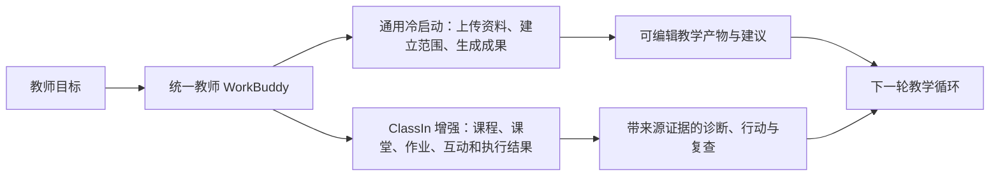
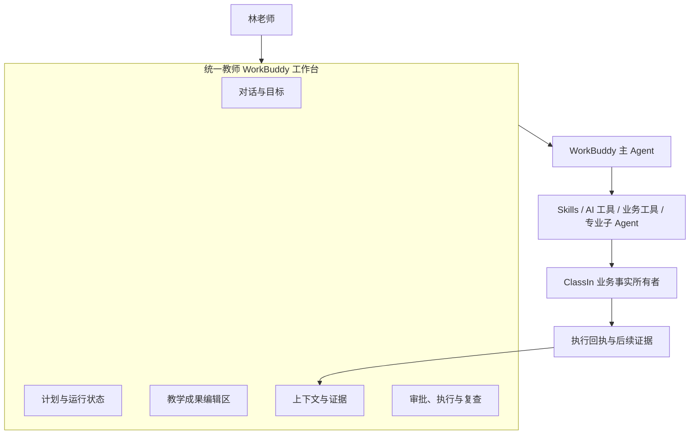
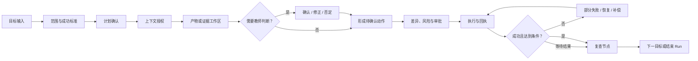

# 教师 WorkBuddy 终局愿景 Demo 体验脚本

## 文档定位

本文是“六件套”的第五件，用一条完整的教师教学循环把终局产品变成可被管理层、销售、客户、设计和工程团队共同理解的体验故事。本文定义演示叙事、场景状态、教师控制点、能力真实性和验收标准，不代表所有能力已经进入生产，也不替代第六件的真实试点计划。

本文受 [[01-终局教师WorkBuddy产品定义_20260815|《终局教师 WorkBuddy 产品定义》]]、[[02-ClassIn教师WorkBuddy三张核心图_20260815|《三张核心图》]]、[[03-教师WorkBuddy-Agent-Harness架构_20260816|《Agent Harness 架构》]] 和 [[04-ClassIn数据知识上下文与工具清单_20260816|《数据、知识、上下文与工具清单》]] 共同约束。

### 当前 PoC 边界

本文件当前是**概念验证（PoC）级的体验脚本和交互状态基线**，验证以下问题：

- 统一教师 WorkBuddy 是否能以一条完整教学循环组织终局叙事；
- 对话、计划、教学产物、上下文证据、审批、执行和复查是否形成连贯的交互状态；
- 通用冷启动与 ClassIn 增强是否共享同一个产品核心；
- 教师确认、拒绝、暂停、撤销和失败恢复是否出现在正确节点。

当前**不承诺**高保真视觉、可用性数据、生产接口、真实模型效果、端到端性能或已上线的桌面/移动端实现。第 4 节的工作台图和第 6 节的“画面”是结构化线框与演示导演说明，不是最终 UI 规格。阶段 D 才开始把这些状态转成高保真原型和可操作的交互流程。

本文必须与以下两条轨道分开理解：

- **愿景 Demo**：允许使用脱敏模拟数据、模拟工具回执和未来能力，用来说明终局产品如何工作；
- **验证型产品**：必须使用真实教师、真实权限、真实数据和真实业务结果，用来判断是否继续投入。

## 一、Demo 要证明什么

### 1. 一句话

> 教师只需要向一个 WorkBuddy 表达教学目标，WorkBuddy 就能在统一工作台中组织上下文、证据、计划和成果；教师始终掌握判断与执行控制，ClassIn 连接后让同一套通用能力获得连续教学证据、真实业务写回和结果复查。

### 2. 观众

| 观众 | Demo 后应形成的判断 |
| --- | --- |
| 管理层 | 这不是新的聊天入口，而是面向教师教学结果的统一工作台；终局和分阶段路径一致 |
| 产品与设计 | 对话、计划、产物、证据、审批和复查是一个连续体验，不是六个孤立功能 |
| 工程与数据 | 主 Agent 背后的 Harness、业务工具、权限和结果回执是产品价值的必要组成 |
| ClassIn 领域团队 | ClassIn 的价值是上下文、执行和反馈增强，而不是把 WorkBuddy 限制成内嵌功能 |
| 教师与试点客户 | 可以从一个目标开始，获得可编辑成果，并在关键判断和外部动作前保留专业控制权 |

### 3. 建议形式

- **总时长**：15—20 分钟；
- **演示角色**：一名教师、一个统一 WorkBuddy 主 Agent；
- **叙事范围**：一个四周教学单元，从目标设计到课后复查；
- **产品视角**：先展示通用冷启动，再切换到 ClassIn 上下文增强；
- **演示原则**：先讲教师结果，再展开能力和系统；不以 Agent 列表、模型名称或工具菜单作为主线。

## 二、演示真值标记

每一个页面、数据、按钮和回执必须在演示者备注或界面中带有真值标记，避免把未来能力误认为现有生产能力。

| 标记 | 含义 | Demo 中的表达方式 | 不能暗示 |
| --- | --- | --- | --- |
| `[真实]` | 已由生产接口、权限和样本确认的能力 | 展示真实对象、真实状态或真实回执 | 不能扩大到未审计范围 |
| `[模拟]` | 为了串起终局体验而准备的脱敏或固定演示数据 | 显示“演示数据”或在旁注中说明 | 不能当作生产数据质量证明 |
| `[集成模拟]` | 业务流程和界面已按目标设计，但当前用模拟 adapter 代替生产连接 | 标明模拟工具、模拟执行或模拟结果 | 不能声称已经写入 ClassIn |
| `[未来]` | 尚未完成生产设计或审计的终局能力 | 用未来能力标签和旁白说明 | 不能进入当前试点承诺 |

真值标记是 Demo 的一等产物。凡是没有标记的对象，默认不应被观众理解为已经生产就绪。

根据第四件当前审计结论，尚没有足够证据把 ClassIn 生产数据接口或逻辑工具统一标记为 E4。因此，在生产审计完成前，本脚本中的 ClassIn 读取、写回、执行回执和复查默认使用 `[模拟]` 或 `[集成模拟]`；只有获得接口、权限、样本和责任人的逐项确认后，才能改为 `[真实]`。

本轮演示可使用一个完全模拟的 ClassIn 机构、教师、班级课程、课程对象和业务回执。模拟机构只用于验证产品形态、交互状态和 Harness 契约，不代表真实 ClassIn 组织、接口或数据已经取得。

## 三、教师画像与教学任务

### 1. 画像

**林老师**，初中英语教师，负责八年级一个 32 人班级，每周三课时。她习惯用自己的教案模板和简洁、具体的评语，愿意审阅 AI 草稿，但不接受 AI 未经确认直接给学生贴标签、修改正式成绩或发送家长消息。

### 2. 四周单元

单元主题为“叙事写作：从事件顺序到细节表达”，目标是让学生能够使用清晰的时间顺序和至少两类细节完成一篇 120 词短文。成功标准包括：结构完整、时序连接正确、细节与主题相关、修改后错误率下降。

### 3. 两种起点



通用冷启动和 ClassIn 增强共享同一个主 Agent、工作台和任务状态。连接 ClassIn 后，不是换了一个产品，而是上下文、执行和结果反馈变得更连续。

## 四、终局工作台的演示状态



演示时始终保持五个区域可见或可一键切换：

```text
+-------------------+--------------------------------+----------------------+
| 对话与目标         | 教学成果编辑区                 | 上下文与证据          |
| 教师与主 Agent     | 课程 / 课件 / 作业 / 干预      | 来源 / 缺口 / 推断    |
|                   |                                |                      |
+-------------------+--------------------------------+----------------------+
| 计划与运行状态     | 审批 / 执行回执 / 撤销 / 到期复查                      |
+-------------------+-------------------------------------------------------+
```

| 区域 | 教师要回答的问题 | 典型内容 |
| --- | --- | --- |
| 对话与目标 | 我想完成什么？ | 目标、范围、约束、成功标准、澄清问题 |
| 计划与运行状态 | WorkBuddy 正在做什么？ | 步骤、依赖、等待原因、失败、复查时间 |
| 教学成果编辑区 | 我可以交付什么？ | 教案、课件、作业、反馈、干预计划、消息草稿 |
| 上下文与证据 | 它依据什么？缺什么？ | 来源、时间、权限、证据片段、冲突、推断置信度 |
| 审批、执行与复查 | 什么会发生？结果怎样？ | 差异、风险、批准、执行回执、撤销、复查结果 |

教师不需要选择“哪个 Agent”或理解内部调用拓扑。需要独立生命周期的任务可以由主 Agent 委派给专业子 Agent，但界面只呈现目标、进度、结果和责任边界。

### 关键交互节点补足清单

以下节点是把功能列表具象化为可见、可操作体验时不可省略的交互契约。阶段 D 的高保真原型必须至少覆盖这些节点的默认、缺口、等待和失败状态。

| 交互节点 | 教师看到什么 | 必须能做什么 | 主要验证问题 |
| --- | --- | --- | --- |
| 1. 目标输入与范围澄清 | 目标复述、范围、时间和成功标准 | 修改范围、补充资料、确认启动 | 教师是否知道 WorkBuddy 要完成什么 |
| 2. 计划确认 | 步骤、依赖、预计产物和风险 | 调整顺序、删除步骤、暂停启动 | 计划是否可理解、可修改 |
| 3. 上下文授权 | 机构/班级/学生范围、来源和敏感项 | 授权、缩小范围、拒绝某类数据 | 读取前是否有明确授权 |
| 4. 证据展开 | 数字、时间、来源对象和缺口 | 展开来源、比较冲突、标记不足 | 事实能否回溯 |
| 5. 产物编辑与差异 | 草稿、版本、来源和变更 | 编辑、接受片段、恢复旧版 | AI 是否成为可编辑协作而非黑盒生成 |
| 6. 推断确认 | 假设、证据、置信度和未知项 | 确认、修正、否定、设置过期 | 推断是否与学生事实隔离 |
| 7. 动作编排 | 目标对象、参数、风险和可逆性 | 改范围、拆分动作、转为草稿 | 教师是否能理解将发生什么 |
| 8. 委派可见性 | 子任务目标、状态、结果契约 | 查看结果、取消委派、改用其他能力 | A2A 是否不增加教师负担 |
| 9. 审批与批量控制 | 差异预览、风险分组、动作清单 | 单项/批量批准、拒绝、延后 | 批量执行是否仍保留专业控制 |
| 10. 执行反馈 | 成功、部分成功、失败和回执 | 查看实际对象、重试、补偿 | 工具成功是否与业务结果区分 |
| 11. 恢复与撤销 | 等待原因、权限变化、可撤销动作 | 补充权限、暂停、恢复、撤销 | 失败是否可恢复、可追责 |
| 12. 复查与下一轮 | 目标进展、证据对照和新建议 | 接受下一目标、调整标准、结束 Run | 结果是否回到教学循环 |

### 交互流程图（PoC 级）



## 五、完整故事板

| 场景 | 教师目标 | WorkBuddy 行为 | 能力形态 | 教师控制点 | 主要产物或证据 |
| --- | --- | --- | --- | --- | --- |
| 1. 定义目标 | 设计四周单元 | 澄清范围、成功标准和资料 | Copilot + 规划 | 确认目标与范围 | 目标草稿、计划 |
| 2. 形成课程草稿 | 把目标变成可教结构 | 读取资料、生成单元和活动 | AI 工具 / Copilot | 编辑、接受或退回 | 课程、单元、活动草稿 |
| 3. 备课演练 | 发现讲解和互动问题 | 分析演练证据，提出修改 | Copilot | 确认修改计划 | 演练报告、版本差异 |
| 4. 连接 ClassIn | 展示 ClassIn 上下文增强 | 显示课程、班级和历史证据 | 上下文引擎 | 授权范围、关闭敏感数据 | ContextSnapshot |
| 5. 课堂发生 | 获得可追溯学习证据 | 聚合课堂互动和任务结果 | 只读工具 / Copilot | 查看来源和缺口 | 课堂、互动、提交证据 |
| 6. 形成诊断 | 判断学生卡点 | 生成班级和学生诊断假设 | Copilot，有限 Agent 预演 | 确认、修正或否定 | 诊断假设 |
| 7. 设计干预 | 为不同学生安排下一步 | 生成分层任务、资源和沟通草稿 | Agent 计划 + Copilot | 审批范围和每项动作 | 干预计划、待确认动作 |
| 8. 执行与复查 | 让行动真正发生并验证 | 经批准写回，按时复查 | 有限 Agent | 批量批准、暂停、撤销 | 执行回执、复查结果 |
| 9. 进入下一轮 | 调整下次教学 | 汇总结果并提出下一目标 | Copilot | 采纳或重新定义目标 | 反思、下一轮计划 |

## 六、逐场景演示脚本

### 场景 1：从一句目标开始

**画面**：空白但非空的 WorkBuddy 工作台，左侧为对话和计划，中间为成果编辑区，右侧提示“当前未连接 ClassIn”。

**教师输入**：

> “我想为八年级学生设计一个四周的叙事写作单元。学生要能写出结构清楚、有细节的 120 词短文。我有一份教材 PDF 和上学期的教案模板，希望每周三课时，评语简洁具体。”

**主 Agent 响应**：先复述目标、时间和产物，指出尚未提供班级历史数据，并询问是否允许将教材和模板作为本次任务资料。它创建 `Agent Run`，展示四步计划：目标拆解、课程草稿、备课演练、课后复查设计。

**演示重点**：WorkBuddy 不把一句话直接变成一页教案，而是先建立任务意图、成功标准和缺口。

### 场景 2：生成并编辑课程草稿

**画面**：成果编辑区出现单元结构；每个活动显示来源和“草稿”状态。

**WorkBuddy 行为**：调用资料解析、目标拆解和课程结构 Skill，生成四周单元、每周活动、课堂练习和作业草稿。右侧显示“使用来源：教材第 3 单元、林老师模板；未使用：班级历史作业数据”。

**教师动作**：把第二周的“同伴互评”改成“教师示范 + 两人互评”，调整第三周作业量，并要求评语不超过两句话。

**控制点**：所有修改保留版本差异；课程仍是教师的草稿，不宣称已经发布到 ClassIn。

### 场景 3：备课演练与改进

**画面**：林老师上传 12 分钟演练录音和当前课件，点击“开始演练复盘”。

**WorkBuddy 行为**：转写并标注时间戳，给出可观察证据：目标说明出现在 00:42，示例讲解连续 6 分钟没有提问，练习指令缺少完成标准。它把建议分成“必须确认”和“可选优化”，生成修改计划。

**教师动作**：确认加入一个检查理解问题，拒绝“减少讲解时间”的泛化建议，要求保留自己的示例。

**结果**：形成课件 v2 和演练报告；系统建议再次演练，但不自动判断教师绩效。

**能力说明**：这是通用 WorkBuddy 在没有 ClassIn 历史数据时也能成立的价值；演练证据若尚未接入生产媒体服务，应标为 `[集成模拟]`。

### 场景 4：连接 ClassIn，增强上下文

**画面**：教师点击“连接 ClassIn 教学范围”，选择机构、班级课程和时间范围，看到权限说明和数据预览。

**主 Agent**：展示“连接前 / 连接后”对照：

| 连接前 | 连接后 |
| --- | --- |
| 只知道教师提供的目标、资料和模板 | 追加班级、课程、课堂互动、作业提交和历史反馈 |
| 生成一般性的活动和建议 | 结合本班已有证据调整活动与支持策略 |
| 结果需要教师手动带回业务系统 | 草稿可以经确认写回课程、作业、待办、资源或消息 |
| 不能验证行动是否有效 | 在复查节点读取后续学习证据 |

**教师动作**：只授权当前班级和本单元，不授权其他机构和历史敏感标签。系统生成 `ContextSnapshot`，列出来源、时间、权限和缺口。

**控制点**：授权和范围选择必须先于数据读取；上下文快照可查看、可过期、可刷新，不能把旧对话当成实时事实。

### 场景 5：课堂和作业证据汇合

**画面**：课堂结束后，WorkBuddy 在“待复查”区域显示新证据；教师可以按班级、学生和目标切换。

**WorkBuddy 行为**：读取课堂互动、作业提交和已有反馈，形成证据摘要：22 人完成首稿，18 人正确使用时序连接词，9 人的细节与主题关联不足。每条数字可展开到来源对象和时间。

**演示重点**：数字是业务事实，来源和范围清楚；WorkBuddy 不能用模型生成的解释替代原始课堂或作业事实。

### 场景 6：诊断假设而非学生标签

**画面**：右侧证据区显示两条诊断卡片：

- “部分学生能排列事件，但在从事件到细节的过渡上缺少支架。”置信度：中；证据：3 次课堂活动、18 份首稿；未知：未观察到家庭练习。
- “9 名学生可能需要更多连接词练习。”置信度：待确认；证据：作业批注和订正记录。

**教师动作**：确认第一条，修正第二条为“先检查题目理解，再安排连接词练习”，并标记一名学生的证据不足，不允许生成个体结论。

**能力说明**：诊断是推断，必须显示依据、未知项、确认状态和过期条件。它不是学生档案标签，也不能自动写入正式评价。

### 场景 7：从确认结论到干预计划

**画面**：主 Agent 汇总确认结论，生成三类待确认动作：

1. 班级：下一节课增加一个“细节与主题匹配”示范；
2. 小组：为 9 名学生生成两道分层订正练习；
3. 个体：给 4 名明确需要帮助的学生准备课堂内待办，消息只生成草稿。

每项动作都显示目标对象、参数、差异、风险、可逆性和预计成本。主 Agent 可以将“练习设计”委派给专业子 Agent，但委派只携带必要的上下文引用和完成契约，教师仍只面对主 Agent。

**教师动作**：批准班级活动和练习草稿，修改消息语气，拒绝自动向家长发送；把个体待办改为课堂内提醒。

### 场景 8：审批、执行、失败与复查

**画面**：运行中心显示动作分组：已批准、等待教师、执行中、部分成功、待复查。

**WorkBuddy 行为**：

- 先执行低风险、可逆的练习和待办草稿；
- 消息仍等待教师最终确认；
- 某一学生因权限变化无法写入时，标记“部分成功”，不声称全部完成；
- 生成执行回执，记录实际对象、时间、失败原因和可撤销动作；
- 到期后自动创建复查节点，读取订正和下一次练习证据。

**教师动作**：查看差异和回执，撤销一项错误的待办，补充缺失权限后恢复任务。

**演示重点**：Agent 的价值是持久的计划、受控执行和复查，而不是一次回答看起来很完整。

### 场景 9：结果回到下一轮教学

**画面**：复查完成后，工作台显示“目标进展”：连接词正确率提升，细节关联仍有差异；所有结论链接到证据。

**WorkBuddy**：提出下一轮两个候选目标，并说明依据、未知项和预期复查时间。林老师选择保留“细节与主题匹配”作为下一目标，形成新的 Run。

**收束旁白**：

> “同一个 WorkBuddy 从教师的一句话开始，先帮助她设计和改进，再在获得 ClassIn 授权后理解真实课堂，最后把确认后的判断变成可追踪的教学行动。它不是替老师做决定，而是让老师更快、更有证据地完成完整教学循环。”

## 七、主 Agent、工具、Copilot 和 Agent 的分工

| 场景 | 主 Agent 做什么 | AI 工具或 Skill | 业务 Copilot | 专业子 Agent / A2A |
| --- | --- | --- | --- | --- |
| 目标与课程草稿 | 理解目标、澄清缺口、组织计划 | 解析资料、目标拆解、结构生成 | 在课程对象中编辑草稿 | 不需要 |
| 备课演练 | 选择证据维度、汇总结果 | 转写、时间戳、指标计算 | 生成可编辑改进建议 | 多轮演练比较可作为未来候选 |
| 证据与诊断 | 组织来源、区分事实和推断 | 聚合、检索、统计 | 呈现诊断假设和证据 | 复杂跨来源分析可受限委派 |
| 干预计划 | 分解目标、排序动作、控制审批 | 生成练习、资源匹配、消息草稿 | 在业务对象中编辑待确认动作 | 需要独立生命周期时委派“干预规划子 Agent” |
| 执行与复查 | 监控状态、处理失败、提醒复查 | 业务读写工具、结果计算 | 展示差异和执行结果 | 有限 Agent 承担持久 Run，不暴露内部拓扑 |

## 八、Demo 数据与资产清单

### 1. 必备数据

- 林老师、机构、班级课程和 32 名脱敏学生的关系；
- 四周单元的课程、单元、活动、课件和作业版本；
- 一段 12 分钟演练录音、转写和时间戳证据；
- 一次课堂互动摘要、一次作业提交集合、批注和订正结果；
- 两条可解释诊断假设及对应来源；
- 练习、待办、资源和消息草稿；
- 一次部分失败、一次撤销和一次恢复的模拟回执；
- 复查后的对照结果和下一目标建议。

### 2. 资产要求

| 资产 | 要求 |
| --- | --- |
| 演示数据 | 脱敏、固定版本、可重置、每个事实有来源 |
| 业务对象 | 有稳定 ID、版本和草稿/正式状态 |
| 工具回执 | 同时覆盖成功、部分成功、权限拒绝、超时和可撤销 |
| UI 状态 | 覆盖空白、加载、缺口、等待审批、执行中、失败、完成和复查 |
| 旁白素材 | 解释真值标记、教师控制和 ClassIn 增强，不解释隐藏推理 |

## 九、失败分支必须演示

愿景 Demo 不能只演示“理想路径”。至少准备以下可切换分支：

1. **上下文不足**：没有历史作业数据时，WorkBuddy 明确缺口并降级为教师资料驱动的建议；
2. **证据冲突**：课堂互动和作业结果不一致时，保留两个来源并请求教师判断；
3. **权限变化**：运行期间学生离班或权限被收回，停止后续读取和写入；
4. **教师否定推断**：诊断假设被否定后，相关干预动作自动失效，不把否定结论写入学生事实；
5. **部分执行**：批量动作只有部分成功时，逐项展示结果，不汇报为整体成功；
6. **外部沟通风险**：消息或家长沟通始终需要教师确认，不能由演示中的 Agent 自动外发；
7. **复查未改善**：结果没有达到成功标准时，创建调整建议，不把“已执行”当作“已完成”。

## 十、Demo 验收标准

### 体验验收

- [ ] 观众能说出 WorkBuddy 的统一身份、终局工作台和主 Agent 角色；
- [ ] 故事从一个教师目标开始，至少经过成果、证据、确认、执行和复查；
- [ ] 未使用 ClassIn 与接入 ClassIn 的差异清楚，但核心产品没有分裂；
- [ ] AI 工具、Copilot、Agent 的差异通过行为和控制点体现，而不是靠概念宣讲；
- [ ] 教师可以查看、编辑、拒绝、暂停和撤销关键动作；
- [ ] A2A 委派不要求教师选择子 Agent，结果可追溯到主 Agent 任务。

### 可信性验收

- [ ] 每个演示对象都有 `[真实]`、`[模拟]`、`[集成模拟]` 或 `[未来]` 标记；
- [ ] 事实、证据、推断、教师确认结论和执行回执没有混为一谈；
- [ ] 任何生产能力、ClassIn 写回或学生判断都没有由模拟数据暗示为已就绪；
- [ ] 至少演示一次缺口、权限变化或部分失败；
- [ ] 演示数据可以恢复到同一初始状态，旁观者可以复核来源和运行步骤。

## 十一、从 Demo 到真实建设的交接

Demo 结束时必须输出一张“愿景到验证”对照表，而不是直接进入大规模开发：

| Demo 片段 | 需要验证的真实假设 | 第六件对应切片 | 进入生产前的证据 |
| --- | --- | --- | --- |
| 课程草稿 | 无 ClassIn 历史也有独立价值 | 课程目标 → 课程对象 | 教师采纳、修改距离、写回正确 |
| 演练改进 | 可观察证据能改善备课 | 备课演练 → 改进 | 证据准确、建议采纳、前后改善 |
| 诊断假设 | 连续 ClassIn 证据提高判断质量 | 批改 → 订正 / 诊断影子模式 | 人工对照、确认率、安全 |
| 跨对象干预 | 受控执行比手工串联更有价值 | 诊断 → 个性化干预 | 审批、回执、复查和可撤销 |

愿景 Demo 的完成标准是形成共同想象；真实投入的依据只来自第六件定义的纵向切片和决策门。
