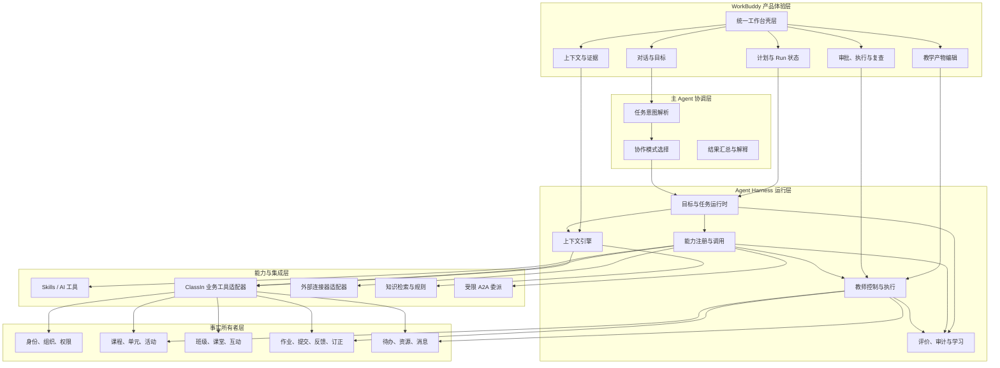
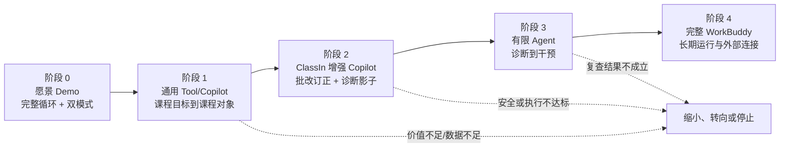

# 教师 WorkBuddy 分阶段纵向切片与评价门槛

## 文档定位

本文是“六件套”的第六件，将 [[05-教师WorkBuddy终局愿景Demo体验脚本_20260816|《终局愿景 Demo 体验脚本》]] 中的完整教学循环拆成少量可验证、可交付、可暂停和可停止的纵向切片，并以 [[03-教师WorkBuddy-Agent-Harness架构_20260816|《Agent Harness 架构》]] 和 [[04-ClassIn数据知识上下文与工具清单_20260816|《数据、知识、上下文与工具清单》]] 作为建设约束。

本文回答三个问题：

1. 先验证哪一条真实教学闭环，为什么；
2. 用什么指标判断价值、质量、安全、成本和业务结果；
3. 什么时候可以从 AI 工具升级到 Copilot，再升级为有限 Agent。

阶段顺序是证据驱动的建议，不是日期承诺，也不意味着所有能力都必须升级为 Agent。

## 一、顶层技术实现框架

### 1. 架构结论

阶段 C 的技术目标不是先建设一个与 ClassIn 平行的“大而全 Agent 平台”，而是建立一条从统一工作台到真实教学结果的受控执行链：

> **WorkBuddy 产品壳层 → 主 Agent 协调层 → Agent Harness 运行层 → 能力与集成层 → ClassIn 事实所有者；评价、安全和审计横向贯穿。**

### 2. 模块化架构

### 3. 模块边界与核心 Interface

| 模块 | 负责什么 | 不负责什么 | 稳定 Interface |
| --- | --- | --- | --- |
| 产品体验层 | 展示目标、计划、产物、证据、审批和结果 | 不拥有课程、成绩或学生事实 | `WorkspaceView`、`TeacherCommand` |
| 主 Agent 协调层 | 解析意图、选择协作模式、汇总结果 | 不直接调用数据库或绕过审批写入 | `interpretIntent`、`proposePlan`、`summarizeRun` |
| 上下文引擎 | 身份、权限、事实、知识和推断装配 | 不复制业务事实为长期记忆 | `buildSnapshot`、`refreshSnapshot`、`explainContext` |
| 任务运行时 | Run、计划版本、依赖、暂停、恢复和复查 | 不拥有业务执行结果 | `start`、`signal`、`inspect` |
| 能力系统 | 注册、发现、调用 Skill/工具/子 Agent | 不决定教师是否批准高风险动作 | `describeCapability`、`invokeCapability` |
| 控制与执行 | 风险评估、差异、审批、幂等、撤销和回执 | 不替领域系统维护最终事实 | `proposeAction`、`approve`、`execute`、`revoke` |
| 评价与审计 | 事件、质量、安全、成本和业务结果 | 不把模型自评当作结果 | `recordEvent`、`evaluateSlice`、`auditRun` |
| 领域适配器 | 将 ClassIn/外部 API 转为受控领域对象和回执 | 不暴露供应商协议给主 Agent | `read`、`draft`、`commit`、`getReceipt` |

### 4. 核心基座选型原则

当前没有足够生产信息锁定具体供应商或云服务，因此先锁定能力类别和选型约束：

| 基座 | 推荐形态 | 选型约束 |
| --- | --- | --- |
| Durable Runtime | 可持久化、可恢复的工作流/任务运行时 | 支持等待教师、超时、重试、补偿、版本和定时复查 |
| WorkBuddy 状态库 | 关系型存储 | 只保存 Run、计划、快照引用、审批、回执、审计和评价事实，不复制领域真相 |
| 教学产物与媒体 | 对象存储 + 版本元数据 | 可预览、可回滚、权限继承、删除和留存策略明确 |
| 知识检索 | 带权限过滤的全文/向量检索 | 版本、生效时间、来源、租户隔离和可重建 |
| 事件与集成 | 领域 API + 可靠事件/回调 | 幂等键、版本、重放、顺序和部分失败可见 |
| 身份与策略 | OIDC/OAuth 兼容身份 + RBAC/ABAC 策略 | 组织成员身份、对象级权限、授权撤回和运行中变化 |
| 模型接入 | Model Adapter + 路由和预算 | 可替换模型、提示版本、成本/延迟记录、敏感数据策略 |
| 可观测性 | 统一 Run/Tool/Business Trace | 能从教师动作追到能力调用、业务回执和复查结果 |

不建议把向量库、对话历史或模型 Memory 作为课程、作业、学生、成绩和权限的第二事实库。

### 5. 与既有产品和存量能力的映射

| WorkBuddy 能力 | 既有 ClassIn 形态/能力 | 推荐集成方式 | 当前需要补齐 |
| --- | --- | --- | --- |
| 统一教师工作台 | 教师首页、课程/班级入口、作业、洞察、消息等情境页面 | 内嵌情境入口 + 独立 WorkBuddy 壳层共享 Run 和身份 | 统一任务导航、跨入口状态和工作台视图模型 |
| 课程与教学产物 | 课程、单元、活动、课件和资源编辑能力 | 复用领域编辑器和对象 ID；WorkBuddy 只生成草稿/差异 | 草稿协议、版本冲突、保存与发布回执 |
| 课堂与学习证据 | 互动课堂、课堂记录、作业提交、批改、洞察/成长 | 只读领域适配器 + 证据标准化层，保留来源和时间 | 字段、稳定 ID、权限、质量和证据纠错 |
| 反馈与订正 | 作业反馈、订正、练习和任务状态 | Copilot 生成草稿，经确认写回既有对象 | 分层练习、反馈草稿和二次掌握事件 |
| 待办、资源与消息 | 待办、资源库、站内/家校消息 | 统一 `ProposedAction` 经控制系统执行 | 风险分级、批量审批、撤销和外发审计 |
| 既有 AI 能力 | AI 预批阅、题目/测验生成、录课总结、授课分析等 | 注册为 Skill/Capability，通过统一来源、成本和审计接口调用 | 能力契约、结果 Schema、版本和质量基准 |
| 既有 Agent/AgentIn | 官方/自定义 Agent 入口和 Agent 能力 | 先以受限 Capability Adapter 接入；只有满足独立目标和生命周期才 A2A | 权限、生命周期、完成契约和跨 Agent 审计 |
| 身份与组织 | ClassIn 登录、机构、角色和班级成员关系 | 复用身份体系，建立 WorkBuddy scoped context | 多机构切换、运行中撤权和对象级授权 |
| 知识与规则 | 教材、课程资料、机构规则和产品帮助 | 版本化索引，继承原对象权限 | 内容所有者、版本、生效时间和删除机制 |

### 6. 集成策略

1. **共享身份，不复制事实**：WorkBuddy 复用 ClassIn 的组织成员身份和对象权限；WorkBuddy 状态库只保存 Run、计划、快照引用、审批、回执和评价事实。
2. **情境入口与统一工作台双向连通**：课程、作业、洞察、消息等页面可以带着对象范围进入 WorkBuddy；WorkBuddy 的产物和执行结果必须返回原领域对象，而不是停留在对话历史。
3. **Adapter 优先，协议隔离**：ClassIn API、事件、已有 AI 服务和未来外部连接器全部经领域适配器接入，主 Agent 只看到稳定 Capability Contract。
4. **先读、再草稿、后确认写回**：阶段 1 允许文件/对象导入和草稿导出；阶段 2 接入真实只读和草稿写回；阶段 3 才开放受控跨对象执行。
5. **复用存量 UI 与领域状态机**：WorkBuddy 负责目标协调、证据组织、差异和审批，不重新实现课程、作业、消息和权限的业务状态机。
6. **事件用于刷新，不用于推断真相**：领域事件触发上下文刷新和复查，但最终状态仍从事实所有者读取；事件缺失时必须可通过版本和轮询发现变化。
7. **内嵌先行、独立渐进**：先在 ClassIn 高意图页面验证闭环，再开放通用 WorkBuddy 的资料导入和外部连接器；两者共享产品核心和任务模型。

### 7. 各阶段的集成深度

| 阶段 | 产品形态 | ClassIn 集成 | 技术重点 | 不做什么 |
| --- | --- | --- | --- | --- |
| 0 | 线性愿景 Demo | 全部模拟或集成模拟 | 固定数据、状态脚本、真值标记 | 不证明生产接口和性能 |
| 1 | 通用 WorkBuddy PoC / 情境入口 | 文件导入、人工选择对象、草稿导出或最小草稿保存 | 体验壳层、Artifact、Model Adapter、事件记录 | 不读敏感学生数据，不跨对象自动写入 |
| 2 | ClassIn 增强 Copilot | 身份、课程、作业、提交和证据只读；草稿写回 | 领域适配器、权限、证据规范化、差异和审批 | 不自动发布成绩，不外发高风险消息 |
| 3 | 受限有限 Agent | 作业、待办、资源和消息的白名单执行 | Durable Runtime、幂等、恢复、撤销、回执、复查 | 不开放无限工具和开放式 A2A |
| 4 | 完整工作台 | 跨入口 Run、外部连接器、机构策略和长期结果 | 多租户治理、连接器协议、成本和商业计量 | 不把“完整”解释为教师工作全自动化 |

## 二、实施原则

### 1. 终局完整，交付窄而纵向

终局仍然是通用教师 WorkBuddy 工作台；实施每次只选择一条从输入到业务结果、包含权限、工具、教师确认和评价的完整闭环。避免同时建设多个只有生成结果、没有执行和复查的半成品。

### 2. 先证实价值，再增加自主性

AI 自主性不是项目进度的替代指标。只有当上下文正确、产出质量稳定、教师愿意使用、写回可控且结果可复查时，才考虑扩大计划范围或减少人工介入。

### 3. 事实、推断和动作分开评价

业务事实正确性、AI 推断可解释性、教师确认行为、业务执行结果和教学结果分别记录。不能用模型自评或工具调用成功替代教学目标完成。

## 三、阶段 0—4 路线图

| 阶段 | 目标 | 主范围 | AI 形态 | 数据与执行 | 明确非目标 | 证明什么 |
| --- | --- | --- | --- | --- | --- | --- |
| 0 | 形成终局共同想象 | 完整教学循环、通用与 ClassIn 双模式 | 模拟 Tool/Copilot/Agent | 脱敏模拟数据、模拟回执 | 不作生产价值承诺 | 产品形态和叙事是否成立 |
| 1 | 证明通用独立价值 | 课程目标 → 课程对象 | AI 工具 + Copilot | 教师资料、模拟机构/课程对象、草稿保存或导出 | 不读取学生敏感证据，不跨对象自动执行 | 没有 ClassIn 历史也能节省时间并产出可采用成果 |
| 2 | 证明 ClassIn 上下文增益 | 批改 → 订正；诊断影子模式 | ClassIn 增强 Copilot | 真实只读证据、草稿工具、教师确认 | 不自动发布成绩、外发消息或固化学生标签 | 连续数据是否提升判断质量和后续行动准备度 |
| 3 | 证明有限 Agent 安全执行 | 诊断 → 个性化干预 | 受审批约束的有限 Agent | 跨作业、待办、资源、消息工具；持久 Run | 不开放高风险自主决定，不隐式扩大范围 | Agent 是否能跨对象计划、执行、恢复和复查 |
| 4 | 形成完整终局工作台 | 长期任务、复查、记忆、外部连接器和统一入口 | Tool/Copilot/Agent 协同 | 生产级 Harness、连接器和结果反馈 | 不以“全自动教师”作为验收 | 能否形成持续使用、机构价值和可扩展商业闭环 |

## 四、主切片选择与推荐顺序

### 1. 推荐决策

在当前没有真实 ClassIn 业务数据的前提下，阶段 1 主切片切换为 **切片 A：课程目标 → 课程对象**。它使用教师资料和可重置的模拟 ClassIn 机构/课程对象完成端到端验证；切片 B 作为后续备选，不在同一周期并行实现。

阶段 1 的选择理由是：它不依赖真实课堂或学生数据，但仍能验证目标澄清、计划、知识支撑、产物编辑、差异、草稿保存和结果评价等完整链路。

在拥有真实 ClassIn 数据和权限后，再根据 G1 审计结果决定是否切换或新增其他切片。

此前的两条候选比较如下：

- **备课演练 → 改进**：风险较低、无学生敏感数据、通用教师可用，最适合先证明独立 WorkBuddy 价值；
- **课程目标 → 课程对象**：更直接连接 ClassIn 课程对象，适合已有稳定课程和内容接口的试点。

不建议阶段 1 同时交付两条完整链路。切片 B 可以保留为交互对照和人工基准，避免分散数据、设计和试点反馈。

阶段 2 固定加入 ClassIn 上下文后，优先做“批改 → 订正”；“诊断 → 干预”先以影子模式运行：系统产生不对教师或学生可见的诊断建议，由人工专家离线评审，不执行外部动作。

### 2. 四条纵向切片规格卡

#### 切片 A：课程目标 → 课程对象

| 项目 | 规格 |
| --- | --- |
| 教师结果 | 在明确教学目标和成功标准后，形成可编辑的课程、单元和活动草稿，并正确保存或写回 |
| 最小输入 | 教师身份、目标、学段/学科、时间、授权资料、课程范围 |
| 核心事实 | 班级课程、单元、活动、教材或教师资料 |
| AI 形态 | 阶段 1 Tool/Copilot；正式发布始终教师确认 |
| 写入边界 | 课程、单元、活动草稿；不自动发布，不改历史教学事实 |
| 关键降级 | 缺少 ClassIn 历史时，生成教师资料驱动草稿并明确来源有限 |
| 结果证据 | 完成时间、采用率、修改距离、写回准确性、后续使用率 |

#### 切片 B：备课演练 → 改进

| 项目 | 规格 |
| --- | --- |
| 教师结果 | 根据可观察演练证据修改课件或教案，并能在再次演练中比较改善 |
| 最小输入 | 教学目标、课件/教案、演练媒体、反馈维度、教师偏好 |
| 核心事实 | 教学产物版本、演练记录、转写和时间戳证据 |
| AI 形态 | 阶段 1 Tool/Copilot；多轮复练暂不 Agent 化 |
| 写入边界 | 报告、修改计划和产物草稿；不进入绩效评价 |
| 关键降级 | 无时间戳或媒体不可用时，只做转写或教师资料分析 |
| 结果证据 | 证据准确率、建议采纳率、修改距离、复练改善、真实课堂复用率 |

#### 切片 C：批改 → 订正

| 项目 | 规格 |
| --- | --- |
| 教师结果 | 在教师确认评分与反馈后，为班级或小组形成可执行的订正练习，并观察再次掌握 |
| 最小输入 | 作业、提交、作答、评分标准、课程目标、反馈和订正状态 |
| 核心事实 | 作业、提交、正式评分、反馈、订正任务和复查证据 |
| AI 形态 | 阶段 2 ClassIn Copilot；不把正式成绩交给 Agent |
| 写入边界 | 反馈、练习和订正草稿；正式分数、发布和消息需教师确认 |
| 关键降级 | 评分标准缺失时只摘要作答和候选问题，不给分数建议 |
| 结果证据 | 批改耗时、修改距离、错因确认率、订正完成率、二次掌握、投诉/纠错率 |

#### 切片 D：诊断 → 个性化干预

| 项目 | 规格 |
| --- | --- |
| 教师结果 | 依据已确认的教学判断，生成并执行分层行动，在复查节点判断是否需要调整 |
| 最小输入 | 教学目标、授权学习证据、机构规则、资源、待办和消息权限 |
| 核心事实 | 课堂/作业证据、诊断假设、教师确认结论、干预计划、执行回执、复查结果 |
| AI 形态 | 阶段 2 影子 Copilot；阶段 3 有限 Agent |
| 写入边界 | 练习、资源、待办和消息草稿；敏感结论、正式评价和外部沟通需人工控制 |
| 关键降级 | 证据不足时只呈现来源摘要和缺口，不生成学生结论或动作 |
| 结果证据 | 诊断可解释性、教师确认率、行动完成率、复查率、目标改善、安全事件、单次成本 |

## 五、阶段执行设计

### 阶段 0：终局愿景 Demo

**交付**：第 5 件文档对应的 15—20 分钟脚本、可重置演示数据、统一工作台关键状态、失败分支和真值标记。

**退出条件**：不同观众都能复述产品定位、ClassIn 增强关系、教师控制点和实施顺序；不以观众喜欢 Demo 作为真实价值证明。

### 阶段 1：通用 Tool/Copilot

**验证建议**：先使用 1 名模拟教师、1 个模拟机构、1 门学科和 1 个模拟班级课程，建立可重置的人工基线和端到端演示基线。真实教师试点需等后续 G1 数据与权限审计通过后再启动。

**必须具备**：资料和产物版本、来源引用、草稿状态、教师编辑、采纳/拒绝事件、导出或最小写回、错误报告和成本记录。

**不允许**：读取未经授权的学生数据、自动发布课程或消息、把演练判断用于绩效、把生成内容当作教学结果。

### 阶段 2：ClassIn 增强 Copilot

**试点建议**：在阶段 1 通过后，选择 1 个机构、1 个学科、2—3 个班级，进行 6—8 周真实验证；同时保留无 ClassIn 或人工输入基线。

**必须具备**：组织成员和对象级权限、稳定 ID/版本、只读证据工具、来源和时间、草稿写回、批量差异、教师确认、撤销或纠错路径。

**诊断影子模式**：诊断结果只供教师或专家评审，不向学生、家长或机构绩效系统可见，不触发外部写入；用于评估证据增益和误差。

### 阶段 3：有限 Agent

**进入前提**：阶段 2 的质量和安全门通过；已经具备持久 Run、计划版本、审批策略、幂等、部分成功、恢复、撤销、审计和复查调度。

**范围**：只允许围绕一个明确班级/课程和一组低风险动作运行。高风险沟通、正式评分、敏感学生结论和不可逆发布始终停在教师审批。

**A2A 条件**：只有当子任务拥有独立目标、受限上下文、独立权限、生命周期、完成契约和审计需求时，才委派专业子 Agent；简单生成、检索和写入仍使用 Skill 或业务工具。

### 阶段 4：完整 WorkBuddy 工作台

**进入前提**：至少两条纵向切片在不同试点中持续产生价值，教师留存和结果改善可复现，生产工具和数据治理达到 E5。

**范围**：统一入口、长期任务与复查、可管理偏好、外部连接器、跨入口 Run 连续性、机构策略和可解释的商业计量。

**边界**：完整不等于无限自动化。新增学科、机构、连接器和执行权限仍需通过同样的决策门。

## 六、评价指标体系

### 1. 六类共同指标

| 维度 | 核心问题 | 示例指标 | 不能用什么替代 |
| --- | --- | --- | --- |
| 用户价值 | 教师是否更快、更容易完成结果 | 单次任务耗时、完成率、重复使用率、主动发起率 | 聊天轮数、模型响应速度 |
| 质量 | 产出和判断是否准确、可采用 | 专家基准一致率、教师采纳率、修改距离、证据引用准确率 | 模型置信度、生成长度 |
| 采用 | 是否进入真实工作流 | 周活教师、目标任务覆盖率、连续周期使用、留存 | 一次 Demo 点击 |
| 可靠与安全 | 是否可控、可解释、可恢复 | 权限拒绝正确率、错误率、部分成功率、撤销成功率、安全事件 | 工具调用成功 |
| 经济 | 价值是否覆盖运行成本 | 单次闭环成本、每节课成本、人工节省、单位产物成本 | Token 数量单独下降 |
| 业务结果 | 是否改善教学和机构结果 | 订正完成、二次掌握、目标达成、教师续用、机构续费意向 | AI 自述完成 |

### 2. 建议核心指标定义

**教师有效完成率**：在规定时间窗内，教师完成目标并形成有效业务产物的任务数 / 启动且满足输入条件的任务数。有效产物必须由领域系统或教师明确确认，不以生成成功计算。

**教师采纳率**：被教师保留并进入下一业务步骤的建议或草稿数 / 已展示且满足评价条件的建议或草稿数。需要同时记录全量采纳、部分采纳和拒绝。

**修改距离**：AI 初稿与教师最终版本在结构、关键字段和文本编辑上的差异，按切片定义，不把教师有意的专业调整当作错误。

**证据引用准确率**：回答中引用的对象、范围、时间和结论是否能由原始来源支持；随机抽样由领域专家复核。

**行动完成率**：经教师批准的动作中，业务事实所有者返回成功且在复查时仍满足完成条件的动作数 / 批准动作数。

**目标改善率**：达到预先声明成功标准的目标或学习证据比例变化，需要与基线、学期进度和教师选择偏差一起解释。

### 3. 必须记录的事件

每条事件至少携带：`run_id`、组织成员身份、切片、对象 ID/版本、时间、输入范围、能力 ID、真值等级、教师动作、风险等级、成本、结果和错误原因。学生内容和敏感数据遵循最小化和访问审计要求。

事件分类：

- 任务：启动、澄清、暂停、恢复、取消、完成、过期；
- 上下文：读取、缺口、刷新、权限变化、冲突；
- 产出：展示、编辑、采纳、部分采纳、拒绝、版本保存；
- 控制：审批、修改范围、撤销、批量确认；
- 执行：调用、成功、部分成功、失败、重试、补偿；
- 结果：复查到期、证据变化、目标达成、需要调整；
- 安全与成本：越权拒绝、敏感内容拦截、延迟、模型和工具成本。

## 七、G0—G4 决策门

| 决策门 | 目的 | 必须回答的问题 | 通过后 |
| --- | --- | --- | --- |
| G0：问题与范围 | 决定是否值得做切片 | 教师结果、对象所有者、成功标准、风险和试点是否明确 | 进入设计和数据审计 |
| G1：数据与控制就绪 | 决定能否小范围试用 | 身份、权限、样本、来源、草稿、审批、审计和退出是否可用 | 进入影子或受控试点 |
| G2：用户价值成立 | 决定是否扩大 Copilot | 教师是否持续采用，耗时/质量是否相对基线改善 | 扩大教师或班级范围 |
| G3：执行安全成立 | 决定是否有限 Agent | 计划、审批、幂等、失败恢复、撤销、复查和安全是否达标 | 在限定范围内 Agent 化 |
| G4：业务价值可扩展 | 决定是否进入完整工作台 | 结果改善可复现，成本可接受，机构愿意持续使用或付费 | 扩展切片、连接器和商业化 |

### G0 必须产出

- 一页切片规格卡；
- 教师结果和成功标准；
- 事实、证据、推断、动作的边界；
- 最小上下文包、权限和数据缺口；
- 试点对象、人工基线和退出条件。

### G1 必须产出

- E4 生产数据和工具审计记录；
- 权限拒绝、缺口、版本冲突和删除路径；
- 草稿/正式状态、审批、回执和审计样本；
- 专家基准集和标注方案；
- 试点培训、授权、支持和事件响应方案。

### G2 建议判定方式

不预设跨学科的统一数值阈值，而由切片负责人和试点业务在 G0 共同声明。最低要求是：相对人工基线在核心价值指标上有清晰改善，且没有安全或质量红线；结果至少覆盖两个连续任务周期，并由教师反馈和专家抽样共同支持。

### G3 建议判定方式

在限定范围内，所有副作用动作都有审批或明确低风险授权；权限拒绝不越权；部分成功可见；失败可恢复或补偿；撤销有效；复查节点可运行；任何敏感结论和外部沟通都没有绕过教师控制。一次严重安全事件即可暂停 Agent 化。

### G4 建议判定方式

至少两个不同教师群体或试点场景中，核心价值可复现；教师留存、单位闭环成本和业务结果趋势支持扩大；数据、工具和知识资产责任人已承诺维护；没有依靠单一演示教师、手工后台操作或不可审计脚本才能成立。

## 八、继续、扩大、转向与停止

### 1. 继续

切片仍有明确价值信号，但样本量、稳定性或某个 P0/P1 依赖尚未充分。继续必须写明下一周期要补的证据和负责人。

### 2. 扩大

核心价值、质量、安全和成本均通过当前门槛；扩大一个变量，例如教师数量、班级数或执行动作范围，不同时扩大所有变量。

### 3. 转向

教师愿意使用但原切片质量不足，或 ClassIn 上下文增益不明显。可以转向更低风险、更高频的切片，例如从诊断转到批改订正、从写回转到草稿和导出；保留事件和基线，不把失败抹掉。

### 4. 停止

连续两个评价周期没有核心价值改善，或依赖无法在合理范围内补齐；停止该切片的扩大投入，归档数据和学习，重新进行 G0。

### 5. 红线停止条件

- 越权读取或跨机构泄露；
- 未经确认修改正式成绩、敏感学生结论或外发高风险消息；
- 无法解释来源、无法区分事实与推断；
- 执行回执与真实业务对象不一致且不能发现；
- 撤销、删除或退出请求不能按承诺完成；
- 用模拟、人工后台或演示脚本伪装生产结果；
- 成本、延迟或故障使教师必须重复检查全部结果；
- 结果改善无法复现且团队仍以单次 Demo 作为投入依据。

触发红线时，立即停止相关读取或写入，保留审计，通知责任人，回退到只读/影子模式，并在新的 G0 前不扩大范围。

## 九、试点设计与 90 天建议

### 1. 试点共通要求

- 选择一个明确机构、学科、课程和教师范围；
- 设定人工基线或同教师历史基线，不只比较使用前后主观感受；
- 先影子观察，再给教师可见草稿，再开放受控写回；
- 由教师主动确认高风险判断和外部沟通；
- 为教师提供培训、反馈入口、错误上报和退出机制；
- 每周检查质量、安全、成本和支持负担，每个周期复盘是否达到决策门。

### 2. 90 天建议节奏

| 时间 | 重点 | 产出 |
| --- | --- | --- |
| 0—2 周 | G0/G1：选切片、审计数据、建立基线和事件 | 规格卡、权限矩阵、基准集、试点协议 |
| 3—6 周 | 阶段 1 小范围运行 | 草稿/建议、教师反馈、采纳与修改数据 |
| 7—9 周 | G2 复盘，决定扩大或转向 | 价值报告、质量抽样、成本和风险报告 |
| 10—12 周 | 阶段 2 影子或 ClassIn Copilot | 上下文增益对照、批改/订正结果、G3 预审 |

90 天不是承诺一定进入 Agent 阶段，而是完成一次可作出“扩大、转向或停止”判断的证据周期。只有真实结果通过 G3，才安排阶段 3 的有限 Agent 试点。

## 十、阶段 C 完成标准

- [ ] 第 5 件提供一条从目标到复查的完整终局体验脚本；
- [ ] 通用冷启动与 ClassIn 增强共享同一 WorkBuddy 核心，差异体现在上下文、执行和反馈；
- [ ] 主 Agent、AI 工具、Copilot、专业子 Agent 和教师控制点在场景中可定位；
- [ ] Demo 真值标记、数据资产、失败分支和验收标准完整；
- [ ] 第 6 件把阶段 0—4、四条切片、指标、事件、G0—G4 和红线条件连成闭环；
- [ ] 每个切片都有教师结果、最小上下文、事实所有者、写入边界、降级策略和评价证据；
- [ ] 阶段顺序明确为建议而非日期承诺，Agent 化必须经过独立门槛；
- [ ] 试点计划能在 90 天后形成继续、扩大、转向或停止判断。

## 十一、下一步输入

阶段 C 完成后，项目不应直接进入“做完整 WorkBuddy”的泛化开发。下一步应由产品、ClassIn 领域、数据、Agent/Harness、教研、安全和试点业务共同完成：

1. 在 G0 锁定切片 A 的模拟机构、学科、课程对象和成功标准；
2. 按第 4 件的 P0 清单完成真实接口、权限、样本和安全审计；
3. 形成切片级 Product/Agent/Tool Spec 和人工基准；
4. 先做影子或草稿闭环，按事件和门槛复盘；
5. 只有真实证据支持时，才把能力升级为跨对象、可恢复的有限 Agent。
