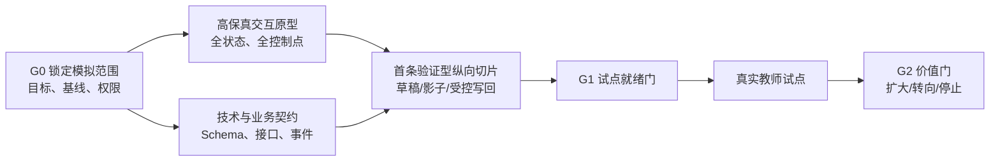

# 教师 WorkBuddy 阶段 D 交互原型与技术基座实施计划

## 文档定位

阶段 A 已完成产品定义和三张核心图，阶段 B 已完成 Agent Harness、数据/知识/上下文与工具基线，阶段 C 已完成终局愿景 Demo 和纵向切片评价门槛。

阶段 D 的任务是把“终局产品如何工作”转成两类可以共同评审和落地的资产：

1. **高保真交互原型**：让产品、设计、业务和工程看到同一个 WorkBuddy 工作台，并能逐节点检查教师控制、证据、审批和失败恢复；
2. **技术基座与集成契约**：让工程和 ClassIn 领域团队知道哪些模块由 WorkBuddy 建设，哪些能力复用既有系统，哪些接口和数据缺口必须先补齐。

本计划不是完整产品开发排期，也不承诺具体供应商、云服务或上线日期。它是从 PoC 进入验证型产品之前的决策和建设顺序。

本计划以 [[05-教师WorkBuddy终局愿景Demo体验脚本_20260816|《终局愿景 Demo 体验脚本》]]、[[06-教师WorkBuddy分阶段纵向切片与评价门槛_20260816|《分阶段纵向切片与评价门槛》]]、[[03-教师WorkBuddy-Agent-Harness架构_20260816|《Agent Harness 架构》]] 和 [[04-ClassIn数据知识上下文与工具清单_20260816|《数据、知识、上下文与工具清单》]] 为输入约束。

## 一、当前共识与专业建议

### 1. 第五份文档的边界

《终局愿景 Demo 体验脚本》当前应被视为**概念验证（PoC）级交互基线**：它已经足够验证产品形态、端到端故事和关键状态，但还没有达到高保真视觉、可用性验证或生产实现标准。

因此，后续不应直接把脚本当作 PRD 交付工程，而应先抽取：

- 页面/区域信息架构；
- 状态与转移；
- 教师命令和权限边界；
- 业务对象、工具和回执契约；
- 每个状态的空白、缺口、失败、恢复和撤销表现。

### 2. 首条纵向切片建议

在你确认当前没有真实 ClassIn 业务数据后，我的建议调整为：

> **阶段 D 的高保真原型覆盖完整终局循环，但阶段 1 的工程主切片切换为“课程目标 → 课程对象”；使用模拟 ClassIn 机构和可重置业务数据完成端到端验证，真实 ClassIn 适配器暂不宣称生产就绪。**

理由：

- 课程目标 → 课程对象可以直接验证 WorkBuddy 的目标澄清、计划、知识支撑、课程/单元/活动草稿、版本差异和保存回执；
- 模拟 ClassIn 机构可以提供稳定的对象 ID、权限范围、版本冲突和部分失败数据，让 Harness 先跑通；
- 真实 ClassIn 数据尚未取得时，不把生产集成假设伪装成事实；
- 批改 → 订正和备课演练保留为下一轮切片，待真实业务条件或试点目标明确后再选择。

这不是永久切片排序。真实 ClassIn 数据和权限获得后，可以在同一技术基座上增加批改 → 订正或备课演练；不需要重做 WorkBuddy 主体。

## 二、阶段 D 的端到端目标

端到端不等于阶段 D 一次实现完整终局，而是每一个阶段都从用户目标开始，经过真实或明确标记的上下文、AI 产出、教师控制、业务结果和评价事件，不留下只有 UI 或只有模型的断点。

## 三、五条并行工作流

| 工作流 | 目标 | 阶段 D 产物 | 主要协作方 |
| --- | --- | --- | --- |
| W1 产品与业务 | 锁定主切片和事实所有权 | 切片规格卡、目标/成功标准、对象图、非目标 | 产品、ClassIn 领域、试点教师 |
| W2 交互与视觉 | 把 PoC 脚本转为可操作的高保真状态 | 桌面工作台原型、交互流程、状态矩阵、可用性问题清单 | 产品、设计、教师 |
| W3 Harness 与工程 | 将五个深模块转为可实现边界 | 模块 Spec、接口 Schema、Run/审批/回执状态机 | Agent/Harness、平台工程 |
| W4 数据与集成 | 补齐 E4 数据、权限和业务工具契约 | Adapter 规格、字段样本、错误契约、事件映射 | ClassIn 领域、数据、安全 |
| W5 评价与试点 | 让每次运行都能决定下一步 | 事件字典、人工基准、试点方案、G1 检查表 | 评价、教研、试点业务 |

五条工作流可以并行，但必须通过同一条主切片汇合。任何不属于当前切片的能力只能进入终局 backlog 或模拟状态，不扩张工程范围。

## 四、高保真原型应补足的范围

### 1. 必须出现的六个界面面

| 界面面 | 原型必须展示 | 不必在阶段 D 实现 |
| --- | --- | --- |
| 工作台首页 | 当前目标、最近 Run、待确认、待复查和情境入口 | 全量个人 Dashboard、复杂推荐系统 |
| 对话与目标 | 目标输入、澄清、成功标准、附件和启动确认 | 开放式闲聊、多个 Agent 选择器 |
| 计划与 Run | 步骤、依赖、等待原因、失败、恢复、版本 | 无限嵌套计划、不可解释的自动重排 |
| 教学成果编辑 | 草稿、差异、来源、版本、批注、导出/保存 | 全部领域编辑器重做 |
| 上下文与证据 | 授权范围、证据时间线、来源展开、缺口和冲突 | 把所有原始数据一次性展示 |
| 审批与复查 | 风险分组、批准、拒绝、撤销、回执和结果对照 | 无边界批量自动执行 |

### 2. 必须覆盖的状态矩阵

每个界面面至少有以下状态：

| 状态 | 交互要求 |
| --- | --- |
| 空白/冷启动 | 清楚说明可以从目标或资料开始，不伪造已有上下文 |
| 生成中/执行中 | 显示当前步骤和可查看的运行状态 |
| 需要补充 | 明确缺什么、为什么需要、如何缩小范围 |
| 待教师确认 | 显示判断、来源、差异、风险和可编辑入口 |
| 部分成功 | 按对象逐项展示，不汇报为整体完成 |
| 权限拒绝 | 说明停止原因，不泄露受限对象信息 |
| 可恢复失败 | 显示重试、补偿、换能力或结束任务选项 |
| 已完成待复查 | 显示完成条件、到期时间和后续证据 |
| 已撤销/已过期 | 保留审计，停止继续执行并说明影响 |

### 3. 高保真原型的验收方法

- 由产品、设计、工程和至少 3 名真实教师共同走查同一条端到端流程；
- 每个关键动作都能回答“当前对象是什么、谁能操作、结果写到哪里”；
- 教师无需知道 Skill、MCP、A2A 或模型名称即可完成任务；
- 设计稿中明确标出 `[模拟]`、`[集成模拟]`、`[未来]` 状态；
- 可用性问题按“阻断任务、造成错误、增加理解成本、视觉偏好”分级，不用审美意见替代业务问题。

## 五、技术基座拆解与模块边界

### 1. 第一批工程模块

| 模块 | 第一批实现内容 | 验收信号 |
| --- | --- | --- |
| Workbench Shell | 页面壳层、区域布局、深链入口、Run 恢复 | 从 ClassIn 情境页进入并回到同一 Run |
| Intent / Plan | 任务意图、成功标准、计划版本和澄清 | 计划可查看、编辑、暂停和恢复 |
| Context Snapshot | 上传资料、身份范围、来源、版本和缺口 | 每次结果都能解释使用了什么 |
| Artifact Workspace | 产物草稿、版本、差异、批注和导出 | 教师修改可保存，正式业务事实不被覆盖 |
| Capability Registry | Skill、模型、领域工具和模拟 adapter 的注册 | 调用前可检查权限、风险和输入输出 |
| Approval / Action | ProposedAction、风险分级、审批、幂等和回执 | 写入有差异、有批准、有实际结果 |
| Durable Run | 状态、等待、超时、重试、补偿和复查 | 页面关闭后任务仍能恢复 |
| Evaluation Trace | 任务、上下文、产出、教师动作、执行和结果事件 | 能计算第六件定义的指标 |

### 2. 第一批不建设

- 不建设开放式 Agent 市场或教师可选择的 Agent 列表；
- 不建设覆盖所有 ClassIn 领域的统一数据仓库；
- 不把向量库或 Memory 做成业务事实副本；
- 不一次接入所有 MCP、外部连接器和模型供应商；
- 不在没有真实接口和安全审计前实现自动发布、自动外发和敏感学生判断；
- 不为了展示终局而提前承诺跨机构、跨学科和移动端全量一致。

## 六、与既有 ClassIn 的集成落地顺序

### 1. 入口与身份

先复用 ClassIn 登录、组织成员身份、班级/课程范围和权限检查；Workbench Shell 可以以内嵌入口出现，但 Run、上下文快照和教师偏好需要由 WorkBuddy 统一管理。

### 2. 读取与证据

先为主切片建设最小只读 Adapter，不建设全量同步。Adapter 输出稳定领域对象和来源清单；字段缺失、权限拒绝、版本冲突和延迟必须成为结构化结果。

### 3. 草稿与产物

先在 WorkBuddy 侧保存版本化草稿，再根据 ClassIn 领域能力选择导出、草稿保存或确认写回。写回必须使用事实所有者的状态机和回执，不允许直接数据库写入。

### 4. 执行与复查

阶段 1 以教师资料和导出为主；阶段 2 增加 ClassIn 只读和草稿写回；阶段 3 才把作业、待办、资源和消息纳入白名单执行，并由 Durable Run 管理恢复和复查。

### 5. 既有 AI 能力复用

AI 预批阅、题目生成、录课总结、授课分析等现有能力先包装为 Capability Adapter，统一返回来源、版本、置信度、成本和错误，不在 WorkBuddy 内复制一套相似能力。现有 Agent/AgentIn 只有在具备独立目标、权限和生命周期时才升级为 A2A 子 Agent。

## 七、阶段性实施计划

时间是建议的工作节奏，不是上线承诺。每阶段都可以因 G0/G1 证据不足而暂停或缩小。

| 阶段 | 建议周期 | 重点工作 | 关键产物 | 退出条件 |
| --- | --- | --- | --- | --- |
| D0：范围与模拟审计 | 1 周 | 固化主切片、定义模拟机构、确认对象所有者和 P0 数据契约缺口 | G0 包、模拟数据字典、权限矩阵、切片假设 | 教师结果、模拟数据边界和负责人明确 |
| D1：交互原型 | 1—2 周 | 把第五件脚本转为高保真工作台和状态流程 | 原型、交互规格、状态矩阵、走查记录 | 关键节点无阻断，教师能完成端到端走查 |
| D2：技术契约 | 1—2 周 | 锁定模块 Interface、Schema、错误、事件和适配器边界 | Harness Spec、ToolManifest、领域 API/事件契约 | 工程和领域团队确认可实现、可审计 |
| D3：纵向骨架 | 2—4 周 | 实现 Workbench Shell、Run、上下文、草稿、评价事件和模拟/最小真实 Adapter | 可重置纵向骨架、演示数据、自动化检查 | 至少一次从目标到产物/复查的可重复运行 |
| D4：G1 准备 | 1 周 | 安全、权限、质量、成本、培训和支持准备 | G1 清单、试点方案、事件看板、回退方案 | 可以进入影子或受控真实试点 |

### 90 天之后

前 6—8 周完成 D0—D3 和小范围影子运行；第 9—12 周根据 G1/G2 结果决定进入阶段 1 真实试点、转向课程切片，或停止当前切片。只有真实试点通过 G3，才安排阶段 3 的有限 Agent 执行建设。

## 八、决策门与责任分工

| 门 | 产品 | 设计 | 工程/Harness | ClassIn 领域 | 数据/安全 | 试点业务 |
| --- | --- | --- | --- | --- | --- | --- |
| G0 主切片 | A/R | C | C | A/R | C | A/R |
| D1 原型 | A/R | A/R | C | C | C | C |
| D2 契约 | A | C | A/R | A/R | A/R | C |
| D3 骨架 | C | C | A/R | R | C | I |
| G1 试点 | A | C | R | R | A/R | A/R |

责任含义沿用第四件：`A` 最终负责，`R` 执行负责，`C` 协作，`I` 知情。

## 九、阶段 D 的停止与转向条件

- G0 无法确认真实教师结果、事实所有者或试点范围：停止工程，先补业务定义；
- 关键 ClassIn 数据或权限无法达到 E4：主切片回退到通用资料/草稿路径，不模拟生产写回；
- 高保真原型只能展示理想路径，无法表达缺口、审批、部分失败和撤销：不进入 D3；
- 技术方案需要复制课程、作业、成绩或权限事实：回到模块边界审查；
- 端到端运行不能产生可评价事件：不进入真实试点；
- 教师在走查中无法判断依据、风险或下一步：优先修复交互，不增加更多 Agent 能力。

## 十、阶段 D 预期共识

阶段 D 完成时，团队应对以下内容形成同一判断：

1. 终局 WorkBuddy 是一个统一工作台和主 Agent 体验，而不是 AI 功能列表；
2. 高保真原型覆盖完整终局循环，但真实工程只实现一条受控纵向切片；
3. Harness 五个深模块是核心工程边界，ClassIn 领域系统继续拥有课程、课堂、作业、消息和权限事实；
4. 现有 AI 能力以 Capability Adapter 复用，只有满足条件的独立任务才使用 A2A；
5. ClassIn 集成遵循身份复用、只读优先、草稿先行、确认写回、结果复查的顺序；
6. 每一次扩大自主性都必须通过 G0—G4 的价值、安全、质量、成本和业务证据门槛。

## 十一、已确认的阶段 D 实施输入

本轮已经确认：

1. “课程目标 → 课程对象”作为阶段 1 主切片；
2. 当前没有真实 ClassIn 业务数据，D0—D3 使用模拟 ClassIn 机构和可重置模拟对象；
3. 第一版默认使用八年级英语、一个模拟班级课程、模拟课程标准和教师资料，后续可以替换，不改变 WorkBuddy 核心 Interface。

下一步先审阅 [[08-教师WorkBuddy高保真原型与Agent-Harness映射框架_20260816|《高保真原型与 Agent Harness 映射框架》]]，再输出阶段 D1 的高保真工作台原型和 D2 的切片级技术契约，而不是继续扩展终局功能列表。
