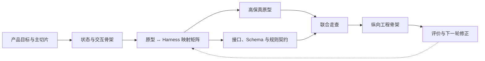
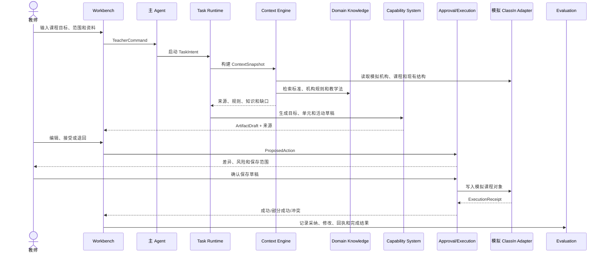
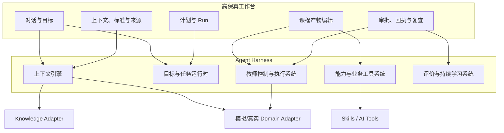

# 教师 WorkBuddy 高保真原型与 Agent Harness 映射框架

## 文档定位

本文回答从“高保真产品原型”过渡到“技术模块拆解”时最关键的四个问题：

1. 原型中的功能模块如何映射到 Agent Harness；
2. 哪些功能依赖产品逻辑和业务规则；
3. 哪些交互需要 Domain Knowledge；
4. 哪些模块需要业务 API 或底层数据驱动。

本文以“课程目标 → 课程对象”为第一条纵向切片，使用模拟 ClassIn 机构和模拟业务对象。它连接 [[05-教师WorkBuddy终局愿景Demo体验脚本_20260816|《终局愿景 Demo 体验脚本》]]、[[06-教师WorkBuddy分阶段纵向切片与评价门槛_20260816|《分阶段纵向切片与评价门槛》]]、[[03-教师WorkBuddy-Agent-Harness架构_20260816|《Agent Harness 架构》]] 和 [[07-教师WorkBuddy阶段D交互原型与技术基座实施计划_20260816|《阶段 D 实施计划》]]。

## 一、先做原型还是先拆技术

结论不是二选一，而是采用“先骨架、后共演”的方式：

> **现在先锁定产品状态、技术模块和五类契约的映射骨架；随后制作高保真原型；每完成一个关键交互节点，就同步校验 Harness、知识、数据、规则和评价契约。**

不建议先把全部技术细节设计完再做原型，因为页面状态、教师控制和失败路径尚未被真实走查，容易过度建设。也不建议先画完高保真再谈技术，因为原型可能隐含无法实现的上下文、权限、写入和恢复假设。



## 二、需要先区分的四类实现输入

这四类输入在原型中可能同时出现在一个页面上，但必须由不同模块拥有。

| 输入类型 | 回答的问题 | 典型例子 | 应由谁拥有 | 变化方式 |
| --- | --- | --- | --- | --- |
| 产品逻辑 | 教师如何完成任务、在哪确认、界面如何反馈 | 目标澄清、计划可编辑、差异预览、失败恢复 | WorkBuddy 产品与 Harness | 随体验和任务模型迭代 |
| 业务规则 | 什么可以做、谁能做、对象状态如何变化 | 课程发布条件、机构模板要求、对象权限、草稿/正式状态 | ClassIn 领域与机构策略 | 版本化规则或领域 API |
| Domain Knowledge | 什么是好的课程设计、目标如何拆解 | 课程标准、教学法、学科知识、活动设计原则 | 教研/内容责任人 | 版本化知识包和检索索引 |
| 业务数据/API | 当前真实对象和执行结果是什么 | 教师、机构、课程、单元、活动、资源、版本、回执 | 对应 ClassIn 领域系统 | API 读取、事件刷新、领域写回 |

模型只负责理解、生成、比较和解释，不拥有上述四类事实。模型输出要进入教学产物或待确认动作，仍需经过产品状态和领域规则。

## 三、第一条切片的端到端运行链

### 1. 模拟业务范围

- 1 个模拟机构：`星河学习中心`；
- 1 名模拟教师：林老师；
- 1 个模拟班级课程：八年级英语；
- 1 份授权教材章节和 1 份教师历史教案模板；
- 1 套模拟课程标准和机构课程设计规范；
- 课程、单元、活动、资源四类模拟业务对象；
- 草稿保存、版本冲突、权限拒绝和部分成功四类模拟回执。

所有模拟对象使用稳定 ID、版本和来源，能够恢复到固定初始状态。模拟 ClassIn Adapter 必须与未来真实 Adapter 共享同一接口，避免高保真原型和纵向骨架写死模拟逻辑。

### 2. 运行时序



## 四、原型功能到 Harness 的映射矩阵

| 原型功能/状态 | 产品逻辑 | Harness 模块 | Domain Knowledge | 业务数据/API | 当前实现 |
| --- | --- | --- | --- | --- | --- |
| 目标输入 | 组织自然语言、附件和目标模板 | 主 Agent + 任务运行时 | 可选目标范例 | 教师身份、当前课程范围 | 本地输入 + 模拟身份 |
| 范围与成功标准 | 显示缺口、要求确认，不静默补全 | 任务意图 + Context Engine | 课程标准中的可观察结果 | 模拟机构、学科、学段、时间 | 模拟 Adapter |
| 计划确认 | 步骤可查看、修改、暂停 | Durable Run / PlanVersion | 课程设计方法 | 无直接写入 | Harness 本地状态 |
| 上下文授权 | 明确使用哪些资料、机构和课程对象 | Context Engine + Policy | 机构规则适用范围 | 身份、对象权限、资料权限 | 模拟权限策略 |
| 标准与知识引用 | 来源可展开，规则与建议分开 | Context Engine / Knowledge Adapter | 课程标准、教学法、机构规范 | 知识版本和授权 | 固定版本知识包 |
| 课程结构草稿 | 草稿状态、来源、未满足约束 | Capability System + Artifact Workspace | 目标拆解、活动设计原则 | 已有课程/单元/活动结构 | 模拟读取 + AI 生成 |
| 产物编辑与版本 | 部分采纳、批注、恢复旧版 | Artifact Workspace | 不要求实时检索 | 草稿版本、对象版本 | WorkBuddy 本地版本 |
| 规则校验 | 区分错误、强制规则和建议 | Capability + Policy/Rule Adapter | 机构规范、课程标准 | 领域状态与发布条件 | 模拟规则服务 |
| 差异与审批 | 展示创建/修改对象和风险 | Control & Execution | 无，使用已确定规则 | 目标对象、版本和权限 | ProposedAction |
| 保存课程草稿 | 教师确认后执行，支持部分失败 | Control & Execution + Capability | 无 | 课程/单元/活动草稿 API | 模拟写入 Adapter |
| 执行回执 | 逐项显示实际结果和冲突 | Runtime + ExecutionReceipt | 无 | 新对象 ID、版本、失败原因 | 模拟回执 |
| 结果与复查 | 判断是否形成可用课程对象 | Evaluation & Learning | 教学完整性量规 | 保存结果、后续使用事件 | 模拟事件 + 人工评价 |

这张表是高保真原型和技术实现之间的主索引。原型新增任何功能点，都必须先补充一行；无法明确 Harness 所有者、知识来源或数据所有者的功能，不进入纵向骨架。

## 五、五个产品区域如何落入 Harness



一个产品区域通常映射多个 Harness 模块，这是正常的。边界的关键不是“一页对应一个服务”，而是每种状态只有一个事实所有者：Run 状态归运行时，课程事实归课程领域，知识版本归知识责任人，审批和回执归控制系统。

## 六、哪些功能依赖深度产品逻辑

以下功能不能仅靠 Prompt 或模型能力解决，需要产品和状态机明确设计：

| 功能 | 需要明确的产品逻辑 | 原因 |
| --- | --- | --- |
| 目标澄清 | 何时必须追问、什么条件才能启动 | 避免根据不完整目标生成看似完整课程 |
| 计划可见性 | 什么步骤展示、教师能修改什么 | 让 Agent 行为可控而非暴露隐藏推理 |
| 资料和范围授权 | 默认范围、敏感项、撤权影响 | 权限不是 Prompt 提示 |
| 草稿与正式状态 | 何时只是 WorkBuddy 草稿、何时成为业务对象 | 防止 AI 输出绕过业务状态机 |
| 部分采纳和版本 | 如何保存教师修改、如何比较和恢复 | 教师专业判断需要成为正式产物 |
| 规则冲突 | 强制规则、建议和教师选择如何排序 | 不同规则责任和风险不同 |
| 审批范围 | 单项、批量、可逆和高风险动作 | 控制副作用和误操作 |
| 失败恢复 | 重试、补偿、取消、权限变化 | 模型自述无法代替持久状态 |
| 完成与复查 | 什么叫课程对象完成、何时需要继续 | 工具成功不等于教师结果完成 |

## 七、哪些节点需要 Domain Knowledge

### 必须实时或任务内检索

| 节点 | 所需知识 | 使用方式 | 缺失时降级 |
| --- | --- | --- | --- |
| 目标与成功标准 | 学科课程标准、学习结果层级 | 约束目标草稿并引用来源 | 只使用教师提供目标，标记未校准标准 |
| 单元拆解 | 学科结构、先修关系、教学进阶 | 生成顺序和依赖候选 | 生成通用结构，要求教师确认顺序 |
| 活动设计 | 教学法、活动类型、时间与班型适配 | 推荐活动并说明适用条件 | 只按教师模板生成 |
| 评价设计 | 量规、成功标准和证据类型 | 对齐活动、作业和评价 | 不自动生成评分建议 |
| 机构合规检查 | 课程设计规范、内容和安全规则 | 区分强制规则与建议 | 只做个人草稿，不声称符合机构要求 |

### 不需要 Domain Knowledge 的节点

版本保存、对象权限检查、计划暂停、审批、幂等、执行回执、撤销和运行恢复主要依赖产品状态与业务 API，不应通过知识库决定。

知识检索结果必须携带来源、版本、生效时间和适用范围；知识库不替代课程对象、权限和业务实时状态。

## 八、哪些节点需要业务 API 或底层数据

| 能力 | 最小业务数据/API | 为什么不能只靠模拟文本 | 当前处理 |
| --- | --- | --- | --- |
| 身份与范围 | 用户、机构成员、角色、课程权限 | 决定能看什么、能写什么 | 模拟身份和权限 Adapter |
| 读取现有课程 | 课程、单元、活动、版本和状态 | 决定创建还是修改，避免覆盖 | 模拟课程读取 API |
| 资源引用 | 资源 ID、版权、访问权限和版本 | 生成文本不能扩大资源权限 | 模拟资源索引 |
| 草稿保存 | 创建/更新草稿、幂等键、对象版本 | 需要真实业务状态和冲突处理 | 模拟写入 API |
| 发布或正式使用 | 领域状态机、发布权限和校验 | 不允许 WorkBuddy 自行定义正式状态 | 本阶段不实现 |
| 执行回执 | 实际对象 ID、版本、成功/失败和可撤销信息 | 模型不能自述保存成功 | 模拟结构化回执 |
| 后续评价 | 课程被使用、修改和发布的事件 | 生成完成不等于业务价值 | 模拟事件 + 人工评价 |

模拟 Adapter 的价值是验证契约和状态，不是证明真实 ClassIn API 已存在。未来替换真实 Adapter 时，工作台、主 Agent 和 Harness Interface 应保持不变。

## 九、原型到工程需要的六类契约

| 契约 | 连接什么 | 必须包含 |
| --- | --- | --- |
| Intent Contract | 对话/目标 ↔ 主 Agent/Runtime | 目标、范围、约束、成功标准、缺口、确认状态 |
| Context Contract | 证据区 ↔ Context Engine | 身份范围、事实引用、知识引用、来源、版本、权限、过期 |
| Artifact Contract | 产物编辑 ↔ Capability/领域对象 | 类型、草稿、来源、版本、差异、验证错误、目标对象 |
| Capability Contract | Runtime ↔ Skill/工具/子 Agent | 输入/输出 Schema、风险、副作用、权限、成本、超时、错误 |
| Action Contract | 审批区 ↔ Control/Domain Adapter | ProposedAction、差异、风险、幂等、批准范围、ExecutionReceipt |
| Evaluation Contract | 全部节点 ↔ Evaluation | Run、对象、教师动作、成本、错误、结果和复查事件 |

高保真原型不需要实现这些接口，但每个关键页面状态必须能指向一份契约。这样设计走查可以立即暴露技术和业务缺口。

## 十、高保真原型的标注规范

每个原型页面或交互节点附带以下元数据，不把技术说明直接展示给教师：

```text
feature_id:
ui_state:
teacher_goal:
domain_objects:
harness_owner:
product_rules:
domain_rules:
knowledge_needs:
capabilities:
side_effect:
approval_level:
events:
truth_label:
```

设计、产品和工程联合走查时，用这些标注回答：

1. 这个页面状态由什么事件进入和退出；
2. 哪个模块拥有状态；
3. 使用了哪些事实、知识和推断；
4. 是否产生业务副作用；
5. 失败、撤销和复查如何表达；
6. 当前是模拟、集成模拟、未来还是真实。

## 十一、接下来的正确推进顺序

### D0.5：映射确认

- 锁定“课程目标 → 课程对象”；
- 锁定模拟机构、模拟课程标准和对象 Schema；
- 审阅本文映射矩阵和六类契约；
- 明确高保真原型要覆盖的默认与异常状态。

### D1：高保真原型

- 制作工作台首页、目标/计划、课程产物、上下文/知识、审批/回执五个核心视图；
- 让同一条 Run 在五个视图中连续；
- 用模拟 Adapter 展示读取、保存、冲突和部分失败；
- 将本文元数据附到每个关键交互节点。

### D2：切片级技术契约

- 将原型状态转成 Intent、Context、Artifact、Capability、Action 和 Evaluation Schema；
- 定义模拟 Adapter 和未来真实 Adapter 的共同接口；
- 形成 Run、计划、审批、执行回执和复查状态机；
- 标记仍需 ClassIn 领域团队确认的生产未知项。

### D3：纵向工程骨架

- 实现可重置的模拟机构和课程数据；
- 跑通目标 → 计划 → 知识检索 → 课程草稿 → 教师编辑 → 确认保存 → 回执；
- 自动记录评价事件和异常路径；
- 以真实 Adapter 替换模拟 Adapter 时不修改 WorkBuddy 核心 Interface。

## 十二、当前可以形成的结论

1. 不需要等高保真原型完成后才谈技术；现在就应锁定模块和契约映射，但不把供应商和内部实现过早定死；
2. 高保真原型的作用不只是“看起来像产品”，而是验证状态、控制点和技术假设；
3. 产品逻辑、业务规则、Domain Knowledge 和业务数据必须分开拥有和版本化；
4. “课程目标 → 课程对象”足以验证 WorkBuddy 工作台与 Harness 的主要骨架；
5. 模拟 ClassIn 机构是合适的当前策略，只要模拟/真实共用接口，并始终标记真值等级；
6. 下一步应先审阅本映射框架，再以它为约束制作第一版高保真工作台，而不是在无画面的情况下继续扩展底层技术细节。

