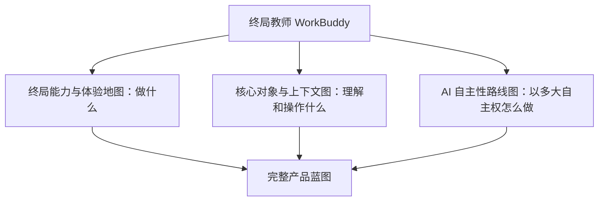
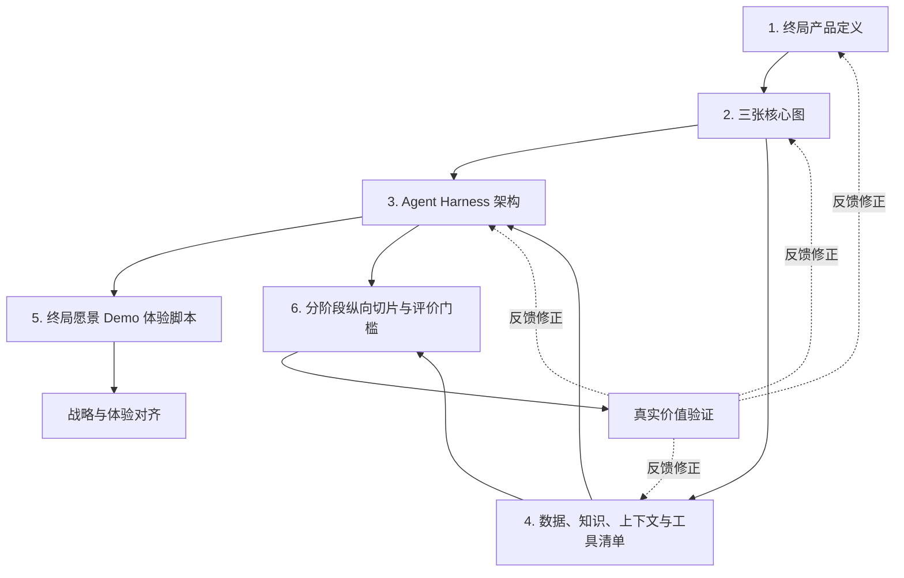

# ClassIn 教师 WorkBuddy 阶段共识与下一阶段六件套

## 文档目的

本文用于沉淀 ClassIn 教师 WorkBuddy 项目截至 2026 年 8 月 15 日形成的阶段共识，并明确下一阶段需要产出的完整产品蓝图、Agent Harness、数据与上下文建设方案，以及以终为始的 Demo 推进计划。

本文不是 PRD、技术 Spec 或已经获得管理层批准的正式立项文件。它承担三个作用：

1. 固化当前已经达成的产品共识，避免后续重新回到“要不要做、做成什么”的发散讨论；
2. 定义下一阶段“六件套”分别解决什么问题、包含什么内容以及相互依赖关系；
3. 为后续产品设计、业务数据梳理、Agent Harness 设计和 Demo 分阶段建设建立统一起点。

## 相关输入

- [[20260814-对workbuddy的专题初步讨论！]]
- [[WorkBuddy项目讨论分析与研究方向_20260815]]
- 路径一：内部战略认知与关键假设
- 路径二：ClassIn 业务与 AI 战略独立判断
- ClassIn PC AgentIn 参考项目中的师生教与学 SOP、AI 机会地图与能力分层研究
- 当前项目目录中的《共识结论》《教与学 SOP 及 AI 能力共识输入》和领域术语表

---

## 一、项目推进到什么阶段

当前已经完成四轮收敛。

### 1. 路径一：内部战略认知

从内部视角明确了为什么要做 WorkBuddy：

- ClassIn 需要面向 AI 时代建立新的产品范式和增长叙事；
- 产品不能只是给现有 SaaS 增加若干 AI 功能；
- ClassIn 已经拥有课堂、课程、作业、组织、消息和教学过程等潜在上下文；
- 应先利用现有客户和深度教学场景形成差异化价值，再逐步产生续费、激活、拉新和传播价值；
- 终局需要形成一个贯穿教师完整教学工作的独立产品形态。

### 2. 路径二：外部独立判断

从 ClassIn 公司、产品矩阵、业务结构、App 架构、公开 AI 能力和外部市场事实出发，形成了几个校准：

- ClassIn 的优势不是单纯“数据多”，而是教学活动真实发生、证据连续、业务对象明确，并可以将结果重新执行回系统；
- 当前公开 AI 能力、智能体和 AIGC 功能已经很多，WorkBuddy 不能只是新的聊天入口、Agent 市场或功能集合；
- 全生命周期愿景可以成立，但第一阶段必须通过少量真实纵向闭环验证；
- 教育场景需要证据、权限、教师确认、结果跟踪和可撤销机制；
- 愿景 Demo 与验证型产品需要双轨推进，不能把演示效果直接视为需求成立。

### 3. 产品终局校准

进一步明确了“终局产品”和“进入路径”的区别：

> **终局是通用型教师 WorkBuddy；ClassIn 是它最强的上下文、执行和结果反馈增强层。**

没有使用 ClassIn 的教师，也可以通过主动提供课程目标、教材、教案、课件、班级和学生信息，使用 WorkBuddy 完成教研、备课、课堂指导和课后教学服务。

使用 ClassIn 后，WorkBuddy 可以在获得授权的前提下接入更连续的课堂、作业、互动、组织、沟通和结果数据，使同一套能力更懂教师、更精细、更专业、更个性化，并能直接执行和追踪。

因此：

- 通用教师 WorkBuddy 是终局产品定义；
- ClassIn 是最深的业务连接器和增强层；
- 从 ClassIn 内部场景切入是验证与商业进入路径；
- “内嵌优先”不等于“永远不做独立产品”；
- 第一阶段不一次性交付全能力，不等于终局边界被缩小。

### 4. 师生业务链路校准

通过研读 ClassIn PC AgentIn 参考项目，将 WorkBuddy 放回完整教与学业务循环：

> **目标 → 准备 → 教学发生 → 形成证据 → 诊断 → 干预 → 反馈 → 下一轮调整**

老师侧覆盖：

```text
明确目标
→ 课程设计与教研
→ 资源、课件与活动生产
→ 备课演练
→ 排课与课前准备
→ 开展课堂
→ 布置任务与批改
→ 教学诊断
→ 个性化干预
→ 沟通跟进
→ 教学反思与复用
```

学生侧覆盖：

```text
理解目标
→ 计划与预习
→ 课堂参与
→ 练习与提交
→ 求助与反馈
→ 订正与掌握
→ 自主学习
→ 理解成长与调整目标
```

WorkBuddy 的一级模型应按照教师业务时刻、教学结果和反馈回路组织，而不是按照页面、聊天入口、模型能力或 Agent 人格组织。

---

## 二、当前产品共识

### 1. 一句话定位

> **教师 WorkBuddy 是一套通用的教师教学工作伙伴；ClassIn 是它最强的上下文、执行和结果反馈增强层。它基于教师授权的教学上下文，理解目标、组织证据、给出可解释判断、生成可编辑成果，并在教师确认后完成后续教学行动和结果追踪。**

### 2. 它帮助教师完成什么

WorkBuddy 不是陪教师聊天，而是帮助教师完成教学结果：

- 将课程标准、教学目标和班级特点转化为课程设计；
- 生成和组织教案、课件、题目、资源和教学活动；
- 支持备课演练，并根据可观察证据提出改进建议；
- 在课堂前、中、后提供适合当前场景的辅助；
- 辅助批改、反馈、订正和分层练习；
- 从课堂和作业证据形成可解释的诊断假设；
- 生成个性化干预、沟通和复查计划；
- 跟踪执行结果，支持教师反思并调整下一轮教学。

### 3. 它不是什么

- 不是一个万能聊天框；
- 不是 Agent 商店、Skill 集合或 AI 功能导航；
- 不是一次生成教案、课件或评语的内容工具；
- 不是通过新建一套 AI 状态替代课程、作业、消息和待办；
- 不是以“自动完成教师 60%—90% 工作”为前提的教育自动驾驶；
- 不是要求第一版同时交付全部课前、课中和课后能力；
- 不是只有使用 ClassIn 后才能工作的附属功能。

### 4. 产品模式

WorkBuddy 的终局产品壳层是一个统一教师工作台：教师以对话表达目标，以结构化工作区查看和编辑教学成果、上下文、证据、计划、审批和复查；教师面对一个统一主 Agent，而不是多个割裂的 AI 应用。

同一个界面支持三种协作模式：

1. **AI 工具模式**：完成边界清楚的单点任务；
2. **Copilot 模式**：理解当前对象、角色、权限和证据，生成可编辑、可确认的业务草稿；
3. **Agent 模式**：围绕复杂目标制定计划、调用能力、等待审批、执行并持续复查。

ClassIn 课程、备课、作业、洞察、消息和资源页面提供连续情境入口，运行与审批中心是工作台中的任务控制区域。所有入口共享同一个 WorkBuddy 身份、上下文和任务状态，最终成果回到真实业务对象。

---

## 三、三张核心图

三张图不是三份互相独立的方案，而是从三个正交维度描述同一个 WorkBuddy。

> **一个具体产品场景 = 终局能力 × 核心对象与上下文 × AI 自主性等级**

### 图一：WorkBuddy 终局能力与体验地图

#### 回答的问题

> WorkBuddy 最终帮助教师完成什么？终局产品包含哪些能力和体验？

#### 主要内容

- 教师完整业务循环中的能力域；
- 每个能力域解决的教师目标和摩擦；
- 用户输入、WorkBuddy 处理、业务产物和后续行动；
- 统一工作台、三种协作模式、结构化工作区和 ClassIn 情境入口之间的体验关系；
- 未使用 ClassIn 与接入 ClassIn 后的能力差异；
- 教师、学生、教学负责人和机构分别感知到的结果。

#### 不负责解决

- 不详细描述底层业务对象和数据关系；
- 不决定每项能力在哪个阶段实现；
- 不直接等同于页面信息架构或功能清单。

#### 预期产出形式

- 一张终局能力全景图；
- 一张终局教师旅程与体验模型；
- 能力域、基础功能、输入、输出和业务结果说明表。

### 图二：核心对象与上下文关系图

#### 回答的问题

> WorkBuddy 正在理解、引用和操作什么？

#### 主要对象

- 教师、学生、教学负责人和机构；
- 班级、课程、单元和教学活动；
- 教学目标、课程标准和成功标准；
- 教案、课件、资源、题目、作业、评语等教学产物；
- 课堂、互动、作答、提交、订正和反馈证据；
- 诊断假设、干预计划、学习任务和复查结果；
- 用户偏好、机构规则、知识索引和 Agent 任务记忆。

#### 需要表达的关系

- 对象之间的归属、引用和生命周期；
- 当前任务属于哪个机构、班级、课程、学生范围和时间范围；
- 哪个领域拥有最终业务事实；
- 哪些是原始事实、派生证据、AI 推断和教师确认结论；
- 哪些信息可以跨时间复用，哪些不能跨机构或角色使用；
- 未使用 ClassIn 时如何建立基础上下文，接入 ClassIn 后如何增强。

#### 关键校准

这不是页面模块关系图。页面和功能模块只是核心对象在不同业务时刻的投影。同一个教师、课程、学生和教学目标会贯穿教研、备课、课堂、作业、诊断和沟通。

#### 预期产出形式

- 核心对象关系图；
- 上下文分层与装配图；
- 事实所有权、权限和数据来源矩阵。

### 图三：AI 自主性与执行成熟度路线图

#### 回答的问题

> 终局能力地图中的每一项业务能力，AI 能做到什么程度，何时可以从工具升级为 Copilot 或 Agent？

#### 三个层级

| 层级 | 定义 | 典型表现 |
| --- | --- | --- |
| AI 工具 | 围绕一个确定任务完成生成、识别、检索、转换或解释 | 生成教案、题目、摘要、时间戳演练报告 |
| AI Copilot | 理解当前对象、角色、权限和证据，生成可编辑、可确认的业务草稿 | 结合班级情况生成课程草稿、批改建议、诊断假设和干预计划 |
| AI Agent | 围绕业务目标制定计划、调用白名单工具、处理失败、经过审批执行并持续跟踪结果 | 诊断学生问题、创建分层任务、生成沟通草稿、等待确认、执行并到期复查 |

#### 路线图要表达什么

- 每个能力当前和目标自主性等级；
- 从工具到 Copilot、从 Copilot 到 Agent 的升级门槛；
- 所需数据、业务工具、权限、Runtime、审批、撤销、审计和评价能力；
- 哪些能力适合成为 Agent，哪些能力由于风险应长期保持 Copilot + 教师确认；
- 阶段性 Demo 中哪些能力是真实实现、哪些是模拟表达。

#### 关键校准

AI 工具、Copilot 和 Agent 不是三种界面。聊天窗口、完整页面或 Agent 名称不能证明能力层级。

并非所有能力最终都必须升级为 Agent。正式评分、敏感学生评价和高风险沟通，即使技术成熟，也可能长期保留教师确认。

#### 预期产出形式

- “业务能力 × 工具/Copilot/Agent”成熟度矩阵；
- 分阶段能力建设路线图；
- 每个升级节点的数据、工具、安全和评价门槛。

### 三张图的关系



---

## 四、Agent 与 Harness 设计

### 1. 为什么核心是 Harness

教师 WorkBuddy 本质上是一个教育行业的教师 Agent。大模型提供理解、推理和生成能力，但大模型本身不能直接构成稳定产品。

Harness 决定了：

- 模型在当前任务中知道什么；
- 如何区分事实、知识、偏好和推断；
- 能调用哪些业务工具；
- 如何把教师目标转成可检查计划；
- 何时可以自动行动，何时必须请求教师确认；
- 页面关闭或任务失败后如何恢复；
- 如何记录来源、执行、撤销和审计；
- 如何评价结果质量并持续改进。

### 2. Harness 不应先于业务闭环建设

不应先做一个泛化 Agent 平台，再寻找教育场景。正确顺序是：

```text
终局业务结果
→ 具体纵向闭环
→ 所需对象和上下文
→ 所需 Skill 与业务工具
→ 运行、审批、安全和评价要求
→ 反推 Harness 模块
```

### 3. 建议的五个 Harness 深模块

#### 上下文引擎

负责身份、角色、机构、班级、课程、学生范围、权限、业务事实、知识和记忆的装配，并为每次任务生成可追溯的上下文快照。

#### 目标与任务运行时

负责把教师目标转成范围、约束、计划、步骤、完成条件和复查节点，并管理运行、暂停、恢复、超时、失败和重试。

#### Skill 与业务工具系统

提供课程设计、资源检索、作业草拟、待办创建、消息草拟、证据读取等白名单能力，明确每个工具的输入、输出、权限、副作用和失败模式。

#### 教师控制与执行系统

负责草稿、差异预览、确认、拒绝、修改、批量操作审批、撤销和审计，确保高风险教育行为保留教师专业控制权。

#### 评价与持续学习系统

记录采纳、编辑、拒绝、撤销、结果改善、错误、成本和教师反馈，用于评价模型、Skill、上下文质量和真实业务结果。

### 4. Harness 与三张图的关系

- 能力地图决定 Harness 必须支撑哪些教师结果；
- 对象与上下文图决定上下文引擎、知识和工具需要理解什么；
- 自主性路线图决定 Runtime、审批、撤销、审计和评价需要做到什么深度；
- Harness 反过来约束哪些能力可以真实实现，哪些只能先在愿景 Demo 中模拟。

---

## 五、ClassIn 数据、业务知识与上下文

### 1. 不是把所有数据都变成文档塞进模型

ClassIn 数据不能统一转换成文档后直接输入模型。需要至少分成四类：

| 类型 | 例子 | 正确使用方式 | 最终事实所有者 |
| --- | --- | --- | --- |
| 实时业务事实 | 班级、课程、课堂、作业、提交、成绩、权限 | 运行时通过业务工具读取 | ClassIn 对应业务系统 |
| 教育知识与规则 | 课程标准、教研规范、评分标准、机构规则 | 文档化或结构化，通过知识检索使用 | 内容或规则管理方 |
| 教师偏好与长期记忆 | 教学风格、评语语气、常用策略 | 可查看、可修改、可删除的 Memory | 教师本人 |
| AI 推断与诊断假设 | 薄弱点、问题原因、干预建议 | 保留来源、置信度、时间和确认状态 | 不是事实；确认后形成业务结论或行动 |

### 2. 第二层需要梳理什么

- ClassIn 当前有哪些业务对象、字段和状态；
- 数据由哪个系统拥有、如何读取和写回；
- 哪些数据真实存在，哪些只是 Demo 或推断；
- 数据质量、更新时间、留存周期和缺失情况；
- 当前教师是否有权限读取，是否允许跨班级、课程和机构使用；
- 哪些信息适合建立知识索引，哪些必须实时查询；
- 哪些教师偏好值得长期记忆，如何查看和删除；
- 每一项 AI 输出引用了哪些证据，如何纠正和过期；
- 哪些行动需要确认、差异预览、撤销和审计。

### 3. ClassIn 的真正差异化

> **差异化 = 工作流入口 × 获授权的连续教学证据 × 可评价的教育知识 × 可执行系统 × 结果反馈。**

数据只有在身份正确、权限明确、质量可信、能够纠正，并真正改善教师和学生结果时，才成为 WorkBuddy 的优势。

---

## 六、以终为始的 Demo 与阶段推进

### 1. 两种 Demo

#### 终局愿景 Demo

用于表达完整教师 WorkBuddy 的终局体验，帮助 CEO、销售、客户和团队形成共同想象。可以模拟尚未实现的数据和能力，但必须清楚标记模拟部分。

#### 验证型纵向切片

使用真实教师、真实数据、真实权限、真实工具和真实确认，验证某一条业务闭环是否产生持续价值。

愿景 Demo 获得认同，不等于业务价值已经成立；验证型切片不需要一次表达完整终局，但必须能够真实运行并评价结果。

### 2. 终局 Demo 应展示两种状态

#### 未使用 ClassIn 的教师

```text
输入目标 / 上传资料 / 建立课程和学生上下文
→ 教研与课程设计
→ 备课和演练
→ 教学服务与沟通支持
```

#### 已使用 ClassIn 的教师

```text
自动获得课堂、作业、互动和结果证据
→ 更精细的诊断和个性化干预
→ 写入待办、作业、资源和消息
→ 执行并复查结果
```

两种状态共享同一个 WorkBuddy 核心。ClassIn 不是使用前提，而是最深的上下文和执行连接器。

### 3. 建议阶段

| 阶段 | 目标 | 主要能力 | 证明什么 |
| --- | --- | --- | --- |
| 阶段 0 | 形成终局愿景 Demo | 完整教师循环、双模式体验、模拟 Agent 运行 | 产品形态与战略叙事是否成立 |
| 阶段 1 | 验证 AI 工具与 Copilot | 课程设计或备课演练的真实纵向闭环 | 无 ClassIn 历史数据时是否也有独立价值 |
| 阶段 2 | 验证 ClassIn 上下文增强 | 诊断到个性化干预、批改到订正 | ClassIn 数据是否显著提高质量和执行能力 |
| 阶段 3 | 验证有限 Agent | 跨作业、待办、资源和消息的计划、审批与执行 | Agent 是否能安全完成跨模块目标 |
| 阶段 4 | 形成完整工作台 | 长期任务、复查、记忆、外部连接器和运行中心 | 通用 WorkBuddy 是否形成持续使用和商业闭环 |

### 4. 每一阶段的升级门槛

不能只按功能完成度升级。每个阶段都要验证：

- 教师是否持续使用；
- 是否明显节省时间或改善结果；
- 上下文是否充分、正确和可授权；
- 产出是否被采纳，修改距离是否可接受；
- AI 是否能解释来源和不确定性；
- 写入和副作用动作是否可控、可撤销、可审计；
- 模型、存储、推理和交付成本是否可接受；
- 是否能够形成机构价值、续费、拉新或独立付费。

---

## 七、下一阶段产出组织：六件套

六件套不是六份互不相关的文档，而是一套逐层推导的产品和系统蓝图。

### 第一件：终局教师 WorkBuddy 产品定义

#### 解决的问题

明确为什么做、为谁做、解决什么、终局是什么，以及 ClassIn 在其中承担什么角色。

#### 包含内容

- 产品愿景与一句话定位；
- 第一用户、关键价值和业务目标；
- 通用产品与 ClassIn 增强层的关系；
- 教师、学生、机构和管理者的价值关系；
- 产品原则、能力边界和非目标；
- 终局核心用户故事。

#### 产出形式

- 一页产品定义；
- 产品原则与边界说明；
- 终局北极星用户故事。

### 第二件：三张核心图

#### 解决的问题

从产品能力、业务语义和 AI 自主性三个维度建立完整产品蓝图。

#### 包含内容

1. WorkBuddy 终局能力与体验地图；
2. 核心对象与上下文关系图；
3. AI 自主性与执行成熟度路线图。

#### 产出形式

- 三张主图；
- 配套定义、矩阵和典型场景说明；
- 三张图之间的映射关系。

### 第三件：Agent Harness 架构

#### 解决的问题

将终局产品能力转化为可建设、可运行、可控制和可评价的 Agent 系统。

#### 包含内容

- 上下文引擎；
- 目标与任务运行时；
- Skill 与业务工具系统；
- 教师控制、审批、执行和撤销；
- Memory 与知识边界；
- 安全、权限、审计和失败恢复；
- 评价、反馈、观测和成本系统；
- 模型与外部系统适配关系。

#### 产出形式

- Harness 总体架构图；
- 核心模块及其 Interface；
- 一条典型 Agent 运行时序；
- 工具、审批和失败状态矩阵。

### 第四件：ClassIn 数据、知识、上下文与工具清单

#### 解决的问题

明确 WorkBuddy 需要什么输入，ClassIn 已经有什么、缺什么、由谁补齐，以及模型如何安全使用。

#### 包含内容

- 核心业务对象和字段清单；
- 实时事实、文档知识、教师偏好和 AI 推断分类；
- 数据来源、所有者、权限、质量和时效；
- 知识库、索引、Memory 和上下文装配规则；
- 可读工具、可写工具和高风险动作；
- 业务部门、产品、数据、研发和教研的协作输入清单。

#### 产出形式

- 数据与知识资产表；
- 上下文来源和权限矩阵；
- Agent 工具注册表；
- 数据缺口和业务协同 Backlog。

### 第五件：终局愿景 Demo 体验脚本

#### 解决的问题

将终局能力转化为一条可以被管理层、销售、客户和产品团队共同理解的完整体验叙事。

#### 包含内容

- 核心教师画像和教学任务；
- 未使用 ClassIn 与接入 ClassIn 的对照；
- 从目标、教研、备课、课堂、诊断、干预到下一轮的完整故事；
- WorkBuddy 的主动时机、输入输出和教师确认；
- Agent 计划、执行、暂停、审批和复查体验；
- 模拟数据、真实能力和未来能力的明确标注。

#### 产出形式

- Demo 故事板；
- 关键场景脚本；
- 信息架构和关键界面框架；
- 演示数据和能力真实性说明。

### 第六件：分阶段纵向切片、评价指标和升级门槛

#### 解决的问题

将终局愿景拆成可验证、可交付、可停止或转向的实施路线。

#### 包含内容

- 阶段 0—4 的目标和范围；
- 每个阶段的真实能力、模拟能力和明确非目标；
- 首批纵向闭环候选；
- 工具 → Copilot → Agent 的升级条件；
- 真实用户、数据、权限和试点要求；
- 北极星指标、配套指标、成本和风险；
- 继续、扩大、转向和停止条件。

#### 产出形式

- 阶段路线图；
- 纵向切片规格卡；
- 评价体系和试点计划；
- 决策门与停止条件。

---

## 八、六件套之间的关系



六件套可以进一步分成三个工作阶段：

### 阶段 A：产品与业务模型

- 第一件：终局产品定义；
- 第二件：三张核心图。

这一阶段解决“做什么、为什么、理解和操作什么、AI 以什么深度参与”。

### 阶段 B：系统与数据蓝图

- 第三件：Agent Harness 架构；
- 第四件：ClassIn 数据、知识、上下文与工具清单。

这一阶段解决“怎样建设、依赖什么、哪些系统和业务团队需要补齐”。

### 阶段 C：体验表达与实施验证

- 第五件：终局愿景 Demo 体验脚本；
- 第六件：分阶段纵向切片、评价指标和升级门槛。

这一阶段解决“终局如何被看见，以及如何一步步真实实现并证明价值”。

---

## 九、推进原则

### 1. 以教师结果为主索引

不按模型能力、Agent 人格或页面入口组织产品，按教师要完成的教学结果组织。

### 2. 以终为始，但不一步到位

终局产品边界必须完整；实施通过少量纵向切片逐步验证，不并行铺开一组半成品功能。

### 3. 从业务闭环反推 Harness

Harness 的每个模块都必须由真实教学目标、对象、工具和安全需求推导，不为假想未来建设泛化平台。

### 4. 事实、知识、偏好和推断分离

不把 ClassIn 数据全部文档化塞给模型，不让 Memory 成为第二套业务数据库，不把 AI 推断自动固化为学生或教师事实。

### 5. AI 产出必须进入业务对象

教案、课程、活动、作业、评语、干预、待办和消息最终应成为现有业务对象中的草稿、建议或待确认动作，而不是只停留在聊天历史。

### 6. 教师保留专业控制权

高风险教育判断、正式评分、学生敏感评价、批量发布和外部沟通必须保留教师确认、差异预览、撤销和审计。

### 7. 愿景 Demo 与验证型产品分轨

愿景 Demo 用于表达终局和形成战略对齐；验证型产品用真实数据和真实结果决定是否继续投资。

### 8. 业务结果优先于模型输出

评价节省时间、采纳率、修改距离、持续使用、执行完成、结果改善、成本和商业价值，而不是生成数量、对话次数或 Agent 数量。

---

## 十、仍需在六件套中回答的关键问题

1. 终局 Demo 的主叙事是否选择“一次完整教学循环”，还是“教师的一天”？建议以前者为骨架，后者作为工作台入口表达。
2. 第一阶段是否同时验证两条路径：非 ClassIn 教师的课程设计/备课演练，以及 ClassIn 教师的诊断到干预？
3. 学生侧 AI 是教师 WorkBuddy 的协同对象，还是独立 Student Buddy，并通过共享教学协议连接？
4. 通用 WorkBuddy 的班级、课程、学生和教学结果对象由产品自建到什么深度，哪些主要依赖导入或连接器？
5. ClassIn 哪些生产数据和工具可以进入首批试点，权限、质量和写回能力如何？
6. 哪些教师动作终局可以由 Agent 自动执行，哪些必须永久保留教师确认？
7. 项目的第一业务目标在客户价值、续费升级、新客增长和市场声量之间如何排序？

这些问题不阻止开始绘制三张图，但必须在三张图、Harness 和阶段路线图中被显式表达，不能留到界面完成后再补。

---

## 十一、下一步

下一阶段正式进入六件套的阶段 A：

1. 先完成《终局教师 WorkBuddy 产品定义》；
2. 依次绘制终局能力与体验地图、核心对象与上下文关系图、AI 自主性与执行成熟度路线图；
3. 使用至少四条具体业务闭环交叉验证三张图：课程目标到课程对象、备课演练到改进、批改到订正、诊断到个性化干预；
4. 三张图稳定后，再从图中反推 Agent Harness 和 ClassIn 数据/工具建设清单；
5. 最后形成终局 Demo 脚本和分阶段真实纵向切片计划。

当前项目已经从“机会发现和方向讨论”进入“终局产品与系统蓝图设计”阶段。下一步的重点不是继续扩充零散 AI 功能，而是完成这套产品、业务、Agent、数据和实施路线相互一致的六件套。
